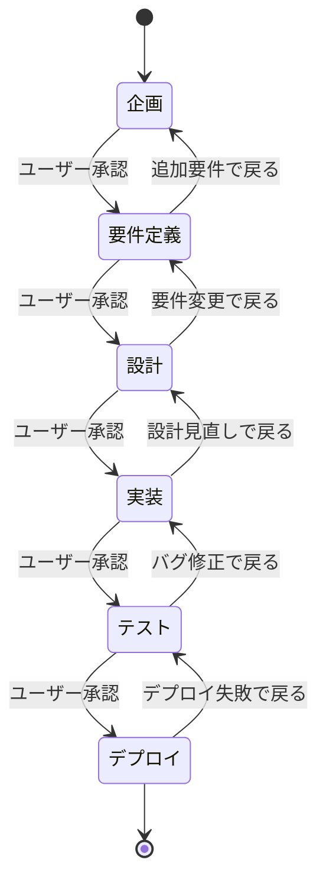

# フェーズ遷移ルール

このドキュメントは、開発フェーズ間の遷移ルールを定義しています。

---

## 開発フェーズ一覧

1. **企画** - ビジョン、目的、背景の明確化
2. **要件定義** - 機能要件・非機能要件の定義
3. **設計** - アーキテクチャ、技術スタック、インフラ設計
4. **実装** - コーディング
5. **テスト** - 単体〜受入テストまで
6. **デプロイ** - 本番環境へのリリース

---

## フェーズ遷移フロー



---

## フェーズ遷移の基本ルール

### 1. 前進（次のフェーズへ）

**条件：**
1. 現在のフェーズの必須項目がすべて決定済み
2. ドキュメントが生成済み
3. **ユーザーがレビュー・承認済み**

**フロー：**
```
1. AIがヒアリングして情報収集
   ↓
2. 会話を振り返る（抜け漏れチェック）
   ↓
3. ドキュメント生成
   ↓
4. ユーザーにレビュー依頼
   - ドキュメントの内容
   - 決定事項の充足度
   - 「次のフェーズに進んで良いですか？」
   ↓
5. ユーザー承認
   ↓
6. 状態を更新（.claude-state/project-state.json）
   ↓
7. 次フェーズへ遷移
```

### 2. 後退（前のフェーズへ戻る）

**条件：**
- ユーザーが「戻りたい」と要求
- 追加要件・変更要件が発生
- 設計の見直しが必要

**対応：**
```
AI: わかりました。[戻り先フェーズ]に戻りますね。
　　どの部分を変更/追加したいですか？
```

**注意：**
- 後退は自由に許可する
- フェーズは強制ではなくガイドライン
- 状態ファイルを適切に更新

---

## 各フェーズ遷移の詳細

### 企画 → 要件定義

**遷移条件：**
- [ ] ビジョン・目的が明確
- [ ] 背景・課題が明確
- [ ] ステークホルダーが特定済み
- [ ] 成功基準が定義済み
- [ ] 企画書が承認済み

**AIの確認質問：**
```
企画書の内容を確認いただきましたが、
次のフェーズ（要件定義）に進んで良いですか？

要件定義では、具体的な機能要件や技術要件を
詳しくヒアリングしていきます。
```

---

### 要件定義 → 設計

**遷移条件：**
- [ ] ビジネス背景が明確
- [ ] 機能要件が定義済み
- [ ] 非機能要件が定義済み
- [ ] 制約条件が明確
- [ ] 要件定義書が承認済み

**AIの確認質問：**
```
要件定義書の内容を確認いただきましたが、
次のフェーズ（設計）に進んで良いですか？

設計フェーズでは、アーキテクチャや技術スタック、
インフラ構成を決めていきます。
```

**AIが確認すべきこと：**
- 決定事項が十分か
- 曖昧な要件が残っていないか
- 矛盾がないか

---

### 設計 → 実装

**遷移条件：**
- [ ] アーキテクチャが決定済み
- [ ] 技術スタックが決定済み
- [ ] インフラ構成が決定済み
- [ ] CI/CD戦略が決定済み
- [ ] システム構成図等が作成済み
- [ ] 設計書が承認済み

**AIの確認質問：**
```
設計書の内容を確認いただきましたが、
次のフェーズ（実装）に進んで良いですか？

実装フェーズでは、設計に基づいてコードを生成します。
技術標準に従った高品質なコードを生成します。
```

**AIが行うこと：**
- 設計の妥当性を最終確認
- 技術標準の準備（`.claude/docs/40_standards/`）

---

### 実装 → テスト

**遷移条件：**
- [ ] コードが生成済み
- [ ] コーディング規約に準拠
- [ ] 技術標準が適用済み
- [ ] ビルドが成功
- [ ] 基本的な動作確認済み

**AIの確認質問：**
```
コードの実装が完了しました。
次のフェーズ（テスト）に進んで良いですか？

テストフェーズでは、単体テストから受入テストまで
段階的にテストを実施します。
```

---

### テスト → デプロイ

**遷移条件：**
- [ ] テスト計画書が作成済み
- [ ] すべてのテストが成功
- [ ] バグが解消済み（または許容範囲）
- [ ] テスト結果報告書が承認済み

**AIの確認質問：**
```
すべてのテストが成功しました。
次のフェーズ（デプロイ）に進んで良いですか？

デプロイフェーズでは、本番環境へのリリースを行います。
dry-run → 承認 → 本番実行 の安全なフローで進めます。
```

**重要：**
本番デプロイ前に、必ずdry-runを実施する。

---

### デプロイ → 完了

**遷移条件：**
- [ ] 本番環境へのデプロイ成功
- [ ] ヘルスチェック成功
- [ ] 監視設定完了
- [ ] デプロイ手順書が作成済み

**AIの完了メッセージ：**
```
デプロイが成功しました！🎉

プロジェクトが完了しました。
今後の保守・運用については、以下のドキュメントを参照してください：
- デプロイ手順書
- ロールバック手順
- 監視・アラート設定

お疲れ様でした！
```

---

## 承認されなかった場合の対応

### ユーザーが「NG」と回答した場合

**AIの対応フロー：**
```
1. どの部分が問題かヒアリング
   ↓
2. 追加ヒアリング実施
   ↓
3. ドキュメント修正・再生成
   ↓
4. 再度レビュー依頼
   ↓
5. 承認されるまで繰り返し
```

**AIの質問例：**
```
わかりました。
どの部分を修正・追加したいですか？
具体的に教えていただけますか？
```

---

## フェーズをスキップする場合

**原則：**
基本的にフェーズのスキップは推奨しない。

**例外的に許可する場合：**
- ユーザーが明示的に要求
- 既に別の方法で完了している（例：要件定義書が既にある）

**対応：**
```
User: 要件定義はスキップして設計から始めたい
AI: わかりました。ただし、設計を進める上で
　　いくつか要件を確認させてください。
　　（必要最小限の要件ヒアリング）
```

---

## 複数フェーズを並行する場合

**ケース：**
- 実装しながら設計を詰める（アジャイル的な進め方）
- テストしながら実装を進める

**対応：**
- 柔軟に対応
- ただし、状態管理は適切に
- ユーザーに現在の状況を常に明示

**例：**
```
AI: 現在、設計と実装を並行して進めています。
　　設計：70%完了
　　実装：30%完了
```

---

## 状態管理の更新タイミング

### フェーズ遷移時
`.claude-state/project-state.json` の `phase` フィールドを更新

```json
{
  "project": {
    "phase": "design",  // ← 更新
    "updated_at": "2025-09-30T15:30:00Z"
  },
  "phases": {
    "requirements": {
      "status": "completed",
      "completed_at": "2025-09-30T15:00:00Z",
      "document": "docs/02_要件定義書.md"
    },
    "design": {
      "status": "in_progress",
      "started_at": "2025-09-30T15:30:00Z"
    }
  }
}
```

---

## AIがフェーズ遷移時に確認すること

### チェックリスト

1. **決定事項の充足**
   - `.claude/docs/10_facilitation/11_decision-items.md` を参照
   - 必須項目がすべて決まっているか

2. **ドキュメントの品質**
   - 受託開発納品レベルか
   - 図・ビジュアル資料があるか
   - 矛盾がないか

3. **ユーザーの理解**
   - ユーザーが内容を理解しているか
   - 質問や懸念はないか

4. **次フェーズの準備**
   - 次フェーズで必要な情報が揃っているか
   - 技術標準等の参照ドキュメントが整っているか

---

## まとめ

フェーズ遷移は、**ユーザーの承認が必須**です。

AIは、各フェーズで：
1. 必須項目の確認
2. 会話の振り返り
3. ドキュメント生成
4. ユーザー承認

このフローを守ることで、抜け漏れのない開発プロセスを実現できます。

柔軟性も大切にし、ユーザーのペースに合わせて進めてください。