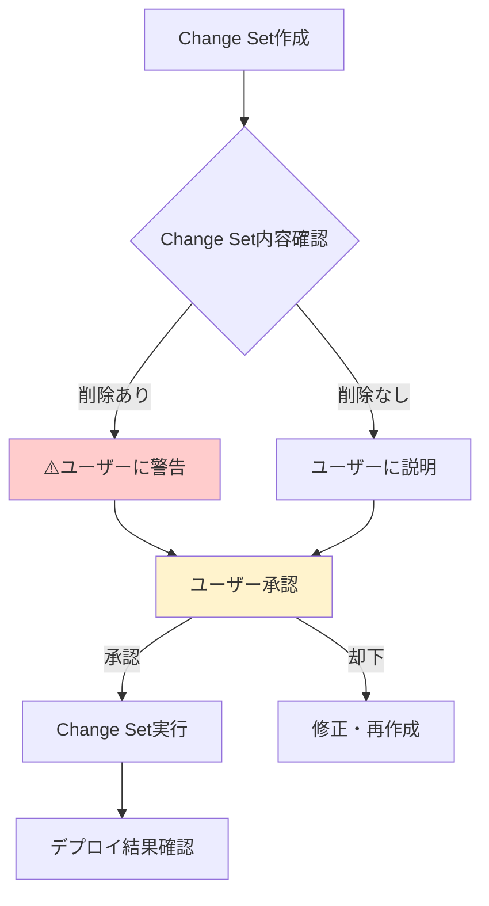

# 2.4.6.1.5 dry-run必須手順（CloudFormation）

## 📋 目的

本番デプロイ前の必須dry-run手順

---

## 🔒 dry-run = Change Set作成

CloudFormationでは**Change Setがdry-run**に相当

---

## 📝 dry-run必須チェックリスト

### 本番デプロイ前に必ず実施

- [ ] Change Set作成
- [ ] Change Set内容を画面出力/ログ保存
- [ ] **削除・置換がないか確認** ⭐⭐⭐
- [ ] ユーザーに説明
- [ ] ユーザー承認取得
- [ ] 承認後にChange Set実行

---

## ⚠️ 絶対に守ること

### 禁止事項

❌ Change Set作成せずに直接デプロイ
❌ Change Set内容を確認せずに実行
❌ ユーザー承認なしで実行

### 必須事項

✅ 必ずChange Set作成
✅ 必ず内容確認
✅ 必ずユーザー承認

---

## 📊 dry-runフロー図

---

**最終更新**: 2025-10-19
