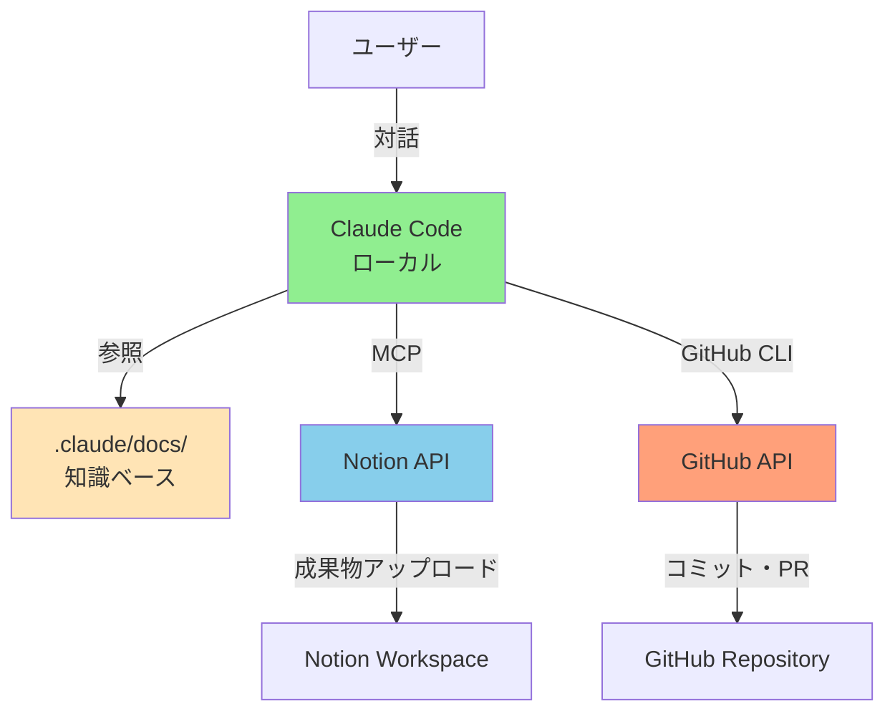
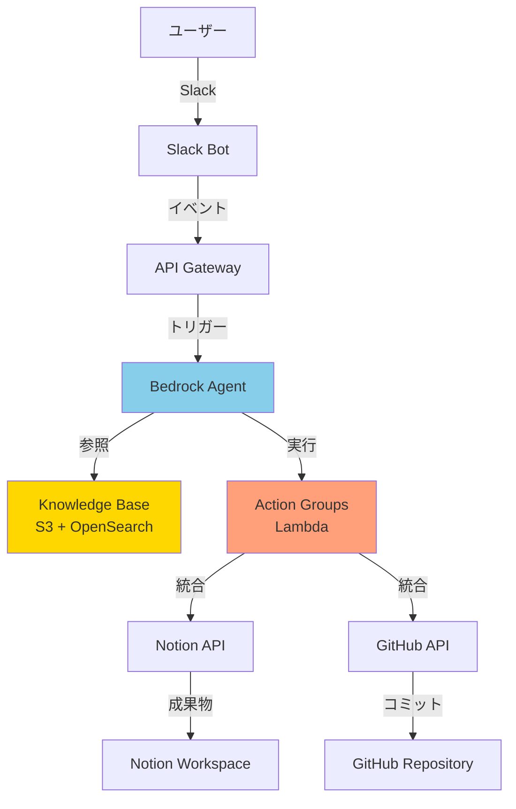
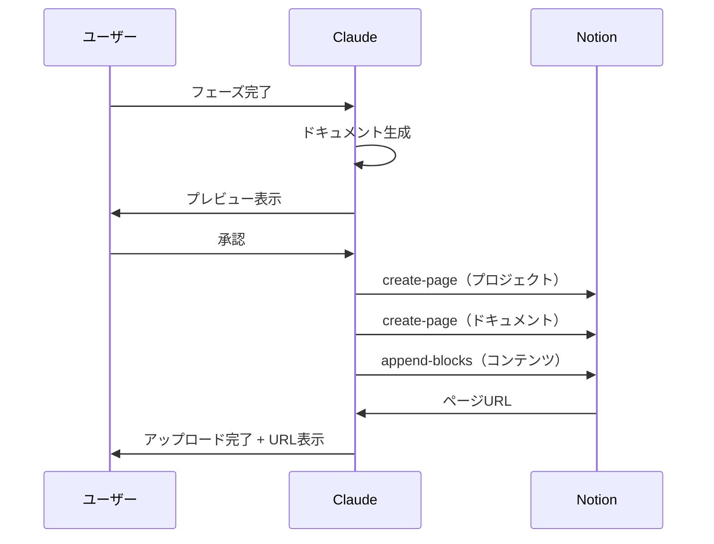
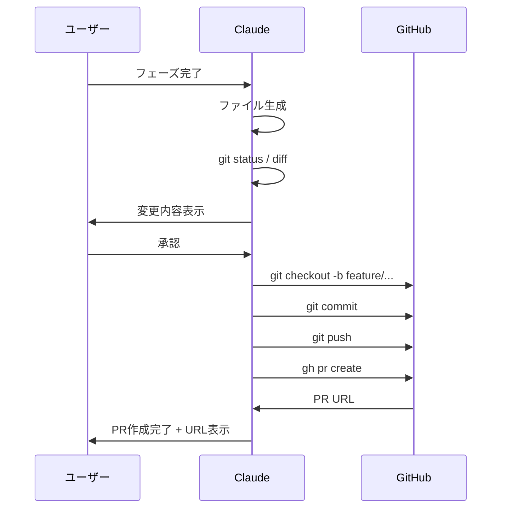

# Phase 3.0: SaaS統合設計 概要

## 1. Phase 3.0 の目的

AI開発ファシリテーターが生成した成果物を、外部SaaSサービスと連携させることで、チーム開発の効率化と成果物の体系的な管理を実現する。

---

## 2. 統合対象SaaS

### 2.1 Phase 3.0で実装するもの

| SaaS | 用途 | 統合方法 | 優先度 |
|------|-----|---------|--------|
| **Notion** | ドキュメント共有・管理 | MCP (HTTP) | ⭐⭐⭐ 高 |
| **GitHub** | コード管理・バージョン管理 | GitHub CLI | ⭐⭐⭐ 高 |

### 2.2 Phase 4.0以降で検討するもの

| SaaS | 用途 | 実装方法 | 理由 |
|------|-----|---------|------|
| **Slack** | 非同期コミュニケーション | Bedrock Agent + Slack Bot | ローカル Claude Code では実装困難 |

---

## 3. アーキテクチャ概要

### 3.1 Phase 3.0 アーキテクチャ（ローカル）



### 3.2 Phase 4.0 アーキテクチャ（クラウド - 検討中）



**Phase 4.0の課題：**
- AWS Bedrock は従量課金（コスト未知数）
- Claude Max プランが使えない可能性
- 開発コストが高い

**現時点の結論：**
- Phase 3.0（ローカル Claude Code）で十分な価値提供が可能
- Phase 4.0（クラウド）は必要性を検証してから判断

---

## 4. 統合フロー

### 4.1 Notion統合フロー



**詳細**: [31_notion_mcp.md](31_notion_mcp.md)

### 4.2 GitHub統合フロー



**詳細**: [32_github_mcp.md](32_github_mcp.md)

---

## 5. 設定管理

### 5.1 MCP設定: `.mcp.json`

```json
{
  "mcpServers": {
    "notion": {
      "transport": "http",
      "url": "https://mcp.notion.com/mcp",
      "env": {
        "NOTION_API_KEY": "ntn_xxxxx"
      }
    }
  }
}
```

**セキュリティ：**
- ✅ `.mcp.json` は `.gitignore` に追加済み
- ✅ API Key は Git 履歴から削除済み
- ⚠️ ローカル環境のみで管理（GitHub にプッシュしない）

### 5.2 Notion設定: `.claude-state/notion-config.json`

```json
{
  "workspaceUrl": "https://pacific-packet-4aa.notion.site/",
  "projectDatabaseId": "28f3b027c0d18191abddc81d578ecd68",
  "uploadMode": "manual",
  "autoSync": false,
  "uploadedDocuments": []
}
```

### 5.3 GitHub設定: `.claude-state/github-config.json`

```json
{
  "repository": {
    "owner": "k-tanaka-522",
    "name": "aidev",
    "defaultBranch": "main",
    "developBranch": "develop"
  },
  "branchStrategy": "feature-per-phase",
  "autoCommit": false,
  "autoPush": false,
  "autoCreatePR": false,
  "commits": []
}
```

---

## 6. 開発ロードマップ

### Phase 3.0.1: 基本機能実装（MVP）

**Notion統合:**
- [ ] プロジェクトページ作成
- [ ] ドキュメントページ作成
- [ ] 基本的な Markdown → Blocks 変換
- [ ] 手動承認フロー

**GitHub統合:**
- [ ] ブランチ作成・切替
- [ ] コミット作成（自動メッセージ生成）
- [ ] プッシュ
- [ ] 手動承認フロー

**目標**: 各フェーズ完了時に、Notion + GitHub へ成果物を自動アップロードできる

### Phase 3.0.2: 機能拡充

**Notion統合:**
- [ ] テーブル変換
- [ ] Mermaid図の埋め込み
- [ ] アップロード履歴管理
- [ ] 差分アップロード

**GitHub統合:**
- [ ] gh CLI 統合（PR作成）
- [ ] 競合解決サポート
- [ ] コミット履歴管理
- [ ] 自動ラベル付与

### Phase 3.0.3: 最適化

**Notion統合:**
- [ ] 自動同期モード
- [ ] バッチアップロード
- [ ] エラーリトライ

**GitHub統合:**
- [ ] 自動コミット・プッシュモード
- [ ] CI/CD連携（ワークフロー生成）
- [ ] ブランチ保護ルール対応

---

## 7. 動作確認済み環境

### 7.1 MCP Server 接続状態

**Notion MCP:**
- ✅ 接続確認済み（2025-01-20）
- ✅ Workspace: TKAsset
- ✅ Bot名: mcpAccessToken
- ✅ API機能: 正常動作

**GitHub CLI:**
- ✅ インストール済み（v2.80.0）
- ✅ 認証済み（account: k-tanaka-522）
- ✅ リポジトリ: https://github.com/k-tanaka-522/aidev.git
- ✅ 権限: repo, workflow, read:org, gist

### 7.2 Git設定

```bash
# リモート
origin: https://github.com/k-tanaka-522/aidev.git

# ブランチ
- main (Phase 2.0 完了・プッシュ済み)
- develop (リモートのみ)
- phase-3.0-mcp-integration (現在のブランチ)
- phase2.0-integration (旧ブランチ)
```

---

## 8. セキュリティ方針

### 8.1 API Key 管理

| ファイル | Git管理 | 用途 |
|---------|---------|------|
| `.mcp.json` | ❌ 除外（.gitignore） | MCP Server 認証情報 |
| `.claude-state/*.json` | ❌ 除外（.gitignore） | プロジェクト設定・状態 |
| `~/.ssh/` | ❌ システム管理 | GitHub SSH鍵 |

### 8.2 機密情報のコミット防止

**Claude の振る舞い：**
- コミット前に `.env`, `*.key`, `*.pem` 等をチェック
- 検出した場合は警告を表示し、コミットを中断
- `.gitignore` への追加を提案

---

## 9. ユーザー体験の改善

### 9.1 Before（Phase 2.0）

```
Claude: 企画書が完成しました。

[プレビュー表示]

ユーザー: 承認します

Claude: では次のフェーズ（要件定義）に進みます
```

**課題：**
- 成果物はローカルのみ（`docs/`）
- チーム共有が手動
- バージョン管理が手動

### 9.2 After（Phase 3.0）

```
Claude: 企画書が完成しました。

[プレビュー表示]

ユーザー: 承認します

Claude: Notion と GitHub にアップロードしますか？

ユーザー: はい

Claude: ✅ Notion にアップロード完了
        📎 https://notion.so/xxxxx

        ✅ GitHub にコミット・プッシュ完了
        ✅ Pull Request 作成完了
        📎 https://github.com/k-tanaka-522/aidev/pull/123

        では次のフェーズ（要件定義）に進みます
```

**改善点：**
- 成果物が自動的に Notion + GitHub に保存
- チーム共有が即座に完了
- バージョン管理が自動化
- レビュープロセスが明確（PR）

---

## 10. 制約事項と今後の課題

### 10.1 現在の制約

| 項目 | 制約 | 影響 |
|------|-----|------|
| Notion 同期 | 一方向のみ（ローカル → Notion） | Notion で編集した内容はローカルに反映されない |
| GitHub 自動化 | 手動承認必須 | 完全自動化はできない |
| Slack 統合 | Phase 3.0 では未実装 | 非同期コミュニケーションは手動 |

### 10.2 Phase 4.0 への移行判断基準

以下の条件を満たす場合、Phase 4.0（クラウド化）を検討：

1. **利用頻度**
   - 週10回以上の実行
   - 複数プロジェクトでの並行利用

2. **コスト試算**
   - Bedrock Agent 従量課金が Claude Max より安い
   - 開発コストを回収できる見込み

3. **機能要求**
   - Slack 経由での非同期実行が必須
   - PCレス運用が必要

**現時点の判断：**
- Phase 3.0（ローカル Claude Code）で運用開始
- 利用状況を見てPhase 4.0を判断

---

## 11. 次のアクション

### 優先順位1: Phase 3.0.1 MVP実装

1. **Notion統合（最小限）**
   - [ ] プロジェクトページ作成の実装
   - [ ] ドキュメントページ作成の実装
   - [ ] 基本的な Markdown → Blocks 変換
   - [ ] エンドツーエンドのテスト

2. **GitHub統合（最小限）**
   - [ ] ブランチ作成・切替の自動化
   - [ ] コミットメッセージ自動生成
   - [ ] git add / commit / push の自動化
   - [ ] エンドツーエンドのテスト

### 優先順位2: 実プロジェクトでの検証

- [ ] テストプロジェクトを作成
- [ ] 企画フェーズ〜納品フェーズまで実行
- [ ] Notion + GitHub への自動アップロードを確認
- [ ] フィードバック収集

### 優先順位3: ドキュメント整備

- [ ] CLAUDE.md への Phase 3.0 統合手順追加
- [ ] README.md への Notion/GitHub 設定手順追加
- [ ] トラブルシューティングガイド作成

---

## 12. 参考リンク

### 内部ドキュメント
- [Notion MCP 統合設計](31_notion_mcp.md)
- [GitHub MCP 統合設計](32_github_mcp.md)
- [既存の Notion ワークスペース](.claude/docs/NOTION_INDEX.md)

### 外部ドキュメント
- [Notion API](https://developers.notion.com/)
- [GitHub CLI](https://cli.github.com/)
- [MCP Protocol](https://github.com/anthropics/mcp)
