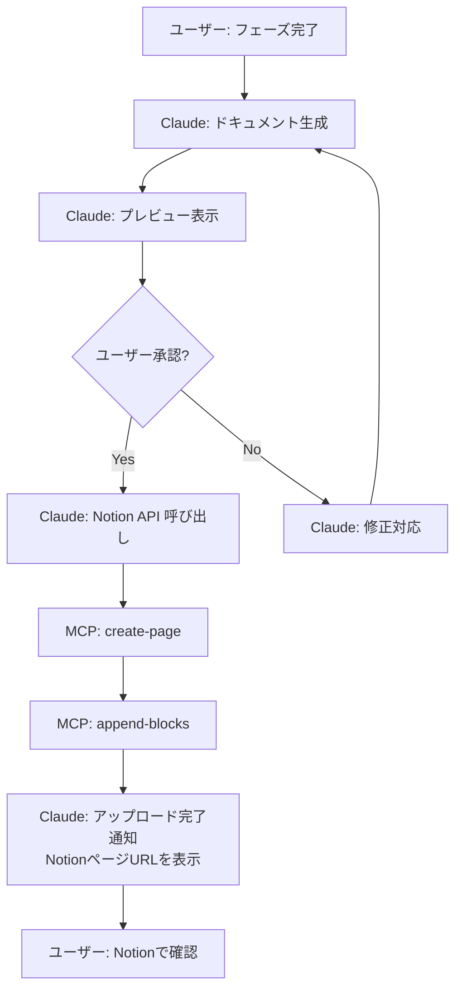
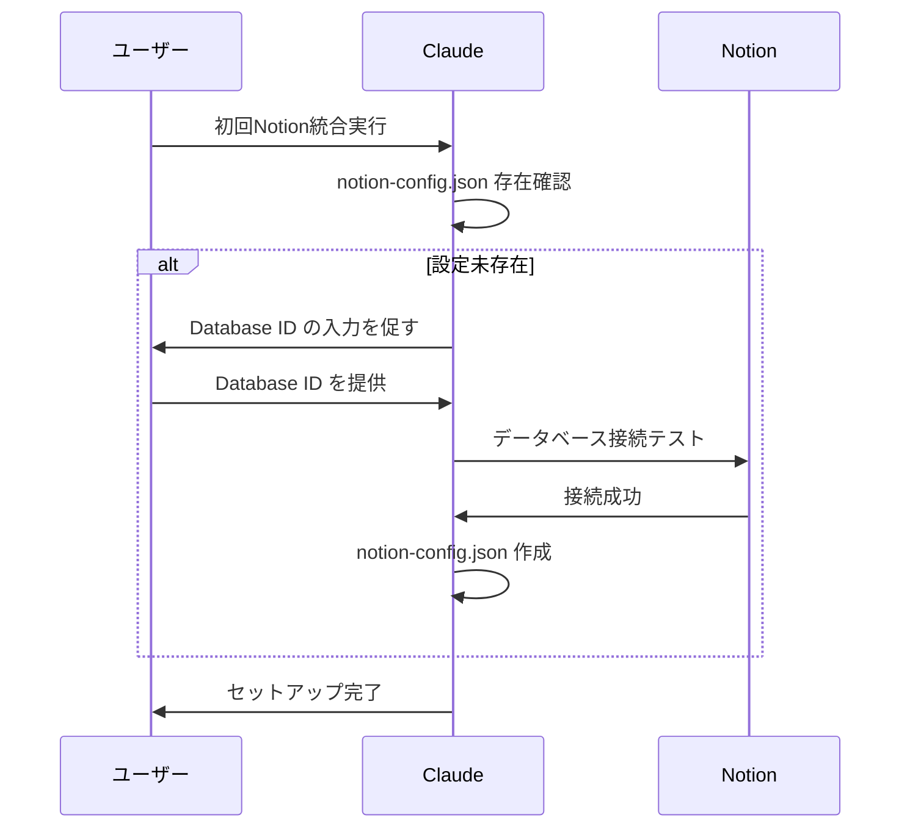

# Notion MCP 統合設計

## 1. 概要

AI開発ファシリテーターが生成した成果物を、Notion ワークスペースに自動アップロードするための MCP 統合設計。

### 目的
- プロジェクトドキュメントの一元管理
- チーム共有の効率化
- 納品物の体系的な整理

### スコープ
- **Phase 3.0**: ローカル Claude Code + Notion MCP Server
- **対象成果物**: `docs/` 配下の全ドキュメント
- **アップロード方式**: 手動承認後の自動アップロード

---

## 2. Notion ワークスペース構造

### 2.1 推奨ページ構造

```
📁 AIファシリテータープロジェクト
├── 📊 プロジェクト管理データベース
│   └── 各プロジェクトページ（データベースアイテム）
│       ├── プロパティ
│       │   ├── プロジェクト名（タイトル）
│       │   ├── ステータス（選択: 企画中/要件定義中/設計中/実装中/テスト中/完了）
│       │   ├── 開始日（日付）
│       │   ├── 更新日（日付）
│       │   └── フェーズ（選択: planning/requirements/design/implementation/testing/delivery）
│       └── 子ページ
│           ├── 📄 01_企画書
│           ├── 📄 02_要件定義書
│           ├── 📄 03_基本設計書
│           ├── 📄 04_詳細設計書
│           ├── 📄 05_テスト計画書
│           ├── 📄 06_テスト結果報告書
│           └── 📄 07_納品物一覧
└── 📚 技術標準ライブラリ（オプション）
    ├── Python規約
    ├── TypeScript規約
    └── CloudFormation規約
```

### 2.2 データベーススキーマ

| プロパティ名 | 型 | 説明 |
|------------|---|------|
| プロジェクト名 | title | プロジェクトの名前 |
| ステータス | select | 企画中, 要件定義中, 設計中, 実装中, テスト中, 完了 |
| フェーズ | select | planning, requirements, design, implementation, testing, delivery |
| 開始日 | date | プロジェクト開始日 |
| 最終更新日 | date | 最後に更新された日時 |
| 技術スタック | multi_select | Python, TypeScript, AWS, etc. |
| 担当者 | person | プロジェクト担当者 |

---

## 3. アップロードフロー

### 3.1 基本フロー



### 3.2 詳細ステップ

#### Step 1: プロジェクトページの作成・取得
```typescript
// 新規プロジェクトの場合
mcp__notion__API-post-page({
  parent: { database_id: "プロジェクト管理DB ID" },
  properties: {
    title: [{ text: { content: "プロジェクト名" } }],
    ステータス: { select: { name: "企画中" } },
    フェーズ: { select: { name: "planning" } },
    開始日: { date: { start: "2025-01-20" } }
  }
})

// 既存プロジェクトの場合
mcp__notion__API-post-database-query({
  database_id: "プロジェクト管理DB ID",
  filter: {
    property: "プロジェクト名",
    title: { equals: "プロジェクト名" }
  }
})
```

#### Step 2: ドキュメントページの作成
```typescript
// 企画書ページを作成
mcp__notion__API-post-page({
  parent: { page_id: "プロジェクトページID" },
  properties: {
    title: [{ text: { content: "01_企画書" } }],
    type: { enum: "title" }
  }
})
```

#### Step 3: Markdown → Notion Blocks 変換
```typescript
// Markdownコンテンツをブロックに変換してアップロード
mcp__notion__API-patch-block-children({
  block_id: "ドキュメントページID",
  children: [
    {
      type: "heading_1",
      heading_1: {
        rich_text: [{ text: { content: "企画書" } }]
      }
    },
    {
      type: "paragraph",
      paragraph: {
        rich_text: [{ text: { content: "本ドキュメントは..." } }]
      }
    }
    // 以下続く
  ]
})
```

### 3.3 エラーハンドリング

| エラーケース | 対処方法 |
|------------|---------|
| Database ID 未設定 | ユーザーに設定を促す（`.claude-state/notion-config.json`） |
| 認証エラー | Notion API Key の再確認を促す |
| ページ作成失敗 | エラー内容を表示し、手動作成を案内 |
| ブロック追加失敗 | 部分的成功の場合は続行、全失敗なら中断 |

---

## 4. 設定管理

### 4.1 設定ファイル: `.claude-state/notion-config.json`

```json
{
  "workspaceUrl": "https://pacific-packet-4aa.notion.site/",
  "projectDatabaseId": "28f3b027c0d18191abddc81d578ecd68",
  "uploadMode": "manual",
  "autoSync": false,
  "lastUploadedAt": "2025-01-20T10:00:00Z",
  "uploadedDocuments": [
    {
      "localPath": "docs/01_企画書.md",
      "notionPageId": "xxxxx",
      "notionUrl": "https://...",
      "uploadedAt": "2025-01-20T10:00:00Z"
    }
  ]
}
```

### 4.2 初回セットアップフロー



---

## 5. Markdown → Notion Blocks 変換ルール

### 5.1 サポートする Markdown 要素

| Markdown | Notion Block Type | 備考 |
|---------|-------------------|------|
| `# 見出し1` | `heading_1` | ✅ 完全対応 |
| `## 見出し2` | `heading_2` | ✅ 完全対応 |
| `### 見出し3` | `heading_3` | ✅ 完全対応 |
| 通常段落 | `paragraph` | ✅ 完全対応 |
| `- リスト` | `bulleted_list_item` | ✅ 完全対応 |
| `1. リスト` | `numbered_list_item` | ✅ 完全対応 |
| `` `code` `` | `code` | ✅ 完全対応 |
| `> 引用` | `quote` | ✅ 完全対応 |
| `---` | `divider` | ✅ 完全対応 |
| テーブル | `table` | ⚠️ 制限あり（シンプルなもののみ） |
| Mermaid図 | `code` (mermaid) | ⚠️ コードブロックとして挿入 |

### 5.2 変換アルゴリズム

```typescript
function markdownToNotionBlocks(markdown: string): NotionBlock[] {
  const lines = markdown.split('\n');
  const blocks: NotionBlock[] = [];

  for (const line of lines) {
    // 見出し検出
    if (line.startsWith('# ')) {
      blocks.push({
        type: 'heading_1',
        heading_1: {
          rich_text: [{ text: { content: line.slice(2) } }]
        }
      });
    }
    // 以下、他の要素も同様に変換
  }

  return blocks;
}
```

---

## 6. 同期戦略

### 6.1 Phase 3.0: 一方向同期（ローカル → Notion）

```
docs/01_企画書.md (ソース)
    ↓ アップロード
Notion ページ (コピー)
```

**ルール：**
- ローカルファイルが常に真実の源（Source of Truth）
- Notion は閲覧・共有用
- Notion で編集した場合、ローカルには反映しない（警告表示）

### 6.2 Phase 4.0以降: 双方向同期（オプション）

将来的に実装可能：
- Notion での編集をローカルに反映
- 競合解決メカニズム
- バージョン管理との統合

**現時点では実装しない（複雑度が高いため）**

---

## 7. ユーザー体験

### 7.1 理想的な会話フロー

```
Claude: 企画書が完成しました。Notionにアップロードしますか？

[プレビュー]
# 企画書
...

ユーザー: はい

Claude: Notionにアップロード中...
        ✅ プロジェクトページを作成しました
        ✅ 企画書ページを作成しました
        ✅ コンテンツをアップロードしました（15ブロック）

        📎 Notionページ: https://notion.so/xxxxx

        Notionで確認してください。問題なければ次のフェーズに進みましょう。

ユーザー: 確認しました。次に進んでください。
```

### 7.2 エラー時の対応

```
Claude: Notionへのアップロードに失敗しました。

エラー内容:
- Database ID が見つかりません

対処方法:
1. .claude-state/notion-config.json を確認してください
2. Database ID が正しいか確認してください
3. Notion Integration がデータベースに接続されているか確認してください

手動でアップロードする場合は、以下のファイルを Notion にコピーしてください:
- docs/01_企画書.md

それでは、次のフェーズに進みますか？それとも Notion 設定を修正しますか？
```

---

## 8. 実装の優先順位

### Phase 3.0.1: 最小限の実装（MVP）
- ✅ プロジェクトページ作成
- ✅ ドキュメントページ作成
- ✅ 基本的な Markdown → Blocks 変換（見出し、段落、リスト）
- ✅ 手動承認フロー

### Phase 3.0.2: 機能拡充
- ⬜ テーブル変換
- ⬜ Mermaid図の埋め込み
- ⬜ アップロード履歴管理
- ⬜ 差分アップロード（変更部分のみ更新）

### Phase 3.0.3: 最適化
- ⬜ 自動同期モード
- ⬜ バッチアップロード
- ⬜ エラーリトライ機構

---

## 9. セキュリティ考慮事項

### 9.1 API Key 管理
- ❌ `.claude-state/` にAPI Keyを保存しない
- ✅ MCP Server の環境変数で管理（`.mcp.json`）
- ✅ `.gitignore` で `.mcp.json` を除外

### 9.2 アクセス制御
- Notion Integration の権限を最小限に
- 必要なデータベースのみアクセス許可
- 定期的な権限レビュー

---

## 10. テスト計画

### 10.1 手動テスト項目
- [ ] 新規プロジェクト作成
- [ ] 既存プロジェクトへのドキュメント追加
- [ ] 見出し、段落、リストの変換
- [ ] エラーハンドリング（DB未設定、認証エラー）
- [ ] 日本語コンテンツの正しい表示

### 10.2 動作確認環境
- ローカル: Claude Code + Notion MCP Server
- Notion: テスト用ワークスペース

---

## 11. 参考リンク

- Notion API 公式ドキュメント: https://developers.notion.com/
- Notion MCP Server: https://github.com/notionhq/notion-mcp-server
- `.claude/docs/NOTION_INDEX.md`: 既存の Notion ワークスペース情報
