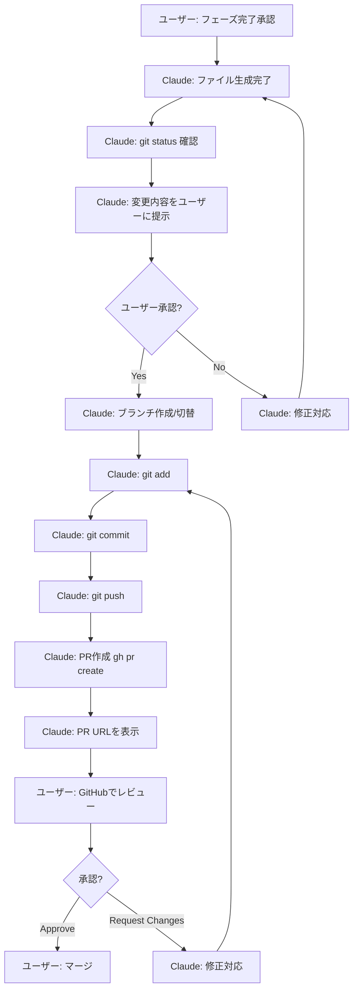
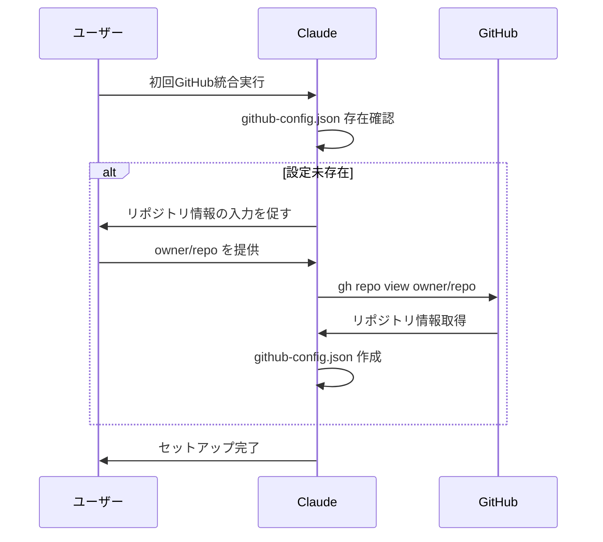
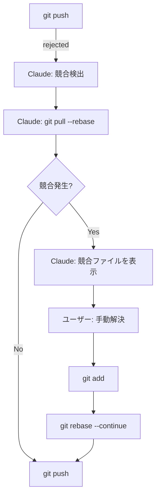

# GitHub MCP 統合設計

## 1. 概要

AI開発ファシリテーターが生成したコード・ドキュメントを、GitHub リポジトリに自動的にコミット・プッシュするための MCP 統合設計。

### 目的
- バージョン管理の自動化
- チーム開発の効率化
- コードレビューの促進
- CI/CD パイプラインとの統合

### スコープ
- **Phase 3.0**: ローカル Claude Code + GitHub CLI/API
- **対象ファイル**: `src/`, `tests/`, `infra/`, `docs/` 等
- **操作方式**: 手動承認後の自動コミット・プッシュ

---

## 2. リポジトリ構造

### 2.1 推奨ブランチ戦略

```
main (本番)
├── develop (開発)
│   ├── feature/aidev-planning-phase-20250120
│   ├── feature/aidev-requirements-phase-20250120
│   ├── feature/aidev-design-phase-20250121
│   └── feature/aidev-implementation-phase-20250121
└── release/v1.0.0 (リリース準備)
```

**AIファシリテーターの振る舞い：**
- 各フェーズごとに `feature/aidev-{phase}-{YYYYMMDD}` ブランチを作成
- フェーズ完了時にPull Request作成
- ユーザーレビュー後にマージ

### 2.2 ディレクトリ構造（生成物の配置）

```
project-root/
├── .claude/                    # AIファシリテーター設定（このリポジトリ）
├── .claude-state/              # プロジェクト状態（.gitignore）
├── docs/                       # 生成ドキュメント
│   ├── 01_企画書.md
│   ├── 02_要件定義書.md
│   ├── 03_基本設計書.md
│   ├── diagrams/               # Mermaid図
│   └── standards/              # プロジェクト固有規約
├── src/                        # アプリケーションコード
│   ├── main.py / index.ts
│   ├── models/
│   ├── services/
│   └── utils/
├── tests/                      # テストコード
│   ├── unit/
│   └── integration/
├── infra/                      # インフラコード
│   ├── terraform/
│   └── cloudformation/
├── .github/                    # GitHub設定
│   └── workflows/              # CI/CD
├── .gitignore
├── README.md
└── package.json / requirements.txt
```

---

## 3. GitHub操作フロー

### 3.1 基本フロー（フェーズ完了時）



### 3.2 詳細ステップ

#### Step 1: 変更内容の確認

```bash
# 並列実行
git status
git diff
git log --oneline -5
```

**Claude の振る舞い：**
- 変更ファイル一覧を表示
- diffの概要を説明
- 追加・削除・変更の統計を提示

#### Step 2: ブランチ戦略の適用

```bash
# 現在のフェーズに応じたブランチ名を生成
PHASE="planning"  # planning, requirements, design, implementation, testing, delivery
DATE=$(date +%Y%m%d)
BRANCH="feature/aidev-${PHASE}-${DATE}"

# ブランチ作成
git checkout -b $BRANCH
```

#### Step 3: コミット作成

```bash
# ステージング
git add docs/01_企画書.md
git add docs/diagrams/

# コミットメッセージ生成（AI が自動生成）
git commit -m "$(cat <<'EOF'
Add planning phase deliverables

企画フェーズの成果物を追加:
- 企画書（ビジネス背景、課題、解決策）
- システム構成図（Mermaid）
- 技術選定の根拠

🤖 Generated with [Claude Code](https://claude.com/claude-code)

Co-Authored-By: Claude <noreply@anthropic.com>
EOF
)"
```

**コミットメッセージのルール：**
- 1行目: 簡潔な要約（50文字以内、英語）
- 2行目: 空行
- 3行目以降: 詳細説明（日本語OK）
- フッター: AI生成の表記

#### Step 4: プッシュとPR作成

```bash
# リモートにプッシュ（-u で上流ブランチ設定）
git push -u origin $BRANCH

# PR作成（gh CLI使用）
gh pr create \
  --title "企画フェーズ完了: システム企画書と構成図" \
  --body "$(cat <<'EOF'
## 概要
企画フェーズの成果物をコミットします。

## 変更内容
- ✅ 企画書（`docs/01_企画書.md`）
- ✅ システム構成図（`docs/diagrams/system-architecture.md`）

## チェックリスト
- [x] ビジネス背景のヒアリング完了
- [x] 課題と解決策の明確化
- [x] 技術選定の根拠説明
- [x] ステークホルダーレビュー完了

## レビュー観点
- [ ] ビジネス背景が正しく理解されているか
- [ ] 技術選定は適切か
- [ ] 構成図は分かりやすいか

🤖 Generated with [Claude Code](https://claude.com/claude-code)
EOF
)" \
  --base develop
```

---

## 4. 設定管理

### 4.1 設定ファイル: `.claude-state/github-config.json`

```json
{
  "repository": {
    "owner": "your-org",
    "name": "your-project",
    "defaultBranch": "main",
    "developBranch": "develop"
  },
  "branchStrategy": "feature-per-phase",
  "commitMessageFormat": "conventional-commits",
  "autoCommit": false,
  "autoPush": false,
  "autoCreatePR": false,
  "lastCommitAt": "2025-01-20T10:00:00Z",
  "commits": [
    {
      "phase": "planning",
      "branch": "feature/aidev-planning-20250120",
      "commitSha": "abc123",
      "prUrl": "https://github.com/org/repo/pull/123",
      "createdAt": "2025-01-20T10:00:00Z"
    }
  ]
}
```

### 4.2 初回セットアップフロー



---

## 5. コミットメッセージ生成ルール

### 5.1 Conventional Commits 準拠

```
<type>(<scope>): <subject>

<body>

<footer>
```

**Type（必須）：**
- `feat`: 新機能追加
- `docs`: ドキュメント追加・更新
- `refactor`: リファクタリング
- `test`: テスト追加
- `infra`: インフラコード追加・変更
- `chore`: その他（設定ファイル等）

**Scope（オプション）：**
- `planning`: 企画フェーズ
- `requirements`: 要件定義フェーズ
- `design`: 設計フェーズ
- `implementation`: 実装フェーズ
- `testing`: テストフェーズ
- `delivery`: 納品フェーズ

**例：**
```
docs(planning): Add business requirements and system architecture

企画フェーズの成果物を追加:
- ビジネス背景と課題分析
- システム構成図（AWS構成）
- 技術スタック選定の根拠

🤖 Generated with [Claude Code](https://claude.com/claude-code)

Co-Authored-By: Claude <noreply@anthropic.com>
```

### 5.2 AI による自動生成ロジック

```typescript
function generateCommitMessage(phase: string, files: string[]): string {
  // フェーズに応じた type を決定
  const type = files.some(f => f.startsWith('docs/')) ? 'docs' : 'feat';

  // 変更内容の要約を生成（AI が自動判断）
  const subject = summarizeChanges(files);

  // 詳細説明を生成
  const body = files.map(f => `- ${f}`).join('\n');

  return `${type}(${phase}): ${subject}\n\n${body}\n\n🤖 Generated with [Claude Code](https://claude.com/claude-code)\n\nCo-Authored-By: Claude <noreply@anthropic.com>`;
}
```

---

## 6. PR（Pull Request）管理

### 6.1 PRテンプレート

```markdown
## 概要
{フェーズ名}フェーズの成果物をコミットします。

## 変更内容
{生成ファイル一覧}

## チェックリスト
- [ ] フェーズの決定事項が全て反映されているか
- [ ] ドキュメントの品質は納品レベルか
- [ ] 技術標準に準拠しているか
- [ ] テストが通っているか（実装フェーズの場合）

## レビュー観点
{フェーズごとのレビューポイント}

## 関連Issue
Closes #{issue_number}

🤖 Generated with [Claude Code](https://claude.com/claude-code)
```

### 6.2 自動ラベル付与

```bash
# フェーズに応じたラベルを自動付与
gh pr edit $PR_NUMBER --add-label "phase:planning"
gh pr edit $PR_NUMBER --add-label "ai-generated"
gh pr edit $PR_NUMBER --add-label "documentation"
```

---

## 7. CI/CD 連携

### 7.1 GitHub Actions ワークフロー（例）

```yaml
# .github/workflows/aidev-pr-check.yml
name: AI Dev PR Check

on:
  pull_request:
    branches: [develop, main]

jobs:
  validate:
    runs-on: ubuntu-latest
    steps:
      - uses: actions/checkout@v3

      # ドキュメント品質チェック
      - name: Check Markdown
        run: |
          npm install -g markdownlint-cli
          markdownlint docs/

      # Mermaid図の検証
      - name: Validate Mermaid Diagrams
        run: |
          npm install -g @mermaid-js/mermaid-cli
          find docs/diagrams -name "*.md" -exec mmdc -i {} -o /tmp/output.svg \;

      # コード品質チェック（実装フェーズの場合）
      - name: Lint Code
        if: contains(github.head_ref, 'implementation')
        run: |
          npm install
          npm run lint

      # テスト実行（実装フェーズの場合）
      - name: Run Tests
        if: contains(github.head_ref, 'implementation')
        run: |
          npm test
```

### 7.2 自動デプロイ（実装フェーズ以降）

```yaml
# .github/workflows/deploy.yml
name: Deploy

on:
  push:
    branches: [main]

jobs:
  deploy:
    runs-on: ubuntu-latest
    steps:
      - uses: actions/checkout@v3

      # インフラデプロイ（Terraform/CloudFormation）
      - name: Deploy Infrastructure
        run: |
          cd infra/terraform
          terraform init
          terraform plan
          terraform apply -auto-approve

      # アプリケーションデプロイ
      - name: Deploy Application
        run: |
          # デプロイロジック
```

---

## 8. エラーハンドリング

### 8.1 よくあるエラーと対処

| エラー | 原因 | 対処方法 |
|-------|------|---------|
| `fatal: not a git repository` | Git未初期化 | `git init` を実行 |
| `rejected (non-fast-forward)` | リモートに新しいコミットあり | `git pull --rebase` してから push |
| `gh: command not found` | GitHub CLI 未インストール | `gh` のインストールを案内 |
| `API rate limit exceeded` | GitHub API 制限 | 1時間待機、または認証トークン確認 |
| `Permission denied` | SSH鍵未設定 | HTTPS URLの使用を提案 |

### 8.2 競合解決フロー



---

## 9. セキュリティ考慮事項

### 9.1 認証情報管理

- ❌ GitHub Personal Access Token を `.claude-state/` に保存しない
- ✅ `gh auth login` でシステム認証を使用
- ✅ SSH鍵は `~/.ssh/` で管理

### 9.2 機密情報のコミット防止

```bash
# .gitignore に必須項目を追加（Claude が自動生成）
.claude-state/
.env
*.key
*.pem
secrets.json
```

**Claude の振る舞い：**
- コミット前に `.env`, `*.key` 等が含まれていないかチェック
- 含まれている場合は警告を表示し、コミットを中断

---

## 10. ユーザー体験

### 10.1 理想的な会話フロー

```
Claude: 企画書が完成しました。GitHubにコミットしますか？

変更内容:
  新規: docs/01_企画書.md
  新規: docs/diagrams/system-architecture.md

コミットメッセージ（案）:
  docs(planning): Add business requirements and system architecture

  企画フェーズの成果物を追加:
  - ビジネス背景と課題分析
  - システム構成図（AWS構成）

ユーザー: はい

Claude: ブランチ `feature/aidev-planning-20250120` を作成しました
        ✅ ファイルをステージングしました
        ✅ コミットを作成しました（abc123）
        ✅ リモートにプッシュしました
        ✅ Pull Request を作成しました

        📎 PR: https://github.com/org/repo/pull/123

        GitHubでレビューして、問題なければマージしてください。

ユーザー: 確認しました。マージします。
```

### 10.2 エラー時の対応

```
Claude: GitHubへのプッシュに失敗しました。

エラー内容:
  ! [rejected] feature/aidev-planning-20250120 -> feature/aidev-planning-20250120 (non-fast-forward)

原因:
  リモートブランチに新しいコミットがあります。

対処方法:
  1. git pull --rebase で最新状態を取得します
  2. 競合があれば解決します
  3. 再度プッシュします

自動で実行しますか？それとも手動で対応しますか？
```

---

## 11. 実装の優先順位

### Phase 3.0.1: 最小限の実装（MVP）
- ✅ ブランチ作成・切替
- ✅ git add / commit / push
- ✅ コミットメッセージ自動生成
- ✅ 手動承認フロー

### Phase 3.0.2: 機能拡充
- ⬜ gh CLI 統合（PR作成）
- ⬜ 競合解決サポート
- ⬜ コミット履歴管理（`.claude-state/`）
- ⬜ 自動ラベル付与

### Phase 3.0.3: 最適化
- ⬜ 自動コミット・プッシュモード
- ⬜ CI/CD連携（ワークフロー生成）
- ⬜ ブランチ保護ルール対応

---

## 12. テスト計画

### 12.1 手動テスト項目
- [ ] 新規リポジトリでの初回コミット
- [ ] 既存リポジトリへのコミット追加
- [ ] ブランチ作成・切替
- [ ] PR作成（gh CLI）
- [ ] 競合発生時の対応
- [ ] 日本語コミットメッセージの正しい表示

### 12.2 動作確認環境
- ローカル: Git + GitHub CLI
- リモート: GitHub.com（プライベートリポジトリ推奨）

---

## 13. 参考リンク

- GitHub CLI 公式ドキュメント: https://cli.github.com/manual/
- Conventional Commits: https://www.conventionalcommits.org/
- Git ワークフロー: https://www.atlassian.com/git/tutorials/comparing-workflows
