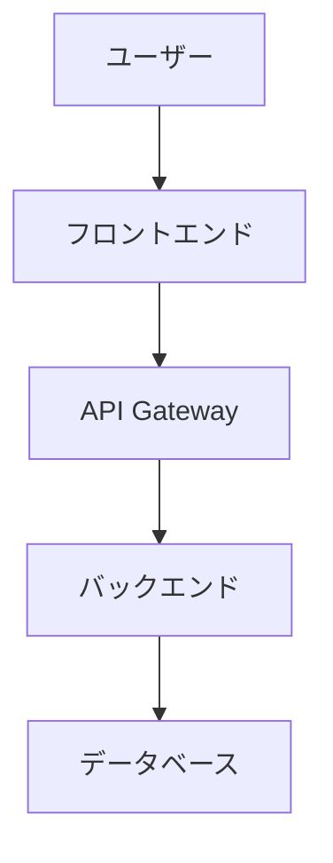

# 企画書テンプレート

> このテンプレートは、企画フェーズで生成するドキュメントの標準構成です。
> ユーザーとのヒアリング内容を基に、各セクションを埋めてください。

---

## 1. プロジェクト概要

### 1.1 プロジェクト名
- **正式名称**: {プロジェクト名}
- **略称**: {略称（あれば）}

### 1.2 プロジェクトの背景
{ビジネス背景を詳細に記述}

- **現状の課題**:
  - {具体的な課題1}
  - {具体的な課題2}

- **課題の影響**:
  - {定量的な影響（数値、時間、コスト等）}
  - {定性的な影響（業務効率、ユーザー体験等）}

### 1.3 プロジェクトの目的
{このプロジェクトで達成したいこと}

- **主要目的**: {最も重要な目的}
- **副次目的**:
  - {副次的な目的1}
  - {副次的な目的2}

---

## 2. ターゲットユーザー

### 2.1 主要ユーザー
- **ペルソナ1**: {ユーザー属性}
  - 役割: {役割}
  - 課題: {抱えている課題}
  - 期待する価値: {システムに期待すること}

- **ペルソナ2**: {ユーザー属性}
  - 役割: {役割}
  - 課題: {抱えている課題}
  - 期待する価値: {システムに期待すること}

### 2.2 ステークホルダー
| ステークホルダー | 役割 | 関心事 |
|----------------|------|--------|
| {役職/部署} | {役割} | {関心事} |
| {役職/部署} | {役割} | {関心事} |

---

## 3. ビジネス価値

### 3.1 期待される効果
- **定量的効果**:
  - {効果1}（例: コスト削減XX%）
  - {効果2}（例: 処理時間XX分短縮）
  - {効果3}（例: エラー率XX%削減）

- **定性的効果**:
  - {効果1}（例: ユーザー満足度向上）
  - {効果2}（例: 業務の属人化解消）
  - {効果3}（例: データ可視化による意思決定の質向上）

### 3.2 投資対効果（ROI）
{ROIの見込み、回収期間等}

---

## 4. スコープ

### 4.1 含まれるもの（In Scope）
- {スコープに含む機能/業務1}
- {スコープに含む機能/業務2}
- {スコープに含む機能/業務3}

### 4.2 含まれないもの（Out of Scope）
- {今回は対象外とするもの1}
- {今回は対象外とするもの2}

### 4.3 将来検討するもの（Future）
- {Phase 2以降で検討するもの1}
- {Phase 2以降で検討するもの2}

---

## 5. 主要機能（概要）

### 5.1 機能一覧
| 機能名 | 概要 | 優先度 |
|--------|------|--------|
| {機能1} | {概要} | 高/中/低 |
| {機能2} | {概要} | 高/中/低 |
| {機能3} | {概要} | 高/中/低 |

### 5.2 機能の詳細
#### {機能1}
- **目的**: {なぜこの機能が必要か}
- **ユーザー価値**: {ユーザーにとっての価値}
- **実現方法の方向性**: {技術的な実現方法の大枠}

#### {機能2}
- **目的**: {なぜこの機能が必要か}
- **ユーザー価値**: {ユーザーにとっての価値}
- **実現方法の方向性**: {技術的な実現方法の大枠}

---

## 6. システム構成（概要）

### 6.1 システムタイプ
- [ ] Webアプリケーション
- [ ] モバイルアプリ
- [ ] デスクトップアプリ
- [ ] API/バックエンドサービス
- [ ] インフラ構築
- [ ] データ基盤
- [ ] その他: {具体的に}

### 6.2 アーキテクチャ概要
{システム全体の構成イメージ}

### 6.3 技術スタックの方向性
- **フロントエンド**: {候補技術}
- **バックエンド**: {候補技術}
- **データベース**: {候補技術}
- **インフラ**: {候補技術}
- **CI/CD**: {候補技術}

---

## 7. スケジュール（概算）

### 7.1 マイルストーン
| フェーズ | 期間（見込み） | 主要成果物 |
|---------|---------------|-----------|
| 要件定義 | {XX週間} | 要件定義書 |
| 設計 | {XX週間} | 設計書 |
| 実装 | {XX週間} | 動作するシステム |
| テスト | {XX週間} | テスト完了報告 |
| デプロイ | {XX週間} | 本番稼働 |

### 7.2 リリース計画
- **Phase 1 (MVP)**: {リリース時期と含む機能}
- **Phase 2**: {リリース時期と含む機能}
- **Phase 3**: {リリース時期と含む機能}

---

## 8. リスクと制約

### 8.1 想定リスク
| リスク | 影響度 | 対策 |
|--------|--------|------|
| {リスク1} | 高/中/低 | {対策} |
| {リスク2} | 高/中/低 | {対策} |
| {リスク3} | 高/中/低 | {対策} |

### 8.2 制約条件
- **技術的制約**: {既存システムとの連携、使用可能な技術等}
- **予算的制約**: {予算上限、コスト制約等}
- **時間的制約**: {リリース期限、マイルストーン等}
- **組織的制約**: {体制、承認プロセス等}

---

## 9. 成功基準

### 9.1 KPI
| KPI | 現状値 | 目標値 | 測定方法 |
|-----|--------|--------|----------|
| {KPI1} | {現状} | {目標} | {測定方法} |
| {KPI2} | {現状} | {目標} | {測定方法} |
| {KPI3} | {現状} | {目標} | {測定方法} |

### 9.2 成功の定義
{何をもってプロジェクト成功とするか}

- **必須条件**:
  - {条件1}
  - {条件2}

- **望ましい条件**:
  - {条件1}
  - {条件2}

---

## 10. 次のステップ

### 10.1 要件定義フェーズで明確にすること
- [ ] {明確にすべき事項1}
- [ ] {明確にすべき事項2}
- [ ] {明確にすべき事項3}

### 10.2 承認事項
- [ ] ステークホルダーレビュー
- [ ] 予算承認
- [ ] スコープ確定
- [ ] 要件定義フェーズへの移行承認

---

## 付録

### A. 参考資料
- {参考にした資料、ドキュメント等}

### B. 用語集
| 用語 | 定義 |
|------|------|
| {用語1} | {定義} |
| {用語2} | {定義} |

### C. 変更履歴
| 日付 | 版数 | 変更内容 | 作成者 |
|------|------|----------|--------|
| {日付} | 1.0 | 初版作成 | AI開発ファシリテーター |
