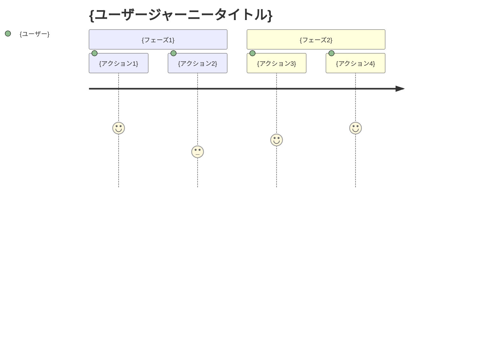
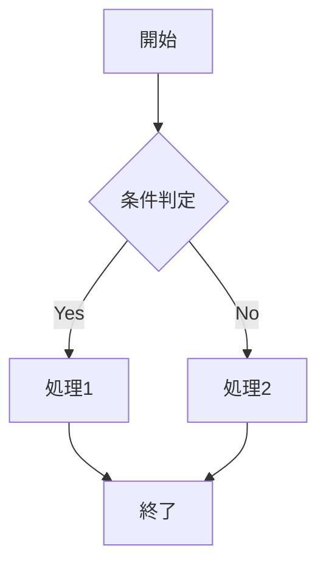
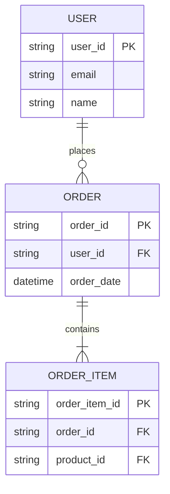

# 要件定義書テンプレート

> このテンプレートは、要件定義フェーズで生成するドキュメントの標準構成です。
> 企画書の内容を基に、より詳細な要件を定義します。

---

## 1. ドキュメント情報

| 項目 | 内容 |
|------|------|
| プロジェクト名 | {プロジェクト名} |
| 文書バージョン | {バージョン} |
| 作成日 | {作成日} |
| 最終更新日 | {更新日} |
| 承認状態 | 承認待ち/承認済み |

---

## 2. プロジェクト概要

### 2.1 背景と目的
{企画書からの要約}

### 2.2 スコープ
{企画書で定義したスコープの再確認}

---

## 3. ビジネス要件

### 3.1 ビジネス目標
{ビジネス上達成すべきゴール}

### 3.2 KPI
| KPI | 現状値 | 目標値 | 測定時期 | 測定方法 |
|-----|--------|--------|----------|----------|
| {KPI1} | {現状} | {目標} | {時期} | {方法} |
| {KPI2} | {現状} | {目標} | {時期} | {方法} |

### 3.3 ビジネスルール
1. **{ルール分類1}**
   - {具体的なルール1-1}
   - {具体的なルール1-2}

2. **{ルール分類2}**
   - {具体的なルール2-1}
   - {具体的なルール2-2}

---

## 4. ユーザー要件

### 4.1 ユーザーストーリー

#### US-001: {ユーザーストーリー名}
- **As a** {ユーザー種別}
- **I want** {やりたいこと}
- **So that** {得たい価値}
- **優先度**: 高/中/低
- **受け入れ基準**:
  - [ ] {基準1}
  - [ ] {基準2}
  - [ ] {基準3}

#### US-002: {ユーザーストーリー名}
- **As a** {ユーザー種別}
- **I want** {やりたいこと}
- **So that** {得たい価値}
- **優先度**: 高/中/低
- **受け入れ基準**:
  - [ ] {基準1}
  - [ ] {基準2}

### 4.2 ユーザージャーニー

---

## 5. 機能要件

### 5.1 機能一覧

| ID | 機能名 | 概要 | 優先度 | 依存関係 |
|----|--------|------|--------|----------|
| F-001 | {機能名} | {概要} | 高/中/低 | {依存するID} |
| F-002 | {機能名} | {概要} | 高/中/低 | {依存するID} |
| F-003 | {機能名} | {概要} | 高/中/低 | {依存するID} |

### 5.2 機能詳細

#### F-001: {機能名}

**概要**
{機能の詳細説明}

**入力**
| 項目名 | データ型 | 必須 | 制約 | 備考 |
|--------|----------|------|------|------|
| {項目1} | {型} | ○/× | {制約} | {備考} |
| {項目2} | {型} | ○/× | {制約} | {備考} |

**処理内容**
1. {処理ステップ1}
2. {処理ステップ2}
3. {処理ステップ3}

**出力**
| 項目名 | データ型 | 条件 | 備考 |
|--------|----------|------|------|
| {項目1} | {型} | {条件} | {備考} |
| {項目2} | {型} | {条件} | {備考} |

**エラー処理**
| エラーコード | 発生条件 | 処理内容 | ユーザーへの表示 |
|-------------|----------|----------|------------------|
| E001 | {条件} | {処理} | {メッセージ} |
| E002 | {条件} | {処理} | {メッセージ} |

**画面遷移/フロー**

**ビジネスルール**
- {ルール1}
- {ルール2}

**備考**
{追加情報、注意事項等}

---

#### F-002: {機能名}
{F-001と同じ構成で記述}

---

## 6. 非機能要件

### 6.1 パフォーマンス要件

| 項目 | 要件 | 測定方法 |
|------|------|----------|
| レスポンスタイム | {XX秒以内} | {測定方法} |
| スループット | {XX件/秒} | {測定方法} |
| 同時接続数 | {XX人} | {測定方法} |

### 6.2 可用性要件

| 項目 | 要件 | 備考 |
|------|------|------|
| 稼働時間 | {99.9%等} | {ダウンタイム許容値} |
| MTTR | {XX分以内} | {復旧時間目標} |
| MTBF | {XX時間} | {平均故障間隔} |

### 6.3 スケーラビリティ要件

- **ユーザー数**: {現在XX人 → 1年後XX人}
- **データ量**: {現在XXレコード → 1年後XXレコード}
- **トラフィック**: {現在XX PV/日 → 1年後XX PV/日}
- **スケール戦略**: {水平/垂直スケール、Auto Scaling等}

### 6.4 セキュリティ要件

#### 認証・認可
- **認証方式**: {JWT、OAuth2.0、SAML等}
- **パスワードポリシー**:
  - 最小長: {XX文字}
  - 複雑性: {英数字+記号必須等}
  - 有効期限: {XXヶ月}
  - 履歴管理: {過去XX回分}

- **ロール管理**:
  | ロール名 | 権限 | 対象ユーザー |
  |---------|------|-------------|
  | {ロール1} | {権限リスト} | {対象} |
  | {ロール2} | {権限リスト} | {対象} |

#### データ保護
- **暗号化**:
  - 通信: TLS 1.2以上
  - 保存データ: AES-256
  - 機密情報: {追加の暗号化方式}

- **個人情報保護**:
  - PII項目: {リスト}
  - マスキング: {方式}
  - 保持期間: {期間}
  - 削除方式: {論理削除/物理削除}

#### 監査・ログ
- **監査ログ対象**:
  - [ ] ログイン/ログアウト
  - [ ] データ参照
  - [ ] データ更新
  - [ ] データ削除
  - [ ] 設定変更
  - [ ] 権限変更

- **ログ保持期間**: {XX年}
- **ログ出力項目**: {ユーザーID、操作内容、タイムスタンプ等}

### 6.5 保守性要件

- **ログ設計**:
  - エラーログ: {出力レベル、フォーマット}
  - アクセスログ: {フォーマット}
  - アプリケーションログ: {フォーマット}

- **監視**:
  - [ ] リソース監視（CPU、メモリ、ディスク）
  - [ ] アプリケーション監視
  - [ ] エラー率監視
  - [ ] レスポンスタイム監視

- **バックアップ**:
  - 頻度: {毎日/毎週等}
  - 世代管理: {XX世代}
  - 保存先: {S3、別リージョン等}
  - RPO: {目標復旧時点}
  - RTO: {目標復旧時間}

### 6.6 互換性要件

- **ブラウザ対応**:
  - [ ] Chrome（最新版-1）
  - [ ] Firefox（最新版-1）
  - [ ] Safari（最新版-1）
  - [ ] Edge（最新版-1）

- **デバイス対応**:
  - [ ] デスクトップ
  - [ ] タブレット
  - [ ] スマートフォン

- **OS対応**:
  - [ ] Windows 10以降
  - [ ] macOS 12以降
  - [ ] iOS 15以降
  - [ ] Android 10以降

### 6.7 運用要件

- **デプロイ**:
  - 頻度: {毎日/毎週等}
  - 時間帯: {深夜/メンテナンス時間等}
  - ダウンタイム: {あり/なし（Blue-Green等）}

- **環境**:
  - 開発環境: {構成}
  - ステージング環境: {構成}
  - 本番環境: {構成}

---

## 7. データ要件

### 7.1 データモデル概要

### 7.2 データ項目定義

#### {エンティティ名1}

| 項目名 | 論理名 | データ型 | 桁数 | NULL | 主キー | 外部キー | 初期値 | 備考 |
|--------|--------|----------|------|------|--------|----------|--------|------|
| {項目1} | {論理名} | {型} | {桁} | ○/× | ○/× | {参照先} | {値} | {備考} |
| {項目2} | {論理名} | {型} | {桁} | ○/× | ○/× | {参照先} | {値} | {備考} |

**インデックス**
| インデックス名 | 項目 | ユニーク | 備考 |
|---------------|------|----------|------|
| {名前} | {項目リスト} | ○/× | {備考} |

**制約**
- {制約1}
- {制約2}

### 7.3 データライフサイクル

| データ種別 | 保持期間 | アーカイブ方式 | 削除方式 | 備考 |
|-----------|----------|---------------|----------|------|
| {データ1} | {期間} | {方式} | {論理/物理} | {備考} |
| {データ2} | {期間} | {方式} | {論理/物理} | {備考} |

---

## 8. 外部インターフェース要件

### 8.1 外部システム連携

#### {外部システム名1}

**概要**
{連携目的、概要}

**連携方式**
- プロトコル: {REST API、gRPC、SOAP等}
- 認証方式: {API Key、OAuth等}
- データフォーマット: {JSON、XML等}

**連携タイミング**
- {リアルタイム/バッチ/イベント駆動等}

**エンドポイント**
| メソッド | パス | 概要 | リクエスト | レスポンス |
|---------|------|------|-----------|-----------|
| GET | /api/v1/{resource} | {概要} | {schema} | {schema} |
| POST | /api/v1/{resource} | {概要} | {schema} | {schema} |

**エラーハンドリング**
| エラーコード | 発生条件 | リトライ | 備考 |
|-------------|----------|---------|------|
| {コード} | {条件} | ○/× | {備考} |

**SLA**
- レスポンスタイム: {XX秒}
- 可用性: {XX%}
- リトライポリシー: {回数、間隔}

### 8.2 API仕様

{このシステムが提供するAPIの仕様}

---

## 9. 制約条件

### 9.1 技術的制約
- {制約1}
- {制約2}

### 9.2 ビジネス的制約
- {制約1}
- {制約2}

### 9.3 法的・規制上の制約
- {制約1（例: 個人情報保護法遵守）}
- {制約2（例: 業界特有の規制）}

---

## 10. リスクと対策

| リスク | 影響度 | 発生確率 | 影響範囲 | 対策 | 担当 |
|--------|--------|----------|----------|------|------|
| {リスク1} | 高/中/低 | 高/中/低 | {範囲} | {対策} | {担当} |
| {リスク2} | 高/中/低 | 高/中/低 | {範囲} | {対策} | {担当} |

---

## 11. テスト要件

### 11.1 テスト戦略
- **単体テスト**: {カバレッジ目標XX%}
- **結合テスト**: {方針}
- **システムテスト**: {方針}
- **性能テスト**: {方針}
- **セキュリティテスト**: {方針}

### 11.2 テスト環境
{テスト環境の要件}

### 11.3 受け入れテスト
{受け入れ基準、テストシナリオの概要}

---

## 12. 移行要件

### 12.1 データ移行
- **移行対象データ**: {リスト}
- **移行方式**: {一括/段階的}
- **データクレンジング**: {要否、方針}
- **移行スケジュール**: {スケジュール}

### 12.2 移行リスク
| リスク | 対策 |
|--------|------|
| {リスク1} | {対策} |
| {リスク2} | {対策} |

---

## 13. 教育・研修要件

- **対象者**: {ユーザー、管理者等}
- **研修内容**: {内容}
- **研修方式**: {ハンズオン、マニュアル等}
- **研修スケジュール**: {スケジュール}

---

## 14. 運用・保守要件

### 14.1 運用体制
- **運用時間**: {24/365、平日9-18時等}
- **サポート体制**: {体制}
- **エスカレーション**: {フロー}

### 14.2 保守計画
- **定期メンテナンス**: {頻度、内容}
- **パッチ適用**: {方針}
- **バージョンアップ**: {方針}

---

## 15. 次のステップ

### 15.1 設計フェーズで決定すること
- [ ] {決定事項1}
- [ ] {決定事項2}
- [ ] {決定事項3}

### 15.2 承認事項
- [ ] ビジネス要件承認
- [ ] 機能要件承認
- [ ] 非機能要件承認
- [ ] 設計フェーズへの移行承認

---

## 付録

### A. 用語集
| 用語 | 定義 |
|------|------|
| {用語1} | {定義} |
| {用語2} | {定義} |

### B. 参考資料
- {参考資料リスト}

### C. 変更履歴
| 日付 | 版数 | 変更内容 | 承認者 |
|------|------|----------|--------|
| {日付} | 1.0 | 初版作成 | - |
