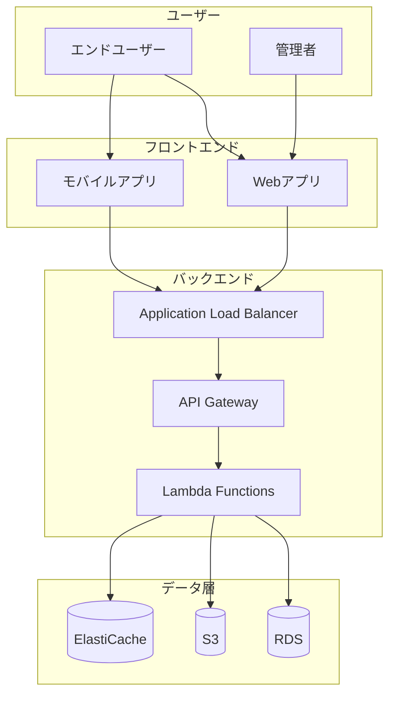
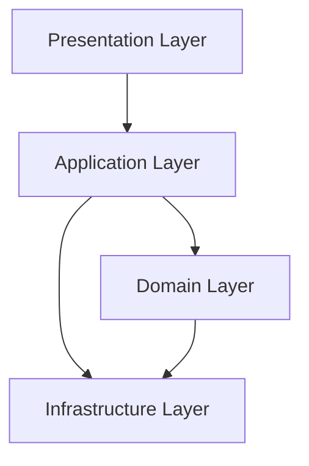
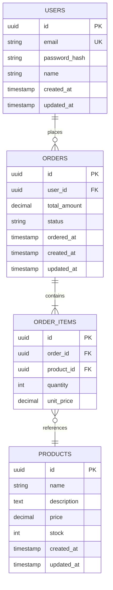
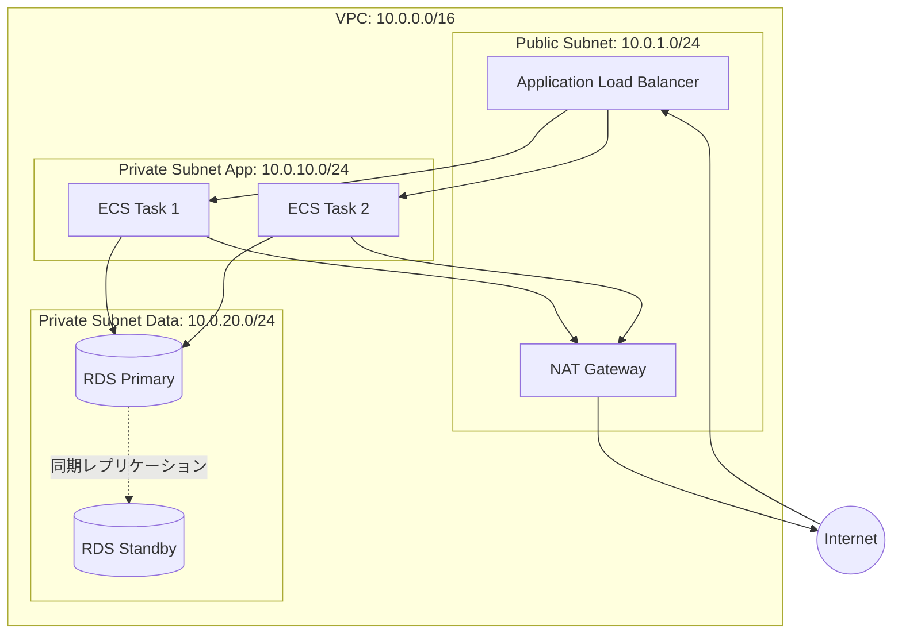
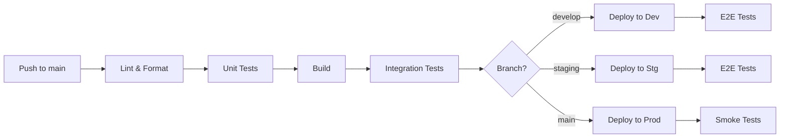
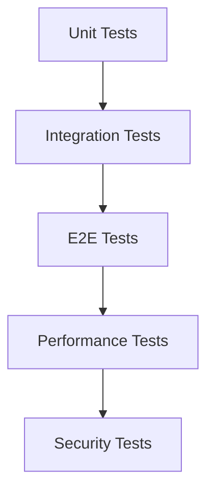
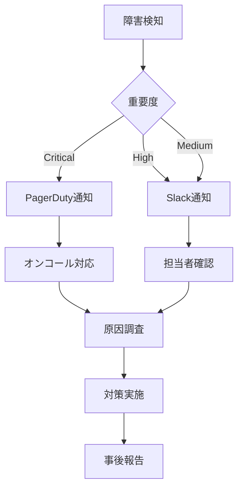

# 設計書テンプレート

> このテンプレートは、設計フェーズで生成するドキュメントの標準構成です。
> 要件定義書の内容を基に、技術的な設計を詳細化します。

---

## 1. ドキュメント情報

| 項目 | 内容 |
|------|------|
| プロジェクト名 | {プロジェクト名} |
| 文書バージョン | {バージョン} |
| 作成日 | {作成日} |
| 最終更新日 | {更新日} |
| 承認状態 | 承認待ち/承認済み |

---

## 2. システム概要

### 2.1 システム構成図



### 2.2 技術スタック

| レイヤー | 技術 | バージョン | 選定理由 |
|---------|------|-----------|---------|
| フロントエンド | {React/Vue/Angular} | {X.Y.Z} | {理由} |
| バックエンド | {Node.js/Python/Go} | {X.Y.Z} | {理由} |
| データベース | {PostgreSQL/MySQL} | {X.Y} | {理由} |
| キャッシュ | {Redis/Memcached} | {X.Y} | {理由} |
| インフラ | {AWS/GCP/Azure} | - | {理由} |
| CI/CD | {GitHub Actions/GitLab CI} | - | {理由} |
| IaC | {Terraform/CloudFormation} | {X.Y.Z} | {理由} |
| 監視 | {CloudWatch/Datadog} | - | {理由} |

---

## 3. アーキテクチャ設計

### 3.1 アーキテクチャパターン
- **採用パターン**: {3層アーキテクチャ、マイクロサービス、サーバーレス等}
- **選定理由**: {理由}

### 3.2 設計原則
- [ ] 疎結合
- [ ] 高凝集
- [ ] 単一責任の原則
- [ ] DRY原則
- [ ] SOLID原則
- [ ] 12 Factor App

### 3.3 レイヤー構成



**各レイヤーの責務**
| レイヤー | 責務 | 主要コンポーネント |
|---------|------|-------------------|
| Presentation | UI、入出力処理 | {コンポーネント} |
| Application | ユースケース実装 | {コンポーネント} |
| Domain | ビジネスロジック | {コンポーネント} |
| Infrastructure | 外部I/O、永続化 | {コンポーネント} |

---

## 4. ディレクトリ構成

> **重要**: ディレクトリ構成はプロジェクト規模・特性に応じて決定してください。
> 以下は参考例です。実装前に最新のベストプラクティスを調査し、プロジェクトに最適な構成を検討してください。

### 4.1 アプリケーション（参考例）

**検討事項:**
- プロジェクト規模（小規模/中規模/大規模）
- アーキテクチャパターン（モノリシック/マイクロフロントエンド等）
- 技術スタック（React/Vue/Next.js等）の推奨構成
- チーム規模・開発体制

**構成を決定する前に調査すべきこと:**
- [ ] 採用技術の公式ドキュメントの推奨構成
- [ ] プロジェクト規模に応じたベストプラクティス（WebSearch/WebFetch で調査）
- [ ] モノレポ vs マルチレポ
- [ ] 機能別 vs レイヤー別の分割方針

**参考構成（React + TypeScript の例）:**
```
{プロジェクト規模や要件に応じて調査・決定した構成を記載}

例:
project-root/
├── src/
│   ├── {構成は要件・規模により決定}
│   └── ...
└── ...
```

### 4.2 インフラ（参考例）

**検討事項:**
- IaCツール（Terraform/CloudFormation/CDK）
- 環境戦略（dev/stg/prod の分離方針）
- モジュール化の粒度

**構成を決定する前に調査すべきこと:**
- [ ] 採用IaCツールのベストプラクティス（WebSearch/WebFetch で調査）
- [ ] プロジェクト規模に応じたモジュール分割
- [ ] 環境別の管理方法（Workspace/ディレクトリ分離等）

**参考構成（Terraform の例）:**
```
{プロジェクト規模や要件に応じて調査・決定した構成を記載}

例:
infra/
├── {構成は要件・規模により決定}
└── ...
```

**決定した構成と理由:**
{実際にプロジェクトで採用した構成を記載し、選定理由を明記}

---

## 5. データベース設計

### 5.1 ER図



### 5.2 テーブル定義

#### users テーブル

| カラム名 | データ型 | NULL | デフォルト | 制約 | 説明 |
|---------|---------|------|-----------|------|------|
| id | UUID | NO | uuid_generate_v4() | PK | ユーザーID |
| email | VARCHAR(255) | NO | - | UK | メールアドレス |
| password_hash | VARCHAR(255) | NO | - | - | パスワードハッシュ |
| name | VARCHAR(100) | NO | - | - | 氏名 |
| created_at | TIMESTAMP | NO | CURRENT_TIMESTAMP | - | 作成日時 |
| updated_at | TIMESTAMP | NO | CURRENT_TIMESTAMP | - | 更新日時 |

**インデックス**
- `idx_users_email` ON email (UNIQUE)
- `idx_users_created_at` ON created_at

**制約**
- `email` は有効なメールアドレス形式
- `password_hash` は bcrypt ハッシュ

---

#### orders テーブル

{同様の形式で定義}

---

### 5.3 データ移行戦略

**マイグレーション管理**
- ツール: {Flyway、Liquibase、Alembic等}
- バージョニング: {V{YYYYMMDDHHmmss}__{description}.sql}
- ロールバック: {各マイグレーションにundo用SQL作成}

**初期データ投入**
- マスターデータ: {seed.sql}
- テストデータ: {test_data.sql（開発環境のみ）}

---

## 6. API設計

### 6.1 RESTful API仕様

**ベースURL**
- 開発: `https://dev-api.example.com/v1`
- ステージング: `https://stg-api.example.com/v1`
- 本番: `https://api.example.com/v1`

**認証**
- 方式: JWT (Bearer Token)
- トークン有効期限: 1時間
- リフレッシュトークン: 30日

### 6.2 エンドポイント一覧

| メソッド | パス | 概要 | 認証 | レート制限 |
|---------|------|------|------|-----------|
| POST | /auth/login | ログイン | 不要 | 10/分 |
| POST | /auth/refresh | トークン更新 | 不要 | 10/分 |
| GET | /users/me | 自分の情報取得 | 必要 | 100/分 |
| PUT | /users/me | 自分の情報更新 | 必要 | 30/分 |
| GET | /orders | 注文一覧取得 | 必要 | 100/分 |
| POST | /orders | 注文作成 | 必要 | 30/分 |
| GET | /orders/:id | 注文詳細取得 | 必要 | 100/分 |

### 6.3 API詳細仕様

#### POST /auth/login

**概要**
ユーザー認証を行い、アクセストークンとリフレッシュトークンを返却

**リクエスト**
```json
{
  "email": "user@example.com",
  "password": "SecurePassword123!"
}
```

**レスポンス（成功時）**
```json
{
  "access_token": "eyJhbGciOiJIUzI1NiIsInR5cCI6IkpXVCJ9...",
  "refresh_token": "eyJhbGciOiJIUzI1NiIsInR5cCI6IkpXVCJ9...",
  "expires_in": 3600,
  "token_type": "Bearer"
}
```

**レスポンス（エラー時）**
```json
{
  "error": {
    "code": "INVALID_CREDENTIALS",
    "message": "メールアドレスまたはパスワードが正しくありません"
  }
}
```

**エラーコード**
| コード | HTTPステータス | 説明 |
|--------|---------------|------|
| INVALID_CREDENTIALS | 401 | 認証失敗 |
| VALIDATION_ERROR | 400 | リクエストパラメータ不正 |
| RATE_LIMIT_EXCEEDED | 429 | レート制限超過 |

---

#### GET /orders

{同様の形式で定義}

---

### 6.4 エラーレスポンス統一仕様

すべてのエラーレスポンスは以下の形式:

```json
{
  "error": {
    "code": "ERROR_CODE",
    "message": "ユーザー向けメッセージ",
    "details": [
      {
        "field": "email",
        "message": "有効なメールアドレスを入力してください"
      }
    ],
    "request_id": "req_abc123"
  }
}
```

---

## 7. インフラ設計

### 7.1 ネットワーク構成



### 7.2 リソース構成

#### Compute

| リソース | スペック | 台数 | 理由 |
|---------|---------|------|------|
| ECS Task | 0.5vCPU, 1GB | Auto Scaling | {理由} |
| Lambda | 512MB | - | {理由} |

#### Database

| リソース | スペック | 構成 | 理由 |
|---------|---------|------|------|
| RDS | db.t3.medium | Multi-AZ | {理由} |
| ElastiCache | cache.t3.micro | 2ノード | {理由} |

#### Storage

| リソース | 容量 | 用途 |
|---------|------|------|
| S3 | 無制限 | {用途} |
| EBS | 100GB | {用途} |

### 7.3 セキュリティグループ

#### sg-alb (Application Load Balancer)

| タイプ | プロトコル | ポート | ソース | 説明 |
|--------|----------|--------|--------|------|
| Inbound | HTTPS | 443 | 0.0.0.0/0 | インターネットからHTTPS |
| Inbound | HTTP | 80 | 0.0.0.0/0 | HTTP→HTTPS リダイレクト |
| Outbound | ALL | ALL | 0.0.0.0/0 | すべて許可 |

#### sg-app (Application Server)

| タイプ | プロトコル | ポート | ソース | 説明 |
|--------|----------|--------|--------|------|
| Inbound | TCP | 8080 | sg-alb | ALBからのトラフィック |
| Outbound | HTTPS | 443 | 0.0.0.0/0 | 外部API通信 |
| Outbound | TCP | 5432 | sg-db | RDS通信 |

#### sg-db (Database)

| タイプ | プロトコル | ポート | ソース | 説明 |
|--------|----------|--------|--------|------|
| Inbound | TCP | 5432 | sg-app | アプリからのDB接続 |
| Outbound | なし | - | - | - |

### 7.4 IAMロール設計

#### ECS Task Execution Role

```json
{
  "Version": "2012-10-17",
  "Statement": [
    {
      "Effect": "Allow",
      "Action": [
        "ecr:GetAuthorizationToken",
        "ecr:BatchCheckLayerAvailability",
        "ecr:GetDownloadUrlForLayer",
        "ecr:BatchGetImage",
        "logs:CreateLogStream",
        "logs:PutLogEvents"
      ],
      "Resource": "*"
    }
  ]
}
```

#### ECS Task Role

```json
{
  "Version": "2012-10-17",
  "Statement": [
    {
      "Effect": "Allow",
      "Action": [
        "s3:GetObject",
        "s3:PutObject"
      ],
      "Resource": "arn:aws:s3:::my-bucket/*"
    },
    {
      "Effect": "Allow",
      "Action": [
        "secretsmanager:GetSecretValue"
      ],
      "Resource": "arn:aws:secretsmanager:ap-northeast-1:123456789012:secret:myapp/*"
    }
  ]
}
```

---

## 8. CI/CD設計

### 8.1 パイプライン概要



### 8.2 GitHub Actions ワークフロー

```yaml
name: CI/CD Pipeline

on:
  push:
    branches: [main, develop, staging]
  pull_request:
    branches: [main]

env:
  NODE_VERSION: '18.x'
  AWS_REGION: ap-northeast-1

jobs:
  lint:
    runs-on: ubuntu-latest
    steps:
      - uses: actions/checkout@v3
      - uses: actions/setup-node@v3
        with:
          node-version: ${{ env.NODE_VERSION }}
      - run: npm ci
      - run: npm run lint
      - run: npm run format:check

  test:
    runs-on: ubuntu-latest
    steps:
      - uses: actions/checkout@v3
      - uses: actions/setup-node@v3
        with:
          node-version: ${{ env.NODE_VERSION }}
      - run: npm ci
      - run: npm test -- --coverage
      - uses: codecov/codecov-action@v3

  build:
    needs: [lint, test]
    runs-on: ubuntu-latest
    steps:
      - uses: actions/checkout@v3
      - uses: actions/setup-node@v3
        with:
          node-version: ${{ env.NODE_VERSION }}
      - run: npm ci
      - run: npm run build
      - uses: actions/upload-artifact@v3
        with:
          name: build
          path: dist/

  deploy-dev:
    needs: build
    if: github.ref == 'refs/heads/develop'
    runs-on: ubuntu-latest
    steps:
      - uses: actions/checkout@v3
      - uses: aws-actions/configure-aws-credentials@v2
        with:
          aws-access-key-id: ${{ secrets.AWS_ACCESS_KEY_ID }}
          aws-secret-access-key: ${{ secrets.AWS_SECRET_ACCESS_KEY }}
          aws-region: ${{ env.AWS_REGION }}
      - run: |
          # デプロイスクリプト実行
          ./scripts/deploy.sh dev
```

### 8.3 環境別デプロイ戦略

| 環境 | トリガー | 承認 | デプロイ方式 | ロールバック |
|------|---------|------|-------------|-------------|
| Dev | develop push | 不要 | Rolling Update | 自動 |
| Stg | staging push | 不要 | Blue-Green | 手動 |
| Prod | main push | 必要 | Blue-Green | 手動 |

---

## 9. 監視・ロギング設計

### 9.1 監視項目

#### インフラ監視

| 項目 | 閾値 | アラート先 | 対応 |
|------|------|-----------|------|
| CPU使用率 | >80% (5分) | Slack | Auto Scaling |
| メモリ使用率 | >80% (5分) | Slack | 調査 |
| ディスク使用率 | >80% | Slack | 容量拡張 |
| RDS接続数 | >80% max | Slack | 調査 |

#### アプリケーション監視

| 項目 | 閾値 | アラート先 | 対応 |
|------|------|-----------|------|
| エラー率 | >5% | PagerDuty | 緊急対応 |
| レスポンスタイム | >3秒 (P95) | Slack | 調査 |
| 5xxエラー数 | >10/分 | PagerDuty | 緊急対応 |

### 9.2 ログ設計

#### ログレベル

| レベル | 用途 | 出力先 |
|--------|------|--------|
| ERROR | エラー、例外 | CloudWatch Logs, Datadog |
| WARN | 警告 | CloudWatch Logs |
| INFO | 重要なイベント | CloudWatch Logs |
| DEBUG | デバッグ情報 | ローカルのみ |

#### ログフォーマット（JSON）

```json
{
  "timestamp": "2025-01-15T12:34:56.789Z",
  "level": "INFO",
  "service": "api-server",
  "environment": "production",
  "request_id": "req_abc123",
  "user_id": "user_xyz789",
  "method": "POST",
  "path": "/api/v1/orders",
  "status_code": 201,
  "duration_ms": 123,
  "message": "Order created successfully",
  "metadata": {
    "order_id": "order_123"
  }
}
```

### 9.3 分散トレーシング

- ツール: {AWS X-Ray、Jaeger、Datadog APM}
- トレース対象:
  - [ ] API Gateway
  - [ ] Lambda
  - [ ] ECS
  - [ ] RDS
  - [ ] 外部API呼び出し

---

## 10. セキュリティ設計

### 10.1 認証・認可

#### JWT構成

```json
{
  "header": {
    "alg": "RS256",
    "typ": "JWT"
  },
  "payload": {
    "sub": "user_id",
    "email": "user@example.com",
    "roles": ["user"],
    "iat": 1234567890,
    "exp": 1234571490
  }
}
```

#### ロールベースアクセス制御（RBAC）

| ロール | 権限 |
|--------|------|
| admin | すべての操作 |
| user | 自分のデータの読み書き |
| guest | 公開データの読み取りのみ |

### 10.2 データ暗号化

- **通信**: TLS 1.3
- **保存データ**:
  - RDS: AES-256（AWS KMS）
  - S3: SSE-S3またはSSE-KMS
  - ElastiCache: 保存時暗号化有効

- **機密情報**:
  - パスワード: bcrypt (cost=12)
  - API Key: AWS Secrets Manager
  - 個人情報: アプリケーション層で暗号化

### 10.3 脆弱性対策

| 脅威 | 対策 |
|------|------|
| SQLインジェクション | プリペアドステートメント使用 |
| XSS | 入力値サニタイズ、Content-Security-Policy |
| CSRF | CSRFトークン、SameSite Cookie |
| 認証情報漏洩 | Secrets Manager、環境変数 |
| DDoS | AWS Shield、Rate Limiting |

---

## 11. パフォーマンス設計

### 11.1 キャッシュ戦略

#### Redis キャッシュ

| データ種別 | TTL | キー形式 | 備考 |
|-----------|-----|---------|------|
| ユーザー情報 | 1時間 | user:{id} | ログイン時更新 |
| 商品一覧 | 10分 | products:list | 在庫更新時invalidate |
| API レスポンス | 5分 | api:{path}:{query_hash} | 条件付き |

#### CDN キャッシュ（CloudFront）

| コンテンツ | TTL | 備考 |
|-----------|-----|------|
| 静的ファイル | 1年 | バージョン付きURL |
| API レスポンス | なし | キャッシュ無効 |

### 11.2 データベース最適化

- **インデックス戦略**: {外部キー、検索条件に使う項目}
- **クエリ最適化**: {N+1問題対策、JOIN削減}
- **パーティショニング**: {大規模テーブルは月次等で分割}
- **リードレプリカ**: {参照系はレプリカに振り分け}

### 11.3 Auto Scaling

#### ECS Auto Scaling

```yaml
TargetTrackingScaling:
  MetricType: ECSServiceAverageCPUUtilization
  TargetValue: 70
  ScaleInCooldown: 300
  ScaleOutCooldown: 60
MinCapacity: 2
MaxCapacity: 10
```

---

## 12. 障害対策

### 12.1 障害シナリオと対策

| シナリオ | 影響範囲 | 対策 | RTO | RPO |
|---------|---------|------|-----|-----|
| AZ障害 | 単一AZ | Multi-AZ構成 | 自動 | 0 |
| RDS障害 | データ層 | Multi-AZ, 自動フェイルオーバー | 2分 | 0 |
| アプリ障害 | アプリ層 | Auto Scaling, ヘルスチェック | 5分 | 0 |
| リージョン障害 | 全体 | マルチリージョン（将来） | 1時間 | 15分 |

### 12.2 バックアップ戦略

#### RDS自動バックアップ

- 頻度: 毎日 04:00 JST
- 保持期間: 7日
- スナップショット: 週次（日曜 04:00）、保持30日

#### アプリケーションデータ

- S3バケットバージョニング: 有効
- S3ライフサイクルルール:
  - 90日後: Glacier移行
  - 7年後: 削除

---

## 13. テスト設計

### 13.1 テスト戦略



### 13.2 テスト種別

| テスト種別 | カバレッジ目標 | ツール | 実行タイミング |
|-----------|--------------|--------|---------------|
| 単体テスト | 80% | Jest | コミット毎 |
| 結合テスト | 主要パス | Jest + Supertest | PR毎 |
| E2Eテスト | クリティカルパス | Playwright | デプロイ前 |
| 性能テスト | - | k6 | リリース前 |
| セキュリティテスト | - | OWASP ZAP | 週次 |

### 13.3 テストデータ戦略

- **開発環境**: 匿名化した本番データ
- **ステージング**: 本番同等のボリューム
- **本番**: テストデータ禁止

---

## 14. 移行設計

### 14.1 移行フェーズ

| フェーズ | 期間 | 内容 |
|---------|------|------|
| 準備 | 2週間 | データクレンジング、移行ツール開発 |
| 試行 | 1週間 | ステージング環境で移行テスト |
| 本番移行 | 1日 | 本番データ移行 |
| 検証 | 3日 | データ整合性チェック |

### 14.2 ロールバック計画

{移行失敗時の戻し手順}

---

## 15. 運用設計

### 15.1 デプロイ手順

{デプロイの詳細手順}

### 15.2 障害対応フロー



---

## 16. 承認

| 役割 | 氏名 | 承認日 | 署名 |
|------|------|--------|------|
| プロジェクトマネージャー | | | |
| テックリード | | | |
| セキュリティ担当 | | | |

---

## 付録

### A. 技術選定詳細
{各技術の詳細な選定理由、比較表等}

### B. 設計判断記録（ADR）
{重要な設計判断の記録}

### C. 変更履歴
| 日付 | 版数 | 変更内容 | 承認者 |
|------|------|----------|--------|
| {日付} | 1.0 | 初版作成 | - |
