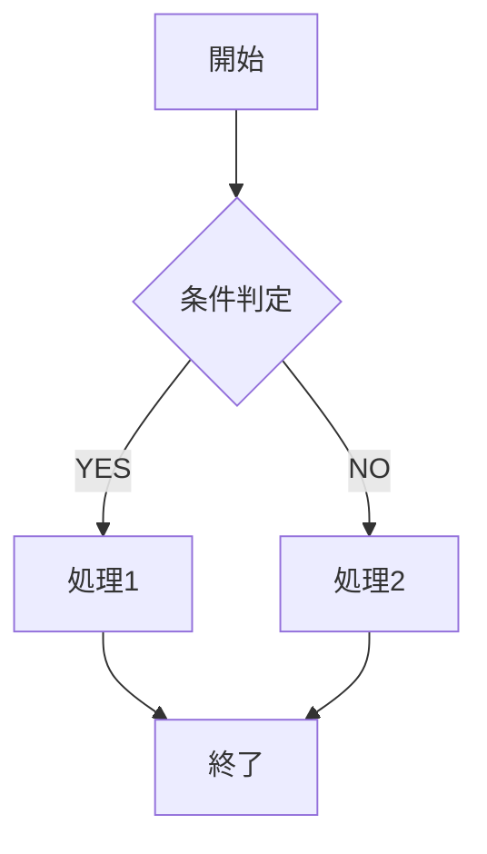

# aiDev プロジェクト ドキュメント構成ガイド

## 概要

このガイドはaiDevプロジェクトにおける標準的なドキュメント構成とフォーマットを定義しています。プロジェクト全体で一貫性のある文書作成を行うため、このガイドに従ってください。

## ファイル命名規則

ドキュメントのファイル名は以下の形式に従います：

```
[番号]_[カテゴリ]_[内容].md
```

- **番号**: ドキュメントの種類と優先順位を示す2桁の数字
  - 00-09: プロジェクト概要、計画、ガイドライン
  - 10-19: 要件定義関連
  - 20-29: 設計関連
  - 30-39: 開発関連
  - 40-49: テスト関連
  - 50-59: 運用・保守関連
  - 90-99: その他資料

- **カテゴリ**: ドキュメントの分類（例: 要件、設計、実装など）
- **内容**: ドキュメントの具体的な内容

例: `01_要件_ユーザーストーリー.md`、`21_設計_システムアーキテクチャ.md`

## 標準ドキュメントテンプレート

### 基本構成

すべてのドキュメントは以下の基本構成に従います：

```markdown
# [ドキュメントタイトル]

## 概要
[ドキュメントの目的と概要の説明]

## 文書情報
| 項目 | 内容 |
|------|------|
| 作成日 | YYYY/MM/DD |
| 最終更新日 | YYYY/MM/DD |
| ステータス | 作成中 / レビュー中 / 承認済み |
| 関連ドキュメント | [関連ドキュメントへのリンク] |

## 本文
[ドキュメントの主要内容]

## 備考
[追加情報、注意事項など]
```

### ドキュメント種別ごとのテンプレート

#### 1. ユーザーストーリー

```markdown
# [プロジェクト名] ユーザーストーリー

## [ペルソナカテゴリ]

| ID | ユーザーストーリー | 優先度 | 工数 | 受け入れ基準 |
|----|-------------------|-------|------|------------|
| US-xxx | **[ユーザー役割]として**、[やりたいこと]。これにより、[得られる価値]。 | 高/中/低 | S/M/L/XL | ・[基準1]<br>・[基準2]<br>・[基準3] |
```

#### 2. 機能要件

```markdown
# [プロジェクト名] 機能要件

## [機能カテゴリ]

| 要件ID | 要件 | 説明 | 優先度 | 関連ユーザーストーリー |
|--------|------|------|-------|----------------------|
| REQ-xxx | [要件タイトル] | [詳細説明] | 高/中/低 | US-xxx, US-yyy |
```

#### 3. アーキテクチャ設計

```markdown
# [プロジェクト名] アーキテクチャ設計

## 概要
[システムアーキテクチャの概要説明]

## アーキテクチャ図
[アーキテクチャ図またはその参照]

## コンポーネント構成
| コンポーネント | 目的 | 技術スタック | 依存関係 |
|--------------|------|-------------|----------|
| [コンポーネント名] | [目的] | [使用技術] | [依存するコンポーネント] |

## インターフェース定義
[コンポーネント間の主要インターフェース定義]
```

## マークダウン活用ガイドライン

### 表形式の利用

複数項目を対比させる情報は表形式を利用します：

```markdown
| 列1 | 列2 | 列3 |
|-----|-----|-----|
| データ1 | データ2 | データ3 |
```

### コードブロック

コードやコマンドは適切な言語識別子を付けたコードブロックで囲みます：

````markdown
```javascript
const example = "コード例";
```
````

### 見出しレベル

- H1 (`#`): ドキュメントのタイトルのみ
- H2 (`##`): 主要セクション
- H3 (`###`): サブセクション
- H4 (`####`): 詳細項目

### 箇条書き

- 順序なしリスト: `-` または `*` を使用
- 順序付きリスト: `1.`, `2.` などを使用
- ネストしたリスト: インデントを使用

### 強調

- 重要な部分は **太字** で強調
- 定義や専門用語は *イタリック* で表記

## 図表の作成ガイドライン

### 推奨ツール

- アーキテクチャ図: draw.io, Mermaid
- フローチャート: Mermaid
- シーケンス図: Mermaid
- クラス図: PlantUML

### Mermaid記法例

````markdown

````

## レビュープロセス

1. ドキュメント作成者がステータスを「作成中」として初稿を作成
2. レビュー依頼時にステータスを「レビュー中」に変更
3. レビュアーはコメントや修正提案を行う
4. すべてのレビュー指摘が解決されたら、ステータスを「承認済み」に変更

## 注意事項

- すべてのドキュメントはUTF-8エンコーディングで保存
- 機密情報や個人情報は含めない
- 外部参照はできるだけ永続的なURLを使用
- 画像やその他のバイナリ資産は `assets` フォルダに保存し、相対パスで参照
