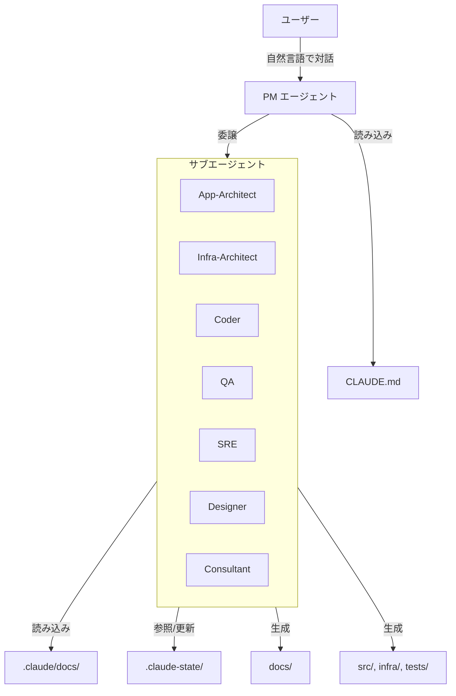
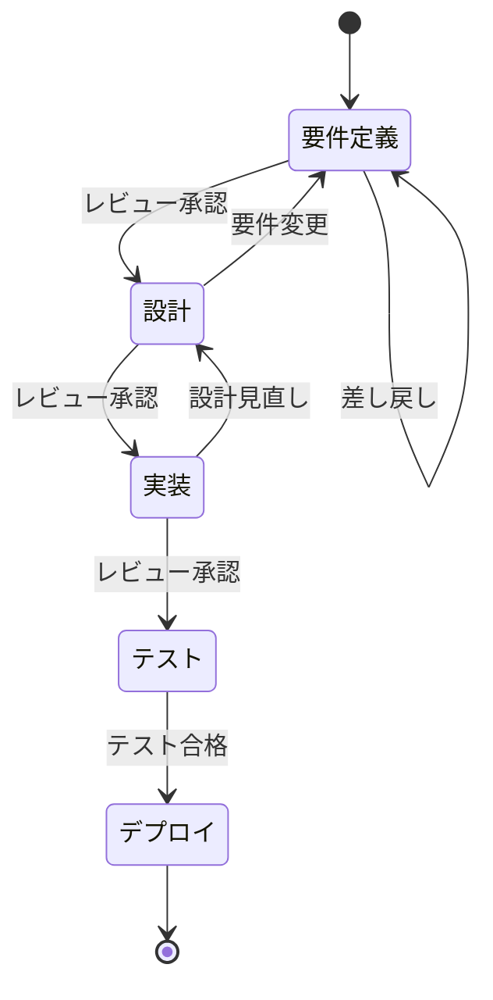

# AI開発ファシリテーター 設計書

## 1. 概要

### 1.1 設計の目的
要件定義で定義した機能を、Claude Code の `.claude` ディレクトリを活用して実装する。
エンジニア・非エンジニアを問わず、自然な対話でシステム開発プロセス全体をファシリテートするAIアシスタントを構築する。

### 1.2 設計方針
1. **Claude Code準拠**
   - `.claude` ディレクトリの標準構造に従う
   - CLAUDE.md をエントリーポイントとする
   - カスタムコマンドとエージェントを活用

2. **段階的実装**
   - Phase 1: ローカル完結（`.claude` 設定のみ）
   - Phase 2以降: MCP連携（将来拡張）

3. **実用主義**
   - まず作って使って調整
   - 完璧を目指さず、実用性を優先
   - フィードバックで改善

### 1.3 技術スタック
- **Claude Code** - ベースプラットフォーム
- **Markdown** - ドキュメント形式
- **JSON** - 状態管理
- **Git** - バージョン管理
- **Mermaid** - 図の生成

---

## 2. システムアーキテクチャ

### 2.1 全体構成



### 2.2 エージェント層構成（3層モデル）

```
Layer 1: PM（オーケストレーション層）
  - ユーザー対話
  - タスク委譲
  - 進捗管理
  - 品質ゲート管理
  ↓
Layer 2: サブエージェント（専門家層）
  - App-Architect: アプリケーション設計
  - Infra-Architect: インフラ設計
  - Coder: コード実装
  - QA: テスト
  - SRE: インフラ実装・運用
  - Designer: UI/UXデザイン
  - Consultant: ビジネス助言
  ↓
Layer 3: 成果物
  - docs/: 設計書
  - src/: アプリケーションコード
  - infra/: IaCコード
  - tests/: テストコード
```

### 2.3 ディレクトリ構造

```
プロジェクトルート/
├── CLAUDE.md                          # エントリーポイント（PM定義）
│
├── .claude/                           # Claude Code設定
│   ├── settings.json                  # 基本設定
│   │
│   ├── agents/                        # エージェント定義
│   │   ├── app-architect/AGENT.md     # アプリケーション設計
│   │   ├── infra-architect/AGENT.md   # インフラ設計
│   │   ├── coder/AGENT.md             # コード実装
│   │   ├── qa/AGENT.md                # テスト
│   │   ├── sre/AGENT.md               # インフラ実装・運用
│   │   ├── designer/AGENT.md          # UI/UXデザイン
│   │   └── consultant/AGENT.md        # ビジネス助言
│   │
│   ├── commands/                      # カスタムコマンド
│   │   ├── status.md                  # 状況把握
│   │   └── checkpoint.md              # チェックポイント
│   │
│   ├── helpers/                       # ヘルパードキュメント
│   │   ├── cross-review-guide.md      # クロスレビューガイド
│   │   └── implementation-checker.md  # 実装チェッカー
│   │
│   └── docs/                          # 参照ドキュメント
│       ├── 00_core-principles.md      # 基本原則
│       │
│       ├── 10_facilitation/           # ファシリテーション
│       │   ├── 0.1_成果物構成設計.md  # 成果物構成の設計（正）
│       │   ├── 2.2_要件定義フェーズ/
│       │   ├── 2.3_設計フェーズ/
│       │   ├── 2.4_実装フェーズ/
│       │   ├── 2.5_テストフェーズ/
│       │   └── 2.6_デプロイフェーズ/
│       │
│       └── 40_standards/              # 技術標準
│           ├── 41_common.md           # 共通規約
│           ├── 42_infrastructure.md   # インフラ（IaC）
│           ├── 43_frontend.md         # フロントエンド
│           ├── 44_backend.md          # バックエンド
│           └── 45_database.md         # データベース
│
├── .claude-state/                     # 状態管理（Git管理）
│   ├── progress.md                    # 進捗状況
│   ├── decisions.md                   # 意思決定記録
│   └── reviews/                       # レビュー記録
│
├── docs/                              # 生成ドキュメント（Git管理）
│   ├── requirements/                  # PM担当
│   │   └── 01_要件定義書.md
│   │
│   ├── 03_アプリケーション設計/        # App-Architect担当
│   │   ├── 01_基本設計/
│   │   └── 02_詳細設計/
│   │
│   ├── 04_インフラ設計/                # Infra-Architect担当
│   │   ├── 01_基本設計/
│   │   └── 02_詳細設計/
│   │
│   └── 05_テスト/                      # QA担当
│       └── テスト計画書.md
│
├── src/                               # Coder担当
├── infra/                             # SRE担当
├── tests/                             # QA担当
└── prototypes/                        # Coder担当（プロトタイプ）
```

---

## 3. エージェント設計

### 3.1 エージェント ↔ 成果物 対応表

| エージェント | 担当成果物 | 参照テンプレート | 出力先 |
|------------|----------|----------------|-------|
| PM | 要件定義書 | 2.2.x | docs/requirements/ |
| App-Architect | アプリケーション設計書 | 2.3.5, 2.3.6 | docs/03_アプリケーション設計/ |
| Infra-Architect | インフラ設計書 | 2.3.5, 2.3.6 | docs/04_インフラ設計/ |
| Coder | アプリケーションコード | 2.4.x | src/, prototypes/ |
| QA | テストコード・テスト文書 | 2.5.x | tests/, docs/05_テスト/ |
| SRE | IaCコード | 2.6.x | infra/ |
| Designer | デザイン成果物 | - | design/ |
| Consultant | ビジネス助言（成果物なし） | - | - |

### 3.1.1 エージェント別テンプレート参照先

各エージェントが成果物作成時に参照すべきテンプレートの詳細：

| エージェント | 成果物作成時に参照するテンプレート |
|------------|--------------------------------|
| **PM** | `.claude/docs/10_facilitation/2.2_要件定義フェーズ/2.2.5_製造物_要件定義書.md` |
| **App-Architect** | `.claude/docs/10_facilitation/2.3_設計フェーズ/2.3.5_製造物_基本設計書構成.md` (Part A: アプリ) |
|                   | `.claude/docs/10_facilitation/2.3_設計フェーズ/2.3.6_製造物_詳細設計書構成.md` (Part A: アプリ) |
|                   | `.claude/docs/10_facilitation/2.3_設計フェーズ/2.3.7_実装方針設計.md` (06_実装方針.md 用) |
|                   | `.claude/docs/10_facilitation/2.3_設計フェーズ/2.3.14_インターフェース設計.md` (App⇔Infra連携用) |
| **Infra-Architect** | `.claude/docs/10_facilitation/2.3_設計フェーズ/2.3.5_製造物_基本設計書構成.md` (Part B: インフラ) |
|                     | `.claude/docs/10_facilitation/2.3_設計フェーズ/2.3.6_製造物_詳細設計書構成.md` (Part B: インフラ) |
|                     | `.claude/docs/10_facilitation/2.3_設計フェーズ/2.3.8_インフラ設計パターン選定.md` |
|                     | `.claude/docs/10_facilitation/2.3_設計フェーズ/2.3.14_インターフェース設計.md` (App⇔Infra連携用) |
| **Coder** | `.claude/docs/10_facilitation/2.4_実装フェーズ/` |
|           | `.claude/helpers/implementation-checker.md` (実装前チェック) |
|           | `.claude/docs/40_standards/` (技術標準) |
| **QA** | `.claude/docs/10_facilitation/2.5_テストフェーズ/2.5.2_テスト戦略策定.md` |
|        | `.claude/docs/10_facilitation/2.5_テストフェーズ/2.5.3_テスト計画書.md` |
| **SRE** | `.claude/docs/10_facilitation/2.6_デプロイフェーズ/` |
|         | `.claude/docs/40_standards/42_infrastructure.md` (IaC標準) |
| **Designer** | (デザイン標準は未定義) |
| **Consultant** | `.claude/docs/10_facilitation/2.1_企画フェーズ/` |

**重要**: 成果物構成の「正」は `.claude/docs/10_facilitation/0.1_成果物構成設計.md` です。テンプレートとの矛盾がある場合は、成果物構成設計を優先してください。

### 3.2 PMエージェント（CLAUDE.md）

#### 役割
- **オーケストレーション専任**: 成果物を作成しない
- ユーザーとの対話（一問一答、ビジネス背景優先）
- サブエージェントへの委譲（Task ツール使用）
- TodoWrite でタスク追跡
- 品質ゲート管理（レビュー）

#### 禁止事項
- docs/, src/, infra/, tests/ の成果物作成
- 技術標準を自分で読んで判断

#### 委譲ルール
```
ユーザー要望 → PM: 専門的内容か判断 → YES
  ↓
Task ツールでサブエージェントに委譲
  ↓
サブエージェント: 成果物作成
  ↓
PM: レビュー（チェックリスト使用）
  ↓
PM → ユーザー: 成果物を提示
```

### 3.3 App-Architect エージェント

#### 役割
- アプリケーション設計書の作成
- Coderへの実装指示

#### 出力先
```
docs/03_アプリケーション設計/
├── 01_基本設計/
│   ├── 01_アーキテクチャ概要.md
│   ├── 02_コンポーネント設計.md
│   ├── 03_データモデル.md
│   ├── 04_API設計.md
│   ├── 05_セキュリティ設計.md
│   └── 06_実装方針.md          ← 必須
└── 02_詳細設計/
```

#### 必須セクション: 06_実装方針.md
- ディレクトリ構成（src/ 配下の詳細）
- エントリーポイントファイル名
- 環境変数一覧
- ポート番号
- 推定行数と分割理由

### 3.4 Infra-Architect エージェント

#### 役割
- インフラ設計書の作成
- SREへの実装指示

#### 出力先
```
docs/04_インフラ設計/
├── 01_基本設計/
│   ├── 01_システム構成図.md
│   ├── 02_ネットワーク設計.md
│   ├── 03_セキュリティ設計.md
│   ├── ...
│   └── 13_運用設計.md
└── 02_詳細設計/
```

### 3.5 Coder エージェント

#### 役割
- アプリケーションコードの実装
- 設計書（06_実装方針.md）に従った実装

#### 出力先
- src/: 本番コード
- prototypes/: プロトタイプ

#### 必須チェック（実装前）
1. 設計書の存在確認
2. 既存ディレクトリ構成の確認（二重実装防止）
3. 環境変数・ポート番号の確認
4. インフラ設計との整合性確認

### 3.6 その他エージェント

- **QA**: テストコード作成、テスト計画・実施
- **SRE**: IaC実装、デプロイ、運用
- **Designer**: UI/UXデザイン
- **Consultant**: ビジネス観点の助言

---

## 4. クロスレビュー設計

### 4.1 クロスレビューマトリクス

| 成果物 | 作成者 | レビュアー | レビュー観点 |
|-------|-------|----------|------------|
| 要件定義書 | PM | Consultant, App-Arch, Infra-Arch | ビジネス整合性、技術実現可能性 |
| アプリ設計書 | App-Architect | Coder, Consultant | 実装可能性、ビジネス要件整合 |
| インフラ設計書 | Infra-Architect | SRE, Consultant | 実装可能性、ビジネス要件整合 |
| IaC | SRE | Infra-Architect | 設計との整合性、ベストプラクティス |
| コード | Coder | QA | テスト可能性、品質 |
| テストコード | QA | Coder | カバレッジ、実装との整合性 |

### 4.2 整合性レビュー（App ⇔ Infra）

アプリケーション設計とインフラ設計の整合性を確保するためのチェック項目：

- [ ] ポート番号の整合性
- [ ] 環境変数の整合性
- [ ] データベース接続設定
- [ ] ヘルスチェックエンドポイント
- [ ] リソース要件（CPU、メモリ）

---

## 5. 状態管理設計

### 5.1 プロジェクト状態（.claude-state/）

```
.claude-state/
├── progress.md         # 進捗状況（Markdown形式）
├── decisions.md        # 意思決定記録
└── reviews/            # レビュー記録（JSON）
    └── {timestamp}_{artifact}.json
```

### 5.2 進捗記録（progress.md）

```markdown
# プロジェクト進捗

## 現在のフェーズ
設計フェーズ

## 完了タスク
- [x] 要件定義書作成
- [x] 要件レビュー完了

## 進行中タスク
- [ ] アプリケーション基本設計

## 次のマイルストーン
設計レビュー完了
```

### 5.3 レビュー記録（reviews/*.json）

```json
{
  "artifact": {
    "path": "docs/03_アプリケーション設計/01_基本設計/",
    "creator": "app-architect"
  },
  "reviewer": "coder",
  "result": "approved_with_comments",
  "feedback": [
    {
      "type": "suggestion",
      "content": "エラーハンドリングの詳細を追加してください"
    }
  ],
  "timestamp": "2025-12-12T10:00:00Z"
}
```

---

## 6. 品質ゲート設計

### 6.1 フェーズ遷移条件



### 6.2 設計書完全性チェック

設計書が以下を含むことを確認：

- [ ] ディレクトリ構成明記（IaC使用時は必須）
- [ ] 技術標準準拠確認
- [ ] 環境差分管理方針明確
- [ ] 実装者向けガイド記載

---

## 7. 成果物構成の整合性管理

### 7.1 正のドキュメント

**`.claude/docs/10_facilitation/0.1_成果物構成設計.md`** を成果物構成の「正」とする。

### 7.2 整合性ルール

1. エージェント定義（AGENT.md）の出力先 = 成果物構成設計の構成
2. テンプレートファイル = 成果物構成設計の構成に準拠
3. 矛盾が発生したら、成果物構成設計を正とする

### 7.3 修正時のチェックリスト

- [ ] 成果物構成設計と一致しているか
- [ ] 出力先パスが正確か
- [ ] ファイル名が一致しているか
- [ ] エージェント責務が明確か

---

## 8. 安全性設計

### 8.1 本番環境保護

- 直接操作禁止
- dry-run必須
- ユーザー承認後に実行

### 8.2 機密情報管理

- ハードコード禁止
- 環境変数の使用
- `.gitignore` で除外

---

## 9. 成功基準

### 9.1 フレームワークの成功基準

1. **エージェント連携**
   - PM → サブエージェントの委譲が正しく動作
   - クロスレビューが機能
   - 成果物の出力先が一貫

2. **成果物品質**
   - 設計書が実装可能なレベル
   - コードが設計書に準拠
   - テストがカバレッジ基準を満たす

3. **整合性**
   - app/infra 分離が維持
   - ポート番号等の不整合なし
   - 二重実装なし

---

## 10. 関連ドキュメント

- **成果物構成設計**: `.claude/docs/10_facilitation/0.1_成果物構成設計.md`
- **エージェント定義**: `.claude/agents/*/AGENT.md`
- **基本原則**: `.claude/docs/00_core-principles.md`
- **技術標準**: `.claude/docs/40_standards/`

---

## 承認

本設計書の内容を確認し、実装フェーズに進むことに同意します。

- 承認日：________
- 承認者：________
