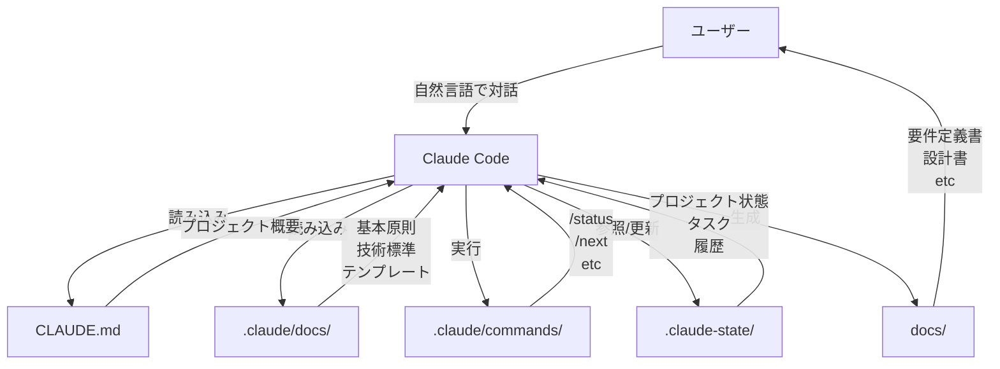
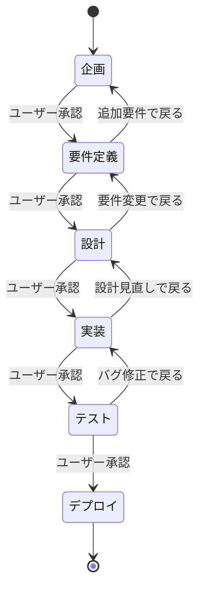
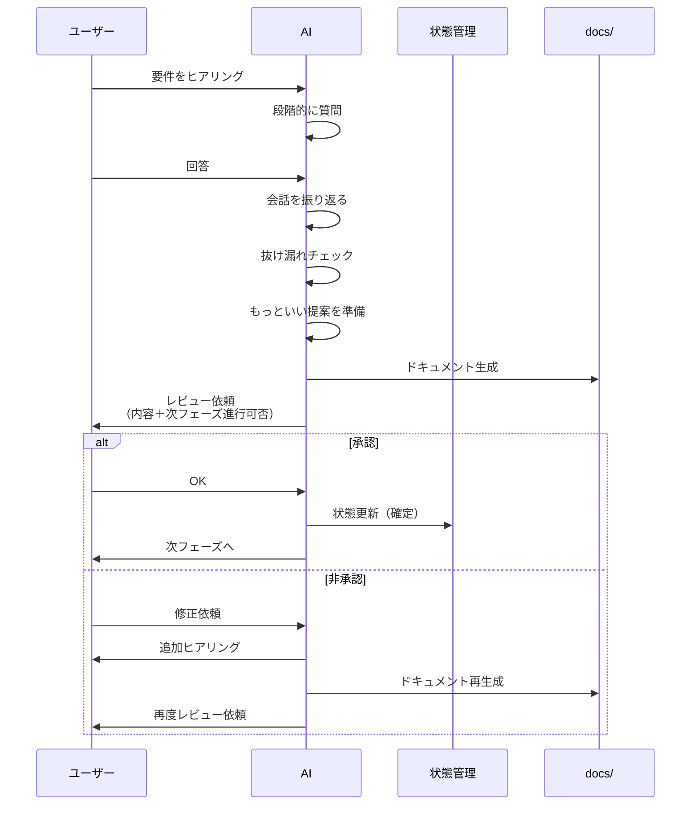
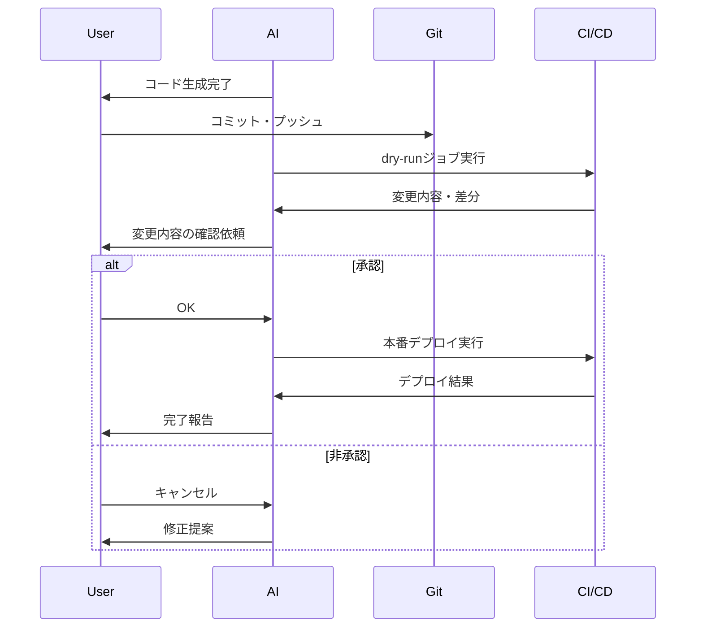

# AI開発ファシリテーター 設計書

## 1. 概要

### 1.1 設計の目的
要件定義で定義した機能を、Claude Code の `.claude` ディレクトリを活用して実装する。
エンジニア・非エンジニアを問わず、自然な対話でシステム開発プロセス全体をファシリテートするAIアシスタントを構築する。

### 1.2 設計方針
1. **Claude Code準拠**
   - `.claude` ディレクトリの標準構造に従う
   - CLAUDE.md をエントリーポイントとする
   - カスタムコマンドとエージェントを活用

2. **段階的実装**
   - Phase 1: ローカル完結（`.claude` 設定のみ）
   - Phase 2以降: MCP連携（将来拡張）

3. **実用主義**
   - まず作って使って調整
   - 完璧を目指さず、実用性を優先
   - フィードバックで改善

### 1.3 技術スタック
- **Claude Code** - ベースプラットフォーム
- **Markdown** - ドキュメント形式
- **JSON** - 状態管理
- **Git** - バージョン管理
- **Mermaid** - 図の生成

---

## 2. システムアーキテクチャ

### 2.1 全体構成



### 2.2 ディレクトリ構造

```
プロジェクトルート/
├── CLAUDE.md                          # エントリーポイント
│
├── .claude/                           # Claude Code設定
│   ├── settings.json                  # 基本設定
│   │
│   ├── commands/                      # カスタムコマンド
│   │   ├── status.md                  # 状況把握→提案
│   │   ├── next.md                    # 次のアクション
│   │   ├── review-phase.md            # フェーズレビュー
│   │   ├── risks.md                   # リスク分析
│   │   ├── progress-report.md         # 進捗レポート
│   │   └── generate-diagram.md        # 図生成
│   │
│   ├── agents/                        # カスタムエージェント
│   │   └── facilitator.md             # ファシリテーター
│   │
│   └── docs/                          # 参照ドキュメント
│       ├── 00_core-principles.md      # 基本原則
│       │
│       ├── 10_facilitation/           # ファシリテーション
│       │   ├── 11_decision-items.md   # 決定事項定義
│       │   ├── 12_phase-transition.md # フェーズ遷移
│       │   └── 13_context-management.md # コンテキスト管理
│       │
│       ├── 20_plugins/                # プラグイン
│       │   ├── 21_japanese-enterprise.md # 日本企業向け
│       │   ├── 22_migration-project.md   # 移行プロジェクト
│       │   └── 23_startup.md             # スタートアップ向け
│       │
│       ├── 30_templates/              # テンプレート
│       │   ├── 31_requirements.md     # 要件定義書
│       │   ├── 32_design.md           # 設計書
│       │   ├── 33_implementation.md   # 実装ガイド
│       │   ├── 34_test-plan.md        # テスト計画書
│       │   └── 35_deployment.md       # デプロイ手順書
│       │
│       └── 40_standards/              # 技術標準
│           ├── 41_common.md           # 共通規約
│           ├── 42_infrastructure.md   # インフラ（IaC）
│           ├── 43_frontend.md         # フロントエンド
│           ├── 44_backend.md          # バックエンド
│           └── 45_database.md         # データベース
│
├── .claude-state/                     # 状態管理（Git無視）
│   ├── project-state.json             # プロジェクト状態
│   ├── tasks.json                     # タスク管理
│   ├── decisions.json                 # 意思決定記録
│   └── history/                       # 履歴
│       └── error-logs/                # エラーログ
│
├── docs/                              # 生成ドキュメント（Git管理）
│   ├── 01_企画書.md
│   ├── 02_要件定義書.md
│   ├── 03_設計書.md
│   ├── 04_実装ガイド.md
│   ├── 05_テスト計画書.md
│   ├── 06_デプロイ手順書.md
│   └── diagrams/                      # 生成した図
│       ├── system-architecture.mmd
│       ├── cicd-pipeline.mmd
│       └── network-diagram.mmd
│
├── src/                               # 生成されたコード
└── .gitignore                         # .claude-state/ を無視
```

---

## 3. 主要コンポーネント設計

### 3.1 CLAUDE.md（エントリーポイント）

#### 役割
- Claude Codeがプロジェクトを理解するための主要な参照先
- AI開発ファシリテーターとしての動作を定義
- ユーザーとの対話スタイルを規定

#### 内容構成
```markdown
# AI開発ファシリテーター

## このプロジェクトについて
このプロジェクトは、Claude Codeを使ったシステム開発を支援するAI開発ファシリテーターです。

## あなた（Claude）の役割
あなたはシステム開発プロセス全体をファシリテートするAIアシスタントです。

## 参照すべきドキュメント
- `.claude/docs/00_core-principles.md` - 基本原則
- `.claude/docs/10_facilitation/` - ファシリテーション方法
- `.claude/docs/40_standards/` - 技術標準
- `.claude-state/` - プロジェクト状態

## 初回起動時の動作
ユーザーが初めて会話を始めた時:
1. プロジェクト状態を確認
2. 新規なら自己紹介とヒアリング開始
3. 継続なら状況を把握して提案

## カスタムコマンド
- `/status` - 状況把握と提案
- `/next` - 次のアクション
（詳細は commands/ 参照）
```

### 3.2 基本原則（00_core-principles.md）

#### 役割
AIの行動原則を定義する最重要ドキュメント

#### 内容構成
1. **ミッション**
   - 自然言語での対話でシステム開発をファシリテート
   - エンジニア・非エンジニア両方に対応

2. **対話の原則**
   - 一問一答形式（複数質問を同時にしない）
   - 確認前に会話を振り返って提案
   - 事例・数値・一般的な事象を踏まえた提案
   - 「もっといい提案」をタイミング良く提示

3. **ヒアリングの原則**
   - ビジネス背景を最優先で聞く
   - 段階的な情報収集
   - 会話の自然な流れを重視
   - ユーザーの温度感を読む

4. **フェーズ管理の原則**
   - ユーザーレビュー後にフェーズ遷移
   - 柔軟な戻りを許容
   - フェーズは強制ではなくガイドライン

5. **安全性の原則**
   - 本番環境への直接操作禁止
   - dry-run必須
   - ユーザー承認後に実行

6. **品質の原則**
   - 技術標準の適用
   - コード説明による学習支援
   - 受託開発納品レベルの品質

### 3.3 決定事項定義（11_decision-items.md）

#### 役割
各フェーズで決めるべき項目を定義

#### データ構造
```markdown
# 決定事項定義

## 企画フェーズ
### 必須項目
- [ ] ビジョン・目的
- [ ] 背景・課題
- [ ] 成功基準
- [ ] ステークホルダー

### 任意項目
- [ ] ROI計算
- [ ] 競合分析

## 要件定義フェーズ
### 必須項目
- [ ] ビジネス背景（業種、課題、理由）
- [ ] システム概要
- [ ] 機能要件
- [ ] 非機能要件（性能、セキュリティ、可用性）
- [ ] 制約条件（予算、期間、技術制約）

### 任意項目
- [ ] 参考事例
- [ ] 将来拡張

## 設計フェーズ
### 必須項目
- [ ] アーキテクチャ方式
- [ ] 技術スタック選定
- [ ] インフラ構成
- [ ] CI/CD戦略
- [ ] セキュリティ設計

### 任意項目
- [ ] コスト見積もり
- [ ] パフォーマンス最適化

（以下、各フェーズ続く）
```

### 3.4 フェーズ遷移（12_phase-transition.md）

#### 役割
フェーズ間の遷移ルールを定義

#### フロー


#### 遷移条件
1. **AIがドキュメント生成**
2. **確認前の振り返り**
   - 会話を振り返る
   - 抜け漏れチェック
   - 「もっといい提案」の準備
3. **ユーザーにレビュー依頼**
   - ドキュメント内容
   - 決定事項の充足度
   - 次フェーズへの進行可否
4. **承認後に遷移**
5. **非承認時の対応**
   - 追加ヒアリング
   - ドキュメント再生成
   - 再度確認

### 3.5 技術標準（40_standards/）

#### 共通規約（41_common.md）

**4つの基本方針**
1. 品質確保
2. 安全性確保
3. 一貫性の維持
4. ベストプラクティスの適用

**適用タイミング**
1. コード生成前に事前説明
2. コード生成時に自動適用
3. 生成後に詳細説明（学習機会）

#### インフラ規約（42_infrastructure.md）

**重点項目**
- モジュール/コンポーネント分割
- 環境差分の管理（dev/stg/prod）
- ネストテンプレート/モジュールの活用
- 直感的なディレクトリ構造
- シークレット情報の分離

**IaC固有**
- CloudFormation: ネストスタック
- Terraform: モジュール化
- ステートファイル管理
- リソース命名規則

### 3.6 カスタムコマンド

#### /status（状況把握→提案）

```markdown
# Status Command

あなたはプロジェクトの現状を分析し、次にやるべきことを提案します。

## 実行手順
1. `.claude-state/project-state.json` を読み込み
2. `.claude-state/tasks.json` を確認
3. 現在のフェーズを特定
4. 完了済み・進行中・未着手を整理
5. 課題・ブロッカーを確認
6. **次にやるべきこと**を提案

## 出力形式
\`\`\`
📊 プロジェクト状況

【現在のフェーズ】
設計フェーズ

【完了】
✅ 企画書作成・承認済み
✅ 要件定義書作成・承認済み
✅ ビジネス背景ヒアリング完了

【進行中】
🔄 システム構成図作成中

【未着手】
⏳ CI/CD戦略の決定
⏳ 設計書のまとめ

【課題】
⚠️ CI/CD戦略が未決定（ブロッカー）

【次にやるべきこと】
1. システム構成図を完成させる
2. CI/CD戦略をヒアリングする
3. 設計書をまとめてレビュー依頼

どれから進めますか？
\`\`\`
```

#### /next（次のアクション）

シンプルに次のアクションだけを提案

#### /review-phase（フェーズレビュー）

現在のフェーズの決定事項を一覧表示

#### /risks（リスク分析）

プロジェクトのリスクを分析して対策を提案

#### /progress-report（進捗レポート）

全体進捗をレポート形式で出力

#### /generate-diagram（図生成）

システム構成図やCI/CD図をMermaidで生成

---

## 4. 状態管理設計

### 4.1 プロジェクト状態（project-state.json）

#### スキーマ
```json
{
  "project": {
    "name": "プロジェクト名",
    "type": "infrastructure|webapp|api|batch|mobile",
    "phase": "planning|requirements|design|implementation|testing|deployment",
    "created_at": "2025-09-30T10:00:00Z",
    "updated_at": "2025-09-30T15:30:00Z"
  },
  "phases": {
    "planning": {
      "status": "completed|in_progress|pending",
      "completed_at": "2025-09-30T11:00:00Z",
      "document": "docs/01_企画書.md"
    },
    "requirements": {
      "status": "in_progress",
      "started_at": "2025-09-30T11:00:00Z",
      "document": "docs/02_要件定義書.md"
    }
  },
  "requirements": {
    "business_background": {
      "industry": "製造業",
      "challenges": ["レガシーシステムの老朽化"],
      "purpose": "クラウド移行"
    },
    "tech_stack": {
      "infrastructure": "AWS",
      "iac_tool": "Terraform",
      "cicd": "GitHub Actions"
    }
  },
  "design": {
    "architecture": "マイクロサービス",
    "infrastructure": {
      "provider": "AWS",
      "regions": ["ap-northeast-1"]
    }
  }
}
```

#### 更新タイミング
- ドキュメント承認時（フェーズ遷移時）
- 重要な決定事項が確定した時
- デプロイ完了時

### 4.2 タスク管理（tasks.json）

#### スキーマ
```json
{
  "tasks": [
    {
      "id": "task-001",
      "title": "システム構成図作成",
      "phase": "design",
      "status": "in_progress|pending|completed",
      "priority": "high|medium|low",
      "created_at": "2025-09-30T12:00:00Z",
      "completed_at": null,
      "blockers": []
    }
  ],
  "issues": [
    {
      "id": "issue-001",
      "title": "CI/CD戦略が未決定",
      "severity": "high|medium|low",
      "status": "open|resolved",
      "created_at": "2025-09-30T14:00:00Z",
      "resolution": null
    }
  ]
}
```

### 4.3 意思決定記録（decisions.json）

#### スキーマ
```json
{
  "decisions": [
    {
      "id": "dec-001",
      "date": "2025-09-30T13:00:00Z",
      "phase": "requirements",
      "title": "IaCツールをTerraformに決定",
      "rationale": "チームの経験、モジュール化のしやすさ",
      "alternatives": ["CloudFormation", "CDK"],
      "decided_by": "user",
      "impact": "high"
    }
  ]
}
```

---

## 5. ドキュメント生成設計

### 5.1 ディレクトリ構造設計

#### 基本構造

```
docs/
├── 01_企画/
│   ├── 企画書.md
│   ├── 提案書.md
│   ├── 費用見積書.md
│   └── スケジュール.md
│
├── 02_要件定義/
│   ├── 業務要件定義書.md
│   ├── システム要件定義書.md
│   ├── 機能要件一覧.md
│   ├── 非機能要件一覧.md
│   ├── ユースケース記述.md
│   ├── 画面一覧.md
│   ├── 画面遷移図.md
│   └── データ項目定義.md
│
├── 03_基本設計/
│   ├── システム構成図.md
│   ├── アーキテクチャ設計書.md
│   ├── DB設計書.md
│   ├── インターフェース設計書.md
│   ├── セキュリティ設計書.md
│   └── インフラ設計書.md
│
├── 04_詳細設計/
│   ├── 機能別詳細設計/
│   │   ├── 認証機能.md
│   │   ├── データ登録機能.md
│   │   └── （各機能ごと）
│   ├── API設計書.md
│   ├── バッチ設計書.md
│   └── 画面設計書.md
│
├── 05_実装/
│   ├── コーディング規約.md
│   ├── ディレクトリ構成.md
│   ├── セットアップ手順.md
│   └── ビルド手順.md
│
├── 06_テスト/
│   ├── テスト計画書.md
│   ├── 単体テスト仕様書.md
│   ├── 結合テスト仕様書.md
│   ├── システムテスト仕様書.md
│   └── テスト結果報告書.md
│
├── 07_デプロイ/
│   ├── リリース計画書.md
│   ├── デプロイ手順書.md
│   ├── ロールバック手順書.md
│   └── CI_CD設計書.md
│
└── 08_運用/
    ├── 運用手順書.md
    ├── 障害対応手順書.md
    ├── 監視設定書.md
    └── FAQ・トラブルシューティング.md
```

#### ファイル命名規則

**ディレクトリ:**
- `{フェーズ番号}_{フェーズ名}/`
- 例: `02_要件定義/`, `03_基本設計/`

**ファイル:**
- 日本語ファイル名を使用（可読性優先）
- 拡張子は `.md`
- 例: `業務要件定義書.md`, `システム構成図.md`

**図ファイル（Mermaid）:**
- ドキュメント内に直接埋め込み
- 必要に応じて `diagrams/` サブディレクトリに分離

### 5.2 生成フロー



### 5.3 ドキュメント生成手順

#### フェーズ開始時
1. 該当フェーズのディレクトリを作成
   ```bash
   mkdir -p docs/02_要件定義
   ```

2. プロジェクトの種類に応じて必要なドキュメントを判断
   - Webアプリ: 画面一覧、画面遷移図を含む
   - API: インターフェース設計書を重点的に
   - IaC: インフラ設計書を重点的に

3. ヒアリング内容に基づいてドキュメント生成

#### ドキュメント生成の優先順位

**必須ドキュメント（すべてのプロジェクト）:**
- 各フェーズの「メインドキュメント」（企画書、要件定義書等）

**条件付きドキュメント:**
- Webアプリの場合のみ: 画面一覧、画面遷移図、画面設計書
- API開発の場合のみ: API設計書（詳細版）
- IaCの場合のみ: インフラ設計書、ネットワーク図
- バッチ処理がある場合のみ: バッチ設計書

#### インデックス生成

各フェーズディレクトリに `README.md` を生成し、ドキュメント一覧とリンクを提供：

```markdown
# 要件定義フェーズ ドキュメント

## ドキュメント一覧

- [業務要件定義書](./業務要件定義書.md)
- [システム要件定義書](./システム要件定義書.md)
- [機能要件一覧](./機能要件一覧.md)
- [非機能要件一覧](./非機能要件一覧.md)

## ステータス

- フェーズ: 完了
- レビュー: 承認済み
- 最終更新: 2025-10-01
```

### 5.4 テンプレート活用

各ドキュメントのテンプレートを `.claude/docs/30_templates/` に配置。
AIはテンプレートを参照して、ヒアリング内容を埋め込んでドキュメント生成。

### 5.5 ビジュアル資料

#### 生成方法
- **Mermaid記法**を使用
- テキストベースなのでGit管理しやすい
- Claude Codeが直接表示可能

#### 保存場所
- `docs/diagrams/*.mmd` - Mermaidソースファイル
- ドキュメント内に埋め込みも可能

#### 優先的に生成する図
1. システム構成図
2. CI/CDパイプライン図
3. ネットワーク図
4. ER図
5. シーケンス図

---

## 6. コード生成設計

### 6.1 生成フロー

1. **事前説明**
   - 「これからコードを生成します」
   - 「技術標準（モジュール分割、環境差分管理等）を適用します」

2. **コード生成**
   - 技術標準に従って自動生成
   - `.claude/docs/40_standards/` を参照

3. **事後説明**
   - なぜこう書いたか
   - このパターンのメリット
   - 学習機会の提供

### 6.2 技術標準の適用

#### 共通
- モジュール/コンポーネント分割
- 環境差分管理（dev/stg/prod）
- 直感的なディレクトリ構造
- シークレット情報の分離

#### IaC（Phase 1検証対象）
- Terraform: モジュール化
- CloudFormation: ネストスタック
- 変数・パラメーター管理
- ステートファイル管理

---

## 7. デプロイ設計

### 7.1 安全なデプロイフロー



### 7.2 環境戦略

#### 環境分離
- **dev** - 開発環境
- **stg** - ステージング環境
- **prod** - 本番環境

#### ブランチ戦略
- `feature/*` → `develop` → dev環境
- `develop` → `staging` → stg環境
- `staging` → `main` → prod環境（承認必須）

### 7.3 ロールバック戦略

1. **失敗検知**
   - デプロイエラー
   - ヘルスチェック失敗
   - アラート通知

2. **ロールバック手順**
   - 前バージョンの特定
   - ロールバックコマンド生成
   - ユーザー確認
   - ロールバック実行

3. **バックアップ**
   - IaCステートファイル
   - データベースバックアップ
   - 設定ファイルのバージョン管理

---

## 8. エラーハンドリング設計

### 8.1 エラーログ管理

#### 保存場所
`.claude-state/history/error-logs/`

#### ファイル構造
```
error-logs/
├── 2025-09-30_deploy-error.json
├── 2025-10-01_validation-error.json
└── ...
```

#### ログ形式
```json
{
  "timestamp": "2025-09-30T16:30:00Z",
  "phase": "deployment",
  "error_type": "terraform_error",
  "message": "Error: Invalid resource name",
  "stack_trace": "...",
  "context": {
    "file": "main.tf",
    "line": 42
  },
  "resolution": {
    "status": "resolved|pending",
    "solution": "リソース名を修正",
    "resolved_at": "2025-09-30T17:00:00Z"
  }
}
```

#### 保存期間
- Phase 1: ローカルで管理（手動削除）
- Phase 2以降: S3ライフサイクルで2年保存（ユーザー設定可能）

### 8.2 エラー解析フロー

1. **ログ自動収集**
2. **エラーメッセージ解析**
3. **原因特定**
4. **修正方法の提案**
   - 具体的な修正手順
   - 修正コード生成
   - 複数の解決策
5. **影響範囲の説明**

---

## 9. セキュリティ設計

### 9.1 機密情報管理

#### 原則
- ハードコード禁止
- 環境変数の使用
- `.gitignore` で除外

#### 対象
- AWSクレデンシャル
- APIキー
- データベースパスワード
- その他シークレット

### 9.2 本番環境保護

- 直接操作禁止
- dry-run必須
- ユーザー承認後に実行
- ロールバック手順の準備

---

## 10. パフォーマンス設計

### 10.1 目標値
- ドキュメント生成: 30秒以内
- コード生成: 1分以内
- エラー解析: 10秒以内

### 10.2 最適化手法
- 必要な情報だけをコンテキストに含める
- 状態ファイルのサイズを最適化
- 大きなログは要約して保存

---

## 11. 拡張性設計（Phase 2以降）

### 11.1 MCP連携の準備

Phase 1の設計を、MCP連携を前提にしておく。

#### 将来追加するコマンド
```
commands/
├── slack.md          # Slack連携
├── notion.md         # Notionドキュメント同期
├── github.md         # GitHub Issue/PR連携
└── monitoring.md     # 運用監視
```

#### プラグイン拡張
新しい技術領域、業界特化の機能をプラグインとして追加可能。

---

## 12. テスト戦略

### 12.1 検証項目

#### 機能テスト
- [ ] 要件定義フェーズの完遂
- [ ] 設計フェーズの完遂
- [ ] コード生成の品質
- [ ] ドキュメント生成の品質
- [ ] フェーズ遷移の動作

#### 品質テスト
- [ ] 生成コードが技術標準に準拠
- [ ] ドキュメントが納品レベル
- [ ] 対話が自然
- [ ] 一問一答が守られている

#### 安全性テスト
- [ ] dry-runが必須
- [ ] 本番環境への直接操作がない
- [ ] シークレット漏洩がない

### 12.2 初期検証（Phase 1）

**AWS IaCプロジェクトで実運用**
1. 新規インフラ構築プロジェクトを実施
2. 要件定義からデプロイまで完遂
3. 問題点を記録
4. フィードバックで改善

---

## 13. 実装優先順位

### Phase 1-1: 基盤構築
1. ディレクトリ構造作成
2. CLAUDE.md 作成
3. 00_core-principles.md 作成
4. settings.json 基本設定

### Phase 1-2: ファシリテーション機能
1. 11_decision-items.md（決定事項定義）
2. 12_phase-transition.md（フェーズ遷移）
3. 状態管理の実装

### Phase 1-3: テンプレート・標準
1. 30_templates/ のテンプレート作成
2. 40_standards/ の技術標準作成
3. 特にAWS IaC標準を詳細化

### Phase 1-4: カスタムコマンド
1. /status コマンド
2. /next コマンド
3. その他補助コマンド

### Phase 1-5: 検証・調整
1. AWS IaCプロジェクトで実運用
2. フィードバック収集
3. 改善実施

---

## 14. 成功基準（再確認）

### 14.1 Phase 1の成功基準
1. **AWS IaCプロジェクトでの実用**
   - 要件定義からデプロイまで完遂
   - 納品レベルのドキュメント生成
   - 安全なデプロイフロー

2. **コード品質**
   - 技術標準に準拠
   - 保守可能な構造
   - モジュール分割、環境差分管理が適切

3. **ユーザー満足度**
   - 対話がスムーズ
   - 一問一答で疲れない
   - 学びがある

4. **安全性**
   - 本番環境への誤操作ゼロ
   - dry-run必須の徹底

---

## 15. まとめ

本設計書では、要件定義で定義した機能を、Claude Code の仕組みを活用して実装する方法を定義した。

**重要ポイント：**
1. Claude Code準拠の`.claude`ディレクトリ構造
2. 自然な対話でのファシリテーション
3. 状態管理によるセッション継続
4. 技術標準の適用とコード品質確保
5. 安全なデプロイフロー
6. 段階的実装（Phase 1 → Phase 2）

次のステップは、この設計に基づいて`.claude`ディレクトリと各設定ファイルを実装する。

---

## 承認

本設計書の内容を確認し、実装フェーズに進むことに同意します。

- 承認日：________
- 承認者：________