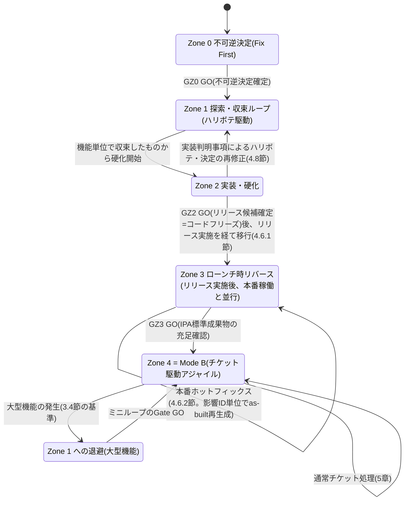
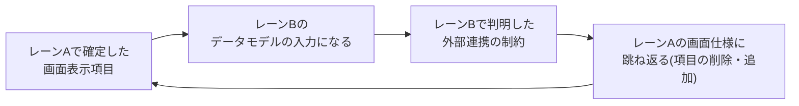
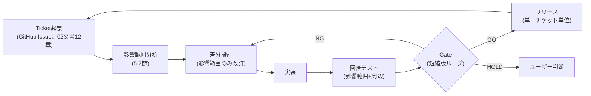
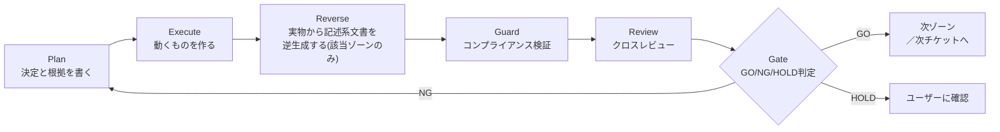

# AI駆動IPA標準フレームワーク プロセス定義書

## 改訂履歴

| 版数 | 日付 | 改訂者 | 改訂内容 |
|------|------|--------|----------|
| 1.0 | 2026-09-10 | Consultant | 初版作成。aiDev v2 の二層プロセス（Mode A / Mode B）、Mode A のゾーン構成（不可逆決定・探索収束ループ・実装硬化・ローンチ時リバース）、統一実行ループ、AIレビュー文化、IPA準拠マトリクスを定義。受託契約における要件定義前倒しオプション（4.10節）を含む |
| 1.1 | 2026-09-10 | Consultant | PMによる01/02文書間の整合レビュー結果を反映。(1) トレーサビリティ起点のID体系を`SCR-ID`（画面単位、機構が自動採番）と`HB-ID`（機能／E2Eシナリオ単位、QAが採番、カバレッジの分母）の二層構造に改め、4.4.5節・4.7.1節を改訂。(2) 決定ログに不可逆度3区分（高／中／低）を追加定義し、4.7.2節の書式表に反映。(3) Zone 1の決定ログ記録トリガを「同期点通過時のみ」から「不可逆度『中』以上は決定時点で都度追記」へ改め、レーン内単独決定の記録漏れを解消。(4) ゲート名を`G0`/`G7`から`GZ0`/`GZ2`/`GZ3`のゾーンゲート表記へ統一し、4.9節にZone2→3のローンチ判定ゲート`GZ2`を追加。成果物番号体系を「00〜05相当」から「00〜07相当」へ修正し02文書・annotation参考実装と統一。用語集にSCR-ID・不可逆度・GZ0/GZ2/GZ3を追加 |
| 1.2 | 2026-09-10 | Consultant | 軽微修正。対文書の参照名を実ファイル・実タイトルに合わせて「02_実行機構設計書」から「02_実行基盤アーキテクチャ」（`docs/v2/02_実行基盤アーキテクチャ.md`）へ全箇所修正（1.1節本文、1.3節関連文書テーブル（ファイルパス併記）、4.4.5節、4.6節、9章、10章）。01/02間のクロスレビュー結果、成果物番号体系（00〜07）の詳細定義は02の4.2.1節に一元化し、01は4.6節の参照に留めることを確認済み |
| 1.3 | 2026-09-11 | Consultant | 別モデル（Fable）による独立レビュー（重大4件・中17件）のうち01文書が担当すべき事項を反映。**(1) ローンチとZone 3の前後関係を修正（4.6.1〜4.6.3節新設）**: GZ2を「リリース候補確定（コードフリーズ）」に再定義し、GZ2 GO後に明示的な「リリース実施」を挟んでZone 3へ移行する構成に改め、Zone 3期間中の本番障害に対応する「Zone3内ミニチケット」経路（4.6.2節）を新設。コードフリーズ時点のgit tagをas-built生成の基準点とする旨を明記（4.6.3節）。**(2) 左岸の複線ID体系（4.4.1節・4.4.5節・4.4.6節）**: レーンBのZone 1成果物を「決定ログ＋契約モック」に限定し`src/`着手をZone 2に限定。画面に現れない要件・画面を持たない案件類型のカバレッジ分母を埋めるため`API-ID`・`NFR-ID`を新設し、03文書が新設した`RPT-ID`・`BAT-ID`とあわせてID正本表をSCR/HB/RPT/BAT/API/NFRの6種に拡張。案件類型別の左岸対応表を新設（4.4.6節）。**(3) 決定ログの分母と回収原則（4.7.3節・4.7.4節新設）**: Zone0必須決定項目とHB-ID単位の必須決定スロットを分母として定義し、Task境界を決定の回収点とする原則を新設。**(4) 同期点記録台帳の要求（4.4.2.1節新設）**: 6.5節条件3・7.6節の分母の記録先が存在しなかった問題に対応。項番付与は03文書へ申し送り。**(5) 01内部の矛盾・誤りを修正**: 決定ログ追記トリガの矛盾を解消（4.4.2節）、決定ID表記を`DEC-`から`DL-{4桁}`へ統一（4.7.2節）、存在しない08番参照をGitHub Issue／00-14変更管理台帳に置換（5.1節・5.2節）、`HB-ID`をdocblockに記載する主体をCoderからQA（E2E）に訂正（4.4.5節）、`SCR-ID`採番主体を「機構が自動採番」から「Skillが採番しhookは登録漏れを警告するのみ」に訂正、GZ2にトレーサビリティ条件（条件6）を適用（6.5節）、逆差分の定義を「実装vs合意媒体」に限定し生成漏れ検査と呼び分け（6.5節）、4.2節の成果物番号体系表記を00〜07相当に統一。**(6) IPA準拠マトリクスの拡充（8章）**: web検索で確認した共通フレーム2013・ISO/IEC 12207のテーラリング容認・非規範性を8.1節に出典付きで補強し、「タスク間の入出力依存・要件のレビュー/合意/ベースライン化は規定される」という留保と、その証跡が4.4.2.1節の同期点記録台帳であることを明記。8.2節に運用プロセス・廃棄プロセス・支援プロセス（文書化管理・共同レビュー・監査・問題解決）・プロジェクトプロセス各種・合意プロセス・組織のプロジェクトイネーブリングプロセス・再利用プロセス群・修整（テーラリング）の行を追加。検証プロセスの独立支援プロセスとしての位置づけの誤りを訂正して「準拠」に変更し、保守プロセスに関する未確認の断定を削除。8.3節に組織のプロジェクトイネーブリングプロセス（ライフサイクルモデル管理）の位置づけを追加。**(7) 10章に宛先を明記した申し送り事項を追加**（02・03・04向け） |

---

## 1. はじめに

### 1.1 目的

本書は、aiDev フレームワーク v2 における開発プロセスの **What（何を行うか）** と **なぜ（なぜそうするか）** を定義する正本である。v1 では `.claude/docs/10_facilitation/` 配下の100件超のファイルと巨大な `CLAUDE.md` に「読ませる」ことでプロセスを実現していたが、v2 ではプロセス定義そのものを本書に集約し、実行機構（どの機構でどう強制するか）とは明確に分離する。

本フレームワークの中核主張は次の一点に集約される。**AI 駆動開発においては、動くもの（プロトタイプ・実装）を作るコストが人間主体の開発より劇的に低い。したがって、机上で要件・設計を固めてから作るより、先に動くものを出してそれを見ながら合意形成するほうが速く、かつ正確である。** 本書の Mode A（4章）は、この主張を「ハリボテ駆動 + ローンチ時リバース」という具体的なプロセスとして実装したものであり、IPA共通フレーム2013が求める標準成果物は**破棄せず、確定させるタイミングを後ろにずらす**という設計判断を取る。

実行機構（Skill 相当の機構・権限制御・hooks 等、Claude Code 上でどう実装するか）は **02_実行基盤アーキテクチャ**（App-Architect 作成）が扱う。本書はプロセスの構造・ゲート条件・成果物体系・レビュー原則を定義し、「どの機能で強制するか」には立ち入らない。両文書は対で読むことを前提とする。

### 1.2 適用範囲

本書は、aiDev フレームワークを用いて実施する全プロジェクトの開発プロセスに適用する。プロジェクト規模（受託開発の新規構築、既存システム改修、小規模スクリプト開発等）に応じた適用範囲の縮退基準は今後整備するものとし、現時点では「10. リスクと残課題」に残課題として記載する。

### 1.3 関連文書

| 文書 | 位置づけ |
|------|---------|
| 02_実行基盤アーキテクチャ（`docs/v2/02_実行基盤アーキテクチャ.md`、App-Architect作成） | 本書の実行機構（Skill相当の機構、権限制御、hooks）を定義する対文書 |
| 00-00_ドキュメント構成一覧（v2版、新設予定） | 本書4章・5章の成果物番号体系に基づくディレクトリツリーの正本 |
| IPA共通フレーム2013 | 8章の準拠マトリクスの参照元 |
| CLAUDE.md（v1）、.claude/docs/10_facilitation/（v1） | 廃止対象。本書2章で問題点を分析する参照元としてのみ扱う |
| docs/04_IPA対応表.md（v1） | 廃止対象。本書8章が置き換える |

### 1.4 用語

| 用語 | 定義 |
|------|------|
| Mode A | 0→1のプロセス全体。Zone 0〜Zone 3で構成する「ハリボテ駆動 + ローンチ時リバース」方式を採る。初回本番リリースまで適用する |
| Mode B（Zone 4） | 稼働後のチケット駆動アジャイルプロセス。初回本番リリース後に適用する |
| Zone 0（不可逆決定） | 後から変更すると手戻りコストが非線形に跳ねる事項だけを前倒しで確定するゾーン。通称 Fix First |
| Zone 1（探索・収束ループ） | ハリボテ（張りぼてプロトタイプ）を用いて3レーン並行で機能・UI・構成を収束させるゾーン。本フレームワークの中核 |
| Zone 2（実装・硬化） | ハリボテ・決定が実装に置き換わり、コードが正になっていくゾーン |
| Zone 3（ローンチ時リバース） | 動くプロダクトと決定ログからIPA標準成果物をas-builtで逆生成するゾーン。IPA準拠の担保点 |
| ハリボテ | 張りぼてプロトタイプ。動かない、またはモックデータで動くHTML等の実物。要件定義書の代わりに合意形成の媒体として機能する |
| 決定ログ（Decision Log） | 「決定内容」と「根拠」のみをリアルタイムに軽量記録する台帳。記述系文書とは別物として扱う |
| レーン A/B/C | Zone 1 内で並行して進む3系統の作業単位（A: UI/ハリボテ、B: ビジネスロジック・外部連携、C: インフラ） |
| 同期点（ミニゲート） | レーン間で確定内容を突き合わせ、整合を確認するチェックポイント |
| 硬化 | Zone 2 において、ハリボテ・決定ログの内容が実装として固定化されていく過程 |
| 左岸 / 右岸 | 実装より上流（要件・設計）を左岸、下流（実装・テスト）を右岸と呼ぶ。試験カバレッジの分母は左岸から取るという原則を継承しつつ、本方式ではハリボテが左岸の代替として機能する（4.4.5節） |
| Plan / Execute / Reverse / Guard / Review / Gate | aiDev v2 の統一実行ループを構成する6ステップ（6章）。ゾーンごとに適用の実体が異なる |
| Gate | GO/NG/HOLD の三値で完了可否を判定する機構。作成者から独立した判定主体が行う |
| GO / NG / HOLD | Gate の判定結果。GO=次工程へ進行可、NG=差し戻し、HOLD=事業判断待ちでユーザーに確認 |
| CR（変更要求） | 確定済み成果物に対する変更要求。変更管理台帳に起票し状態を追跡する |
| defer | フェーズゲートで意図的に対応を見送った項目。リスク管理台帳への登録を条件に許容する |
| as-built（実装反映） | 実装物から事後的に生成した文書に付す区分。事前設計であったかのような日付を付けない |
| トレーサビリティマトリクス | 要件ID→設計→実装→テストの対応関係を記録する表。カバレッジ判定の唯一の分母とする |
| SCR-ID | `SCR-{連番}`。ハリボテHTMLが書かれた時点でSkill（`mockup-generate`）が採番する画面単位のID。hookは登録漏れの警告のみを担う。`prototypes/SCREEN_ID_INDEX.md` に登録する（4.4.5節） |
| HB-ID | `HB-{連番}`。同期点A⇔B通過時にQAが採番する、複数画面をまたぐ機能／E2Eシナリオ単位の暫定ID。カバレッジの分母であり、経由する `SCR-ID` を経路情報として保持する。Zone 3 で正式要件IDへ変換する（4.4.5節） |
| 不可逆度 | 決定ログの各エントリに付す3区分（高／中／低）。決定を覆す際に要する手続きの水準（ゾーンゲート差し戻し／ミニゲート再承認／記録のみ）を規定する（4.7.2節） |
| GZ0 / GZ2 / GZ3 | ゾーンゲート。GZ0=Zone 0→1（不可逆決定確定）、GZ2=Zone 2→3（リリース候補確定・コードフリーズ。GO後にリリース実施を経てZone 3へ移行する。版1.3改訂、4.6.1節）、GZ3=Zone 3→4（運用定常化・Mode B切替）。同期点（ミニゲート）やZone 1⇄2の機能単位往復は番号を持たない（4.9節） |
| 分母 / 分子 | Gate判定における検証対象の総数（分母）と、実際に検証済みと確認できた件数（分子） |
| クロスレビュー | 成果物の作成者とは異なるエージェントがレビューを行う原則 |
| コードフリーズ / リリース実施 | GZ2 GO時点でコード・IaCを凍結し、その時点のgit tagを打刻する行為（コードフリーズ）、およびその直後にSRE主導の3ステップ（dry-run→承認→本番実行）で本番反映する行為（リリース実施）。Zone 3のas-built生成はリリース実施完了後に開始する（4.6.1節、版1.3で新設） |
| Zone 3ホットフィックス（Zone3内ミニチケット） | Zone 3期間中（本番稼働中かつas-built生成中）に発生した本番障害・不具合に対応する短縮ループ。ミニゲート相当の扱いとし差し戻し回数の累積対象外とする（4.6.2節、版1.3で新設） |
| API-ID | `API-{連番}`。OpenAPI定義のoperationIdを合意媒体とし、レーンBが確定した時点でApp-Architectが採番するID。ITのカバレッジの分母（4.4.5節・4.4.6節、版1.3で新設） |
| NFR-ID | `NFR-{連番}`。Zone 0の決定ログのうち非機能要件に該当するエントリに付与するID。STのカバレッジの分母（4.4.5節・4.4.6節、版1.3で新設） |
| RPT-ID / BAT-ID | 帳票・バッチのトレーサビリティ起点ID。定義は03_成果物体系定義書3.10節に従う。本書4.4.5節のID正本表に取り込む（版1.3） |
| 同期点記録台帳 | 同期点（ミニゲート）通過ごとに通過日時・参加者・確認項目・関連ID（`DL-ID`/`HB-ID`/`SCR-ID`/`API-ID`等）を記録する台帳。項番は03_成果物体系定義書が採番する（4.4.2.1節、版1.3で新設） |
| 生成漏れ検査 | Zone3で生成された文書と、生成元となった実装・合意媒体との対応関係を確認する検査。「逆差分」（実装vs合意媒体の比較）とは判定対象が異なるため区別する（6.5節、版1.3で新設） |

---

## 2. v2 の狙い

v1 は「PM がオーケストレーションに専念し、サブエージェントが成果物を作る」という層分離の発想自体は正しかった。しかし、その発想を実現する手段が**自然文の指示とドキュメント参照**に全面的に依存しており、規模が大きくなるほど形骸化する構造的欠陥を抱えていた。v2 の設計判断は、v1 で発生していた／発生しうる問題を事実として洗い出し、それぞれに構造的な対処を当てることから出発する。

### 2.1 v1 の問題点と v2 の対処

| # | v1 の問題点（事実） | 何が起きるか | v2 の対処 |
|---|---|---|---|
| 1 | 「読ませる」方式の限界 | `.claude/docs/10_facilitation/` 配下だけで100件超のMarkdownがあり、`CLAUDE.md` はサブエージェントに「参照すること」を指示する形でプロセスを実現している。長い会話が続くとコンテキストが希釈され、実際に参照されたかを検証する手段がない | プロセス定義を本書に集約して文書点数を削減し、実行の強制力を要する部分（権限・ロード条件）は02文書側の機構に委ねる。「読ませて守らせる」から「機構で強制し、崩れたらGateが機械的に止める」へ重心を移す |
| 2 | ロール強制がプロンプト依存 | `CLAUDE.md` の「PMは成果物を一切作成しない」は自然文での自己申告的規範であり、逸脱を防ぐ実体的な強制力はテキストの説得力のみに依存している | 作成者と判定者の分離（7章）をプロセス上のMUST要件として明記し、Gate判定を作成主体から独立した機構に外出しする。権限の技術的強制方式は02文書に委ねるが、プロセス設計としては「判定主体が成果物の作成者と同一であってはならない」という制約を機械的に効かせることを前提とする |
| 3 | レビューが自己申告 | v1のクロスレビューは「レビュー結果をJSONに記録する」運用のみで、判定基準が数値化されていない。レビュアーが「合格率◯％」と報告すればPMはそれを転記するだけになりうる | 判定者は報告の数字を転記せず、分母（前工程成果物のID総数）と分子（一次証跡から機械的に数えた件数）を自ら数える原則を導入する（7章）。合格率のみの報告は受理しない |
| 4 | 運用フェーズが未定義 | v1のフェーズマップは Phase 6「運用移行」で終わっており、本番稼働後の機能追加・改修プロセスが定義されていない。企画書（01_企画書.md）の「11フェーズ」も新規開発プロセスのみを扱い、稼働後のループが存在しない | Mode B（Zone 4／チケット駆動アジャイル）を新設し、影響範囲分析を必須の入口ゲートとして組み込む（5章） |
| 5 | IPA準拠が参考止まり | `docs/04_IPA対応表.md` は「高対応/部分対応/参考」という曖昧な3値評価であり、対応レベルの判断根拠・差分の理由が記載されていない。文書冒頭で「完全な準拠ではなく、参考対応です」と明言している | 「準拠する／意図的に差分をつける」の二値評価とし、差分には AI 駆動開発ゆえの合理性を理由として必須記載する（8章） |
| 6 | 「要件を固めてから作る」前提そのものの非効率 | v1 は暗黙に、企画→要件定義→設計→実装というウォーターフォール的な確定順序を前提としていた。AI駆動開発では実物を出すコストが低いため、確定前に机上の議論だけで要件を固める行為自体が、後で覆るリスクを抱えたまま時間を消費する非効率を生む | Mode A をハリボテ駆動 + ローンチ時リバース方式に再設計し、確定の順序をAI駆動開発の実情に最適化する（4章） |

### 2.2 変えないもの

v1 の設計判断のうち、以下は v2 でも維持する。問題は「層分離の発想」にあったのではなく、「発想を実現する手段」と「確定順序の前提」にあったためである。

- PM（オーケストレーション層）とサブエージェント（成果物作成層）の分離
- ビジネス背景優先・一問一答というユーザー対話の原則
- 受託開発納品レベルの品質を志向する方針（ただし、その品質を担保する成果物一式が「いつ」完成するかは4章で変更する）
- 本番環境への直接操作禁止・dry-run必須という安全性原則

---

## 3. 二層プロセス

aiDev v2 は、プロジェクトのライフサイクルを **Mode A（0→1）** と **Mode B（稼働後）** の二層で扱う。両モードは排他的であり、任意の時点でプロジェクトはどちらか一方のモードに属する。

### 3.1 Mode A: ハリボテ駆動 + ローンチ時リバース（概要）

**定義**: 企画から初回本番リリースまでを、Zone 0（不可逆決定）→ Zone 1（探索・収束ループ）→ Zone 2（実装・硬化）→ Zone 3（ローンチ時リバース）の順に進めるモード。従来型（要件定義書を書いてから設計し、設計してから実装する順次確定型）は採らない。IPA共通フレームが求める標準成果物（要件定義書・基本設計書・詳細設計書・トレーサビリティマトリクス等）は破棄しないが、**確定させるタイミングを Zone 3 まで後ろにずらす**点が v1（フェーズゲート型）と根本的に異なる。詳細は4章で定義する。

**適用条件**: プロジェクト開始時点から、Zone 3（ローンチ時リバース）完了のGate（GZ3・運用定常化）がGOと判定されるまでの全期間に適用する。

### 3.2 Mode B（Zone 4）: チケット駆動アジャイル

**定義**: 初回本番リリース後、機能追加・不具合修正・非機能改善をチケット単位のループで処理するモード。Zone 3 で生成されたトレーサビリティマトリクスを分母とする影響範囲分析を必須の入口として持つ（5章）。

**適用条件**: Mode A の最終Gate（GZ3）がGOと判定された時点から適用する。

### 3.3 全体像



### 3.4 Mode B 中に大型機能が発生した場合の Zone 1 への退避

Mode B のチケットループは、Zone 0 の不可逆決定を覆さない差分変更を前提とする。以下のいずれかに該当する場合は、通常のチケットループでは扱わず、**Zone 1（探索・収束ループ）へ退避**しなければならない（MUST）。

| 基準 | 具体例 |
|------|--------|
| 新規テナント区分・新規契約形態の追加 | 単一プランのみだった課金モデルへのプラン階層の新設 |
| Zone 0 で確定したアーキテクチャの土台を変更する | 同期処理だった主要フローを非同期ジョブ化する |
| 新規の外部システム連携・新規の非機能要件カテゴリの追加 | 新しい認証方式の追加、新しい法規制要件への対応 |
| 影響範囲分析（5.2節）の結果、影響を受ける要件IDがトレーサビリティマトリクスの1領域を跨ぐ | 承認ワークフロー全体の状態機械を変更する |

退避したゾーン1は、当該機能に限定してハリボテを作り直し、レーン間の同期点を経て収束させ、その後は通常の硬化（Zone 2）→ 影響範囲に限定したas-built更新（Zone 3相当のミニリバース）→ Mode Bへ合流、という経路を取る。

### 3.5 Zone 0 の決定そのものを覆す要望が出た場合の扱い

Zone 1 以降で、Zone 0 の不可逆決定自体を覆す必要が生じた場合（例: マルチテナント前提だったものを単一テナント専用に変更する等）は、単なる差し戻しではなく**プロジェクトの再定義に相当する**。この場合は必ず HOLD とし、ユーザーの判断を仰ぐ（MUST）。詳細な戻りコストと承認者の一覧は4.8節に定める。

---

## 4. Mode A: ハリボテ駆動 + ローンチ時リバース

### 4.1 全体像と設計思想

従来型の開発プロセス（要件をすべて固めてから設計し、設計してから実装する）は、人間が主体の開発では「手戻りを避けるための合理的な選択」であった。設計変更のコストが実装より低く、実装変更のコストが最も高いためである。しかし AI 駆動開発では、この前提が崩れる。**動くもの（ハリボテ・プロトタイプ）を作るコスト自体が劇的に下がっており、机上で議論するより出して見せたほうが速く、かつ認識齟齬を早期に検出できる。**

本フレームワークはこの前提の変化を正面から取り込み、Mode A を4つのゾーンで再定義する。IPA標準成果物（要件定義書・基本設計書・詳細設計書等）は放棄しない。**放棄するのは「先に文書を書いてから作る」という順序であり、成果物そのものではない。** Zone 3（ローンチ時リバース）で、動くプロダクトと決定ログから同等の成果物を生成する。

```mermaid
flowchart TB
    Z0["Zone 0: 不可逆決定<br/>(Fix First)<br/>成果物: 決定ログ"]
    Z0 --> Z1

    subgraph Z1["Zone 1: 探索・収束ループ(ハリボテ駆動) ★中核"]
        direction LR
        LA["レーン A: UI/ハリボテ<br/>(Designer 主)"]
        LB["レーン B: ビジネスロジック<br/>・外部連携<br/>(App-Architect+Consultant 主)"]
        LC["レーン C: インフラ<br/>(Infra-Architect+SRE 主)"]
        LA <-->|同期点| LB
        LB <-->|同期点| LC
        LA <-->|同期点| LC
    end

    Z1 -->|機能単位で収束したものから| Z2["Zone 2: 実装・硬化<br/>(コードが正になる)"]
    Z2 -->|実装判明事項で再修正| Z1
    Z2 -->|GZ2 GO: 全機能が硬化、リリース候補確定(コードフリーズ)→リリース実施| Z3["Zone 3: ローンチ時リバース<br/>(リリース実施後、本番稼働と並行してas-buildを生成)"]
    Z3 -->|GZ3 GO| Z4["Zone 4 = Mode B<br/>(チケット駆動アジャイル)"]
```

### 4.2 ゾーン一覧（概要）

| Zone | 定義 | 主な活動 | 成果物 | 主担当 |
|---|---|---|---|---|
| Zone 0 | 不可逆決定（Fix First） | 後から変更すると手戻りコストが非線形に跳ねる事項の確定 | 決定ログ（Decision Log） | PM + Consultant（ユーザー合意形成の進行） |
| Zone 1 | 探索・収束ループ（ハリボテ駆動） | 3レーン並行でのプロトタイピングと合意形成 | ハリボテ、決定ログへの追記、E2Eシナリオ骨格（HB-ID） | レーンA: Designer／レーンB: App-Architect+Consultant／レーンC: Infra-Architect+SRE |
| Zone 2 | 実装・硬化 | ハリボテ・決定を実装へ置き換える | `src/`, `infra/`, 単体テスト | Coder, SRE |
| Zone 3 | ローンチ時リバース | 実物と決定ログからIPA標準成果物をas-builtで生成 | 00〜07相当の設計文書一式、トレーサビリティマトリクス正式版 | Reverse担当（実装者と異なるエージェントが望ましい） |
| Zone 4 | Mode B | 稼働後のチケット駆動アジャイル | 5章を参照 | 5章を参照 |

### 4.3 Zone 0: 不可逆決定（Fix First）

**定義**: 最初に決めないと後で全損する事項だけを、前倒しで確定するゾーンである。

**対象**:

- ビジネス背景、ドメイン、スコープの外周（何を作らないかを含む）
- 法規制・コンプライアンス・セキュリティの前提（後から覆すと全設計が壊れるもの）
- 非機能の骨格（マルチテナントか否か、想定規模のオーダー、可用性クラス、データ主権・保存年限）
- アーキテクチャの土台（クラウド、認証基盤、データストアの種別）
- 外部連携の相手と、相手都合で動かせない制約
- 予算・期限・体制

**選別基準（MUST明文化）**: Zone 0 に置いてよいのは「後から変えたときの手戻りコストが非線形に跳ねる決定」だけである。それ以外は意図的に決めず、Zone 1 に送る。**「念のため今決めておく」を禁止する（MUST NOT）。** 理由は、AI駆動開発では実物を出すコストが劇的に下がっており、机上で議論するより出して見せたほうが早く正確であるという本フレームワークの中核主張に反するためである。Zone 0 が肥大化することは、v1のフェーズゲート型への先祖返りを意味する。

**成果物**: 分厚い企画書ではなく、**不可逆決定記録（Decision Log）** とする。書式・粒度・記録トリガは4.7節で定義する。

**Gate（GZ0: 不可逆決定確定）**: ユーザー承認 かつ Consultant・App-Architect・Infra-Architectによる実現可能性の確認をもってGOとする。

### 4.4 Zone 1: 探索・収束ループ（ハリボテ駆動）★本フレームワークの中核

**定義**: HTML等のハリボテ（張りぼてプロトタイプ、動かない、またはモックデータで動く）を作り、それを見ながら会話して機能とUIを決める。ハリボテが**要件定義書の代わりに「合意の媒体」**として機能する。

#### 4.4.1 3レーンの並行進行

以下の3レーンを**並行**で走らせる（MAY並行、SHOULD並行）。

| レーン | 主担当 | 確定していく内容 | 成果物の形態 |
|---|---|---|---|
| レーン A: UI/ハリボテ | Designer | 画面、遷移、画面上のデータ項目 | HTMLハリボテ、画面遷移メモ |
| レーン B: ビジネスロジック・外部連携 | App-Architect + Consultant | 業務ルール、外部IF、データの意味 | 決定ログ、契約モック（OpenAPI等のインターフェース定義）、外部IF制約リスト |
| レーン C: インフラ | Infra-Architect + SRE | 構成、非機能の実現手段 | 決定ログ、構成メモ（正式図はZone3） |

**レーンBの実装着手タイミング（版1.3で明確化・MUST NOT）**: レーンBがZone 1のうちに `src/` へ本実装を書き始めることを禁止する（MUST NOT）。Zone 1の成果物はあくまで決定ログと契約モック（OpenAPI等）に限定し、`src/` への着手はZone 2からとする。これは4.4.5節で述べる「カバレッジの分母は硬化より先に固定される」という原則の前提であり、レーンBの成果物を実装（`src/`）そのものとする設計は、分母の確定時点を実質的に実装後ろ倒しにしてしまうため採らない。02_実行基盤アーキテクチャの現行案（レーンBを`src/`先行実装とする構成、`sync-check`が`src/backend/models/`と突合する構成）は本改訂と整合しないため、10章で02文書への申し送りとする。

#### 4.4.2 同期点（ミニゲート）

レーン間には**同期点（ミニゲート）**を定義する。各レーンが独立に進むと不整合が蓄積するため、以下のタイミングで突き合わせを行う（MUST）。

| 同期点 | 実施タイミング | 確認内容 | 実施者 |
|---|---|---|---|
| A⇔B | ハリボテの画面が一定範囲で固まったとき | 画面上のデータ項目が、レーンBのデータモデル・業務ルールと矛盾しないか | Designer + App-Architect |
| B⇔C | 外部連携の制約が判明したとき | 外部IFの制約がインフラ構成（レイテンシ、接続方式等）に影響しないか | App-Architect + Infra-Architect |
| A⇔C | ハリボテに非機能要件（応答時間等）が絡む操作が現れたとき | 画面操作がZone 0の非機能骨格・インフラ構成と矛盾しないか | Designer + Infra-Architect |

不可逆度「低」の内容は決定ログに記録しない。不可逆度「中」以上は、同期点を待たず4.7.2節に従い都度追記する（MUST。版1.3で修正。旧版は「同期点を通過した内容のみ記録対象」としていたが、4.7.2節が定める「不可逆度『中』以上は同期点を待たず都度追記する」という規則と矛盾していたため、本節を4.7.2節に整合させた）。同期点通過時には、当該同期点で新たに確定した内容、および前回同期点以降にレーン内で単独に記録された決定との整合を確認する。

#### 4.4.2.1 同期点記録台帳（新設・要求。版1.3）

6.5節の条件3（Zone 1のGate＝同期点における「同期点合意内容」の作成済み確認）、および7.6節の分母「同期点を通過した画面遷移の件数」は、記録先が定義されない限り判定不能である。決定ログは不可逆度「中」以上のみを記録するため（4.7.2節）、不可逆度に満たない日常的な同期確認は決定ログに残らず、これらの分母・判定材料が宙に浮いていた。

**要求（MUST）**: 同期点（ミニゲート）の通過ごとに、以下を記録する**同期点記録台帳**を新設すること。

- 通過日時
- 参加者（レーン、担当エージェント）
- 確認項目（4.4.2節の「確認内容」列に対応する具体的なチェック結果）
- 関連する `DL-ID` / `HB-ID` / `SCR-ID` / `API-ID` の一覧

台帳の配置場所・項番・ファイル形式は成果物体系の採番規則（03_成果物体系定義書9.1節）に従うべき事項であり、本書は要求と記載項目の定義に留める。**項番の付与は03_成果物体系定義書の責務とし、本書は独自に項番を定めない**（10章の申し送り）。この台帳が存在しない限り、8.1節が主張するIPA準拠（要件・設計の実体はZone 0〜2で確定しているという主張）はレビュー可能な証跡を欠くため成立しない（8.1節参照）。

#### 4.4.3 レーン間の相互駆動



ハリボテで確定した画面項目がレーンBのデータモデルの入力になり、レーンBで判明した外部連携の制約がレーンAの画面に跳ね返る。この相互駆動がZone 1の収束メカニズムである。3レーンを完全に独立させると、後工程（Zone 2）で矛盾が露呈し手戻りが増えるため、同期点（4.4.2節）による定期的な突き合わせを怠ってはならない（MUST NOT怠る）。

#### 4.4.4 Zone 1 では記述系文書を作らない

**原則（MUST NOT）**: Zone 1 では、画面設計書・API設計書・データモデル図等の**記述系文書を作成しない**。理由は、ハリボテは書き換え・破棄される前提の成果物であり、記述系文書を並行して作成すると、ハリボテが変わるたびに文書が陳腐化し、更新されないまま負債化するためである。

**Zone 1 で永続化するのは「決定と根拠」だけである。** 具体的な線引きと書式は4.7節で定義する。

**契約モック（OpenAPI等）の位置づけ（版1.3で明確化）**: レーンBが4.4.1節で作成する契約モックは、本節が禁止する「記述系文書」には該当しない。契約モックはAPIの入出力形状という**合意の媒体**であり、レビュー用の説明文書ではないためである。API仕様書としての記述（エンドポイントの説明文・エラーケースの文章化等）は、従来どおりZone 3のリバースを待つ（4.7.1節）。

#### 4.4.5 試験の分母問題への対応：SCR-ID・HB-ID・API-ID・NFR-ID・RPT-ID・BAT-IDの複線ID体系で左岸を代替する（版1.3で拡張）

annotation の orchestrate スキルは「試験設計は左岸（要件定義・基本設計）で起こす。実装を見てシナリオを書くと、カバレッジの分母が実装側に寄り、設計要求の抜けを検出できなくなる」と定めている。Mode A では要件定義書という文書の確定を Zone 3 まで遅らせるため、この「左岸」に相当する文書が Zone 1 の時点では存在しない、という問題が生じる。

この問題への対応は、`HB-ID` だけでは3点で不十分である。(1) `HB-ID` はE2Eシナリオ単位のIDであり、確定するのはレーンA⇔Bの同期点通過後、すなわち画面とロジックが同期して初めて採番される。したがって分母が固定されるのは正確には「実装より先」ではなく**「硬化（Zone 2着手）より先」**である。(2) 画面に現れない業務ルール・権限マトリクス・API×ケース・非機能要件は、`HB-ID` の経路情報として現れないため、初回リリース時点でIT・STのカバレッジ判定が分母を持たない。(3) 案件類型（03_成果物体系定義書7章）のうちB（API・バックエンドのみ）・D（データ基盤）・F（インフラ構築のみ）は画面を持たず、`SCR-ID`・`HB-ID`がそもそも発生しない。

**解決方針**: **ハリボテに加え、契約モック・決定ログ・帳票/バッチ台帳を左岸の代替として扱い、ID体系を粒度別に複線化する（版1.3で拡張）。** 以下の6種のIDを本書の正本表とする（`RPT-ID`・`BAT-ID`は03_成果物体系定義書3.10節が新設したものを、本表に正式に取り込む）。

| ID | 粒度 | 採番者・タイミング | 用途（分母） | Zone 3での正式ID変換 |
|---|---|---|---|---|
| `SCR-{連番}` | 画面1枚 | ハリボテHTMLが書かれた時点でSkill（`mockup-generate`）が採番し `prototypes/SCREEN_ID_INDEX.md` に登録する。hookは登録漏れの警告のみを担う | 機械抽出の単位。入力項目・遷移条件の抽出元。grep等で機械的に数えられる（単独ではカバレッジの分母にならない） | 画面IDとして存続。変換不要 |
| `HB-{連番}` | 機能／E2Eシナリオ1本（複数画面をまたぐ） | 同期点A⇔B通過時にQAが採番する | **E2Eカバレッジの分母。** 1件が複数の `SCR-ID`（該当する場合は`RPT-ID`・`BAT-ID`も）を経路として参照する | `F-{領域}-{連番}`（正式機能要件ID）へ変換 |
| `API-{連番}` | 外部公開APIエンドポイント1本 | レーンBでOpenAPI定義のoperationIdが確定した時点でApp-Architectが採番する | **IT（結合テスト、エンドポイント×ケース単位）の分母。** 画面を経由しないAPI-only案件（03_成果物体系定義書7章の類型B）のカバレッジを担保する | 変換しない。OpenAPIのoperationIdをそのまま正式API要件IDとして採用する（合意媒体自体が機械可読な識別子であるため） |
| `NFR-{連番}` | 非機能要件1件 | Zone 0の決定ログのうち非機能要件に該当するエントリが確定した時点で、記録者（Consultant／Infra-Architect）が付与する | **ST（システムテスト）における非機能検証の分母。** 画面を持たない類型（03_成果物体系定義書7章の類型F等）のカバレッジを担保する | `NF-{領域}-{連番}`（正式非機能要件ID）へ変換 |
| `RPT-{連番}` | 帳票1様式 | 帳票ハリボテ確定時に機構が採番する（定義は03_成果物体系定義書3.10節） | 帳票出力を伴う業務シナリオの分母。`HB-ID`の経路情報として`SCR-ID`と同列に保持する | `F-RPT-{連番}`（正式帳票要件ID）へ変換 |
| `BAT-{連番}` | バッチジョブ1本 | 入出力仕様とサンプルデータの合意時点でQAが採番する（定義は03_成果物体系定義書3.10節） | バッチ処理の分母。画面非経由のバッチ単体シナリオは`BAT-ID`をそのままカバレッジの分母として扱う特例とする（03_成果物体系定義書3.10節） | `F-BAT-{連番}`（正式バッチ要件ID）へ変換。画面非経由のバッチも同様に変換し、`HB-ID`変換後の正式要件IDと同一の命名系列（`F-`接頭辞）に揃える（版1.3で新設。従来未定義だった変換規則を本節で確定する） |

`SCR-ID` は画面が実体として存在することの証跡であり、単独ではカバレッジの分母にならない（1画面が複数の業務フローに登場しうるため、画面数と業務要件数は一致しない）。**画面のあるE2Eの分母は `HB-ID`**、**IT（API単位）の分母は `API-ID`**、**ST（非機能）の分母は `NFR-ID`** というように、判定観点ごとに分母となるIDが異なる点に注意する（6.5節の条件6の判定に用いる）。

**手順（MUST）**:

1. レーンAでハリボテHTMLが1画面分書かれた時点で、Skill（`mockup-generate`）が `SCR-{連番}` を採番し `prototypes/SCREEN_ID_INDEX.md` に登録する（hookは登録漏れの警告のみを担う）
2. 同期点A⇔Bを通過し、複数画面をまたぐ業務の流れ（画面遷移の単位）が固まった時点で、QAが暫定機能ID **`HB-{連番}`** を採番する。採番時、当該 `HB-ID` が経由する `SCR-ID`（該当する場合は`RPT-ID`・`BAT-ID`）の並びをトレーサビリティマトリクスの暫定版に経路情報として記録する
3. QAが、`HB-{連番}` に対応するE2Eシナリオの骨格（目的、起点画面の `SCR-ID`、操作の流れ、期待される業務結果）をトレーサビリティマトリクスの暫定版に記録する。この時点では正式な要件IDではなく `HB-ID` を分母仮置きとして使う
4. レーンBで確定した外部公開APIエンドポイントについて、OpenAPI定義のoperationIdが確定した時点でApp-Architectが `API-{連番}` を採番する。画面を経由するAPIは、対応する`HB-ID`の経路情報として`API-ID`も保持する
5. Zone 0の決定ログのうち非機能要件に該当するエントリが確定した時点で、Consultant／Infra-Architectが `NFR-{連番}` を付与する
6. Zone 2〜3でQAがE2Eテストを実装する際、対応する `HB-ID` をテストのdocblockに記載する（MUST。版1.3で訂正。旧版は「Coderが実装する際」としていたが、7.3節の原則により IT以上（E2Eを含む）のテストは実装者が書かないため、`HB-ID`のdocblock記載主体はQAである）。UT（単体テスト）はCoderが実装と同時に作成するが（7.3節）、`HB-ID`はE2Eシナリオ単位のIDであるためUTのdocblockへの記載対象ではない。これにより、Zone 3でのas-built生成時に、実装・テスト・ハリボテの対応関係を機械的に再構成できる
7. **ハリボテが書き換わった場合の追随ルール（MUST）**:
   - 画面単体の変更（項目の追加・削除、文言変更）: 既存の `SCR-ID` を維持し、`SCREEN_ID_INDEX.md` の当該行を改訂する
   - 画面遷移の軽微な変更（経路上の `SCR-ID` の並びが変わらない範囲の修正）: 既存の `HB-ID` を維持し、シナリオを改訂として扱う。改訂履歴に版数を残す
   - 画面遷移の構造自体が変わる大幅な作り直し（経路上の `SCR-ID` の並びが変わる）: 新しい `HB-ID` を採番し、旧IDは「統合済み」「廃止」として明示的にクローズする。IDを黙って再利用しない（MUST NOT）。画面自体が廃止される場合は `SCR-ID` も同様に廃止として `SCREEN_ID_INDEX.md` に記録する
8. Zone 3 で、上表右列の規則に従い各IDを正式要件IDへ変換する。変換対応表を Zone 3 の成果物に含める（MUST）

この手順により、要件定義書という「文書」の確定を後ろ倒しにしても、**カバレッジの分母は硬化（Zone 2着手）より先に固定される**という左岸の原則を維持できる。従来「実装より先に固定される」としていた表現は不正確であり、本節で「硬化より先」に訂正する（版1.3）。

#### 4.4.6 案件類型ごとの左岸（版1.3で新設）

画面を持たない案件類型（03_成果物体系定義書7章の類型B・D・F等）では、4.4.5節のハリボテがそもそも存在しないため、「何を左岸とするか」を案件類型ごとに定める必要がある。案件類型の定義そのもの、および成果物の必須／条件付き必須の判定は03_成果物体系定義書7章が正本である。本節は「類型ごとに左岸となる合意媒体を定める」という原則と、代表的な対応関係のみを示す。

| 案件類型（03文書7.1節） | 左岸となる合意媒体 | 対応するID |
|---|---|---|
| A: Webアプリ | ハリボテ（画面＋業務フロー） | `SCR-ID`, `HB-ID` |
| B: API・バックエンドのみ | 契約モック（OpenAPI等） | `API-ID` |
| C: バッチ・データ処理 | 入出力仕様＋サンプルデータ | `BAT-ID` |
| D: データ基盤 | データモデル＋ETLジョブ定義 | `BAT-ID`（ジョブ単位）、`NFR-ID`（性能・鮮度要件） |
| E: モバイル | モバイルモック（ハリボテ相当） | `SCR-ID`, `HB-ID` |
| F: インフラ構築のみ | 構成メモ＋非機能決定 | `NFR-ID` |

複数の類型にまたがる案件は、該当する全類型の左岸媒体を併用する（03文書7.1節の「必須の和集合」原則と整合させる）。

### 4.5 Zone 2: 実装・硬化

**定義**: ハリボテ・決定ログの内容が、実装に置き換わっていく過程である。ここからコードが正になる。

**Zone 1 と Zone 2 は機能単位で重なる**。ある機能はまだハリボテの段階、別の機能はもう実装済み、という状態が正常であり、全機能が同時にZone 1からZone 2へ移行することを前提としない。機能ごとの現在ゾーンは、進捗管理表（PMが `.claude-state/` 相当に記録）で追跡する。

- Guard（コンプライアンス検証）は、検証対象となる実装が存在して初めて意味を持つため、Zone 2から適用を開始する
- UT（単体テスト）は統一実行ループの短縮版（6章）に従い、Coderが実装と同時に作成する
- 実装中に、Zone 0の決定やZone 1のハリボテでは想定していなかった制約が判明した場合、Zone 1へ差し戻す（4.8節）。これは Mode A において**正常な運用**であり、例外処理ではない

### 4.6 Zone 3: ローンチ時リバース ★IPA準拠の担保点

**定義**: 動くプロダクトから、IPA標準成果物（要件定義書・基本設計書・詳細設計書・トレーサビリティマトリクス等）を **as-built で逆生成**するゾーンである。ここで初めて、IPA共通フレームが求める成果物一式が揃う。Zone 2 から本ゾーンへの移行判定は **GZ2（リリース候補確定＝コードフリーズ）** が担う。GZ2 GO後、リリース実施（4.6.1節）を経てZone 3が開始する。すなわちZone 3は**本番稼働と並行して**as-builtを生成する期間である点に注意する（従来「初回リリース到達」をGZ2の判定内容としていたが、版1.3でリリース実施をGZ2から分離した。詳細は4.6.1節）。

#### 4.6.1 GZ2の再定義とリリース実施の位置づけ（版1.3で改訂）

旧版は、GZ2のGO条件を「全機能の硬化完了、初回リリースの実施判断」とし、GZ2 GOと同時に初回リリースが完了しているかのように扱っていた。しかしMode B（Zone 4）はGZ3のGOまで開始せず、Mode AとMode Bは排他である（3章）。この結果、GZ2からGZ3完了までの期間、本番は稼働しているにもかかわらず、この期間の障害対応・ホットフィックスを扱うプロセスがどこにも定義されないという欠落があった。さらに、移行計画書・移行手順書・リリース手順書・受入テスト結果報告書（06-01〜04、03_成果物体系定義書3.8節）がZone3〜Zone4境界で生成される設計になっており、受託契約における受入テストがリリース後という順序矛盾も抱えていた。版1.3は次のとおり再定義することでこれらを解消する。

- **GZ2（リリース候補確定＝コードフリーズ）**: 全機能の硬化完了、Critical/High指摘0件、トレーサビリティの充足（6.5節条件6。`HB-ID`・`API-ID`・`NFR-ID`を分母とする判定）をもってGOとする。GOした時点のコード・IaCを凍結し、git tagを打刻する（4.6.3節）。**この時点ではまだ本番リリースを実施しない。**
- **リリース実施**: GZ2 GO後、SRE主導で本番反映の3ステップ（dry-run→ユーザー承認→本番実行、5.4節・v1から継続の原則）を実施する。リリース実施自体はGateを持たない実行イベントであり、失敗した場合はGZ2のコードフリーズを解除し、該当する機能に限定してZone 2へ差し戻す（4.8節）。
- **Zone 3 の開始**: リリース実施が完了した時点でZone 3（as-builtの生成）を開始する。以降GZ3のGOまで、本番稼働とas-built生成が並行する。

**03文書への申し送り（本節に伴う変更・10章参照）**: 移行計画書・移行手順書・受入テスト結果報告書・リリース手順書（06-01〜04）は、本節の再定義に伴い、生成タイミングを「Zone3〜Zone4境界」から「GZ2以前（リリース前）」へ移す必要がある。リプレース案件のデータ移行・受入テストは本番リリースより前に完了していなければならないためである。03文書のカタログ（3.8節）を01文書が直接書き換えることはせず、10章の申し送りとして扱う。

#### 4.6.2 Zone 3期間中の本番障害・ホットフィックス経路（新設・版1.3）

リリース実施後からGZ3 GOまでの期間（Zone 3）は本番が稼働しているため、この間に発生する障害・不具合には対応経路が必要である。唯一の戻り先である「Zone 3→Zone 1」（4.8節、承認者PM+関連Architect）は、些末な不具合1件のために発動するには重い。したがって、次の短縮ループを新設する。

**Zone 3内ミニチケット（MUST）**: Zone 3期間中に発生した本番障害・不具合は、6.4節（Mode Bの短縮版ループ）の「軽微」または「通常」区分の手順をZone 3内に前倒し適用し、次の手順で処理する。

1. 起票（障害内容、影響範囲の暫定特定）
2. 影響範囲の暫定特定: 当該修正が触れる `HB-ID`・`SCR-ID`・`API-ID`・`NFR-ID`・決定ログを、5.2節の影響範囲分析に準じて機械的に洗い出す
3. Execute（修正の実装）
4. Review（作成者以外によるクロスレビュー）。該当する場合はGuardも実施する
5. Gate（ミニゲート相当。GO/NG/HOLDで判定するが、**差し戻し回数の累積対象外**とする。7.4節の3回上限カウントに含めない）
6. 本番反映（dry-run→承認→本番実行の3ステップ、5.4節）
7. 反映後、新たなgit tagを打刻し、4.6.3節の基準点を更新する

**as-built再生成の範囲（MUST）**: Zone 3内ミニチケットで入った変更は、以下の範囲に限定してas-built文書の再生成対象とする。全量再生成は行わない（MUST NOT）。

- 手順2で特定した `HB-ID`・`SCR-ID`・`API-ID`・`NFR-ID` が対応する設計文書の該当セクション
- 変更されたコード・IaCが属するモジュール・リソースの詳細設計（オンデマンド生成方式、03_成果物体系定義書5章）
- トレーサビリティマトリクスの当該行

#### 4.6.3 as-built生成の基準点（新設・MUST。版1.3）

as-built生成は、**GZ2 GO時点で打刻したgit tag（コードフリーズ点）を基準点とする**。Zone 3期間中に4.6.2節のホットフィックスが入った場合、当該ホットフィックスの反映時点で新たなgit tagを打刻し、基準点を更新する。これにより「動く標的」問題（生成途中のas-built文書が本番の変化を追い続け、GZ3の逆差分判定のたびに結果が変わる問題）を回避する。GZ3の逆差分判定（6.5節）は、判定を実施する時点で最新の基準点（git tag）に対してのみ行い、判定と判定の間に生じた差分は次の基準点更新まで持ち越す。

**供給源は2つ**:

1. **「なぜそうなったか」= Zone 0 / Zone 1 の決定ログ**（決定の根拠、トレードオフの判断理由）
2. **「何であるか」= 実物**（コード、IaC、画面、ハリボテの最終形）

**運用ルール**:

- 生成した文書には文書ヘッダーに **`生成区分: 実装反映(as-built)`** を明記する（MUST）
- 事前設計であったかのような日付を付けない（MUST NOT）
- 生成対象は、原則としてMode Aの成果物番号体系（00〜07相当。IPA共通フレームの工程順に対応した項番。annotation参考実装および02_実行基盤アーキテクチャと統一する）とする
- 4.4.5節で採番した `HB-ID` を正式要件IDへ変換し、トレーサビリティマトリクスを正式化する
- Reverse を実施するエージェントは、当該機能の実装者と異なることが望ましい（SHOULD。7章のクロスレビュー原則と整合させる）

**本フレームワークの主張**: 従来型（要件定義書を先に書いてから実装する方式）は、実装が要件からずれても文書が追随せず、「作文としての要件定義書」になりがちである。本方式は逆に、**要件定義書を実物から生成する**ため、生成された文書と実物が乖離することが構造的に起こりえない。すなわち「実物と一致することが保証された要件定義」になる。これは v1（および従来型ウォーターフォール）に対する本方式の優位点として明確に主張する。

**Gate（GZ3: 運用定常化）**: IPA標準成果物一式の生成完了 かつ トレーサビリティマトリクスの充足（6.5節の条件6を全面適用） かつ 初回リリース後の安定稼働確認をもってGOとする。GOと判定された時点でMode B（Zone 4）へ切り替わる。

### 4.7 決定ログと記述系文書の線引き（後知恵の作文問題への対応）

annotation の orchestrate スキルは「決定と根拠は前（Plan/Execute）に置け。後から書くと後知恵の作文になり記録価値が消える」と明記している。Zone 3 でのリバース（後から書く）を前提とする本方式は、この原則と表面上は衝突する。

**解決方針**: **「決定と根拠」だけはリアルタイムに軽量記録し（決定ログ）、「記述系文書」（構成図・API仕様・データモデル・手順書）だけをリバースする**、という線引きを徹底する。後知恵の作文になり得るのは「なぜその判断をしたか」という根拠であり、「何が出来上がったか」という記述はリバースしても正確性が損なわれない。むしろ実物という正解があるため、リバースのほうが正確になる。

#### 4.7.1 文書種別ごとの前後判断

| 文書種別 | 前（Zone 0/1でリアルタイム決定ログ） | 後（Zone 3でリバース） | 理由 |
|---|---|---|---|
| 事業背景・スコープ外周 | ○ | - | 覆すと全設計が壊れるため。実物からは復元できない「なぜ作らないと決めたか」が価値の中心 |
| 法規制・コンプライアンス前提 | ○ | - | 同上。後から実装を見ても「なぜその規制対応が必要と判断したか」は分からない |
| 非機能の骨格（マルチテナント可否等） | ○ | - | アーキテクチャの土台に効くため。決定が遅れるとZone 1全体の手戻りコストが跳ね上がる |
| アーキテクチャ選定とトレードオフ理由 | ○ | - | 「なぜAではなくBを選んだか」という根拠は実物には残らない。決定ログにのみ存在しうる情報 |
| 画面ID（SCR-ID）・E2Eシナリオ骨格（HB-ID）・API-ID・NFR-ID・RPT-ID・BAT-ID | ○（Zone1〜2のうちに先行採番。採番者・タイミングは4.4.5節の表に従う） | Zone3で4.4.5節の変換規則に従い正式ID化（`SCR-ID`は画面IDとして存続し変換不要、`API-ID`はOpenAPIのoperationIdをそのまま採用） | 4.4.5節・4.4.6節。試験の分母問題を避けるため、根拠ではなくIDのみを先出しする例外的な扱い（版1.3でAPI-ID・NFR-ID・RPT-ID・BAT-IDを追加） |
| 画面遷移図・画面レイアウト設計書 | - | ○ | ハリボテが頻繁に書き換わるため、前倒しで文書化すると即座に陳腐化し負債になる |
| API仕様書 | - | ○ | 実装が正になった時点で、実物から機械的に生成できる。前倒しで書く必要性が薄い |
| データモデル／ER図 | - | ○ | 同上 |
| 運用手順書 | - | ○ | 実際の構築・運用手順から書くほうが正確であり、机上で書いた手順は実態とずれやすい |
| 機能要件一覧（正式ID） | - | ○（ただしHB-IDは前出し） | 機能の最終形はハリボテの収束を待たないと確定しないため |
| 不可逆決定に基づくGate合否判断 | ○ | - | 判断そのものが決定であり、後から作文すると価値が消える |

#### 4.7.2 決定ログの粒度・書式・記録トリガ

**粒度**: 「後から変えたときに他の決定を巻き込んで手戻りが生じるもの」1件につき1エントリとする。実装上の些末な選択（変数名、ライブラリの細部設定等）は決定ログの対象に含めない（MUST NOT）。粒度を細かくしすぎると、決定ログ自体がZone 1の記述系文書化してしまい、4.4.4節の原則に反する。

**不可逆度の区分（MUST付与）**: 決定ログの各エントリには、以下の3区分のいずれかの**不可逆度**を必ず付す。区分は、当該決定を覆す際にどの水準の手続きを要するかを規定するものであり、4.8節の戻りコスト表と対応する。

| 不可逆度 | 定義 | 覆す場合の扱い |
|---|---|---|
| 高 | Zone 0 で確定する不可逆決定 | ゾーンゲートの差し戻し扱い。ユーザー判断によるHOLD（4.8節「Zone 0への戻り」） |
| 中 | Zone 1 で覆せるが、レーンをまたいで波及する | ミニゲート（同期点）での再承認が必要 |
| 低 | Zone 2 以降でも軽微修正で対応可能 | 記録のみ。承認不要 |

**書式**:

| 項目 | 内容 |
|---|---|
| 決定ID | `DL-{4桁}`（例: `DL-0001`。版1.3で`DEC-{連番}`から統一。02_実行基盤アーキテクチャ8.1節・03_成果物体系定義書9.1節と表記を揃える） |
| 決定内容 | 1文で記述 |
| 根拠 | なぜその決定に至ったか |
| 不可逆度 | 上表3区分（高／中／低）のいずれか |
| 不可逆性の理由 | なぜその不可逆度に区分したか（Zone 0確定対象である理由、または波及するレーンの範囲等） |
| 決定日 | - |
| 決定者 | ユーザー／エージェント名 |
| 覆す場合の扱い | 4.8節のどの戻りパターンに該当するかを記載（不可逆度「高」は「Zone 0への戻り」に対応） |

**記録トリガ（MUST）**:

- Zone 0: 決定した瞬間に都度追記する。まとめて記録することを禁止する（MUST NOT）
- Zone 1: **不可逆度「中」以上の決定は、同期点を待たずに決定した時点で都度追記する（MUST）**。レーン内で単独に下される決定（例: レーンBが外部連携方式をA案からB案に変更する）を、次の同期点まで記録せずに放置してはならない（MUST NOT）。同期点通過時には、その同期点で確定した内容と、前回同期点以降にレーン内で記録された決定との整合を確認する
- 不可逆度「低」の日常的なハリボテ微修正は記録しない（ノイズになるため）

#### 4.7.3 決定ログの分母の定義（新設・版1.3）

決定ログの充足度（7.2節のGate判定における「決定ログのカバレッジ検査」、02_実行基盤アーキテクチャ8.2節の`decision-check`）を機能させるには、判定対象の総数（分母）が定義されていなければならない。旧版はこの分母を定義しておらず、判定者が「自ら数える」（7.2節）対象そのものが存在しない状態だった。本節でこれを定義する。

**(a) Zone 0 必須決定項目（分母）**: 以下は、Zone 0において必ず決定ログへの記録対象とすべき項目であり、GZ0の分母を構成する（MUST）。4.3節の「対象」列挙と対応するが、4.3節が「決めてよい範囲」を示すのに対し、本節は機械的に数えられる分母として明示する点が異なる。

- 事業背景・ドメイン
- スコープの外周（何を作らないか。理由を含む）
- 法規制・コンプライアンス・セキュリティの前提
- 非機能の骨格（マルチテナント可否、想定規模、可用性クラス、データ主権・保存年限）
- アーキテクチャの土台（クラウド、認証基盤、データストア種別）
- 外部連携の相手と相手都合の制約
- 予算・期限・体制
- 案件類型の判定（03_成果物体系定義書7章。不可逆度「高」）
- 前倒しオプションの選択有無（4.10節）

各項目についてエントリが存在しない場合、GZ0はGOと判定してはならない（MUST NOT）。

**(b) HB-ID単位の必須決定スロット（分母）**: 各`HB-ID`について、以下のスロットに該当する決定が存在する場合は決定ログへの記録を必須とする（MUST）。該当が無い場合は「該当なし」と明記する。

- 業務ルール（計算規則、判定条件等）
- 権限（誰が実行できるか）
- 異常系の扱い（エラー時の挙動、ロールバック要否）
- 外部連携が絡む場合の制約

これにより、Zone1〜2段階での決定ログのカバレッジ検査は、(a)の項目数 ＋ (b)のスロット数×`HB-ID`件数を分母として機械的に数えられる。

#### 4.7.4 Task境界を決定の回収点とする原則（新設・版1.3）

決定はサブエージェントのコンテキスト内で生じるが、Task（サブエージェントへの委譲単位）が完了しコンテキストが閉じた時点で、そのコンテキスト内でのみ存在した判断は失われる。したがって、次を原則として定める（MUST）。

**サブエージェントは、委譲されたTaskの完了報告において、当該作業で下した決定を明示的に報告しなければならない。決定が無かった場合は「決定なし」と明記する。**

この報告義務を機構として実装すること（例: `orchestrate` Skillが戻り値に決定ブロックを必須とする等）は02_実行基盤アーキテクチャに委ねるが、報告義務そのものは本書が原則として定める。

### 4.8 ゾーン別の戻りコストと承認者

Mode A は戻り作業を前提に組む。ただし、どのゾーンへの戻りかによって、コストと必要な承認者は大きく異なる。

| 戻り | 内容 | コスト | 承認者 |
|---|---|---|---|
| Zone 1 内の戻り（レーン間の再同期） | ハリボテの書き換え、決定の微修正 | 低・**日常** | 該当レーンの主担当同士（承認プロセス不要。決定ログへの記録のみ） |
| Zone 2 → Zone 1 | 実装中に判明した制約により、ハリボテ・決定を修正する | 中・**通常** | 該当領域のArchitect（App-Architect または Infra-Architect） |
| Zone 3 内のホットフィックス（本番障害対応） | 4.6.2節のZone3内ミニチケットとして処理する軽微〜通常の本番障害・不具合修正 | 低〜中・**Zone3特有の日常（他ゾーンへの戻りではない）** | 該当領域のArchitectまたはSRE（Reviewは作成者以外、4.6.2節。版1.3で新設） |
| Zone 3 → Zone 1 | as-built生成時に発覚した設計不整合が大きく、実装の手戻りを要する | 高・**要注意** | PM + 関連Architectの合議。ユーザーへの状況説明を伴う（MUST） |
| Zone 0 への戻り | 不可逆決定そのものを覆す | 最高・**プロジェクトの再定義に相当** | **ユーザー判断によるHOLD（MUST）。Claudeは独断で決定しない（MUST NOT）** |

### 4.9 ゲート一覧

| ゲート | 位置 | 判定内容 |
|---|---|---|
| GZ0 | Zone 0 完了（Zone 0→1） | 不可逆決定の確定（ユーザー承認 + 実現可能性確認） |
| 同期点（複数回） | Zone 1 内 | レーン間の整合確認（4.4.2節）。ミニゲートであり、ゾーンゲート（GZ）ではなく番号を持たない |
| 機能単位のZone 2完了 | Zone 2 内、機能ごと | 当該機能のUT合格、Guard適用（存在すれば）。ゾーンゲートではなく番号を持たない |
| GZ2 | Zone 2→3（リリース候補確定・コードフリーズ） | 全機能の硬化完了、トレーサビリティの充足（6.5節条件6、版1.3で適用対象に追加）。GO後、リリース実施（4.6.1節）を経てZone 3（ローンチ時リバース）へ移行する |
| Zone3内ミニチケットのGate（無番号） | Zone 3 内、随時 | 4.6.2節のミニゲート相当。差し戻し累積対象外（ゾーンゲートではなく番号を持たない、版1.3で新設） |
| GZ3 | Zone 3 完了（Zone 3→4） | IPA標準成果物一式の生成完了、トレーサビリティ充足、Mode B切替のトリガ |

### 4.10 例外: 受託契約における「要件定義前倒しオプション」

本節は章を立てるほどの分量ではないため、4章末尾の例外規定として位置づける。**標準プロセスはあくまで4.1〜4.9で定義したハリボテ駆動 + ローンチ時リバースである。**「動くもので合意し、文書はローンチ時（Zone 3）に実物と一致した形で納品する」モデルが標準であり、以下のオプションはこの標準を歪めるものではない。契約上の制約がある案件に限定した選択的分岐として扱い、**標準側の設計をこの例外に合わせて妥協させてはならない（MUST NOT）**。

**適用条件**: 受託開発契約において「要件定義書を中間成果物として検収する」形態を取る案件。この場合、標準の Zone 1（ハリボテ駆動）は Zone 3 まで要件定義書の確定を待てない。

**選択**: 該当する場合、Zone 0 の決定として **「要件定義前倒しオプション」** を選択する（契約上必須であれば MUST、任意の前倒しであれば MAY）。

**順序の変更**:

| 項目 | 標準（ハリボテ駆動 + ローンチ時リバース） | 前倒しオプション選択時 |
|---|---|---|
| Zone 1 ハリボテの位置づけ | 合意形成の最終媒体。文書化は Zone 3 まで待つ | 要件定義書を書くための**手段**として先に使う。ハリボテで合意 → その内容を要件定義書に固めて検収 → Zone 2 へ、という順序になる |
| 要件定義書の確定タイミング | Zone 3（ローンチ時、as-built） | Zone 1 完了時点（検収のため前倒しで確定） |
| Zone 2 着手条件 | 機能単位でハリボテが収束したものから順次 | 検収済み要件定義書の確定を待つ（契約上の中間検収がゲートになる） |

**選択の記録（MUST）**: どちらを選択したかは、Zone 0 の決定ログに必ず記録する。決定エントリには、契約形態（検収の有無）、選択理由、適用範囲（プロジェクト全体か一部機能かを明示）を記載する。

**残課題: 二重メンテのリスク**: 前倒しオプションを選択した場合、Zone 1 完了時点で検収・確定した要件定義書と、Zone 2 以降で実装が進むにつれて生じる実物との乖離という、二重メンテナンスのリスクを負う。これは標準モデルが構造的に回避しているリスクを、契約上の制約と引き換えに引き受けるものである。対応として、**Zone 3 のローンチ時リバースにおいて、前倒し版の要件定義書と実物から生成した as-built 版との差分検査を必ず実施する（MUST）**。差分が検出された場合は変更管理台帳に CR として起票し、検収済み文書側の改訂要否を契約担当者と協議する。この残課題は10章にも記載する。

---

## 5. Zone 4（Mode B）: チケット駆動アジャイル

### 5.1 ループ定義

Zone 4（Mode B）は、機能追加・不具合修正・非機能改善のすべてを単一のチケット単位ループで処理する。ループの入口は必ず影響範囲分析であり、これを経ずに実装へ進むことを禁止する（MUST NOT）。



### 5.2 影響範囲分析の手順（必須・MUST）

影響範囲分析は、**Zone 3 で生成されたトレーサビリティマトリクスを逆引き**し、要件ID→設計→コード→テストの連鎖から波及先を機械的に導出する。実装を読んで「影響がありそうな箇所」を主観的に洗い出す方法は禁止する（MUST NOT）。理由は、実装からの推測では、設計に存在するが実装に反映されていない要件（未実装項目）への影響を見落とすためである。

**手順**:

1. **対象IDの特定**: Ticketの内容から、直接関係する要件ID・画面遷移ID・APIエンドポイントを特定する
2. **正引き**: 特定したIDについて、トレーサビリティマトリクスの当該行から紐づく設計書項番・実装ファイル・テストIDを抽出する
3. **逆引き（波及先の導出）**: 抽出した実装ファイル・APIエンドポイントを検索キーとして、トレーサビリティマトリクス全体を逆引きし、**同一の実装ファイル・同一のAPIエンドポイント・同一の画面を共有する他の要件ID**を機械的に抽出する。これが直接には触れていないが影響を受けうる範囲（波及先）である
4. **波及先の分類**:

| 分類 | 定義 | 対応 |
|------|------|------|
| 直接影響 | Ticketが変更を意図するID | 差分設計・実装・テストの対象とする |
| 連動影響 | 同一の実装ファイル・API・画面を共有するID | 差分設計の対象とはしないが、回帰テスト（既存テストの再実行）の対象に含める（MUST） |
| 非機能影響 | セキュリティ・性能等、横断的な非機能要件ID | Guard（6章）の対象範囲として明示する |

5. **文書更新義務範囲の決定**: 直接影響を受けるIDに対応する設計書・要件定義書の該当箇所は改訂を必須とする（MUST）。連動影響のIDについては、内容に変更がなければ改訂不要だが、トレーサビリティマトリクスの当該行への参照追記は必須とする（MUST）
6. 分析結果をIssue本文に記録し、00-14変更管理台帳のCRとして紐づける（版1.3で訂正。旧版が参照していた「08-03相当」はv2の番号体系（00〜07）に存在しないannotationの残骸であり、v2ではGitHub Issueがチケットの正である（02文書12章）。影響分析結果はIssue本文＋00-14変更管理台帳のCRとして扱う）

**注記**: Zone 3のリバースが一部機能について未完了のままMode Bへ突入した場合（GZ3がGOと判定される以上本来ないはずだが、実運用上の欠落があり得る）、該当機能の分母は暫定的に `HB-ID` のままとなる。この状態を放置してはならず（MUST NOT）、該当機能に触れるチケットが発生した時点で正式ID化を優先実施する。

### 5.3 差分設計・実装・回帰

- 差分設計は、影響を受ける設計書のみを改訂する。全文書を再生成しない（MUST NOT フルリライト）。改訂履歴に版数を追記する（MUST）
- 実装は該当ファイルのみを変更する。設計駆動実装の原則（v1から継続）はMode Bでも維持する
- 回帰テストは、影響範囲分析で特定した「直接影響」「連動影響」双方のテストIDを対象とする。加えて、非機能影響が識別された場合はGuardを通す

### 5.4 リリース単位とロールバック方針

- リリース単位は**チケット単位**を原則とする（MUST）。複数チケットの同時リリースは、依存関係がある場合に限り許容する（MAY）
- 本番反映はdry-run（差分確認）→ユーザー承認→本番実行の3ステップを必須とする（v1から継続。MUST）
- ロールバック方針: 直前の安定版リリースへの切り戻しを既定とする。切り戻し手順はリリースのたびに確認可能な状態を維持しなければならない（MUST）。切り戻し困難な変更（不可逆なデータマイグレーション等）を含むチケットは、Gateの判定時にその旨を明示し、リスク管理台帳に記録する（MUST）

### 5.5 文書の陳腐化を防ぐルール

Mode Bは高頻度の変更を扱うため、文書がコードに追従せず陳腐化するリスクがMode Aより高い。以下を運用ルールとして定める（MUST）。

1. トレーサビリティマトリクスはチケットごとに追記する。まとめ書き・後日一括更新を禁止する（MUST NOT）。理由は、まとめ書きはセッション中断時に成果が全損するリスクを持つためである
2. Ticketには対応する変更管理台帳のCR番号を必ず紐づける（MUST）
3. 一定周期（四半期を目安とする）で、ドキュメント構成一覧のコンテンツ充足状況を棚卸しし、実装が先行して文書が追いついていない箇所をReverse（6章）で補完する
4. deferした項目は必ずリスク管理台帳に登録し、対応予定フェーズ（次期リリース／将来フェーズ）を明記する（MUST）

---

## 6. 統一実行ループ

Plan → Execute → Reverse → Guard → Review → Gate の6ステップは、aiDev v2 の全ゾーン・全チケットに通底する汎用パターンである。ただし、各ステップが**具体的に何を指すか**はゾーンごとに異なる。本章では、まずZone 1のレーン内ループとしての位置づけを中心に定義し、他ゾーンでの実体を続けて示す。

### 6.1 ループの一般形



### 6.2 Zone 1 における統一実行ループ（レーン内ループ）

Zone 1 は本フレームワークの中核であるため、統一ループの適用は次のとおり**軽量化**する。

| ステップ | Zone 1 での実体 |
|---|---|
| Plan | 同期点に向けて、レーン内で決めるべきことを洗い出す（4.4.2節） |
| Execute | ハリボテ・決定ログの更新（4.4節） |
| Reverse | **原則スキップする（MUST NOT実施）**。4.4.4節の原則により、Zone 1では記述系文書を作らないため |
| Guard | 該当する場合のみ軽量に実施（例: 個人情報項目をハリボテに含める場合のマスキング確認） |
| Review | 同期点でのクロスレーンレビュー（4.4.2節の実施者が兼ねる） |
| Gate | 同期点（ミニゲート）そのものがGateに相当する。GO=次の探索へ、NG=当該レーンのハリボテ・決定を修正、HOLDはZone 0への戻りが疑われる場合のみ（4.8節） |

### 6.3 Zone 2・Zone 3 における統一実行ループの実体

| ステップ | Zone 2（実装・硬化） | Zone 3（ローンチ時リバース） |
|---|---|---|
| Plan | 実装方針の決定（設計駆動実装の原則を継続） | リバース対象文書の棚卸し、供給源（決定ログ／実物）の特定 |
| Execute | コード・IaCの実装、UT作成 | 実物からの文書生成（4.6節） |
| Reverse | 機能完了時に軽量なコード内docstring/README相当を整備（任意） | **本ステップの主戦場。** IPA標準成果物一式をas-buildで生成する |
| Guard | セキュリティ・コンプライアンス検証（実装が存在するため本格適用開始） | 生成された文書がGuard基準を満たすか最終確認 |
| Review | Coder以外によるコードレビュー | 実装者と異なるエージェントによる生成文書レビュー（7章） |
| Gate | 機能単位のZone 2完了判定 | GZ3（4.9節）。Zone 2→3の移行自体はGZ2（4.9節）が担う |

文書配置の前後判断（何を先に書き、何を後で書くか）そのものは4.7節に定義済みであり、本章はステップとしての適用箇所のみを扱う。

### 6.4 Zone 4（Mode B）における短縮版ループ

Mode Bのチケットループでは、変更規模に応じてループを短縮してよい（MAY）。

| 変更規模 | 適用ステップ |
|---------|------------|
| 軽微（表示文言修正、設定値変更等、要件IDに変更を伴わない） | Execute → Review → Gate（Plan/Reverse/Guardは省略可） |
| 通常（要件ID単位の機能追加・修正） | Plan → Execute → Guard → Review → Gate（Reverseは影響を受けた記述系文書がある場合のみ） |
| 大型（3.4節の基準に該当） | Zone 1へ退避し、フルループを適用 |

省略可否の判断は影響範囲分析（5.2節）の結果に基づき、判断根拠をTicketに記録する（MUST）。

### 6.5 Gate 判定基準（全ゾーン共通）

**GO条件（全て満たすこと。MUST ALL）**

1. Critical/High指摘が0件
2. 全Guardがpass（defer項目はリスク管理台帳に記録済みであること）
3. 当該ゾーン・当該Gateで定義された成果物（Zone 0=決定ログ、Zone 1=同期点合意内容、Zone 3=IPA標準成果物一式等）が作成済み
4. 前ゾーン（前チケット）のGateがGO済み
5. 差し戻し回数が3回以下
6. **トレーサビリティが充足していること**（Zone 2のGZ2、Zone 3のGZ3、Zone 4の回帰テストに適用。版1.3でGZ2を適用対象に追加）

**条件6の判定方法**:

- **分母**: 前工程成果物（Zone 3以降は正式要件ID・画面遷移条件・APIエンドポイント×ケース全件、Zone 1〜2段階では`HB-ID`全件・`API-ID`全件・`NFR-ID`全件・画面非経由の`BAT-ID`全件〔4.4.5節・4.4.6節、版1.3で追加〕）から、判定主体が自ら数える
- **分子**: テストコードの記述（docblock等）に記載されたID（HB-IDまたは正式ID）をgrep相当の手段で数える。skip/fixme、例外処理の握りつぶしを含むテストは分子に数えない（MUST NOT）
- **差分**: 分母−分子は、リスク管理台帳へのdefer登録件数と一致していなければならない。**MUST要件・正常系遷移のdeferは不可（HOLDとする）**
- **逆差分**: **実装 vs 合意媒体（ハリボテ・契約モック・決定ログ・HB/API/NFR/RPT/BAT台帳）** の比較に限定し、実装に存在し合意媒体に存在しない要素が0件であることを指す（版1.3で定義を限定）。Zone 3のas-buildは実装から生成するため、「実装 vs 生成された設計文書」を比較しても差分は定義上ゼロになる同語反復であり、これは逆差分とは呼ばない。生成された文書と生成元（実装・合意媒体）との対応関係を確認する行為は**「生成漏れ検査」**と呼び、逆差分とは別の検査として区別する
- 合格率のみの報告（「◯件中◯件パス」）は、分母の出典が明示されない限り**その時点でNG**とする

**NG → 差し戻し先判定**

| 指摘の性質 | 差し戻し先 |
|-----------|-----------|
| 成果物の軽微な品質不足 | 同一ゾーン内のExecute |
| 計画の前提崩壊 | 同一ゾーン内のPlan、または4.8節に基づく前ゾーンへの戻り |
| 前ゾーン成果物に問題 | 前ゾーン（変更管理台帳でのCR起票を伴う） |
| トレーサビリティ不足（条件6） | 試験設計（シナリオ追加）。要件・設計側に抜けがある場合は前ゾーン |

**HOLD条件**: 差し戻し3回超過、または事業判断を要する場合。ユーザーに確認する（MUST）。

---

## 7. AI レビュー文化の原則

v1最大の弱点は、レビューが「レビュー担当エージェントが自己申告した結果を、PMがそのまま集約する」構造だった点にある。v2では以下を原則として明文化し、全ゾーン・全チケットに適用する。

### 7.1 作成者はレビュアになれない

成果物の作成者と、その成果物をレビューするエージェントは、**別エージェント・別コンテキストでなければならない（MUST）**。同一エージェントが「自分の成果物を自分でレビューして問題なしと判定する」構造を禁止する。

### 7.2 判定者は報告の数字を転記しない。自ら数える

Gate判定を行う主体は、レビュー担当や作成担当が報告した数値（「◯件中◯件パス」等）をそのまま判定に用いてはならない（MUST NOT）。分母（前工程成果物から数えるべき総数）と分子（一次証跡から数えられる合格件数）を、判定主体が独自に数え直す（6.5節）。**合格率をカバレッジとして受理しない。**

### 7.3 テストを書いた者が合否を判定しない

IT（結合テスト）以上のテストは、実装者が書いてはならない（MUST NOT）。実装者がテストも持つと、欠陥を発見した瞬間に無自覚に「テストが通るように」実装を調整してしまい、欠陥の存在が記録に残らなくなるためである。UTのみ、分母が実装の分岐であるため実装者が書いてよい（MAY）。

セキュリティ・テナント分離等のテストは、設計・実装をQAが担い、合否の判定はGuardが行う。**テストを書いた者が合否を出す構造を作らない（MUST NOT）。**

### 7.4 差し戻し上限とHOLDへのエスカレーション

差し戻し回数は3回を上限とする。3回を超えて差し戻しが発生する場合は自動的にHOLDとし、ユーザーに事業判断を仰ぐ（MUST）。差し戻し回数は該当ゾーン（Mode A）またはTicket（Mode B）のGate記録に累積し、**セッションを跨いで数える（MUST）**。1セッション内でカウントをリセットしてはならない。

### 7.5 指摘・deferの永続化

Reviewで発生した指摘、およびGateでdeferと判断された項目は、必ず台帳（リスク管理台帳／課題管理表／変更管理台帳）に記録する（MUST）。口頭・チャット内のみでのやり取りに留め、台帳へ記録しないまま次工程へ進めることを禁止する（MUST NOT）。記録は検出時点で即時に行い、ゾーン完了後にまとめて記録することを禁止する（MUST NOT）。理由は、まとめ記録は途中セッションの中断により成果が全損するリスクを持つためである。

### 7.6 クロスレビューマトリクス（v2版）

| 成果物 | 生成ゾーン | 作成者 | クロスレビュアー | Gateで自ら数える対象（分母） |
|--------|-----------|--------|-----------------|------------------------------|
| 決定ログ（Zone 0） | Zone 0 | 各領域の主担当（Consultant/App-Architect/Infra-Architect） | ユーザー承認を前提に、決定ログ提案者以外の2名以上 | 不可逆性の理由が記載されたエントリ数 |
| ハリボテ（レーンA） | Zone 1 | Designer | App-Architect、Consultant | 同期点を通過した画面遷移の件数 |
| ビジネスロジック決定（レーンB） | Zone 1 | App-Architect + Consultant | Designer、Infra-Architect | 外部IF制約の記録件数 |
| インフラ構成決定（レーンC） | Zone 1 | Infra-Architect + SRE | App-Architect、Consultant | 非機能骨格との整合確認数 |
| E2Eシナリオ骨格（HB-ID） | Zone 1 | QA | Designer、App-Architect | ハリボテの画面遷移数との突合差分 |
| ソースコード | Zone 2 | Coder | QA | UTカバレッジ（分岐網羅率） |
| IaCコード | Zone 2 | SRE | Infra-Architect | dry-run差分件数 |
| as-built要件定義書／基本設計書／詳細設計書 | Zone 3 | Reverse担当（実装者以外が望ましい） | PM + 当該領域の主担当以外 | 決定ログとの突合差分、実装との逆差分 |
| トレーサビリティマトリクス（正式版） | Zone 3 | QA | PM | HB-ID→正式要件ID変換の漏れ件数 |
| IT／E2Eテスト実装 | Zone 2〜3 | QA | （合否判定はGate機構。QAは書くが判定しない） | docblockのID記載数、禁止パターン（URL直打ち等）の検出数 |
| 変更管理台帳エントリ | Zone 4 | CRの発生元エージェント | CR発生元以外のエージェント | CR起票から反映までの経過日数 |

上表の「Gateで自ら数える対象（分母）」のうち、同期点由来の値（画面遷移件数、外部IF制約の記録件数、非機能骨格との整合確認数）は、4.4.2.1節が定める**同期点記録台帳**を一次証跡とする。決定ログは不可逆度「中」以上のみを記録するため、これらの分母は決定ログ単独では数えられない（版1.3で明記）。

レビュー完了後の記録は、対象成果物、作成者、レビュアー、結果（approved / approved_with_comments / rejected）、フィードバック内容を台帳に残す（v1から継続。MUST）。

---

## 8. IPA共通フレーム準拠マトリクス

v1の `04_IPA対応表.md` は「高対応/部分対応/参考」という曖昧な3値評価に留まり、「完全な準拠ではなく参考対応」という宣言で対応関係の検証可能性を放棄していた。v2では**準拠する／意図的に差分をつける**の二値評価とし、差分には理由を必ず付す。加えて、Mode Aをゾーン構成に再設計したことに伴い、本章は**「IPAの各プロセスを、どのゾーンのどのタイミングで、どういう形で満たすか」**という形式で記述する。

### 8.1 順序の違いについての基本方針

本方式は、IPA共通フレームが暗黙に前提とする実施順序（企画→要件定義→方式設計→詳細設計→構築→…という文書の確定順序）とは異なる順序で成果物を確定させる。具体的には、要件定義書・方式設計書という**「文書」**の確定はZone 3まで遅延するが、要件・設計の**「実体」**（何を作り、何を作らないか、どう動くか）はZone 0〜Zone 2で確定している。

IPA共通フレーム自体はアクティビティ・タスクの実施を求めるものであり、文書の形式・名称・作成順序そのものを規定するものではない（test-design-guideにおける同様の指摘「共通フレームはアクティビティ・タスクを定めるものであり、文書の形式や名称は規定しない」と同じ解釈に立つ）。したがって、本方式はIPAが求めるプロセスの充足を満たしつつ、確定順序をAI駆動開発の実情に合わせて最適化したものと位置づける。妥当性は、Zone 3で生成された文書がトレーサビリティマトリクスにより実装・テストと機械的に整合していることで担保する。

**web調査により裏付けられた根拠（版1.3で追加）**: 共通フレーム2013は「プロセス／アクティビティ／タスク」という階層で作業内容を定めるものであり、文書化の規定は規範的ではなく関係者間の合意に委ねており、取捨選択・繰返し・括りといった**修整（テーラリング）**を行うことを前提としている。基底規格であるISO/IEC 12207もまた、文書の名称・形式・内容を規定する意図はなく、特定のライフサイクルモデルも規定しないこと、利用者が自らモデルを選択し規格のプロセスをそこへ写像することを明記している。したがって、本方式が採る「確定順序の変更」は、共通フレームが想定する修整の範囲内にある（8.3節「修整（テーラリング）」も参照）。出典は次のとおりである。

- https://www.kogures.com/hitoshi/webtext/std-kyotu-frame/index.html
- https://ja.wikipedia.org/wiki/共通フレーム
- https://wildart.github.io/MISG5020/standards/IEEE-12207-2008.pdf

**重要な留保（版1.3で追加）**: 規格は成果物の確定順序を規定しないが、**タスク間の入出力依存**（要件定義の成果が方式設計の入力になる、等）と、**要件のレビュー・合意・ベースライン化**は規定している。したがって「要件・設計の実体はZone 0〜Zone 2で確定している」という本節の主張を成立させるには、その実体（同期点合意・決定ログ）が**レビュー可能な証跡として存在すること**が必要である。この証跡の記録先は4.4.2.1節が要求する**同期点記録台帳**であり、当該台帳が実装され運用されない限り、本節の準拠主張は成立しない。**8.2節以降のマトリクスにおける「準拠」の判定は、すべてこの証跡の存在を前提条件とする。これは本書のIPA準拠主張の生命線である。**

### 8.2 プロセス対応マトリクス（ゾーン対応版）

| IPA共通フレーム2013 プロセス | 満たすゾーン／タイミング | 成果物の形 | 対応 | 理由（差分の場合必須） |
|---|---|---|---|---|
| 企画プロセス | Zone 0（決定ログとして先に確定） | 決定ログ → Zone 3で事業企画書相当としてas-built整形 | 準拠 | 順序はIPAと一致（最初に実施）。文書化のタイミングのみ後ろ倒し |
| 要件定義プロセス | Zone 1（ハリボテ収束と並行して確定）＋ Zone 3（文書化） | ハリボテ、決定ログ、HB-ID → Zone 3で正式要件定義書 | **意図的に差分** | IPAは要件定義書という文書の確定を設計の前に置くが、本方式では機能要件の確定（実体）はハリボテの収束と同時並行で進み、文書化はZone 3で行う。IPAが要求しているのは「要件が定義され、設計の入力になっていること」であり「要件定義書という文書が先に存在すること」ではない。ハリボテとレーンBの決定ログが実質的に要件定義の役割を果たしており、Zone 3のリバースはその実質を文書化するに過ぎない |
| システム方式設計プロセス／ソフトウェア方式設計プロセス | Zone 0（アーキテクチャの土台）＋ Zone 1レーンC（構成の詳細化）＋ Zone 3（文書化） | 決定ログ → Zone 3で方式設計書 | **意図的に差分** | 同上の理由。土台（クラウド、認証基盤、データストア種別）はZone 0で先に確定するため、方式設計の根幹はIPAと同様に早期確定している。詳細な構成図の文書化のみ後ろ倒し |
| ソフトウェア詳細設計プロセス | Zone 2（実装と同時に確定） | 実装方針 → Zone 3で詳細設計書（実装反映） | **意図的に差分** | AI駆動開発ではクラス設計・モジュール設計の全項目を実装前に固定すると、実装段階で判明する最適化との乖離が生じやすい。詳細設計は「実装方針」までを対象とし、内部実装の詳細はCoderが実装と同時に確定する運用とする |
| ソフトウェア構築プロセス（コーディング） | Zone 2 | `src/`, `infra/` | 準拠 | - |
| ソフトウェア結合プロセス／システム結合プロセス／システム適格性確認テストプロセス | Zone 2（機能単位で順次）＋ Zone 3のGZ3（全体確認） | UT/IT/STの実施記録 | 準拠 | 実施のタイミングが機能単位に分散する点はMode Bとも共通の性質であり、IPAの要求（結合・適格性の確認）自体は満たす |
| 導入プロセス／受入れ支援プロセス | Zone 3完了後（Zone 4への境界） | 受入テスト結果、リリース手順書 | 準拠 | - |
| 保守プロセス | Zone 4（Mode B）全体 | 5章 | **意図的に差分** | aiDev v2は本番稼働後をMode Bとして常設ループ化し、影響範囲分析（5.2節）を全変更の入口ゲートとして固定する点を差分として明示する（版1.3で訂正。旧版の「IPAは保守を都度のプロジェクトとして扱う」という記述はweb調査で確証を得られなかったため削除し、差分の主張をMode Bの常設ループ化という一点に限定した） |
| 検証プロセス（Verification） | 全ゾーンの同期点・Gate（6章） | Gate判定記録 | 準拠 | 共通フレーム2013において検証プロセスは、企画〜保守の各プロセス内のアクティビティではなく**独立した支援プロセス**として位置づけられている（版1.3で訂正。旧版の「IPAは検証を各プロセス内のアクティビティとして位置づける」という記述は誤りであった）。aiDev v2がGateを独立した判定機構として外出しし、作成主体から独立した主体に機械的に判定させる設計（7章）は、この独立性をむしろ技術的に強く体現したものであり、差分ではなく準拠と評価する |
| 妥当性確認プロセス（Validation） | Zone 3のGZ3（受入確認） | GZ3判定記録 | 準拠 | - |
| 構成管理プロセス | Zone 0から継続（決定ログ、変更管理台帳） | 00文書群 | 準拠 | - |
| 品質保証プロセス | 全ゾーンのReview（7章） | クロスレビュー記録 | **意図的に差分** | IPAは品質保証を独立部門機能として位置づけるが、aiDev v2は「作成者と異なるエージェントによるクロスレビュー」という形でエージェント間の役割分離により構造化する |
| 運用プロセス | Zone 4（Mode B）全体、および07番文書群（Zone 3で生成） | 07-00〜07-40運用設計書・手順書・マニュアル（04_運用設計体系定義書が定める） | 準拠 | 04_運用設計体系定義書が運用設計の決定タイミング（Zone0/Zone1レーンC）・07番の生成・Mode Bとの接続を定義しており、IPAの運用プロセスが求める運用体制・運用手順・SLA管理等の要求を満たす。本書は04文書の存在を明示するに留め、詳細は04文書に委ねる（版1.3で追加。旧版は本行を欠落しており04文書が指摘していた） |
| 廃棄プロセス | Zone 4（廃止判断時、または契約終了が当初から明確な案件はMode B開始時点） | 07-50システム廃止（03_成果物体系定義書3.12節） | 準拠 | 03_成果物体系定義書3.12節が廃棄プロセスを07-50として新設した。旧版は本プロセスの行を欠落させていたため版1.3で追加する |
| 支援プロセス（文書化管理） | 全ゾーン（as-built生成、決定ログ記録を通じ継続） | Zone 3のas-built文書群、決定ログ | **意図的に差分** | IPAは文書化のタイミングを規定しないが、通常の開発は設計と並行して文書を作成する。本方式は確定順序の変更（文書化をZone 3へ集約すること）そのものが文書化管理プロセスへの意図的な差分であり、8.1節で述べる本方式の核心そのものである（版1.3で追加） |
| 支援プロセス（共同レビュー） | 全ゾーンのReview（6章・7章） | クロスレビュー記録 | 準拠 | 品質保証プロセスの行と実体は共通（7章）。共同レビュープロセスが要求する「作成者以外による確認」を満たす（版1.3で追加） |
| 支援プロセス（監査） | Zone 3のGZ3、Mode Bの各リリース | Gate判定記録（`GZ{0,2,3}-99`）、00-14変更管理台帳 | 準拠 | Gate記録・変更管理台帳が事後監査の証跡として機能する（版1.3で追加） |
| 支援プロセス（問題解決） | 全ゾーン・全チケット（常時） | 00-13課題管理表 | 準拠 | 7.5節の指摘・defer永続化原則が問題解決プロセスの記録義務を満たす（版1.3で追加） |
| プロジェクトプロセス（プロジェクト計画） | Zone 0（決定ログ）＋PMの進捗管理表（4.5節） | 決定ログ、進捗管理表（`.claude-state/`相当） | 準拠 | 版1.3で追加 |
| プロジェクトプロセス（プロジェクトアセスメント/制御） | 各ゾーンゲート（GZ0/GZ2/GZ3）、Mode Bの各チケットGate | Gate判定記録 | 準拠 | Gateそのものがプロジェクト制御の判定点に相当する（版1.3で追加） |
| プロジェクトプロセス（意思決定管理） | 全ゾーン（決定発生の都度、4.7節） | 決定ログ | 準拠 | 版1.3で追加 |
| プロジェクトプロセス（リスク管理） | 全ゾーン（常時） | 00-12リスク管理台帳 | 準拠 | 7.5節・5.5節が記録義務を定める（版1.3で追加） |
| プロジェクトプロセス（情報管理） | 全ゾーン（常時） | 00-00 INDEX、00-01成果物構成カタログ | 準拠 | 版1.3で追加 |
| プロジェクトプロセス（測定） | Zone 3以降、Mode Bの各リリース | Gate判定の分母・分子記録（6.5節・7.2節） | 準拠 | 「判定者が自ら数える」原則（7.2節）そのものが測定プロセスの技術的実装である（版1.3で追加） |
| 合意プロセス（取得プロセス） | Zone 0（契約形態の決定ログ）、Zone 4（00-14） | 決定ログ、00-14変更管理台帳 | 準拠 | 契約書そのものはスコープ外（10章残課題#5）だが、契約条件の反映は決定ログ・変更管理台帳が受ける（版1.3で追加） |
| 合意プロセス（供給プロセス） | 全ゾーン（常時） | 00-01成果物構成カタログ、00-12リスク管理台帳 | 準拠 | 版1.3で追加 |
| 組織のプロジェクトイネーブリングプロセス（ライフサイクルモデル管理） | プロジェクト横断・恒常的 | aiDev v2文書群（`docs/v2/01〜04`）そのもの | 準拠 | 本サブプロセスの成果物は組織の標準ライフサイクルモデルの整備である。aiDev v2の01〜04文書群自体がこれに相当し、個別プロジェクトはこれをテーラリングして適用する（次行「修整（テーラリング）」参照）。03_成果物体系定義書3.13節は本プロセス群全体を「スコープ外」としているが、これは資源管理・人的資源管理等の他サブプロセスに限定すべきであり、ライフサイクルモデル管理サブプロセスを本書群の成果物として扱わない解釈は精度を欠く（8.3節・10章の申し送り。版1.3で追加） |
| 組織のプロジェクトイネーブリングプロセス（資源管理・人的資源管理等） | - | - | **意図的に差分（スコープ外）** | aiDevは個別プロジェクトの実行を支援するフレームワークであり、組織横断の資源管理・人事管理は対象としない（03_成果物体系定義書3.13節と同一見解。版1.3で追加） |
| 再利用プロセス群 | Zone 0〜2（Skillテンプレート・doc-style-guide等の適用時、常時） | 02_実行基盤アーキテクチャが定めるSkill・hooks一式 | 準拠 | Skillテンプレート・規約集（doc-style-guide、code-style-guide等）が再利用資産に相当し、個別プロジェクトはこれを呼び出す形で再利用する（版1.3で追加） |
| 修整（テーラリング） | Zone 0（案件類型判定、前倒しオプション選択）、全ゾーン | 決定ログ（案件類型・前倒しオプションのエントリ） | **準拠（本方式の正当化根拠）** | 共通フレーム2013はプロセス・アクティビティ・タスクの取捨選択・繰返し・括りを前提とする修整（テーラリング）を認めている（8.1節）。Mode A（ハリボテ駆動＋ローンチ時リバース）は、確定順序を変更するという単一の大きな修整を、03_成果物体系定義書7章の案件類型判定・4.10節の前倒しオプションという形で明示的に記録し実施するものである。すなわち**Mode A全体を、共通フレームが認めるテーラリングの記録として位置づける**。これは本書のIPA準拠主張の中で最も強い根拠である（版1.3で追加） |

### 8.3 aiDev v2 独自プロセスの位置づけ

| aiDev v2 独自プロセス | 内容 | IPA上の位置づけ |
|---|---|---|
| ハリボテ駆動探索（Zone 1） | プロトタイピングによる要件・UI・構成の合意形成 | IPAの要件定義プロセスにおける「要件の合意形成」タスクを、文書ベースの合意からプロトタイプベースの合意へ具体化したものと位置づける |
| Reverse（Zone 3） | 実装物から構成図・API仕様・データモデル・運用手順を逆生成し、`生成区分: 実装反映(as-built)` を明記する | IPAに直接対応するプロセスは存在しない。構成管理プロセスの文書化タスク、および品質保証プロセスのトレーサビリティ確保タスクを、AI駆動開発特有の実装先行（コードファースト）の実態に適応させたものと位置づける |
| Guard | セキュリティ・コンプライアンス準拠の機械的検証 | 品質保証プロセスおよびシステム監査プロセスにおける技術的安全管理の点検アクティビティに相当する独自実装 |
| AIクロスレビュー | 作成者と異なるエージェントによるレビュー。判定者が自ら数える原則（7章） | 品質保証プロセスの「実施の独立性の確保」タスクに相当する。IPAは体制の独立性を人的資源配置の問題として扱うが、aiDev v2はエージェントの役割分離とGate機構により技術的に担保する |
| Gate（GO/NG/HOLD） | ゾーン・チケット完了の機械判定と差し戻し制御 | 検証プロセス・妥当性確認プロセスの実施記録に相当する。差し戻し回数の上限管理は、プロジェクト管理プロセスにおけるリスク管理タスクに対応する |
| aiDev v2 文書群（`docs/v2/01〜04`） | フレームワークとしての組織標準プロセス定義（ゾーン構成、実行機構、成果物体系、運用設計体系） | 組織のプロジェクトイネーブリングプロセスのうち**ライフサイクルモデル管理サブプロセス**の成果物に相当する（8.2節にも同旨の行を追加）。03_成果物体系定義書3.13節は組織のプロジェクトイネーブリングプロセス全体を一律「スコープ外」としているが、これは資源管理・人的資源管理等の他サブプロセスに限定すべきであり、ライフサイクルモデル管理については「aiDev v2文書群自体がその成果物である」と位置づけるほうが準拠主張として強い（版1.3で追加。10章の申し送り） |

### 8.4 エージェント ↔ IPA役割対応（v1から継続、変更なし）

| aiDevエージェント | IPA役割（参考） | 担当領域 |
|------------------|-----------------|---------|
| PM | プロジェクトマネージャー | オーケストレーション、Gate運営の窓口、決定ログの整備補助 |
| Consultant | ビジネスアナリスト | Zone 0のビジネス背景確定、レーンBでのビジネスロジック検討、ROI評価 |
| App-Architect | システムアーキテクト（ソフトウェア） | レーンBの主担当、詳細設計、Zone 3のアプリ領域リバース |
| Infra-Architect | システムアーキテクト（インフラ） | レーンCの主担当、Zone 3のインフラ領域リバース |
| Designer | UI/UXデザイナー | レーンAの主担当（ハリボテ作成） |
| Coder | ソフトウェアエンジニア | Zone 2の実装、単体テスト |
| QA | テストエンジニア | HB-IDとE2Eシナリオ骨格の採番、結合・システム・受入テストの設計と実施、トレーサビリティマトリクスの維持 |
| SRE | インフラエンジニア、運用エンジニア | レーンCの実現、インフラ実装、移行、運用 |

本書における差分は8.2節・8.3節に限定され、エージェントとIPA役割の対応そのものは変更しない。

---

## 9. 成功指標と失敗のサイン

### 9.1 v2 が機能している状態

- Zone 0の決定ログが肥大化しておらず、「後から変えると手戻りコストが非線形に跳ねる事項」のみに絞られている
- Zone 1でハリボテが繰り返し書き換えられており、その検討過程（何を試して何を捨てたか）が決定ログの同期点記録として残っている
- E2Eシナリオ骨格（HB-ID）が、ハリボテの画面遷移が固まった時点で先行採番されている
- Zone 3のas-built文書すべてに `生成区分: 実装反映(as-built)` が明記され、事前設計を装う日付が付いていない
- HB-ID→正式要件IDの変換に漏れがない（変換対応表がZone 3成果物に含まれる）
- 各ゾーン・各チケットのGate記録がすべて存在し、GOでの通過履歴を遡って確認できる
- レビュー記録・Gate記録において、作成者とレビュアー／判定者が常に異なるエージェント名で記録されている
- Mode B移行後も、リリースのたびに影響範囲分析ログが残っている
- IPA準拠マトリクスの「意図的に差分」欄がすべて理由付きで埋まっており、「参考対応」のような曖昧な評価に戻っていない
- 合格率のみの報告がレビュー記録・Gate記録のいずれにも存在しない
- 画面を持たない要件（業務ルール・権限・API・非機能）についても、`API-ID`・`NFR-ID`によってZone 1〜2の時点でカバレッジの分母が確定している（版1.3で追加）
- Zone 3期間中の本番障害が4.6.2節のZone3内ミニチケットとして処理され、決定ログ・as-built文書の再生成対象が影響ID単位で明確に追跡できている（版1.3で追加）
- 同期点記録台帳（4.4.2.1節）に、同期点ごとの通過記録が漏れなく残っている（版1.3で追加）

### 9.2 形骸化のサイン

- Zone 0が「念のため」で肥大化し、実質的にv1のフェーズゲート型（要件を全部固めてから作る）へ先祖返りしている
- Zone 1のうちに画面設計書・API設計書等の記述系文書が作られてしまい、ハリボテの書き換えに追従できず負債化している
- E2Eシナリオ骨格の採番がZone 2以降に遅延し、カバレッジの分母が実装側に寄ってしまっている（annotationのPhase 1.5型事故の再発）
- Zone 3のローンチ時リバースが実施されない、または簡略化されたままMode Bに突入している（IPA準拠が恒久的に未達成のまま本番稼働に入る）
- Zone 3で生成された文書に生成区分の記載がない、または事前設計を装った日付が付されている
- Zone 0への戻りがユーザー判断を経ずに行われている
- 同一エージェントが成果物の作成とレビューの双方を担当している
- 「◯件中◯件パス」という合格率のみの報告が受理されている
- 差し戻し回数がセッションごとにリセットされ、実際には3回を超えているのに累積カウントが機能していない
- Zone 3期間中の本番障害が、Zone3内ミニチケット（4.6.2節）を経ずにその場しのぎで修正され、as-built再生成の対象から漏れている（版1.3で追加）
- 同期点記録台帳が更新されておらず、7.6節の分母（画面遷移件数等）の出典を誰も示せない（版1.3で追加）

**いずれかのサインが継続して観測される場合、02_実行基盤アーキテクチャの強制力（権限設計・機構設計）が形骸化している可能性が高く、機構の見直しを優先する。**

---

## 10. リスクと残課題

版1.3より、他文書への申し送り事項は「宛先」列で明示する（PMが宛先の担当へ配布する）。宛先「-」は01文書自身が抱える残課題である。

| # | 宛先 | リスク・残課題 | 内容 |
|---|---|---|---|
| 1 | 02 | Gate判定主体の実行可能性 | 6.5節・7.2節のGate判定（分母・分子を自ら数える）は、実際にはコード・テストの内容を読む必要がある。一方でPMは`src/`・`tests/`を読まない方針を維持する（v1から継続）。Gate判定を担う主体をPMとは別の独立した機構として設計しなければ、両者は原理的に両立しない。02_実行基盤アーキテクチャで、Gate判定の実行主体（PMでもQAでもない独立した機構）を明確に定義することが必須である |
| 2 | - | Zone 1の長期化リスク | 「Zone 1では記述系文書を作らない」方針は、探索が数ヶ月続くような大規模プロジェクトにおいて、チーム間の意思疎通コストを増大させる可能性がある。ハリボテと決定ログだけでは、途中参加者のオンボーディングが困難になりうる。長期化が見込まれる場合の暫定文書化ルールは本書の範囲外であり、今後整備が必要である |
| 3 | - | Zone 3リバースの省略リスク | 初回リリースを急ぐあまり、Zone 3のローンチ時リバースを簡略化・省略する事業判断が行われた場合、IPA準拠が恒久的に未達成のまま本番稼働に入るリスクがある。GZ3でリバース完了を必須条件とすることで防止するが、事業判断によるHOLD回避（押し切り）を防ぐ牽制が実行機構側に必要である |
| 4 | - | Zone 0の選別基準の判断難度 | 「後から変えると手戻りコストが非線形に跳ねるか」という選別基準自体が高度な設計判断であり、判断を誤ると本来Zone 0にあるべき決定がZone 1で場当たり的に変更され続ける事態、あるいは逆にZone 0が肥大化する事態のいずれも起こりうる |
| 5 | - | 契約形態との整合 | 受託開発の契約形態（準委任／請負）によって、成果物の確定時期を後ろ倒しにする本方式が契約上の中間検収と整合するかは、プロジェクトごとに個別調整が必要である。本書は技術プロセスのみを扱い、契約・金銭精算のルールは範囲外とする |
| 6 | - | 小規模プロジェクトへの適用過多 | 数日で完了するスクリプト開発等にZone 0〜3のフルセットを適用すると、プロセスのオーバーヘッドが成果物の価値を上回る。プロジェクト規模に応じた適用範囲の縮退基準は本書では定義しておらず、今後整備が必要である |
| 7 | - | Reverse生成物の精度 | 実装からの自動抽出（Zone 3のReverse）の正確性は、抽出を行うエージェントの能力と実装の複雑度に依存する。当面は生成物に対する人間またはエージェントによる査読を必須とし、無査読での正本化を避けるべきである |
| 8 | - | 業種別ガイドライン対応の範囲 | 三省二ガイドライン等の業種別規制対応は、本書8章のIPAマトリクスの範囲外である。医療・金融等の規制業種を扱うプロジェクトでは、プロジェクト個別に `00_プロジェクト管理・ガバナンス/` 配下へガイドライン対応表を追加する運用とする |
| 9 | - | v1からの移行手順 | 既存プロジェクトがv1のディレクトリ構成・文書体系（フェーズゲート型）で稼働中の場合、v2（ゾーン型）への移行手順は本書の範囲外である。移行が必要になった時点で個別に移行計画を立てる |
| 10 | - | 要件定義前倒しオプションの二重メンテリスク | 4.10節の例外（受託契約における要件定義書の中間検収）を選択した場合、Zone 1完了時点で検収・確定した要件定義書と、Zone 2以降で実装が進むにつれて生じる実物との乖離という二重メンテナンスのリスクを負う。Zone 3のas-built版との差分検査（MUST）を運用として徹底することが前提となるが、差分検査自体を省略する事業判断が行われた場合のリスクは本書の統制が及ばない |
| 11 | 02 | レーンBのZone1成果物の再定義に伴う02文書の改訂 | 02_実行基盤アーキテクチャ3.1節はレーンBの成果物を`src/`（先行実装）とし、10.3節の`sync-check`は`src/backend/models/`とハリボテを突合する設計になっている。本書4.4.1節の改訂（レーンBのZone1成果物を「決定ログ＋契約モック」に限定し、`src/`着手をZone2に限定）に合わせ、02文書のダイアグラム・`sync-check`の突合対象（契約モックまたはレーンBの決定ログ内データモデルメモとの突合）を改訂すること |
| 12 | 02 | Task境界での決定報告義務の機構実装 | 4.7.4節が定める「サブエージェントはTask完了報告で決定を明示すること」という原則を、`orchestrate` Skillの戻り値仕様（決定ブロック必須化）等の機構として実装すること。あわせて02文書8.2節の決定ログ書き忘れ防止の3段構えに、Task境界での回収を追加の段として組み込めるか検討すること |
| 13 | 02 | Consultantの決定ログ起票権限の矛盾 | 本書7.6節はConsultantを決定ログ（Zone0）の起票主体の一つとするが、02文書6.1節のエージェント一覧はConsultantに`Write`/`Edit`を付与していない。Consultantに`Write`/`Edit`を付与するか、起票主体からConsultantを外すか（例えば口頭合意をApp-Architectが代筆する運用にするか）を02文書側で判断し解消すること |
| 14 | 02, 03 | トレーサビリティ分母集計の拡張実装 | 6.5節・4.4.5節で新設した`API-ID`・`NFR-ID`・画面非経由`BAT-ID`をGate判定の分母に含める実装（`gate-check`・`sync-check`の集計ロジック改修）が必要。03_成果物体系定義書10章残課題#9（`BAT-ID`/`RPT-ID`のトレーサビリティ集計拡張）と重複するため、02・03が一体で対応すること |
| 15 | 02 | GZ2再定義とZone3ホットフィックス経路への機構対応 | 4.6.1節（GZ2をリリース候補確定・コードフリーズへ再定義し、リリース実施を分離）、4.6.2節（Zone3内ミニチケット）、4.6.3節（git tagを基準点とするas-built再生成）に対応する機構（`gate-check`のGZ2判定基準改訂、コードフリーズ時のgit tag打刻、Zone3内ミニゲート相当のワークフロー）を02文書側で設計すること |
| 16 | 03 | 06番（移行・導入）の生成タイミング変更 | 03_成果物体系定義書3.8節が定める06-01（移行計画書）・06-02（移行手順書）・06-03（受入テスト結果報告書）・06-04（リリース手順書）の生成タイミングを、「Zone3〜Zone4境界」から「GZ2以前（リリース前）」へ変更すること（4.6.1節）。リプレース案件のデータ移行・受入テストは本番リリースより前に完了していなければならないため。あわせて生成方式（現在「実物からのリバース」）も、リリース前に確定させる前提に合わせて見直すこと。04_運用設計体系定義書7.1節・7.3節がこの前提（06番はZone3〜Zone4境界で生成）を参照しているため、変更時は04文書側の参照整合も確認すること |
| 17 | 03 | 同期点記録台帳の項番採番 | 4.4.2.1節が要求する同期点記録台帳について、03_成果物体系定義書9.1節の採番規則に従い項番を付与すること（00番配下への新設を想定）。記載項目は4.4.2.1節に定義済み |
| 18 | 03 | API-ID・NFR-IDの成果物カタログへの取り込み | 4.4.5節で新設した`API-ID`・`NFR-ID`を、03_成果物体系定義書1.4節の用語集・9.1節の採番規則対象外リスト・関連するトレーサビリティ台帳（00-02相当）に正式に取り込むこと。現状03文書には`RPT-ID`/`BAT-ID`のみ記載があり、`API-ID`/`NFR-ID`の記載が無い |
| 19 | 03 | 組織のプロジェクトイネーブリングプロセスの記述精緻化 | 03_成果物体系定義書3.13節「組織のプロジェクトイネーブリングプロセス」を一律「スコープ外」とする記述を、ライフサイクルモデル管理サブプロセス（aiDev v2文書群自体が成果物に相当。本書8.2節・8.3節参照）と、それ以外の資源管理・人的資源管理等（スコープ外のまま）とに分けて精緻化すること |
| 20 | - | 新設ID・新設経路の運用実績検証 | `API-ID`・`NFR-ID`（4.4.5節）、Zone3内ミニチケット（4.6.2節）はいずれも版1.3で新設したものであり、実プロジェクトでの運用実績が無い。採番タイミングの実務上の判断難度、ミニチケットの濫用（本来Zone1へ差し戻すべき大型修正をミニチケットで処理してしまうリスク）等は、運用実績を踏まえて今後精緻化する必要がある |

---
