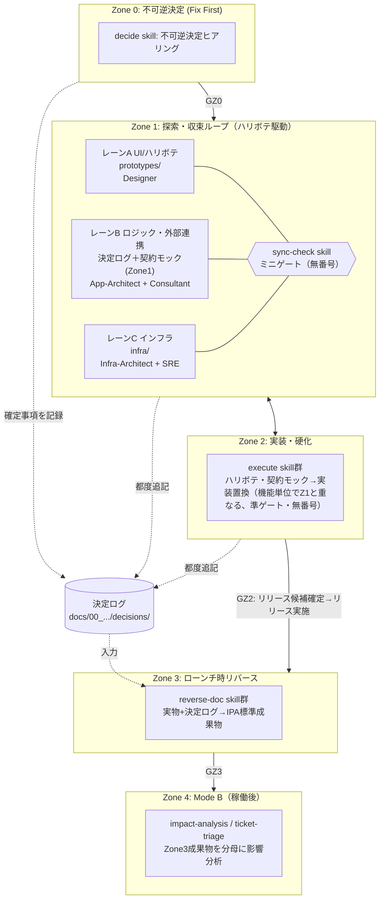
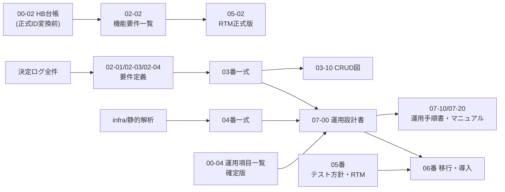
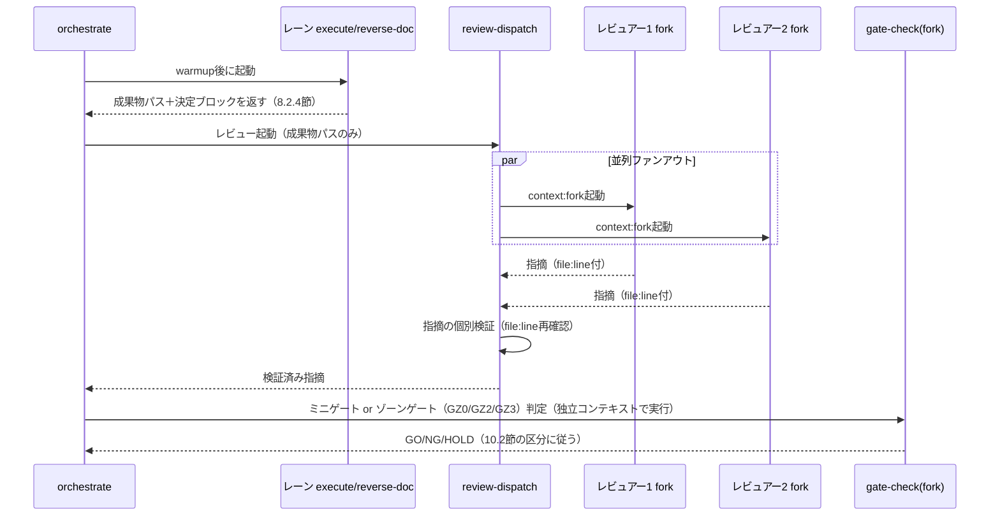
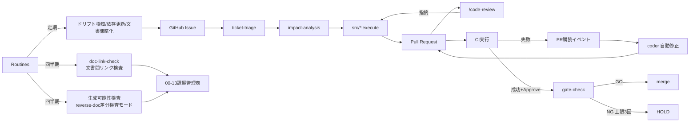

## 改訂履歴

| 版数 | 日付 | 作成者 | 変更内容 |
|---|---|---|---|
| 1.0 | 2026-09-10 | App-Architect | 初版作成（Mode Aをフェーズ順次型として写像） |
| 1.1 | 2026-09-10 | App-Architect | Mode Aのプロセスモデルを「ゾーン/レーン型（ハリボテ駆動＋ローンチ時リバース）」に全面改訂。決定ログ機構・リバース生成エンジンを新設章として追加 |
| 1.2 | 2026-09-10 | App-Architect | 「要件定義前倒しモード」をZone0のプロセス・オプションとして追加。決定ログ機構・リバース生成エンジンへ関連機構を追記（標準構成は変更なし） |
| 1.3 | 2026-09-10 | App-Architect | PM整合レビュー（01文書との突合）の指摘3件を反映。(1)トレーサビリティ起点を`SCR-ID`（画面単位）/`HB-ID`（機能・E2Eシナリオ単位）の二層ID体系に改訂（10.1節）。(2)ゾーンゲートの名称を`GZ0`/`GZ2`/`GZ3`に統一し10.2節・関連箇所へ併記。(3)`docs/`配下00〜07の完全な成果物区分一覧を新設（4.2.1節、annotation基準、旧版の「06_運用・保守」表記を「07_運用・保守」に訂正） |
| 1.4 | 2026-09-11 | App-Architect | 別モデル（Fable）による独立レビュー（重大4件・中17件、web検索による事実確認込み）、01文書版1.3の申し送り（10章#11・12・13・14・15）、03文書10章の申し送り（#1・9・11・13）、04文書10章の申し送り（#6）を反映した全面改訂。**(1) 決定ログ機構を検知型から構造型へ転換**（8章全面改訂・最優先）: Task境界を決定の回収点とする段を新設し`orchestrate`の戻り値仕様に決定ブロックを必須化（8.2.4節）、段1・段2の警告を`.claude-state/decision-warnings.json`へ永続化し`decision-check`の分母に組み込み（8.2.5節）、01文書4.7.3節の分母定義を機械的に数える実装として具体化（8.3節）、`decide` Skillのヒアリング項目・起票フォーマット・ID採番を明文化し04文書6.3節のヒアリング項目5件を追加（8.4節）、consultantの決定ログ起票経路を`decisions/**`限定のWrite付与で解決（8.5節・6.1節・7.1.2節）。**(2) Mode B入口ゲートのRTM生成機構を新設**（9.1.1節）: `src/`の静的解析（ルーティング定義・テストのimportグラフ・ORM定義）から`HB-ID`→実装ファイル→API→モジュールの列を機械生成する機構を追加し、列定義の正本化を03文書へ申し送り（15章）。**(3) レーンBの実体を01文書版1.3に整合**（3.1節・4.2節・4.3節・5.3節・10.3節）: レーンBのZone1成果物を「決定ログ＋契約モック」に限定し`src/`着手をZone2に限定、契約モックの配置場所（`decisions/contracts/`）を新設、`sync-check`の突合対象を`src/backend/models/`から契約モックへ変更。**(4) ID体系拡張の反映**（10章全面改訂）: `API-ID`・`NFR-ID`・`RPT-ID`・`BAT-ID`を01文書4.4.5節・03文書3.10節の正本どおり分母に追加、帳票ハリボテを`prototypes/reports/`に隔離し画面ハリボテと機械的に区別する方式を新設（10.1.3節）。**(5) Gate判定主体の独立性を確保**（7.1節・7.4節・10.2節）: `gate-check`に`context: fork`・`allowed-tools`を付与、「ゾーンゲート相当の操作」を`.claude-state/current-zone.json`書き込みで具体的に定義、web調査によりhookペイロードに`agent_id`/`agent_type`が含まれることを確認し`active-agent.json`方式を不要と判定、Skill経由の`context: fork`尊重可否をGitHub Issue #17283とともに15章の要検証に追加。**(6) permissions表を分割**（7.1節）: web調査により`settings.json`のpermissionsがセッション全体に適用されサブエージェント別のパス制御ができないことを確認し、(a)セッション共通deny/ask、(b)`role-boundary-guard.js`（`agent_id`参照）によるロール別パス制御の2表構成に改訂。**(7) 03・04文書からの発注を取り込み**（4章・7章・9章・12章）: `BAT-ID`/`RPT-ID`の分母拡張、CRUD図の静的解析生成機構（9.1.2節）、Markdown→HTML変換機構（9.6節）、文書間リンク検査機構（Routine、9.6節・12章）、drawio作図スキルの新設（要検証、9.7節）、オンデマンド生成の生成可能性検査（Routine、12章）、`decide`の運用設計向けヒアリング項目（8.4節）、`00-04_運用項目一覧`台帳へのhook対応（`ops-item-guard.js`新設、7.3節）。**(8) 参照切れの修正**（4.2.1節）: 備考の「01文書のIPA準拠マトリクスに従う」を「03_成果物体系定義書4章に従う」へ修正。**(9) モデル階層をティア表記へ変更**（13章）: 具体的なモデル名の記載を廃し「上位/中位/下位」のティア表記に統一（世代交代による陳腐化を避けるため、およびリポジトリに push する成果物へ特定モデル識別子を残さない方針のため）。その他: 9.4節に生成DAGとコードフリーズ基準点の機構対応を新設、GZ2再定義（01文書4.6.1節）とZone3内ミニチケット（同4.6.2節）に対応する機構を10.2節・10.4節に追加、`.claude/agent-memory/`の配置を「要検証」と明記、15章旧#8を01文書4.7.2節・4.8節による解決済みとして削除し宛先付き申し送りへ再構成 |

---

## 1. はじめに

### 1.1 目的

本文書は、aidev フレームワーク自体を Claude Code の最新機構（Skills / Subagents / Hooks / Permissions / Workflow ツール / Agent Memory / PR購読 / Routines 等）の上に再実装するための**実行基盤アーキテクチャ**を定める。対象は aidev という製品（PM エージェントが Consultant / App-Architect / Infra-Architect / Designer / Coder / QA / SRE に委譲し、顧客案件の企画〜納品を支援するファシリテーター・フレームワーク）の内部構造であり、顧客案件個別のアプリケーション設計・インフラ設計ではない。

### 1.2 適用範囲

- `/home/user/aidev/.claude/` 配下の全構成（agents, skills, hooks, commands, settings, templates）
- `docs/` `prototypes/` `src/` `infra/` `tests/` 配下のディレクトリスコープ Skill 配置と、`.claude/docs/10_facilitation/` `.claude/docs/40_standards/` の解体・変換先
- 決定ログ機構、リバース生成エンジン、レビュー・ゲート判定の実行機構
- Mode B（チケット駆動アジャイル）の実行機構
- モデル階層とコスト方針
- v1 → v2 の移行計画

顧客案件そのものの成果物（決定の中身・設計の中身）は対象外である。プロセスの What / なぜ（ゾーン定義、レーン定義、IPA準拠の論理、戻りの承認レベル）は並行して作成される `docs/v2/01_プロセス定義書.md`（以下「01文書」）の責務であり、本文書はそれを Claude Code の機能に**どう写像するか（How）**のみを扱う。成果物そのものの体系（何を・どの粒度で・いつ・どこに）は `docs/v2/03_成果物体系定義書.md`（以下「03文書」）の責務であり、運用設計の中身は `docs/v2/04_運用設計体系定義書.md`（以下「04文書」）の責務である。本文書はこれら3文書と対で読むことを前提とし、他文書が正本を持つ事項については節番号まで特定して参照する。

### 1.3 前提: Mode A のプロセスモデル（01文書の要約、本文書はこれを所与とする）

Mode A（0→1 開発）は要件を先に固める直列フェーズ進行ではなく、**HTMLのハリボテを先に出し、会話で機能とUIを決める**。IPA標準成果物は放棄せず、**作成タイミングをローンチ直前に後ろ倒しし、実物から逆生成する**。

| ゾーン | 内容 | 成果物の性質 |
|---|---|---|
| Zone 0: 不可逆決定（Fix First） | 後から変えると手戻りコストが非線形に跳ねる決定のみを先に確定（ドメイン/スコープ外周、法規制・セキュリティ前提、非機能の骨格、アーキテクチャの土台、外部連携の動かせない制約、予算・期限） | 決定ログ（Decision Log）。分厚い企画書は作らない |
| Zone 1: 探索・収束ループ（ハリボテ駆動） | レーンA（UI/ハリボテ・Designer）、レーンB（ビジネスロジック・外部連携・App-Architect+Consultant）、レーンC（インフラ・Infra-Architect+SRE）の3レーン並行。レーン間にミニゲート（同期点） | 記述系文書は作らない。永続化するのは決定と根拠のみ。**レーンBの成果物は決定ログと契約モック（OpenAPI等）に限定し、`src/`への着手はZone2からとする（01文書版1.3 4.4.1節、版1.4で反映。3.1節・4.3節）** |
| Zone 2: 実装・硬化 | ハリボテ・契約モックが実装に置き換わる。機能単位でZone1と重なる（ある機能はハリボテ、別の機能は実装済み、が正常状態） | コード、IaC |
| Zone 3: ローンチ時リバース | 動く実物＋決定ログからIPA標準成果物（要件定義書・基本設計書・詳細設計書・RTM）をas-built生成。**IPA準拠の担保点はここ** | IPA標準文書一式 |
| Zone 4: Mode B（稼働後チケット駆動） | 既存のチケット駆動アジャイル。Zone 3の成果物が影響範囲分析の分母になる | Issue/PR |

戻り作業はゾーン間・レーン間で常態的に発生することを前提に組む。**戻りは異常ではなく正常系**である。この前提は本文書の強制機構設計（差し戻しカウントの適用範囲、ゲート条件の抑制条件）に直接影響するため、7章・10章で繰り返し参照する。ゾーン間の遷移判定（ゾーンゲート）には正式名称 `GZ0`/`GZ2`/`GZ3` を用いる（10.2節）。`GZ2`は版1.4より「リリース候補確定（コードフリーズ）」を意味し、GO後にリリース実施を経てZone3へ移行する（01文書4.6.1節、10.2節）。

なお、受託契約の形態によっては標準（本節のゾーン型モデル）をそのまま適用できない例外案件があり、その場合にZone0で選択する「プロセス・オプション」の機構は8.7節・9.5節で扱う。**標準側の設計は例外に合わせて歪めない**。

### 1.4 用語

| 用語 | 定義 |
|---|---|
| Skill | `.claude/skills/<name>/SKILL.md`。frontmatter の `description` のみ常時ロードされ、本体は起動時に遅延ロードされる |
| ディレクトリスコープ Skill | 任意のサブディレクトリ配下 `.claude/skills/` に置かれた Skill。そのディレクトリのファイルを読み書きした時点で有効化され、`ディレクトリ:スキル名` の修飾名で呼び出す |
| ウォームアップ | ディレクトリスコープ Skill を呼ぶ前に、対象ディレクトリ配下のファイルを1つ読み込み、Skill を有効化させる操作 |
| `context: fork` | Skill を呼び出し元とは独立したコンテキストで実行する指定 |
| Subagent | `.claude/agents/<name>.md`。`description`/`tools`/`model` を frontmatter で指定できる独立実行コンテキスト |
| Zone / レーン | 1.3節の定義に従う |
| ミニゲート | レーン間同期点。番号を持たない。差し戻し回数カウントの対象外（10.2章） |
| ゾーンゲート（`GZ0`/`GZ2`/`GZ3`） | Zone間の遷移判定。`GZ0`=Zone0→1、`GZ2`=Zone2→3（リリース候補確定＝コードフリーズ、版1.4で意味を精緻化）、`GZ3`=Zone3→4（運用定常化・Mode B切替）。差し戻し回数カウントの対象（10.2節） |
| 決定ログ（Decision Log） | Zone 0〜2で生じた不可逆・準不可逆な決定を記録するADR風の台帳（8章） |
| リバース生成 | Zone 3で実物と決定ログからIPA標準成果物をas-built生成する処理（9章） |
| 逆差分 | 実装 vs 合意媒体（ハリボテ・契約モック・決定ログ・各種台帳）の比較で、実装にのみ存在する要素（版1.4で01文書6.5節に整合し定義を限定。9.3節） |
| 生成漏れ検査 | 生成された文書と生成元（実装・合意媒体）の対応関係を確認する検査。逆差分とは判定対象が異なる（版1.4で追加、01文書6.5節が正本。9.3節） |
| 台帳ファイル | 判定結果・差し戻し回数・承認記録をファイルとして永続化したもの |
| プロセス・オプション | Zone0で選択する進行方式の分岐。標準は `prototype-driven`、契約上の例外は `requirements-first`（8.7節） |
| 要件定義前倒しモード（`requirements-first`） | 要件定義書を契約上の中間検収物としてZone1のうちに執筆する例外的プロセス・オプション。標準（ハリボテ駆動）は歪めない案件単位の選択（8.7節・9.5節） |
| `SCR-{連番}` | 画面1枚粒度のトレーサビリティID。ハリボテHTMLが書かれた時点で機構が採番する。機械抽出（grep）の単位（10.1節） |
| `HB-{連番}` | 機能・E2Eシナリオ1本（複数画面をまたぐ）粒度のトレーサビリティID。レーンA⇔B同期点でQAが採番する。**E2Eカバレッジの分母**（10.1節） |
| `API-{連番}`（版1.4で新設） | OpenAPI operationId確定時にApp-Architectが採番するトレーサビリティID。ITカバレッジの分母。定義は01文書4.4.5節が正本（10.1節） |
| `NFR-{連番}`（版1.4で新設） | Zone0決定ログの非機能要件エントリに付与するID。STカバレッジの分母。定義は01文書4.4.5節が正本（10.1節） |
| `RPT-{連番}` / `BAT-{連番}`（版1.4で新設） | 帳票・バッチのトレーサビリティ起点ID。定義は03文書3.10節が正本（10.1節） |
| 契約モック（版1.4で新設） | レーンBがZone1のうちに確定するAPI等の入出力形状の合意媒体（OpenAPI定義等）。01文書4.4.1節・4.4.4節が正本。記述系文書ではなく実行可能な合意媒体として扱う（3.1節・4.3節・5.3節） |
| 不可逆度（版1.4で用語追加） | 決定ログの各エントリに付す高／中／低の3区分。定義は01文書4.7.2節が正本。本書はfrontmatterフィールドとしての実装のみを扱う（8.1節） |
| リリース実施（版1.4で新設） | GZ2 GO後、SRE主導でコード・IaCを本番反映する実行イベント。Gateを持たない。01文書4.6.1節が正本（10.2節） |
| Zone3内ミニチケット（版1.4で新設） | Zone3期間中の本番障害・不具合に対応する短縮ループ。01文書4.6.2節が正本。差し戻し累積対象外（10.4節） |
| 同期点記録台帳（版1.4で用語追加） | ミニゲート通過ごとの通過記録を残す台帳。01文書4.4.2.1節が要求、項番は03文書が採番する（4.2節・10.3節） |
| `.claude-state/decision-warnings.json`（版1.4で新設） | 決定ログ書き忘れ警告（8.2節の段1・段2・段3）を永続化する機械可読ファイル。`decision-check`が分母の一部として参照する（8.2.5節） |

不確かな Claude Code の機能仕様は本文中で「要検証」と明記する。断定はしない。

---

## 2. 設計方針

### 2.1 v1 の機構上の問題

現状の v1 資産を実際に確認した結果を根拠として示す。

| 資産 | 実測 | 問題 |
|---|---|---|
| `CLAUDE.md`（PM定義） | 338行 | フェーズマップ・品質ゲート・読み書き権限表まで**常時全文コンテキストに乗る**。Skill のプログレッシブ・ディスクロージャに相当する遅延ロード機構が無い |
| `.claude/agents/*/AGENT.md` | 合計3,866行（最大 infra-architect 955行） | Task 委譲のたびにサブエージェントの全文がシステムプロンプトとして渡る |
| `.claude/docs/10_facilitation/` | 80ファイル超 | フェーズ順次進行を前提にした「要件定義ヒアリング→設計執筆→…」という記述系文書の執筆ガイド群であり、**ハリボテ駆動モデルとは前提が根本的に異なる**。そのまま移植できない |
| `.claude/docs/40_standards/` | 15ファイル | 「サブエージェントが都度参照する」設計だが、読むか否かが自己申告的 |
| `.claude/hooks/prevent-pm-layer-violation.sh` | `settings.local.json` にのみ登録、`project-structure.json` 不在 | 強制機構が個人設定依存かつ識別子なしの自動検出フォールバックで動作。Coder の正当な `src/` 書き込みまでブロックしうる設計不備を内包 |
| `.claude/skills/review-*` 6種 | `context: fork` 指定なし | レビューの独立性がプロンプト指示依存 |

v1 は「規律」の大半を自然言語命令と Markdown 読解に依存しており、機構による強制は一部かつ配線不備がある。さらに v1 の `10_facilitation` は要件定義書を起点とする直列進行を前提に書かれており、**Mode A のプロセスモデルが変わった以上、その前提ごと組み替える必要がある**。これは単なる Skill 化ではなく、「何を先に確定し、何を後回しにし、何を実物から逆算するか」というプロセスの骨格そのものを実行基盤に落とし込む作業である。

### 2.2 v2 の解決方針

| 課題 | 解決方針 | 主たる機構 |
|---|---|---|
| 常時コンテキストの肥大化 | フェーズ知識・技術標準・ゾーン別手続きをすべて Skill 化し、`description` 以外は起動時のみロードする | Skills のプログレッシブ・ディスクロージャ |
| ロール規律のプロンプト依存 | 「誰が何を書けるか」を宣言的な allow/ask/deny とエージェント単位のツール制限で固定する | Permissions、Subagent `tools`、Hooks |
| 自己レビュー化 | レビューを `context: fork` で必ず独立コンテキスト化する | `context: fork` |
| 標準文書の肥大化 | 技術標準を `user-invocable: false` の自動参照 Skill に変換し、`paths` で発火させる | 自動参照 Skill |
| ゲート判定の自己申告 | 分母・分子を `gate-check` 自身が `grep` して数える。**判定コンテキストそのものをPM・作成者から独立させる（版1.4、7.1節・7.4節・10.2節）** | 機械判定 + 台帳ファイル + `context: fork` |
| **記述系文書を先に書かせてしまう慣性**（新規） | `docs/02〜04` 配下には `plan`/`execute` Skill を**置かない**。Zone 3到達まで空であることを正常状態として扱い、記述の起点をハリボテと決定ログに一本化する | ディレクトリ構成そのもの（4章）＋ ゾーン対応ゲート（10章） |
| **決定の根拠が消える**（新規） | 「なぜそう決めたか」は実物からは復元できないため、決定ログを Zone 0〜2の生命線として機構的に書き漏らしを検知する。**さらにTaskという会話内の区切りそのものを回収点とし、ファイル変更を伴わない決定の見落としを構造的に防ぐ（版1.4、8章）** | 決定ログ機構（8章） |
| **要件定義書が無い状態でのトレーサビリティ**（新規） | ハリボテの画面確定時点で`SCR-ID`を、レーンA⇔B同期点で`HB-ID`を採番し、これをトレーサビリティの起点として`SCR-ID`/`HB-ID`→E2E→実装の連鎖を機械的に追跡する。**画面を持たない要件・帳票・バッチには`API-ID`/`NFR-ID`/`RPT-ID`/`BAT-ID`を追加し6種のID体系とする（版1.4、10章）** | ハリボテ起点トレーサビリティ（10章） |
| **戻りを異常視する統制**（新規） | Zone1内のレーン往復・ミニゲートのNGは差し戻しカウントの対象外とし、ゾーンゲート（`GZ0`/`GZ2`/`GZ3`）のみをカウント対象とする | ゲート設計の階層化（10章） |

**代替案と却下理由**: 「10_facilitation の内容をほぼそのまま `docs/02〜04` の `execute` Skill に移植し、記述の順序だけをZone3側に遅延させる」という保守的な案も検討した。しかし `execute` Skill を `docs/02〜04` に置いた時点で、そのディレクトリのファイルを書く操作が発生しうる導線ができてしまい、「記述先行を作らない」という Zone 1/2 の原則と衝突する。したがって `docs/02〜04` には**生成専用**（`reverse-doc` と `review`）の Skill のみを置き、執筆を行う `execute` に相当する導線は物理的に存在しないという設計を採用する（4章・5章）。この原則には契約上の例外（8.7節・9.5節）があるが、例外は案件単位で明示的に有効化されるものであり、標準の既定構成には影響しない。

---

## 3. 全体アーキテクチャ

### 3.1 ゾーン/レーンとメカニズムの対応



**版1.4での修正**: 01文書版1.3の4.4.1節により、レーンBのZone1成果物は「決定ログ＋契約モック（OpenAPI等）」に限定され、`src/`への着手はZone2に限定された。旧版はレーンBを`src/`先行実装としており01文書と不整合であったため、上図・以降の関連節（4.2節・4.3節・5.3節・10.3節）を是正する。契約モックの配置場所は4.2節、Zone1/Zone2でのスキル分担は5.3節、`sync-check`の突合対象変更は10.3節を参照。

### 3.2 実行基盤レイヤ構成

```mermaid
graph TB
    subgraph L5["外部連携層"]
        GH[GitHub MCP]
        PRSUB[PR購読]
        ROUT[Routines cron]
        ART[Artifacts]
        WF[Workflow ツール]
    end

    subgraph L1["オーケストレーション層"]
        PM["PM（主スレッド）<br/>軽量CLAUDE.md"]
        ORCH["orchestrate skill<br/>ゾーン遷移の統制、Task境界の決定回収（8.2.4節）"]
    end

    subgraph L2["エージェント層"]
        CONS[consultant]
        APPA[app-architect]
        INFA[infra-architect]
        DESN[designer]
        CODE[coder]
        QAA[qa]
        SREA[sre]
    end

    subgraph L3["スキル層"]
        subgraph L3a["横断スキル"]
            DSG["doc-style-guide"]
            CSG["code-style-guide"]
            TDG["test-design-guide"]
            SEC["security-guard fork"]
            GATE["gate-check fork"]
            DEC["decide / decision-check"]
        end
        subgraph L3b["ゾーン/レーンスキル"]
            PROTO["prototypes/.claude/skills/*<br/>mockup-generate,update,extract"]
            CONTRACT["decisions/contracts/.claude/skills/*<br/>contract-design（Zone1）"]
            SRCB["src/*/.claude/skills/*<br/>execute,review（Zone2）"]
            INFC["infra/*/.claude/skills/*<br/>execute,review"]
            REVD["docs/02〜07/.claude/skills/*<br/>reverse-doc(traceability-reverse),review のみ"]
        end
    end

    subgraph L4["強制層"]
        PERM[settings.json permissions]
        HOOK[hooks PreToolUse/PostToolUse/Stop（agent_id/agent_type参照）]
    end

    subgraph L6["成果物層"]
        PROTOD[prototypes/]
        SRC[src/]
        INFRA[infra/]
        DOCS[docs/]
        LEDGER["台帳ファイル・決定ログ・decision-warnings.json"]
    end

    PM --> ORCH
    ORCH -->|Task| CONS
    ORCH -->|Task| APPA
    ORCH -->|Task| INFA
    ORCH -->|Task| DESN
    ORCH -->|Task| CODE
    ORCH -->|Task| QAA
    ORCH -->|Task| SREA

    DESN -.warmup.-> PROTO
    APPA -.warmup Zone1.-> CONTRACT
    APPA -.warmup Zone2.-> SRCB
    INFA -.warmup.-> INFC
    APPA -.Zone3のみ.-> REVD

    ORCH -->|context:fork| SEC
    ORCH -->|Task| DEC
    ORCH -->|context:fork| GATE

    DESN --> PROTOD
    CODE --> SRC
    SREA --> INFRA
    APPA --> DOCS
    INFA --> DOCS

    HOOK -.機械検知.-> PROTOD
    HOOK -.機械検知.-> SRC
    HOOK -.機械検知.-> INFRA
    HOOK -.機械検知.-> DOCS
    PERM -.書込制御.-> PM
    PERM -.書込制御.-> SREA

    GATE --> LEDGER
    DEC --> LEDGER

    GH --> PRSUB --> CODE
    ROUT --> ORCH
    DOCS -.HTML公開.-> ART
```



v1 との最大の違いは、`docs/` が L6 成果物層の中で**Zone3まで空である**点である。これは実装漏れではなく設計上の正常状態であり、7章・9章の hook 設計はこれを前提に「空であることを警告しない」制御を組み込む（ただし8.7節の例外選択時はこの限りでない）。

---

## 4. ディレクトリ構成（v2 レイアウト）

### 4.1 `.claude/` 直下

```
.claude/
├── CLAUDE.md                          # PMの主体定義（150〜180行目安、6章）
├── settings.json                      # permissions + hooks 登録（プロジェクト共有・必須コミット）
├── settings.local.json                # 開発者個人の追加許可のみ
├── agents/
│   ├── consultant.md
│   ├── app-architect.md
│   ├── infra-architect.md
│   ├── designer.md
│   ├── coder.md
│   ├── qa.md
│   └── sre.md
├── agent-memory/
│   └── {agent}/MEMORY.md              # 配置・永続化スコープは要検証（15章#8。01文書10章残課題#10と同根）
├── skills/
│   ├── orchestrate/SKILL.md           # ゾーン遷移の統制＋Task境界の決定回収プロトコル（8.2.4節、新設）
│   ├── gate-check/SKILL.md            # ゾーンゲート(GZ0/GZ2/GZ3)/ミニゲート判定（10.2節）。`context: fork`（版1.4で付与）
│   ├── security-guard/SKILL.md
│   ├── doc-style-guide/SKILL.md
│   ├── code-style-guide/{SKILL.md, languages/*.md}
│   ├── iac-style-guide/{SKILL.md, *.md}
│   ├── test-design-guide/SKILL.md
│   ├── decide/SKILL.md                # Zone0: 不可逆決定ヒアリングと決定ログ起票（8.4節、版1.4で仕様具体化）
│   ├── decision-check/SKILL.md        # 決定ログのカバレッジ検査、decision-warnings.jsonの消し込み確認（8.2.5節・8.3節）
│   ├── sync-check/SKILL.md            # レーン間ミニゲート、HB-ID/API-ID/BAT-ID採番（5.5節・10.3節・10.1.4節）
│   ├── impact-analysis/SKILL.md       # Mode B
│   ├── ticket-triage/SKILL.md         # Mode B
│   ├── review-dispatch/SKILL.md
│   ├── doc-html-render/SKILL.md       # Markdown→HTML変換（新設、9.6節）
│   ├── doc-link-check/SKILL.md        # 文書間リンク検査、Routine実行（新設、9.6節）
│   └── drawio-diagram/SKILL.md        # drawio別紙生成（新設・要検証、9.7節）
├── hooks/
│   ├── lint-guard.js
│   ├── role-boundary-guard.js         # agent_id/agent_type参照方式（版1.4で確定、7.1.2節・7.4節）
│   ├── gate-transition-guard.js       # トリガーを`.claude-state/current-zone.json`への前進書込に具体化（版1.4、7.3節）
│   ├── doc-header-guard.js            # 検査対象を`docs/0[2-7]_**`に限定（版1.4、7.3節・9.2節）
│   ├── decision-log-guard.js          # 段1。警告をdecision-warnings.jsonへ永続化（版1.4、8.2.2節）
│   ├── decision-stop-check.js         # 段2。Stop hookでの決定ログ書き忘れ検知（版1.4で命名・8.2.3節）
│   ├── task-boundary-guard.js         # 段3（新設・最重要）。Task返り値の決定ブロック検査（8.2.4節）
│   ├── artifact-emptiness-guard.js    # Zone3到達までdocs/02〜07（01除く）の空を正常とみなす（4.2.1節・9章。8.7節のプロセス・オプションで抑制を解除）
│   └── ops-item-guard.js              # 00-04運用項目一覧の登録漏れ警告（新設、04文書10章#6への対応。7.3節）
├── commands/{init,status,next}.md
└── templates/prototype/
```

### 4.2 `docs/` `prototypes/` 直下（ゾーン/レーンの配置）

```
prototypes/                                    # レーンA。第一級の作業ディレクトリ（格上げ）
├── .claude/skills/
│   ├── mockup-generate/SKILL.md               # ハリボテ新規生成（SCR-ID採番、帳票モードでRPT-ID採番。10.1.3節）
│   ├── mockup-update/SKILL.md                 # ハリボテ改修（SCR-ID追随検知・影響HB-ID特定を伴う）
│   └── mockup-extract/SKILL.md                # ハリボテからデータ項目・遷移を抽出しレーンBへ連携
├── SCREEN_ID_INDEX.md                          # SCR-ID（画面単位）採番台帳。機械抽出の起点（10.1節）
├── REPORT_ID_INDEX.md                          # RPT-ID（帳票単位）採番台帳（版1.4で新設、03文書3.10.1節）
├── index.html / design-system.html / {screen}.html
├── reports/                                     # 帳票ハリボテの隔離先（版1.4で新設。画面ハリボテとの機械的区別、10.1.3節）
│   └── {report}.html
└── mockups/...

docs/
├── 00_プロジェクト管理・ガバナンス/
│   ├── decisions/                              # Zone0〜2 決定ログ（8章、新設）
│   │   ├── .claude/skills/ → 上記 decide / decision-check を参照（ディレクトリスコープではなく横断skill）
│   │   ├── INDEX.md                            # 決定ログ一覧・ID体系
│   │   ├── DL-0000_process-option.md           # プロセス・オプション選択の正本（8.7節、新設）
│   │   ├── contracts/                          # レーンBのZone1成果物（契約モック）置き場（版1.4で新設、4.3節・5.3節）
│   │   │   ├── .claude/skills/contract-design/SKILL.md
│   │   │   └── {api-name}.openapi.yaml
│   │   └── DL-0001_{タイトル}.md
│   ├── 00-01_成果物構成カタログ.md              # IPA成果物カタログ（Zone3出力先の正本として継続）
│   ├── 00-02_HBトレーサビリティ台帳.md          # HB-ID台帳。経由するSCR-ID/RPT-ID/BAT-ID/API-ID一覧を保持（10.1節、版1.4で経路欄拡張）
│   ├── 00-03_バッチトレーサビリティ台帳.md      # BAT-ID台帳（版1.4で新設、03文書3.2節・3.10.2節）
│   ├── 00-04_運用項目一覧.md                    # 運用項目一覧（版1.4で新設、03文書3.2節・04文書3.2節。`ops-item-guard.js`が登録漏れを警告）
│   ├── 00-12_リスク管理台帳.md
│   ├── 00-13_課題管理表.md
│   ├── 00-14_変更管理台帳.md
│   └── GZ{0,2,3}-99_ゲート記録.md               # ゾーンゲート判定の台帳（10.2節）
│
├── 02_要件定義/                                 # 標準: Zone3到達まで空が正常
│   └── .claude/skills/{reverse-doc,review}/SKILL.md   # execute/planは意図的に置かない（2.2節）
│                                                        # 例外(requirements-first)時のみ execute/plan を追加有効化（8.7節）
├── 03_アプリケーション設計/
│   └── .claude/skills/{reverse-doc,review}/SKILL.md
├── 04_インフラ設計/
│   └── .claude/skills/{reverse-doc,review}/SKILL.md
├── 05_テスト/
│   └── .claude/skills/{traceability-reverse,review}/SKILL.md   # HB-ID起点のRTM生成に特化した名称（版1.4で明記、5.4節）
├── 06_移行・導入/
│   └── .claude/skills/{reverse-doc,review}/SKILL.md
└── 07_運用・保守/
    └── .claude/skills/{reverse-doc,review}/SKILL.md
```

`.claude-state/decision-warnings.json`（8.2.5節）は台帳ではなく実行時状態であるため、`docs/00_プロジェクト管理・ガバナンス/`ではなく`.claude-state/`配下に置く。

01番（システム企画相当）は独立ディレクトリを持たない。詳細は次項4.2.1の一覧表を参照。

### 4.2.1 `docs/` 配下の成果物区分一覧（00〜07）

annotationの構成（`00_プロジェクト管理・ガバナンス` / `01_システム企画` / `02_要件定義` / `03_基本設計` / `04_詳細設計` / `05_製造・テスト` / `06_移行・導入` / `07_運用・保守`）を基準とし、v2で名称・構成を変える場合はその理由を併記する。

| 項番 | ディレクトリ名 | annotation基準との異同 | どのゾーンで埋まるか | 配置されるディレクトリスコープSkill |
|---|---|---|---|---|
| 00 | プロジェクト管理・ガバナンス | 同名。`decisions/`（決定ログ、8章）・`00-02`〜`00-04`（各種台帳、10.1章）を新設格納する点のみ相違 | 常時（Zone0から蓄積） | 持たない。横断skill（`decide`/`decision-check`/`gate-check`/`sync-check`）が直接読み書きする |
| 01 | システム企画 | **v2では独立ディレクトリを持たない**。理由: Zone0は分厚い企画書を作らず決定ログのみを残す設計（1.3節）であり、01番に対応する記述系文書が存在しないため。番号は将来拡張のため欠番として予約する | — | なし |
| 02 | 要件定義 | 同名 | 標準: Zone3まで空。例外（`requirements-first`）時はZone1から（8.7節） | `reverse-doc`, `review`（例外時 `execute`, `plan` を追加） |
| 03 | アプリケーション設計 | annotationの「03_基本設計」を**分割**。理由: v2はApp-Architect/Infra-Architectの責務をトップディレクトリ単位で分離する。これはv1 aidevの既存カタログ（`00-01_成果物構成カタログ.md`、旧`0.1_成果物構成設計.md`）が既に採用していた構成を継承したものであり、annotation（単一プロジェクト・単一アーキテクト）との構成差はaidevがフレームワーク製品であることに起因する | Zone3で生成 | `reverse-doc`, `review` |
| 04 | インフラ設計 | 03の分割相手（上記参照） | Zone3で生成 | `reverse-doc`, `review` |
| 05 | テスト | annotationの「05_製造・テスト」を**「テスト（記述系のみ）」に縮小**。理由: ハリボテ駆動モデルでは「製造」はコード（`src/`, `infra/`）そのものであり文書化しない。RTM（`HB-ID`起点、10.1節）とテスト結果報告書のみをZone3で生成する | Zone3で生成 | `traceability-reverse`, `review`（版1.4で名称を明記） |
| 06 | 移行・導入 | 同名 | **Zone3〜Zone4境界**で生成（運用移行の直前。他番号のような「Zone3到達まで空」ではなく、Zone3内でも比較的遅く埋まる） | `reverse-doc`, `review` |
| 07 | 運用・保守 | 同名（前版の本書は誤って「06_運用・保守」と表記していた。annotationの番号順に合わせ本改訂で07に訂正） | Zone3で生成（`07-30`はZone4継続更新、`07-50`はZone4生成。04文書3.9節） | `reverse-doc`, `review` |

備考: annotationの「04_詳細設計」は独立したトップ番号を持たない。v2では03/04それぞれの配下に`02_詳細設計/`サブディレクトリとして格納する（v1 aidevの既存カタログが採用していた階層をそのまま踏襲。**作るか省略するかの判断基準は03_成果物体系定義書4章に従う（版1.4で修正。旧版は「01文書のIPA準拠マトリクスに従う」としていたが、01文書8章のマトリクスは案件ごとの省略可否を判定する基準として機能しないため参照切れであった。03文書4章がその実体を提供している）**）。

**「Zone 3まで空である状態が正常」な項番**: 02（標準時）・03・04・05・07。06（移行・導入）はZone3〜Zone4境界で埋まるためこの集合から除外し、`artifact-emptiness-guard.js`（7.3節#8）の抑制対象からも外す（06の未生成はZone4着手直前に`gate-check`（`GZ3`）が個別に確認する、10.2節）。01は成果物を持たないため対象外。00は常時蓄積が正常であるため対象外。

### 4.3 `src/` / `infra/` / `tests/`（レーンB・レーンC・Zone2）

```
src/
├── frontend/.claude/skills/{execute,review}/SKILL.md   # レーンB（Zone2のみ。一部レーンA由来のUI実装を含む）
├── backend/.claude/skills/{execute,review}/SKILL.md    # レーンB（Zone2のみ）
└── {mobile,sdk,...}/.claude/skills/{execute,review}/SKILL.md

infra/
└── {cdk,terraform,...}/.claude/skills/{execute,review}/SKILL.md   # レーンC

tests/
├── e2e/        # HB-ID起点のシナリオ。docblockにHB-IDと経由するSCR-ID/RPT-IDを記載（qa Subagent、10.1節）
├── integration/  # API-ID起点のシナリオ。docblockにAPI-IDを記載（版1.4で明記、10.1.2節）
└── （非機能検証テストのdocblockにはNFR-IDを記載。10.1.2節）
```

`src/` `infra/` に `plan` Skill を置かない点が v1（4章の当初案）およびannotationとの違いである。Zone1/2ではモジュール分解の計画立案という独立工程を置かず、ハリボテ・決定ログ・インフラ制約の3者を突き合わせながら直接実装に入り、計画に相当する判断は `sync-check`（ミニゲート）と決定ログが代替する。これは「記述系文書を先に作らない」という2.2節の原則を実装Skillの構成そのものに反映したものである。

**版1.4での修正（01文書版1.3への整合、重大3の02側への対応）**: 01文書版1.3の4.4.1節は「レーンBがZone1のうちに`src/`へ本実装を書き始めることを禁止する（MUST NOT）」と明確化し、レーンBのZone1成果物を「決定ログ＋契約モック（OpenAPI等）」に限定した。旧版の本書は3.1節の図でレーンBを`src/`（先行実装）としており、10.3節の`sync-check`も`src/backend/models/`と直接突合する設計であったため、01文書と整合していなかった。本改訂で次のとおり是正する。

1. `src/{frontend,backend,...}/execute` の起動は**Zone2以降に限定する（MUST）**。Zone1のうちにapp-architectが`src/**`へWrite/Editを試みた場合、`role-boundary-guard.js`（7.1.2節）がこれを拒否する。Zoneの判定は`.claude-state/current-zone.json`を参照する
2. レーンBのZone1活動（契約モックの作成）は、`docs/00_プロジェクト管理・ガバナンス/decisions/contracts/.claude/skills/contract-design/SKILL.md`（新設）が受け持つ。`src/`とは物理的に異なるディレクトリスコープに置くことで、Zone1のうちに`src/`へ書き込む導線自体を作らない。これは「記述先行を作らない」という2.2節の設計思想を、Zone1/Zone2の境界にも同型で適用したものである
3. `sync-check`（10.3節）の突合対象を`src/backend/models/`から契約モック（`decisions/contracts/*.openapi.yaml`）へ変更する

**設計判断（ジェネリック性の担保、継続）**: `docs/00-01_成果物構成カタログ.md`（旧 `0.1_成果物構成設計.md`）はプロジェクト非依存のIPA成果物カタログとして引き続き正本とする。フェーズ順次からゾーン型に変わっても、「最終的にどのIPA文書を何本出すか」というカタログ自体は不変であるため、これを Zone 3 の `reverse-doc` 群の出力先カタログとして再利用する。これにより4.1節で述べた代替案A（Skillのプロジェクトごと動的生成）を依然として不要にできる。

**例外（契約上の前倒し）**: 受託契約で要件定義書を中間検収物とする案件では、Zone0のプロセス・オプション選択（8.7節）により `docs/02_要件定義/` に限り `execute`/`plan` Skillが追加有効化され、Zone1のうちに執筆できるようになる。これは標準構成に対する**案件単位の例外**であり、本節で示した標準構成（`reverse-doc`/`review` のみ）自体は変更しない。他のIPA成果物ディレクトリ（`03_アプリケーション設計/` 等）は例外選択時も標準どおりZone3まで生成しない。

---

## 5. スキル設計一覧

### 5.1 横断スキル（`.claude/skills/`、常設）

| 名前 | 配置先 | frontmatter主要設定 | 責務 | 呼び出し元 | 連携先 |
|---|---|---|---|---|---|
| orchestrate | `.claude/skills/orchestrate/SKILL.md` | `disable-model-invocation: true` | ゾーン遷移・ミニゲート・ゾーンゲート（`GZ0`/`GZ2`/`GZ3`）の統制。**Task完了報告に決定ブロックを必須化し、空でない場合は次Task起動前に`decide`を呼ぶ（版1.4新設、8.2.4節）** | PM | 各レーンSkill、`decide`、`gate-check`、`review-dispatch` |
| decide | `.claude/skills/decide/SKILL.md` | `argument-hint` | Zone0の不可逆決定ヒアリングと決定ログ起票（プロセス・オプションの選択もここで確定、8.7節）。Zone1/2進行中の追加決定の起票、Task境界からの直接起票（8.2.4節）も担う。ヒアリング項目・起票フォーマットは8.4節が定める | orchestrate、各エージェント（決定発生時） | 決定ログ（8章） |
| decision-check | `.claude/skills/decision-check/SKILL.md` | `context: fork` | 決定ログのカバレッジ検査（8.3節の分母を機械集計）、`decision-warnings.json`の未解消件数確認（8.2.5節）、`process-option.json`との同期検査（8.7節） | orchestrate（ミニゲート/ゾーンゲート時） | gate-check |
| sync-check | `.claude/skills/sync-check/SKILL.md` | `argument-hint` | レーンA/契約モック(B)/Cのミニゲート整合確認（版1.4で対象変更、10.3節）、通過時の`HB-ID`/`API-ID`採番と`00-02`台帳登録、バッチ版（`--kind=batch`）による`BAT-ID`採番（10.1.4節） | orchestrate（レーン同期時） | gate-check、`docs/00_.../00-02`・`00-03` |
| gate-check | `.claude/skills/gate-check/SKILL.md` | `context: fork`, `allowed-tools: Read, Grep, Glob`（版1.4で付与、10.2節） | ミニゲート/ゾーンゲート（`GZ0`/`GZ2`/`GZ3`）の機械判定。ゾーンに応じて判定基準を切り替える（10章） | orchestrate | 台帳ファイル |
| security-guard | `.claude/skills/security-guard/SKILL.md` | `context: fork` | コンプライアンス検査 | orchestrate | qa |
| doc-style-guide | `.claude/skills/doc-style-guide/SKILL.md` | `user-invocable: false` | 文書ヘッダー・語調・構成規約（`生成区分`必須フィールド含む。値は03文書8.4節と統一、9.2節） | `reverse-doc`系（自動） | — |
| code-style-guide | `.claude/skills/code-style-guide/` | `user-invocable: false`, `paths` | コーディング規約 | `src/**` の execute/review（自動） | — |
| iac-style-guide | `.claude/skills/iac-style-guide/` | `user-invocable: false`, `paths` | IaC規約 | `infra/**` の execute/review（自動） | — |
| test-design-guide | `.claude/skills/test-design-guide/SKILL.md` | `user-invocable: false`, `paths` | 試験レベル責務分担・ID体系（E2Eの分母が`HB-ID`、ITの分母が`API-ID`、STの分母が`NFR-ID`、機械抽出単位が`SCR-ID`である6種ID体系を明記、版1.4で拡張、10.1節） | qa、gate-check | — |
| impact-analysis | `.claude/skills/impact-analysis/SKILL.md` | `argument-hint` | Mode B: チケットの影響範囲特定（分母はZone3成果物）。9.1.1節の静的解析結果（`HB-ID`→実装ファイル→API→モジュール列）を逆引きの材料とする（版1.4で追記）。Zone3内ミニチケット（10.4節）でも軽量モードとして流用する | orchestrate（Mode B、Zone3内ミニチケット） | `src/{layer}:execute` |
| ticket-triage | `.claude/skills/ticket-triage/SKILL.md` | `argument-hint` | Mode B: Issueの一次仕分け | orchestrate（Mode B） | impact-analysis |
| review-dispatch | `.claude/skills/review-dispatch/SKILL.md` | `disable-model-invocation: true` | クロスレビューの並列ファンアウトと指摘検証（11章） | orchestrate | Workflow、各`review`、gate-check |
| doc-html-render | `.claude/skills/doc-html-render/SKILL.md`（新設） | `argument-hint` | Markdown→HTML変換（03文書8.3節への対応、9.6節） | orchestrate（GZ3到達時） | doc-style-guide |
| doc-link-check | `.claude/skills/doc-link-check/SKILL.md`（新設） | `argument-hint` | 文書間リンク検査（03文書8.2節への対応、9.6節）。Routineとして定期実行 | Routines、orchestrate | `00-13_課題管理表.md` |
| drawio-diagram | `.claude/skills/drawio-diagram/SKILL.md`（新設・要検証） | `argument-hint` | drawio別紙生成（03文書8.5.3節への対応、9.7節） | `docs/{02,03,04,07}_.../reverse-doc` | — |

### 5.2 レーンA: `prototypes/.claude/skills/`（新設・厚め設計）

ハリボテは v1/annotation では Designer の補助成果物（基本設計の下位工程）だったが、v2 では**合意形成の主媒体**として第一級に格上げする。そのため3つのSkillに分割し、それぞれの責務を明確化する。

| 名前 | 責務 | 入力 | 出力 | frontmatter |
|---|---|---|---|---|
| mockup-generate | 対話しながら新規画面のHTMLハリボテを生成する。決定ログ（Zone0の制約）とdesign-system.htmlのパターンに従う。**帳票（印刷物・外部提出様式）の依頼と判断した場合は`prototypes/reports/`配下に帳票ハリボテを生成し`RPT-ID`を採番する（版1.4で追加、10.1.3節）。画面と帳票を同一HTMLに二重採番しない（MUST NOT）** | ユーザーとの会話、決定ログ | `{screen}.html`または`reports/{report}.html`、対応する`SCREEN_ID_INDEX.md`/`REPORT_ID_INDEX.md`への新規ID追記 | `disable-model-invocation: true`, `argument-hint: "[画面名 or 帳票名 or all]"` |
| mockup-update | 既存ハリボテの改修。改修に伴う`SCR-ID`・入力項目の変化を検知し、その`SCR-ID`を経路に含む`HB-ID`を`00-02`台帳から逆引きして特定した上で、影響を受けるレーンB（契約モック・データモデル）・E2Eシナリオへの波及を警告する | 変更依頼、既存HTML | 更新後HTML、`SCR-ID`変更差分レポート、影響`HB-ID`一覧 | `argument-hint: "[画面名]"` |
| mockup-extract | 確定したハリボテからデータ項目（入力フィールド名・型のヒント）・画面遷移条件を抽出し、レーンB向けの構造化データ（決定ログまたは一時メモ）として出力する。抽出対象画面の`SCR-ID`が`00-02`台帳の`HB-ID`経路に未紐付けであれば警告する。**記述系文書は生成しない**、あくまでレーンB/Cへの引き渡し用データの抽出に限る | 確定済みHTML一式 | 抽出データ（画面遷移表、入力項目一覧の中間データ） | `disable-model-invocation: true`, `argument-hint: "[画面名 or all]"` |

`mockup-extract` の出力は「記述系文書」ではなく「レーン間の受け渡しデータ」という位置づけである点に注意する。これは2.2節の原則（docs/02〜04には記述系文書を作らない）を守りながら、レーンA→レーンBの情報伝達を機構的に行うための設計であり、実体は決定ログのサブフォーマット（`DL-xxxx_screen-data-{screen}.md`）として `decisions/` 配下に保存し、後述の `sync-check`（ミニゲート）が読む。

### 5.3 レーンB/C: `src/{layer}/`・`infra/{layer}/.claude/skills/`、および契約モック作成（版1.4で改訂）

| 名前 | 配置先 | 適用ゾーン | 責務 |
|---|---|---|---|
| contract-design（新設） | `docs/00_.../decisions/contracts/.claude/skills/contract-design/SKILL.md` | Zone1（レーンB） | ハリボテ・決定ログを入力に、OpenAPI等の契約モックを作成する。実装（`src/`）には一切触れない（MUST NOT）。確定した契約モックは`sync-check`（10.3節）の突合対象になり、確定時点でApp-Architectが`API-ID`を採番する（10.1節） |
| execute | `src/{layer}/`, `infra/{layer}/.claude/skills/execute/SKILL.md` | Zone2 | 契約モック・ハリボテ・決定ログ・インフラ制約を直接の入力として実装する。規約準拠実装＋UT（レーンB）／IaC実装（レーンC） |
| review | 同上 | Zone2 | `context: fork`。実装可能性・規約準拠・決定ログ（および契約モックとの整合）を検証 |

`role-boundary-guard.js`（7.1.2節）は、app-architectについてZone1中は`src/**`へのWrite/Editを拒否し`decisions/contracts/**`のみ許可、Zone2以降は逆に`src/**`を許可する（MUST）。Zoneの判定は`.claude-state/current-zone.json`を参照する。

### 5.4 Zone3: `docs/{02〜07}/.claude/skills/`（01を除く。4.2.1節参照）

| 名前 | 責務 |
|---|---|
| reverse-doc | 実物（コード/IaC/ハリボテ）＋決定ログからIPA標準成果物をas-built生成する。9章で詳述（`docs/02_要件定義/` は例外選択時、9.5節の差分検査モードを先に実行）。03番配下では9.1.2節のCRUD図生成、02・03・07番配下では9.7節の`drawio-diagram`呼び出しを含む |
| traceability-reverse（版1.4で明記） | `docs/05_テスト/`専用の`reverse-doc`の特化名。`HB-ID`起点のRTMをas-built生成し正式要件IDへ変換するとともに、9.1.1節の静的解析による Mode B 入口ゲート向け逆引き列（`HB-ID`→実装ファイル→API→モジュール）を生成する。生成主体はqa |
| review | `context: fork`。生成物の完全性・決定ログとの整合・逆差分の有無を検証 |

### 5.5 Zone境界のミニゲートSkill

| 名前 | 配置先 | 責務 |
|---|---|---|
| sync-check | `.claude/skills/sync-check/SKILL.md`（横断、対象パスを引数で受け取る） | レーンA（画面項目）とレーンB（契約モック／決定ログ内データモデルメモ）の機械的突合（版1.4で対象変更）、レーンC（インフラ制約）との整合確認（10.3節）。**整合が確認できた時点で`HB-ID`を採番し、経由する`SCR-ID`/`RPT-ID`一覧・関連`API-ID`とともに`00-02`台帳へ登録する（QA実施）**（10.1節）。バッチ版（`--kind=batch`）は入出力仕様とサンプルデータを対象に`BAT-ID`を採番し`00-03`台帳へ登録する（10.1.4節） |

---

## 6. エージェント設計

### 6.1 v2 エージェント一覧

モデル欄は13章が定めるティア表記（上位／中位／下位）に統一する（版1.4、具体的なモデル名は記載しない）。

| エージェント | 役割 | tools | model | agent-memory | 起動元 |
|---|---|---|---|---|---|
| consultant | Zone0ヒアリング支援、ビジネス整合レビュー、**Zone0決定ログの起票（版1.4で追加、8.5節）** | Read, Grep, Glob, Skill, **Write, Edit**（`decisions/**`のみ。`role-boundary-guard.js`で強制、7.1.2節） | 中位 | なし | orchestrate |
| app-architect | レーンB主担当、Zone3 `reverse-doc`（アプリ系）の主担当 | Read, Write, Edit, Grep, Glob, Skill, TodoWrite（Zone1中は`src/**`拒否・`decisions/contracts/**`のみ許可、7.1.2節） | 上位（Zone3生成は中位、13章） | あり | orchestrate |
| infra-architect | レーンC主担当、Zone3 `reverse-doc`（インフラ系）の主担当 | Read, Write, Edit, Grep, Glob, Skill, TodoWrite | 上位（Zone3生成は中位） | あり | orchestrate |
| designer | レーンA主担当（ハリボテ生成・改修、帳票ハリボテを含む） | Read, Write, Edit, Grep, Glob, Skill | 中位 | あり | orchestrate |
| coder | Zone2実装（ハリボテ→実装置換） | Read, Write, Edit, Bash, Grep, Glob, Skill, TodoWrite | 中位 | あり | orchestrate、PR購読 |
| qa | 試験設計・実装・十分性レビュー（実装者から独立）、レーンA⇔B同期点での`HB-ID`/`API-ID`/`BAT-ID`採番（10.1節）、Zone3 `traceability-reverse`（`HB-ID`から正式要件IDへの変換を含むRTM生成、9章） | Read, Write, Edit, Bash, Grep, Glob, Skill, TodoWrite | 中位 | あり | orchestrate |
| sre | レーンCの構築実務、運用移行 | Read, Write, Edit, Bash, Grep, Glob, Skill, TodoWrite | 中位（本番deployのみ上位判断） | あり | orchestrate |

レビュー実行時は既存ロールをそのまま用い、`context: fork` で独立コンテキスト化する（v1版の6.2節の判断を維持）。

### 6.2 PMを痩せさせる方法（維持）

v1のCLAUDE.md（338行）のうち、フェーズマップ・ゲート詳細・クロスレビュー詳細・読み書き権限詳細は `orchestrate` Skillと`settings.json`に移す。CLAUDE.mdに残すのは3層原則、ゾーンマップ（表のみ簡略）、ユーザー対話原則、「まず `/orchestrate` を起動する」導線のみとし、150〜180行を目安とする。**この分離が v2 最大のコンテキスト削減レバーである**点は変わらない。

---

## 7. 規律の強制機構

### 7.1 permissions（`settings.json`）と役割別パス制御の分離（版1.4で表を分割）

web調査（Claude Code公式ドキュメント「Configure permissions」）により、`settings.json`のpermissionsルールは**セッション全体に適用され、稼働中のサブエージェント（`Agent(AgentName)`で個別のサブエージェント全体を無効化することはできるが、パス単位でロール別に絞る手段は無い）**ことを確認した。したがって、旧版7.1節の単一表（「主体」列を持ちながらセッション全体適用のpermissionsで表現する）は構造的な矛盾を含んでいた。版1.4は次の2表に分割する。

#### 7.1.1 セッション共通のallow/ask/deny（`settings.json` permissions）

これらはどのロールが呼び出しても同一に適用される、コマンドパターン単位の規則である。

| 対象パターン | allow/ask/deny | 理由 |
|---|---|---|
| `Bash(terraform destroy *)`, `Bash(cdk destroy *)`, `Bash(git push --force*)`, `Bash(git reset --hard*)` | deny | 破壊的操作の恒久禁止 |
| `Read(.env)`, `Read(**/*secret*)` | deny | シークレット漏洩防止 |
| `Bash(*apply*env=prod*)`, `Bash(*deploy*env=prod*)` | ask | 本番デプロイは人間承認必須（コマンド文字列の`env=prod`パターンで判定。実際に呼ぶのは主にsreだが、規則自体はロールを問わず適用される） |
| `Bash(terraform plan*)`, `Bash(cdk diff*)`, `Bash(*apply*env=dev*)` | allow | dry-run・非本番は自律実行可 |
| `Bash(npm test*)`, `Bash(pytest*)`, `Bash(npm run build*)` | allow | 開発ループの自律実行 |

#### 7.1.2 ロール別パス制御（`role-boundary-guard.js`、`agent_id`/`agent_type`参照）

`docs/02_**`〜`docs/04_**`, `src/**`, `infra/**`, `tests/**`, `decisions/**`, `prototypes/**` への Write/Edit は、settings.jsonのpermissionsではなく`role-boundary-guard.js`（PreToolUse hook）が`agent_id`/`agent_type`（7.4節参照）を見て許可パスを判定する。既定は**全ロール拒否のホワイトリスト方式**とし、以下の表に無いパスへの書込は`exit 2`で拒否する（MUST）。

| ロール（`agent_type`が示す値） | 許可される書込パス | 備考 |
|---|---|---|
| （未設定＝メインスレッド＝PM） | `docs/00_プロジェクト管理・ガバナンス/**`（`decisions/**`を除く）、`.claude-state/**` | `agent_type`が付与されないことでメインスレッドと判定する（要検証、15章#19） |
| consultant | `docs/00_プロジェクト管理・ガバナンス/decisions/**` | Zone0の決定ログ起票専用（8.5節） |
| designer | `prototypes/**`、`decisions/**`（`decide`経由の起票） | Zone3では`docs/03_**`の画面設計配下も許可（reverse-doc実行時） |
| app-architect | `decisions/**`。Zone1中は`decisions/contracts/**`まで、Zone2以降は`src/**`も許可 | Zoneの判定は`.claude-state/current-zone.json`参照（4.3節・5.3節） |
| infra-architect | `infra/**`、`decisions/**`、Zone3のみ`docs/04_**` | |
| coder | `src/**`, `tests/**` | Zone2以降 |
| qa | `tests/**`、`docs/00_.../00-02`〜`00-03`（台帳）、Zone3のみ`docs/05_**` | |
| sre | `infra/**`、Zone3以降`docs/07_**`、`docs/06_**` | 本番反映コマンドは7.1.1節の`ask`ルールが別途適用される |

この表はhookによる能動的なブロック（`exit 2`）であり、settings.jsonのpermissionsとは独立した強制層である。全ロールについて`decisions/**`への書込は`decide` Skill経由をSHOULDとするが、consultant等の一部ロールについては本表のパススコープ自体が最終防衛線として機能する（`decide`を介さない直接Writeも、パスが一致する限りブロックしない。フォーマットの一貫性は`decide`のテンプレートで担保する努力目標に留まる。8.5節）。

### 7.2 Subagent 単位のツール制限

consultant は Write/Edit を `decisions/**` のみに限定して持つ（版1.4で変更、8.5節）。レビュー実行時（`context: fork` 内の各ロール）に `Write`/`Edit` を持たせない、`gate-check`・`decision-check` を `Read`/`Grep`/`Glob` のみとする方針は v1版から維持する（6章参照）。

### 7.3 Hooks 一覧

| # | Hook名 | イベント | 検知内容 | 動作 | 実装方針 |
|---|---|---|---|---|---|
| 1 | `lint-guard.js` | `PostToolUse`（Edit\|Write） | 機械判定可能な規約違反 | `exit 2` | annotation方式を継続。`prototypes/reports/**`への新規HTML追加時は`REPORT_ID_INDEX.md`への、それ以外の新規画面HTMLは`SCREEN_ID_INDEX.md`への登録漏れを分岐して警告する（版1.4、10.1.3節） |
| 2 | `role-boundary-guard.js` | `PreToolUse`（Edit\|Write） | ロール境界違反。7.1.2節の許可パス表と`agent_id`/`agent_type`（7.4節）を突合 | `exit 2` | `agent_id`/`agent_type`参照方式（版1.4で確定。web調査によりhook入力共通フィールドとして提供されることを確認済み） |
| 3 | `gate-transition-guard.js` | `PreToolUse`（`.claude-state/current-zone.json`へのWrite/Edit） | 「ゾーンゲート相当の操作」を**`current-zone.json`の`zone`値を前進させる書込**として具体的に定義（版1.4、旧版は未定義だった）。書込もうとする新しい`zone`値に対応するゾーンゲート判定が`GZ{0,2,3}-99_ゲート記録.md`にGOとして記録されていない場合に検知 | `exit 2`（後退・同値の書込は許可） | ミニゲートには適用しない（10.2節で区別） |
| 4 | `doc-header-guard.js` | `PostToolUse`（Write, `docs/0[2-7]_**/*.md`） | doc-style-guide必須ヘッダー、`生成区分`フィールドの欠落。検査対象を`docs/0[2-7]_**`に限定（版1.4、旧版は`docs/**/*.md`全体を対象にし`docs/00`・決定ログ・`docs/v2/*`まで警告対象になっていた不備を是正） | `exit 2` | 9.2節参照。`生成区分`は必須フィールドとし値は`実装反映(as-built)`\|`事前設計(前倒し)`\|`手動作成`のいずれか（03文書8.4節と統一、版1.4で訂正） |
| 5 | `decision-log-guard.js`（段1） | `PostToolUse`（Edit\|Write, アーキテクチャ関連パターン: `infra/**`, `decisions/contracts/**`, `prototypes/**`の新規画面/帳票, 外部連携設定） | 対応する決定ログが直近に追記されていない変更 | **警告のみ（exit 0）**。`.claude-state/decision-warnings.json`へ`{type: "file_change", ...}`を追記する（版1.4で永続化先を明記） | 8.2.2節で詳述 |
| 6 | `decision-stop-check.js`（段2、版1.4で命名） | `Stop` | セッション中の`git diff`相当の変更差分と決定ログ追記を突合し、パターン該当なのに記録が無い変更を検知 | 警告のみ（exit 0）。`decision-warnings.json`へ`{type: "stop_session", ...}`を追記 | 8.2.3節。実現可能性は要検証（15章#2） |
| 7 | `task-boundary-guard.js`（段3、新設・最重要） | `PostToolUse`（`Task`） | Taskの返り値テキストに`## 決定ブロック`見出しが存在するか、存在する場合「決定なし」以外の内容に対応する`decisions/DL-*`が起票されたかを検査 | 警告のみ（exit 0）。`decision-warnings.json`へ`{type: "task_boundary_missing"\|"task_boundary_unrecorded", ...}`を追記 | 8.2.4節で詳述。ファイル変更ではなくTask境界という会話内の出来事を検知対象にする点が段1・段2と異なる |
| 8 | `artifact-emptiness-guard.js` | 定期実行（Routine）または `PostToolUse`（`docs/00-01_成果物構成カタログ.md` の完全性走査） | `docs/02〜07`（01を除く。区分別のゾーン対応は4.2.1節の一覧表を参照。06_移行・導入はこの抑制対象から除外し別枠で扱う）のIPA成果物カタログ上の未生成項目 | `.claude-state/current-zone.json` の `zone` が3未満、かつ `.claude-state/process-option.json` の `mode` が `prototype-driven`（標準）なら**検知そのものを抑制**（通知しない）。`zone`が3以上、または`mode`が`requirements-first`（前倒し例外）なら通常どおり警告する | 9章・8.7節・4.2.1節参照 |
| 9 | `ops-item-guard.js`（新設） | `PostToolUse`（Edit\|Write, `infra/**`の監視・バックアップ・DR関連IaC定義ファイル、`src/**`のジョブスケジューラ定義ファイル） | 対応する`docs/00_.../00-04_運用項目一覧.md`のエントリが存在しない変更 | 警告のみ（exit 0） | 04文書10章#6への対応。検知対象パターン（04番技術設計文書の実際の構成）の具体例提供は04文書側へ申し送る（15章#21） |

### 7.4 ロール境界の機構化とその確定（版1.4でagent_id/agent_type方式に確定）

**版1.4での更新**: 旧版は「hookイベントペイロードに呼び出し元Subagentの識別子が含まれるか」を要検証としつつ、フォールバックとして`active-agent.json`方式（`orchestrate`がTask起動直前に現在のロールを記録し、hookがこれと突合する）を採用していた。本改訂にあたりweb調査（Claude Code公式ドキュメント「Hooks reference」）を行った結果、**PreToolUse/PostToolUse等のhook入力共通フィールドに`agent_id`（サブエージェント呼び出し時のみ付与される一意識別子）と`agent_type`（サブエージェント名。例: `"security-reviewer"`）が含まれることを確認した**。したがって`role-boundary-guard.js`は`agent_type`を直接参照する設計に改め、`active-agent.json`方式は不要と判定する（01文書10章残課題#1・02文書旧15章#2の解決）。

**残る不確実性（要検証、15章#19）**: `agent_type`が未設定の場合にメインスレッド（PM）と一意に判定してよいかは、Claude Codeが将来`--agent`セッション種別を導入した場合に崩れる可能性がある。この判定ロジックの信頼性は運用実績を踏まえて再確認する。

新たに、`decisions/` と `prototypes/` がロール境界の対象パスに加わる。`decisions/`への書き込みはロール別の許可パス（7.1.2節）で制御し、consultant等は`decisions/**`のみを許可する（8.5節）。

---

## 8. 決定ログ機構（版1.4で全面改訂・最優先）

決定ログは本方式（ハリボテ駆動＋ローンチ時リバース）の生命線である。実物は後から読めるが「なぜそう決めたか」は後から復元できない。9章のリバース生成エンジンは決定ログを主要な入力源とするため、書き漏れは Zone 3 の成果物の欠落に直結する。

別モデル（Fable）による独立レビューは、旧版の3段構え（decision-log-guard、Stop hook、decision-check）が**いずれもファイル変更をトリガとする検知型**であり、01文書4.7.1節が「前に置くべき」と定める決定（事業背景、スコープ外周、「なぜ作らないと決めたか」、法規制前提、A案でなくB案を選んだ理由）のように**会話の中で決まりファイル変更を伴わない決定**に対して構造的に盲目であると指摘した。加えて、段1の警告の永続化先が未定義であること、決定ログのカバレッジ検査（旧8.2節段3）の分母が定義されていないこと、サブエージェントのTaskコンテキストが閉じた時点で決定の文脈が消えること、Consultantに決定ログの起票経路が無いこと、も併せて指摘された。本章は8.2節を「検知型」から「検知＋構造的回収」の複合型に転換し、8.3節〜8.5節でこれらの欠落を埋める。

### 8.1 ファイル形式とID体系

- 配置: `docs/00_プロジェクト管理・ガバナンス/decisions/DL-{4桁連番}_{タイトルkebab}.md`
- ID体系: `DL-0001` 通し番号。画面データ抽出等の中間データ（5.2節の `mockup-extract` 出力）も同一体系内のサブタイプとして採番する（例: `DL-0032_screen-data-upload.md`）。トレーサビリティ用の `SCR-ID`・`HB-ID`・`API-ID`・`NFR-ID`・`RPT-ID`・`BAT-ID` は別体系であり、決定ログのIDとは混同しない（10.1節）
- 記載項目: 決定内容 / 背景・検討した代替案とその却下理由 / 影響レーン（A/B/Cのどれに波及するか） / **不可逆度**（高・中・低。定義は01文書4.7.2節が正本） / 状態（確定/仮/覆った） / 決定日時 / 決定に関与したロール / **対象カテゴリ**（Zone0必須決定項目に該当する場合のみ。値の集合は8.3節、版1.4で新設） / **関連HB-ID**（該当する場合、8.3節、版1.4で新設） / **NFR-ID**（非機能決定の場合、10.1節、版1.4で新設） / **運用項目コード**（04文書4.3節の項目番号B1〜B6/I1〜I7/M1〜M10、該当する場合、8.4節、版1.4で新設）

不可逆度の区分ラベルと承認レベルの正確な定義は01文書に従う。本文書ではこれをファイルのfrontmatterフィールドとして機構的に扱えるようにする、という実装上の受け皿のみを定義する。

### 8.2 書き忘れを機構で防ぐ方法（検知型から構造型への転換、版1.4で全面改訂）

3段の検知に加え、Task境界を回収点とする第3段（構造的回収）を新設し、計4段構えとする。いずれも完全な機構化ではなく、確実性の異なる複数の網を重ねる設計とする。

#### 8.2.1 検知型（段1・段2）の構造的な限界

段1（ファイル変更検知）・段2（セッション終了時のgit diff検知）は、いずれも**ファイル変更をトリガ**にする。しかし01文書4.7.1節が「Zone0/1でリアルタイム決定ログに残す」と定める決定のうち、事業背景・スコープ外周・「なぜ作らないと決めたか」・法規制前提・アーキテクチャ選定の理由は、**会話の中でのみ確定し、対応するファイル変更を必ずしも伴わない**（例えば「マルチテナントにしない」という決定は、それ自体が新しいファイルや変更を生まないことがある）。段1・段2はこの種の決定に対して構造的に盲目であり、これを補うために段3（8.2.4節）を新設する。

#### 8.2.2 段1: `decision-log-guard.js`（PostToolUse）

アーキテクチャに関わるファイル変更（`infra/**`、`decisions/contracts/**`、`prototypes/**` の新規画面/帳票ファイル、外部連携設定ファイル等）を検知した際、直近の決定ログ更新時刻と比較し、対応するエントリが無ければ**警告**する。**あえてブロックしない**。決定ログを書くべきかの判断自体にエージェントの裁量が必要な場面が多く、機械的な `exit 2` は誤検知（些末な変更まで止める）のコストが高いと判断したためである。これは代替案として「ブロックする」案も検討したが、Zone1のハリボテ反復のような高頻度・低コストの変更にまでブロックが効くと、ハリボテ駆動という速度重視のプロセス自体を阻害するため、**警告に留める**という設計判断を明示的に採る（トレードオフ: 見逃しリスクは残るが、Zone1の速度を優先）。**版1.4での変更**: 警告はstderr表示に加え、`.claude-state/decision-warnings.json`へ`{id, type: "file_change", path, detected_at, resolved: false}`として永続化する（8.2.5節）。旧版はstderr出力のみで永続化先が無く、ゲート判定時点で消えているという指摘があったため是正した。

#### 8.2.3 段2: `decision-stop-check.js`（Stop hook）

セッション中に変更されたファイル一覧（`git diff` 相当）と決定ログの追記を突き合わせ、パターンに該当するのに記録が無い変更を「未記録の決定」として`decision-warnings.json`へ`{type: "stop_session", ...}`として永続化し、PMに一覧提示する。**要検証**: Stop hookの実行タイミングでgitワーキングツリーの差分を確実に取得できるか、Stop hook自体がこの用途で利用可能な仕様か（15章#2）。

#### 8.2.4 段3（新設・最重要）: Task境界を決定の回収点とする構造的回収

01文書版1.3の4.7.4節は「サブエージェントは、委譲されたTaskの完了報告において、当該作業で下した決定を明示的に報告しなければならない。決定が無かった場合は『決定なし』と明記する」という原則を新設した。本節はこれを機構として実装する。

**`orchestrate` Skillの戻り値仕様（MUST）**: `orchestrate`は各Subagentへの委譲プロンプトに、次のフォーマットでの報告を必須指示として含める。

```
## 決定ブロック
（この作業で下した決定を1件ずつ列挙する。無ければ「決定なし」と記載する）
1. 決定内容: ...
   不可逆度: 高 | 中 | 低
   理由: ...
   対象カテゴリ / 関連HB-ID: ...（該当する場合）
```

**`orchestrate`の遵守事項（MUST）**: Task完了報告に「決定ブロック」が空でない場合、`orchestrate`は次のTaskを起動する前に`decide` Skillを呼び出し、決定内容をそのまま引数として渡して起票を完了させる。「決定なし」の場合はそのまま進めてよい。

**機構的な補強（`task-boundary-guard.js`、PostToolUse、`Task`ツール）**: `orchestrate`自身の遵守は自己申告であり検証手段が無いため、次の検査をhookとして追加する。
1. Task完了時の返り値テキストに`## 決定ブロック`見出しが存在するかを正規表現で検査する。存在しなければ警告し`decision-warnings.json`へ`{type: "task_boundary_missing", agent_type, task_summary, timestamp}`を追記する
2. 見出しが存在し内容が「決定なし」以外の場合、当該Task完了時刻以降に`decisions/DL-*`の新規ファイルが追加されているかを`git status`相当で確認し、無ければ`{type: "task_boundary_unrecorded", ...}`を追記する

この段は**ファイル変更ではなくTask境界という会話内の出来事を検知対象にする**点が段1・段2と根本的に異なり、8.2.1節で指摘した構造的な盲点を直接埋める。ブロックしない理由は段1と同じ（判断の裁量、誤検知コスト）である。**要検証（15章#20）**: サブエージェントが見出しの書式を微妙に変えて返した場合の検出漏れ。

#### 8.2.5 `decision-warnings.json`による永続化と消し込み

**ファイル形式**: `.claude-state/decision-warnings.json`

```json
{
  "warnings": [
    {
      "id": "W-0001",
      "type": "file_change" | "stop_session" | "task_boundary_missing" | "task_boundary_unrecorded",
      "detected_at": "2026-09-11T10:00:00Z",
      "path_or_task": "infra/cdk/network-stack.ts",
      "resolved": false,
      "resolved_by": null
    }
  ]
}
```

**消し込み手順（MUST）**: 該当する決定が`decide` Skill経由で決定ログに追記された時点で、`decide`は`decision-warnings.json`を走査し、パス・タイムスタンプの近接一致（または`orchestrate`が警告IDを`decide`の引数として明示的に渡す方式）により対応する警告を特定し、`resolved: true`・`resolved_by: <DL-ID>`を設定する。近接一致で解決できない警告は`decision-check`実行時に一覧化し、判定主体（ゾーンゲート/ミニゲート実行時のPM経由のユーザー確認、または当該レーンの主担当）に手動解消を促す。

`decision-check`（ミニゲート/ゾーンゲート時）は、`resolved: false`のエントリ件数を8.3節の分母計算に組み込む。3段構え（旧版）から4段構え（版1.4）になったことで、「ここで初めて先に進めない、という強い制約になる」という段の重み付けは変わらないが、**分母を持たない旧版のカバレッジ検査は、本節の永続化によって初めて機械的に数えられる検査になる**。

### 8.3 決定ログの分母の機械化（新設、01文書4.7.3節の実装）

01文書版1.3の4.7.3節が定めるZone0必須決定項目とHB-ID単位の必須決定スロットを、`decision-check`が機械的に数える実装として定義する。

**(a) Zone0分母**: `decisions/DL-*.md`のfrontmatter「対象カテゴリ」フィールドに、以下9値のいずれかを持たせる（MUST）。`decision-check`は9値それぞれについて該当エントリが1件以上存在するかを`grep`し、分母9・分子（充足カテゴリ数）を計算する。全9件が埋まっていなければ`GZ0`はGOと判定しない（01文書4.7.3節(a)のMUST NOTに対応）。

値の集合: `事業背景` / `スコープ外周` / `法規制前提` / `非機能骨格` / `アーキ土台` / `外部連携制約` / `予算期限体制` / `案件類型`（03文書7章） / `前倒しオプション`（01文書4.10節）

**(b) HB-ID単位分母**: 各`HB-ID`について「業務ルール」「権限」「異常系」「外部連携」の4スロットが分母となる。`decision-check`は`00-02_HBトレーサビリティ台帳.md`から`HB-ID`一覧を取得し、frontmatterの「関連HB-ID」フィールドで対応する決定ログを検索し、4スロット（該当なしの明記を含む）の充足数を数える。分母は`(a)の9項目) + (4スロット × HB-ID件数)`である。

**(c) 運用系の分母（04文書10章#6への対応、版1.4で追加）**: 04文書4.3節が定める条件B該当項目（M2・B5・M10）については、frontmatterの「運用項目コード」フィールド（B1〜B6/I1〜I7/M1〜M10）で検索可能にし、`decision-check`が04文書6.2節の判定表と突合できるようにする。これにより、01文書8.1節が要求する「運用プロセスの証跡」も同一の機械集計基盤で扱える。

### 8.4 `decide` Skillの仕様（新設・具体化）

- frontmatter: `argument-hint: "[zone0 | HB-ID | 決定内容の要約]"`、`tools: Write（decisions/**のみ、role-boundary-guardが強制）, Read, Grep`
- **Zone0ヒアリング項目**: 8.3節(a)の9項目を一問一答でヒアリングする（PMのユーザー対話原則を踏襲）。
- **04文書6.3節が要求する運用設計向けヒアリング項目（版1.4で追加、MUST）**: 条件B相当の決定（M2/B5/M10）が生じた際、追加で次の5項目をヒアリングする。
  1. 重大インシデント発生時の一次対応者・エスカレーション先
  2. 事業影響の判断基準
  3. 対外報告義務の有無と、報告先・期限
  4. 本番変更の最終承認者
  5. データ廃棄・システム廃止の判断トリガとなる条件（法定保存期間の満了、契約終了等）

  これらは「対象カテゴリ」ではなく「運用項目コード」（04文書4.3節の項目番号）で記録する（04文書10章#6のカテゴリタグ要求に対応）。
- **起票フォーマット**: 8.1節の書式表に統一する。
- **ID採番**: `DL-{4桁}`通し番号。中間データ（mockup-extract出力、5.2節）は同一体系のサブタイプとして採番する。
- **Task境界からの呼び出し（8.2.4節）**: `orchestrate`が決定ブロックのテキストをそのまま引数として渡す場合、`decide`はヒアリングを省略して直接起票してよい（MAY、既に決定内容が明確なため）。

### 8.5 consultantの決定ログ起票経路（新設、01文書10章#13の解決）

01文書7.6節はConsultantを決定ログ（Zone0）の起票主体の一つとするが、旧版の6.1節エージェント一覧はConsultantに`Write`/`Edit`を付与していなかった。

**採用する解決策**: consultantのtools frontmatterに`Write`, `Edit`を追加し、`role-boundary-guard.js`（7.1.2節）がパスを`docs/00_プロジェクト管理・ガバナンス/decisions/**`のみに制限する（6.1節に反映済み）。

**却下した代替案**: (1) 「PM経由の代筆」案（Consultantが口頭でPMに伝え、PMが`decide`を起票する）は、PMは「成果物を一切作成しない」というLayer1原則（CLAUDE.md）と衝突するため採らない。(2) 「App-Architectが代筆する」案は、Zone0のビジネス背景・スコープ外周のような判断はConsultantが最も正確に記述できるため、伝言によるニュアンスの劣化を避けるべきと判断し採らない。

**残るリスク（要検証、15章#22）**: consultantに`decisions/**`限定とはいえWrite/Editを付与したことで、`decisions/`以外への誤書込みに対する最終防波堤は`role-boundary-guard.js`のみになる。hookの登録漏れ・障害時には無防備になる。

### 8.6 Zone3での消費

`reverse-doc` Skillは決定ログを読み、IPA成果物の「設計判断・根拠」「トレードオフ」節に**転記**する（生成ではなく転記）。決定ログに存在しない判断は「未記載」と明記し、実装から推測して後知恵の作文をしない（annotationの `reverse-doc` 原則を踏襲、9章）。

### 8.7 プロセス・オプションの記録と分岐（要件定義前倒しモード）

受託契約によっては「要件定義書を中間成果物として検収する」ことが契約条件になる案件があり、その場合は標準（ハリボテ駆動＋ローンチ時リバース）をそのまま適用できない。01文書が定めるこの例外を、実行基盤では**Zone0で選択するプロセス・オプション**として扱う。**標準側の設計（Zone3集約のリバース生成）は歪めない**。例外を選んだ案件だけが追加の振る舞いを持つ、という構成を取る。

**保持場所**: 選択そのものは決定ログの正本エントリ（`docs/00_.../decisions/DL-0000_process-option.md`、不可逆度: 高、Zone0で確定）に記録する。ただし hook / gate はMarkdownを都度解析するコストと精度の問題を避けるため、この決定ログの内容を**機械可読な鏡ファイル**`.claude-state/process-option.json`（例: `{"mode": "prototype-driven" | "requirements-first", "decided_by": "DL-0000", "since": "<timestamp>"}`）にミラーし、hook / `gate-check` はこちらを参照する。決定ログが正本、鏡ファイルは実行時参照用のキャッシュという位置づけであり、`current-zone.json` と同じ設計パターンを踏襲する（版1.4：`active-agent.json`は7.4節の確定により廃止したため、鏡ファイル方式が残るのは`process-option.json`と`current-zone.json`のみである）。

**分岐する振る舞い**:

| 機構 | `prototype-driven`（標準） | `requirements-first`（前倒し例外） |
|---|---|---|
| `artifact-emptiness-guard.js`（7.3節#8） | Zone3未到達の`docs/02_要件定義`の空を正常として抑制 | **抑制を無効化**。Zone1開始時点で`docs/02_要件定義`が埋まっていることを期待し、未着手なら通常どおり警告する |
| `docs/02_要件定義/.claude/skills/` | `reverse-doc`/`review`のみ（4.2節） | `execute`/`plan`を追加で有効化し、Zone1のうちに執筆できるようにする（`doc-style-guide`は変わらず自動適用） |
| Zone3の`docs/02_要件定義`向け`reverse-doc` | 通常生成 | 9.5節の**差分検査モード**を先に実行する |
| `doc-header-guard.js`（7.3節#4） | `docs/02_要件定義`配下の生成物に`生成区分: 実装反映(as-built)`を要求 | 前倒し要件定義書自体に`生成区分: 事前設計(前倒し)`を要求する（版1.4で訂正。旧版はフィールド自体を要求しないとしていたが、03文書8.4節の「フィールド必須・値で区別」に統一した） |

**トレードオフ**: 鏡ファイル方式は9.5節のアクティブスキル方式と同じ限界（決定ログとの同期漏れ）を持ち込む。これを避けるため、`decision-check`（8章既出）の検査項目に「`process-option.json`が対応する決定ログエントリ（`DL-0000`）と一致していること」を追加し、不一致はゾーンゲートでブロックする。この同期検証の機械的な検出限界は15章の要検証項目として扱う（15章#10）。

---

## 9. リバース生成エンジン（Zone 3）

Zone 3 は「片手間の逆生成」ではなく、**IPA準拠を担保する主要機構**として設計する。

### 9.1 入力→出力対応表

| 入力 | 出力（IPA成果物） | 生成主体 |
|---|---|---|
| `src/backend/`, `src/frontend/` のコード | ソフトウェア構成図、API設計書（IF部分）、論理データモデル（実体部分）（03番） | app-architect の `docs/03_.../reverse-doc` |
| `infra/`（CDK/Terraform） | AWS構成設計書、ネットワーク構成図（04番） | infra-architect の `docs/04_.../reverse-doc` |
| `prototypes/` 確定版 ＋ `SCREEN_ID_INDEX.md`（`SCR-ID`）／`REPORT_ID_INDEX.md`（`RPT-ID`） | 画面設計書（03-05番）、帳票設計書（03-08番） | designer の `docs/03_.../reverse-doc` |
| `tests/e2e/`（`HB-ID`のdocblock）＋`docs/00_.../00-02_HBトレーサビリティ台帳.md` | RTM（`HB-ID`を正式要件IDへ変換したトレーサビリティマトリクス）（05番） | qa の `docs/05_.../traceability-reverse` |
| `src/`の静的解析（ルーティング定義・importグラフ・ORM定義） | Mode B入口ゲート向けRTM逆引き列（`HB-ID`→実装ファイル→API→モジュール）（版1.4で新設、9.1.1節） | qa の `docs/05_.../traceability-reverse` |
| `src/backend/models/`＋データアクセス層コードの静的解析 | CRUD図（03-10番、版1.4で新設、9.1.2節） | app-architect の `docs/03_.../reverse-doc` |
| `docs/00_.../decisions/` 全件 | 各設計書の「設計方針・判断根拠・トレードオフ」節、要件定義書の背景・制約・スコープ | 各 `reverse-doc` が該当ログを引用・転記（新規生成しない） |
| Git履歴（コミットログ、PR、Issue）＋決定ログ（移行関連）＋`infra/`のデプロイ設定 | 変更履歴、体制・スケジュール実績、移行計画書・手順書骨格（06番） | orchestrate が `git log` を集計／infra-architect・sreの `docs/06_.../reverse-doc` |
| コード・IaC・決定ログの統合ビュー | 運用手順書骨格（07番） | sreの `docs/07_.../reverse-doc` |

例外選択時（`process-option.json` の `mode` が `requirements-first`）は、`docs/02_要件定義/` のみ入力の一部が反転する。実物から生成する代わりに、Zone1で前倒し執筆済みの要件定義書そのものが既に存在するため、9.5節の差分検査モードがこれを扱う。

#### 9.1.1 Mode B入口ゲート向けRTM逆引き列の機械生成（新設・重大2への対応）

01文書5.2節は影響範囲分析で「主観的な洗い出しを禁止」しRTMの逆引きを必須とするが、旧版の`traceability-reverse`の入力は「`tests/e2e/`のdocblock＋`00-02`台帳」のみで、実装ファイル・APIエンドポイント・設計書項番を紐づける材料が無かった。本節はこれを埋める静的解析機構を新設する。

**手順**:
1. `HB-ID`→実装ファイル: `tests/e2e/`のdocblockに記載された`HB-ID`と、当該テストファイルの操作対象（URLパスまたはページオブジェクト）を、`src/frontend/`のルーティング定義（React Router、Next.jsのページディレクトリ等）と突合してファイルパスを特定する
2. 実装ファイル→API: `src/frontend/`内のAPIクライアント呼び出し（fetch/axios等）を抽出し、`src/backend/`のルーティング定義（Express Router、FastAPIのデコレータ等）とエンドポイントパスで突合して`API-ID`（OpenAPI operationId）を特定する
3. API→モジュール: バックエンドのハンドラ関数が属するディレクトリ（5.1節のモジュール定義に準拠、03文書5.1節参照）をモジュールIDとする

生成した列は`00-02_HBトレーサビリティ台帳.md`の追加列（「実装ファイル」「API-ID」「モジュール」）として保持する（MUST）。**列定義そのものの正本化は03_成果物体系定義書に委ね、15章で申し送る**。

**限界（要検証、15章#13）**: 静的解析の実現手段は言語・フレームワークにより大きく異なる。TypeScriptのAST解析（ts-morph等）は機械的に可能だが、動的なルーティング定義（文字列結合によるURL生成等）は正規表現では追えない。本機構は「フレームワーク別の静的解析アダプタを追加していく」拡張可能な設計とし、アダプタが存在しない技術スタックでは自動生成を諦め人手での列埋めにフォールバックすることを許容する（MUST、フォールバックの許容）。優先実装すべきフレームワークの選定は15章の要検証とする。

#### 9.1.2 CRUD図の静的解析生成（新設、03文書3.11節への対応）

03文書3.11節が要求するCRUD図（テーブル×機能のマトリクス）を次の手順で生成する。

1. `src/backend/models/`等のORM定義からテーブル一覧を抽出する
2. `src/backend/`のデータアクセス層（Repository/DAO相当）コードを静的解析し、各テーブルへのCRUD操作（命名規則: `create`/`find`/`update`/`delete`等）を抽出する（9.1.1節と静的解析基盤を共有する）
3. 呼び出し元をたどり、機能単位（`HB-ID`・`API-ID`・`BAT-ID`のいずれか）に紐づける

生成先: `docs/03_アプリケーション設計/02_詳細設計/`配下ではなく`03-10_CRUD図.md`（03文書3.5節が定める項番、単独文書）。生成主体はapp-architectの`docs/03_.../reverse-doc`。

### 9.2 `生成区分`の強制

`doc-style-guide` の文書ヘッダーテンプレートに `生成区分` を必須フィールドとして追加する。値は `実装反映(as-built)` \| `事前設計(前倒し)` \| `手動作成` のいずれかとする（03文書8.4節と統一。版1.4で訂正。旧版は前倒し要件定義書に本フィールド自体を要求しないとしていたが、03文書が「フィールド必須・値で区別」を定めたため、これに揃える）。`doc-header-guard.js`（7.3節#4）はこのフィールドの有無と値の妥当性を機械チェックする。加えて、`reverse-doc` Skill 経由で生成されたことを示す実行時マーカー（`decision-log-guard`と同様の仕組み）を用いて、`reverse-doc` を経由せず直接 `docs/02〜07` に書き込まれたファイルを識別し警告する。**この識別方式は更新漏れへの脆弱性を持つことを明記する**。

前倒し要件定義書（9.5節）には`生成区分: 事前設計(前倒し)`を付与する（MUST、版1.4で訂正）。9.5節の突合レポートには`生成区分: 実装反映(as-built)`を付与する。両者を混同しないよう`reverse-doc`実行時にモード表示を明示する。

### 9.3 正確性の担保

1. **差分検査モード**: `reverse-doc` を引数無しで起動した場合、生成せずに既存文書と実装のズレの一覧のみを出す（annotation方式を踏襲）
2. **逆差分検出**: **実装 vs 合意媒体（ハリボテ・契約モック・決定ログ・`HB`/`API`/`NFR`/`RPT`/`BAT`台帳）**の比較に限定し（版1.4で01文書6.5節に整合し定義を限定。生成された設計文書との比較は同語反復であり逆差分と呼ばない）、実装に存在し合意媒体に存在しない要素が0件であることをゾーンゲート条件に組み込む（10章）。画面の逆差分は`SCR-ID`総数と実装側ルーティング定義の画面数の突合、APIの逆差分は`API-ID`総数とバックエンドのエンドポイント数の突合で検出する（10.1節）
3. **生成漏れ検査（新設、01文書6.5節が正本）**: 生成された文書と生成元（実装・合意媒体）との対応関係を確認する検査。逆差分（上記2）とは判定対象が異なるため、`reverse-doc`はどちらの検査を実行しているかをログに明示する（MUST）
4. **未記載の明示**: 決定ログに根拠が無い判断は「未記載」と明記し `00-13_課題管理表.md` へ登録する。実装からの推測で埋めることを禁止する

### 9.4 分割生成と中断耐性

Zone 3 は一括で生成する成果物の量が多く、長時間セッションになりやすい。annotationの `qa-engineer` 運用（「1件判明するごとに即座にファイルへ追記する。まとめ書きは中断で全損する」）と同じ教訓を踏まえ、`reverse-doc` 系Skillは以下を実行方針としてSKILL.md本文に明記する。

- 出力先ファイルは着手前に決め、冒頭に見出しだけ作ってから埋める
- 1セクション判明するごとに即座に追記する。セッション最後にまとめて書かない
- 中断時に再開できるよう、生成対象文書の一覧と進捗状態を `docs/00_.../00-01_成果物構成カタログ.md` に生成済みマーク欄として追記する

#### 9.4.1 生成DAG（新設、03文書10章の指摘への対応）

03文書のカタログを合算するとMarkdown本文だけで1〜2万行規模になり、生成順序の依存（`02-02`の正式ID→`05-02`、`07-00`→`07-10`、`00-04`→`07-10`等）が定義されていなかった。以下の生成DAGを`reverse-doc`群の実行順序として定める（MUST）。



**実行順序の原則（MUST）**: 上流（決定ログ・台帳の確定）が下流（文書生成）より先に完了していなければ、下流の`reverse-doc`は「未確定入力あり」として生成を保留し、`00-13_課題管理表.md`へ登録する。`orchestrate`はZone3着手時にこのDAGに従ってTaskの起動順序を決定する（MUST）。

#### 9.4.2 コードフリーズ基準点との接続（新設、01文書4.6.3節への対応）

01文書4.6.3節が定める「GZ2 GO時点で打刻したgit tagをas-built生成の基準点とする」原則を、次の機構で実装する（MUST）。

- `gate-check`がGZ2をGOと判定した直後、`orchestrate`が`git tag freeze-gz2-{YYYYMMDD-HHmm}`相当のタグを打刻する
- `.claude-state/current-zone.json`に`{"zone": 3, "freeze_tag": "freeze-gz2-..."}`を記録する
- `reverse-doc`群は実行時に`git diff {freeze_tag}..HEAD`の差分が空でないことを検知した場合、「基準点更新が必要」と警告する（01文書4.6.3節の「動く標的」問題への対応）
- 10.4節のZone3内ミニチケットが反映された時点で、`orchestrate`が新たなタグを打刻し`current-zone.json`の`freeze_tag`を更新する

### 9.5 差分検査モード: 前倒し版とas-built版の突合（要件定義前倒しモードのみ）

`.claude-state/process-option.json` が `requirements-first` のとき、Zone1のうちに契約上の中間成果物として要件定義書（`docs/02_要件定義/`）が既に存在する。Zone3のリバース生成は、この前倒し文書をいきなり上書きしてはならない（検収済みの契約成果物であるため）。そこで `docs/02_要件定義/.claude/skills/reverse-doc` は、`process-option` が `requirements-first` の場合に限り、通常の生成に先立って以下の差分検査を行う。この節は9.3節の一般的な「差分検査モード」を、前倒し例外に特化して拡張したものである。

**手順**:

1. 前倒し要件定義書の各項目（機能要件・非機能要件等）を読み込む
2. 実物（コード・ハリボテ・決定ログ）から同じ項目をas-built生成する（ただし既存ファイルへは書き込まない。一時的な比較用データとして保持する）
3. 両者を突き合わせ、次の判定表を出力する

| 項番 | 前倒し版の記述 | 実物（as-built） | 判定 |
|---|---|---|---|
| F-012 | 「CSVエクスポート機能を持つ」 | 実装に存在しない | 文書のみ（未実装） |
| F-018 | （記載なし） | `/api/v1/notifications` が実在 | 実装のみ（契約外の追加） |
| F-020 | 「同時アクセス100ユーザーまで」 | 非機能要件として実測未検証 | 一致（検証待ち） |

**判定後のフロー**: 判定が「文書のみ」「実装のみ」の項目は、契約成果物の変更を伴いうるため `reverse-doc` が自動で前倒し文書を書き換えることはしない。`docs/00_.../00-14_変更管理台帳.md` へCRとして起票し、PM経由でユーザー（発注者）の承認を得た上で、承認された変更のみを前倒し文書側に反映する。この点は9.2節の「`reverse-doc`はas-builtとして自由に生成・上書きしてよい」という標準側の原則の**例外**であり、混同しないよう `reverse-doc` 実行時にどちらのモードで動作しているかを明示する。

**出力先**: 突合レポートは `docs/02_要件定義/02-99_前倒し版差分検査レポート.md` として出力し、9.2節の通り**このレポートにのみ** `生成区分: 実装反映(as-built)` を付与する（前倒し要件定義書本体には`生成区分: 事前設計(前倒し)`を付与する、版1.4で訂正）。

### 9.6 Markdown→HTML変換機構、文書間リンク検査機構（新設、03文書8章への対応）

03文書8.2節・8.3節が要求する変換・検査機構をここで具体化する。

**Markdown→HTML変換（`doc-html-render` Skill、新設）**: `docs/{項番}/reverse-doc`完了後の後処理として、GZ3のローンチスナップショット生成時に一括実行する（03文書8.3節）。変換方式はBashツール経由で`pandoc`を呼び出す方式を第一候補とする（汎用的でMermaidコードブロックの扱いにも拡張実績があるため）。Mermaid図のレンダリングには`@mermaid-js/mermaid-cli`（`mmdc`）をBash経由で前処理として使い、画像化してからHTML変換する二段構成とする。drawio別紙（9.7節）はエクスポート画像への変換または別紙リンクの埋め込みで対応する。**実装可否・ツールの利用可能性（サンドボックス内でのインストール可否含む）は要検証とする（15章#16）**。

**文書間リンク検査（`doc-link-check` Skill、新設）**: 03文書8.2節が要求するリンク切れ検知を実装する。手順: (1) `docs/`配下の全Markdownをgrepし、`[...](...)`形式の相対リンクを抽出する、(2) リンク先パスが実在するかを確認する、(3) ファイル名パターン（`{項番}-{連番}_*.md`）と本文中の項番言及（「◯◯（項番）を参照」等）を突合し、項番のみで実ファイルへのリンクが張られていない箇所を検出する。Routine（12章）として四半期ごとに定期実行し、検出結果を`00-13_課題管理表.md`へ登録する（MUST）。

### 9.7 drawio作図スキルの新設（要検証、03文書8.5.3節への対応）

03文書8.5.3節が発注した`drawio-diagram` Skillをここで受ける。

- 配置: `.claude/skills/drawio-diagram/SKILL.md`
- 呼び出し元: `docs/04_.../reverse-doc`（主）、`docs/02_.../reverse-doc`・`docs/03_.../reverse-doc`・`docs/07_.../reverse-doc`（業務フロー図・運用フロー図生成時）
- 入力: 03文書8.5.2節が定める第1段階Mermaidスケルトンと、実物（`infra/`のIaC定義）
- 準拠ルール: draw.ioのAWS4シェイプライブラリを使用し、`vidanov/aws-architecture-diagram-skill`（GitHub上に実在を確認済み。draw.io XMLを出力し`npx skills add`で導入可能）に準拠する
- 導入方式: `npx skills add vidanov/aws-architecture-diagram-skill`相当のコマンドで導入し、版を固定する（導入時のコミットハッシュをdoc-style-guideの参考文献欄に記録し、無断で最新版に追随しない、MUST）
- **要検証（15章#17）**: (a) 当該スキルのライセンス条件（本書執筆時点で未確認）。商用利用・改変の可否を確認してから導入すること（MUST、確認できるまで導入を保留する）。(b) draw.io XMLの生成精度（座標・接続関係の構造化）がAIによる直接生成でどこまで安定するか。(c) 導入できない、またはライセンス条件が合わない場合の縮退案として、03文書8.5.2節が既に定める「第1段階のMermaidスケルトンのみで運用する」構成をそのまま最終形として採用する

---

## 10. トレーサビリティとゲート・レーン同期の実行機構（版1.4でID体系拡張・GZ2再定義に対応し全面改訂）

### 10.1 トレーサビリティの起点（版1.4：二層から6種のID体系へ拡張）

01文書版1.3の4.4.5節・4.4.6節は、`SCR-ID`・`HB-ID`の二層に加え、`API-ID`・`NFR-ID`・`RPT-ID`・`BAT-ID`を新設し、左岸を代替するID体系を6種に拡張した。ID体系の定義そのもの（粒度・採番タイミング・正式ID変換規則）は01文書4.4.5節・03文書3.10節が正本であり、本節はそれをどう機械的に採番・記録・集計するかのみを扱う。

#### 10.1.1 ID採番・台帳一覧

| ID | 採番者・タイミング（01文書4.4.5節が正本） | 採番を担うSkill/hook | 台帳 |
|---|---|---|---|
| `SCR-{連番}` | ハリボテHTML記述時、Skill（`mockup-generate`）が採番 | `mockup-generate`（`lint-guard.js`が登録漏れを警告） | `prototypes/SCREEN_ID_INDEX.md` |
| `HB-{連番}` | 同期点A⇔B通過時、QAが採番 | `sync-check` | `docs/00_.../00-02_HBトレーサビリティ台帳.md` |
| `API-{連番}`（版1.4） | OpenAPI operationId確定時、App-Architectが採番 | `contract-design`（Zone1、5.3節）またはZone2の`execute` | `decisions/contracts/`配下のOpenAPI定義＋`00-02`の経路欄（版1.4で拡張） |
| `NFR-{連番}`（版1.4） | Zone0決定ログの非機能エントリ確定時、Consultant／Infra-Architectが付与 | `decide` | `decisions/DL-*.md`のfrontmatter（`NFR-ID`フィールド） |
| `RPT-{連番}`（版1.4） | 帳票ハリボテのHTML記述時、機構が自動採番 | `mockup-generate`（帳票モード、10.1.3節） | `prototypes/REPORT_ID_INDEX.md` |
| `BAT-{連番}`（版1.4） | 入出力仕様・サンプルデータ確定時、QAが採番 | `sync-check`（バッチ版、10.1.4節） | `docs/00_.../00-03_バッチトレーサビリティ台帳.md` |

```
prototypes/SCREEN_ID_INDEX.md（SCR-ID）／REPORT_ID_INDEX.md（RPT-ID）
   ↓ mockup-extract が入力項目・遷移条件を抽出
   ↓ レーンA⇔B同期点（sync-check）通過時、QAがシナリオ単位でHB-IDを採番
     （1つのHB-IDが複数のSCR-ID/RPT-ID/API-ID/BAT-IDを経路として参照する）
docs/00_.../00-02_HBトレーサビリティ台帳.md（HB-ID台帳、経路欄を拡張）
docs/00_.../00-03_バッチトレーサビリティ台帳.md（BAT-ID台帳、版1.4で新設）
   ↓
tests/e2e/*.spec.ts（HB-ID/経由SCR-ID・RPT-ID）、tests/integration/*.spec.ts（API-ID）
   ↓ 実装（src/）
Zone3: traceability-reverse がHB-ID起点のRTMを生成し正式要件IDへ変換、9.1.1節の静的解析でMode B向け逆引き列を追加生成
```

#### 10.1.2 gate-checkの分母・分子（版1.4で拡張）

| ゾーン | 分母 | 分子 |
|---|---|---|
| Zone 1〜2 | `HB-ID`全件＋`API-ID`全件＋`NFR-ID`全件＋画面非経由の`BAT-ID`全件（01文書6.5節条件6が正本。`requirements-first`選択時は前倒し要件定義書の要件IDも加わる、8.7節） | E2Eは`tests/e2e/`docblockの`HB-ID`、ITは`tests/integration/`docblockの`API-ID`、STは非機能検証テストのdocblockの`NFR-ID`。`skip`/`fixme`/握りつぶしは分子に数えない |
| Zone 3以降 | Zone3で生成されたRTM（`traceability-reverse`出力、正式要件ID起点） | 同上（要件ID化後） |

`SCR-ID`・`RPT-ID`はカバレッジの分母には使わない。9.3節の逆差分検出、および10.1.3節の帳票/画面区別の材料として使う。

#### 10.1.3 帳票ハリボテと画面ハリボテの機械的区別（新設、03文書3.10.1節への対応）

03文書が指摘したとおり、帳票ハリボテと画面ハリボテをhookがどう区別するかが未定義であった。**方式: ディレクトリによる隔離（MUST）**。帳票ハリボテは`prototypes/reports/`配下にのみ配置し、画面ハリボテは`reports/`には置かない。`mockup-generate`はユーザーの依頼内容（「帳票」「印刷」「PDF」等のキーワード、または明示的な引数指定）に応じて出力先を切り替え、`reports/`配下に生成した場合は`RPT-ID`を、それ以外は`SCR-ID`を採番する（二者択一。同一HTMLに両方採番しない、MUST NOT）。`lint-guard.js`（7.3節#1）は対象パスが`prototypes/reports/**`かどうかで、`SCREEN_ID_INDEX.md`と`REPORT_ID_INDEX.md`のどちらへの登録漏れを警告するかを分岐する。

**却下した代替案**: HTML内部の構造（`<table>`要素の有無、印刷用CSSの有無等）を解析して自動判定する案も検討したが、通常の画面にも表形式のUIが多く含まれ誤判定率が高いと判断し、確実性の高いディレクトリ分離を採用した。

#### 10.1.4 バッチのトレーサビリティ機構（新設、03文書3.10.2節への対応）

`BAT-ID`は画面を持たないため`sync-check`の通常の突合（HTML入力項目とORMフィールドの突合）は適用できない。バッチ版`sync-check`（`--kind=batch`）は、レーンB（App-Architect）が確定した入出力仕様書（決定ログのサブフォーマット、5.2節の`mockup-extract`と同様の中間データ）とサンプルデータを入力に、QAが`BAT-ID`を採番し`00-03_バッチトレーサビリティ台帳.md`へ登録する。画面を経由するバッチ（`HB-ID`の経路情報に`BAT-ID`が含まれる場合）は`00-02`台帳の経路欄にも追記する（MUST拡張、03文書3.10節）。

### 10.2 ゲートの再設計（版1.4でGZ2の意味を精緻化し、判定主体を独立化）

| ゲート種別 | 正式名称 | 遷移 | 判定条件（概要） | 差し戻しカウント対象か |
|---|---|---|---|---|
| ゾーンゲート | `GZ0` | Zone0 → Zone1 | 決定ログの必須項目充足（8.3節の分母。不可逆度:高の決定、案件類型判定、プロセス・オプション選択を含む） | 対象 |
| ミニゲート | （無番号） | レーンA⇄B⇄C（Zone1内、随時） | `sync-check` によるレーン間整合（10.3節）、`HB-ID`/`API-ID`/`BAT-ID`採番 | **対象外**（1.3節・2.2節の「戻りは正常系」原則） |
| （準ゲート） | （無番号） | Zone1 ⇄ Zone2（機能単位） | 特定機能の契約モック・ハリボテが実装に置き換わる際の整合確認 | 対象外（機能単位の反復は正常系） |
| ゾーンゲート | `GZ2`（版1.4で意味を精緻化） | Zone2 → Zone3（**リリース候補確定＝コードフリーズ**。01文書4.6.1節） | 全機能の硬化完了、トレーサビリティ充足（10.1.2節、6.5節条件6）、Critical/High指摘0件。GO時、`orchestrate`がgit tagを打刻する（9.4.2節）。**この時点では本番リリースを実施しない** | 対象 |
| （実行イベント、Gateを持たない） | リリース実施 | GZ2 GO後 | SRE主導dry-run→承認→本番実行の3ステップ（12章）。失敗時はGZ2のコードフリーズを解除しZone2へ差し戻す（01文書4.6.1節） | — |
| Zone3内ミニチケットのGate | （無番号） | Zone3内、随時 | 10.4節参照 | 対象外 |
| ゾーンゲート | `GZ3` | Zone3 → Zone4（運用定常化・Mode B切替） | IPA成果物の生成完了、逆差分0件、RTM充足（9.3節）、07番の生成完了（04文書7.3節のチェックリスト）。`requirements-first`選択時は9.5節の突合レポートに未承認CRが残っていないことも条件に加わる | 対象 |

`G0`/`G7`のような通し番号ではなく`GZ0`/`GZ2`/`GZ3`と表記し、Zone番号を残したままゲートであることを明示する（01文書とのゲート名称統一）。ミニゲートおよびZone1⇄2の機能単位往復（準ゲート）は番号を持たない。

**戻りを異常として扱わない設計**を明確にするため、差し戻し回数カウント（3回超でHOLD、01文書7.4節）は**ゾーンゲート（`GZ0`/`GZ2`/`GZ3`）にのみ適用**し、ミニゲートおよびZone1⇄2の機能単位往復には適用しない。ミニゲートの実行回数そのものは記録するが、それは統制のためではなく「レーン間でどれだけ反復が生じたか」という進行状況の可視化のためである。

**判定主体の独立性（版1.4で強化）**: `gate-check`のfrontmatterに`context: fork`・`allowed-tools: Read, Grep, Glob`を付与し（4.1節・5.1節）、PMの主コンテキストとは独立したコンテキストで実行する（01文書10章残課題#1への対応）。これにより、PMが`src/`・`tests/`を直接読まないという方針と、Gate判定が実際にはコード・テストの内容を読む必要があるという要求が両立する。「ゾーンゲート相当の操作」は`.claude-state/current-zone.json`への前進的な書き込みとして具体的に定義する（`gate-transition-guard.js`、7.3節#3）。

**01文書への申し送り**: 01文書7.6節はas-built文書・RTM正式版のクロスレビュアーとしてPMを挙げているが、PMが`docs/`（読む権限あり）を超えて`tests/`・`src/`との整合を検証する必要がある場合、「PMは`src/`・`tests/`を読まない」という原則と矛盾しうる。本書はこれを02文書側の機構では解消できない01文書側の定義の問題と位置づけ、15章で01文書へ申し送る（02文書はここでは修正しない）。

### 10.3 レーン同期点（ミニゲート）の判定機構（版1.4で契約モック突合に改訂）

`sync-check` Skillは、レーンA（画面）とレーンB（契約モック・決定ログ内データモデルメモ）を機械的に突き合わせる。**版1.4での修正**: 旧版はレーンBの実体を`src/backend/models/`としていたが、01文書版1.3の4.4.1節によりレーンBのZone1成果物は「決定ログ＋契約モック」に限定されたため、突合対象を次のとおり改める。

1. `prototypes/{screen}.html` の `<input name="...">` 等から入力フィールド名の一覧を `grep` で抽出する
2. `decisions/contracts/{api-name}.openapi.yaml` のリクエスト/レスポンススキーマ定義（`properties`のキー）からフィールド名の一覧を抽出する。契約モックがまだ存在しない場合（Zone1初期）は、レーンBの決定ログ内データモデルメモ（`DL-xxxx_screen-data-{screen}.md`、5.2節`mockup-extract`の出力）を代替の突合対象とする
3. 両者の差分（画面にあって契約モック/データモデルメモに無い、逆も同様）を報告する
4. 整合が確認できた時点で `HB-ID` を採番し、経由する `SCR-ID`／`RPT-ID` 一覧、および関連する `API-ID` とともに `docs/00_.../00-02_HBトレーサビリティ台帳.md` へ登録する（QA実施、10.1節）

Zone2に入り`src/backend/`に実装が生じた後は、突合対象を契約モックから実装（`src/backend/models/`）へ切り替える運用パラメータ（`sync-check --source=contract|impl`）を持たせ、`current-zone.json`を参照して自動選択する（MUST）。

**限界**: 1〜3の突合は命名規則の揺らぎ（`user_name` と `userName` 等）に弱く、完全一致ベースの `grep` では検出漏れ・誤検出が起こりうる。命名変換ルール（snake_case⇔camelCase）を吸収する正規化ステップを組み込むが、意味的な対応（同じ概念を異なる語彙で表現している場合）までは機械的に検出できない。この限界は15章の要検証項目として扱う（15章#3）。

### 10.4 Zone3内ミニチケットへの機構対応（新設、01文書4.6.2節への対応）

01文書4.6.2節が定めるZone3内ミニチケットの実行機構を定義する。

- **起票**: GitHub Issueに`zone3-hotfix`ラベルを付与する（MUST）
- **影響範囲の暫定特定**: `impact-analysis`（12章のMode B機構を軽量モードで流用、MAY）を実行し、10.1.2節の各ID（`HB-ID`・`SCR-ID`・`API-ID`・`NFR-ID`）を機械的に洗い出す
- **Gate**: `gate-check --kind=zone3-hotfix`として実行し、差し戻し回数を`GZ{0,2,3}-99`とは別の台帳（`.claude-state/zone3-hotfix-count.json`、累積対象外）に記録する（01文書4.6.2節の「差し戻し回数の累積対象外」原則を機構的に担保する）
- **as-built再生成範囲**: 9.4.2節のコードフリーズ基準点更新の仕組みをそのまま用い、影響ID単位に限定した`reverse-doc`の部分実行（各Skillに`--scope=<ID>`引数を追加、MUST）とする

---

## 11. レビューの実行機構

レビューのコンテキスト分離（`context: fork`）、Workflow ツールによる並列ファンアウトと指摘の個別検証パイプライン、`gate-check` の機械判定（grepと引き算）、台帳ファイルによるセッションを跨いだ差し戻し回数の管理という4点の設計思想は、ゾーン型モデルに移行しても変わらない。適用対象がフェーズの `review` Skill からゾーン/レーンの `review` Skill（5.3・5.4節）に置き換わるのみである。



分母・分子の機械判定（grepと引き算）の例、合格率のみの報告を受理しない方針は、v1版から変更しない。ただし分母の取得元は10.1節の通りゾーンによって切り替わる。

---

## 12. Mode B（チケット駆動）の実行機構



| 要素 | 設計 |
|---|---|
| チケット | GitHub Issue を正とする |
| リリース単位 | PR = 1チケット分の実装＋テスト |
| impact-analysis の分母 | **Zone3で生成されたIPA成果物（RTM・API設計書等）**。9.1.1節の静的解析結果（実装ファイル→API→モジュール列）を逆引きの材料とする（版1.4で追記）。Mode B開始時点（`GZ3`通過後）では要件定義書・設計書が実在するため、この時点からはannotationと同じ「設計書を分母とする」原則に復帰する |
| `/code-review` の組み込み | PR作成時に起動、インラインコメント投稿。Critical/HighはブロッキングでCoderが追加コミットで応答 |
| PR購読による自動修正 | CI失敗・レビューコメントを受け `coder` を起動。ループ上限3回、超過時HOLD |
| Routines | 依存更新チェック、IaCドリフト検知、文書陳腐化チェック（`reverse-doc` の差分検出モードを定期実行）、**文書間リンク検査（`doc-link-check`、四半期、9.6節・03文書8.2節、版1.4で追加）**、**生成可能性検査（`reverse-doc`差分検査モードの定期実行、四半期、03文書5.4節、版1.4で追加）** |

Zone3を境に、統制の性質が「決定ログ中心」から「設計書中心」へ切り替わる点が、v1版からの実質的な変更点である。

---

## 13. モデル階層とコスト方針（版1.4でティア表記へ変更）

**版1.4での変更理由**: 具体的なモデル名（例: 「Opus」「Sonnet」等の世代名）は2点の理由で記載しない。(1) モデル名はAnthropicの世代交代により本書より短命であり、記載すると即座に陳腐化する。(2) 本フレームワークはリポジトリにpushされる成果物であり、特定のモデル識別子を含めない方針を取る。したがって本章は「上位（High-tier）／中位（Mid-tier）／下位（Light-tier）」の3ティアのみを定義し、各用途にどのティアを割り当てるかを示す。実装時は`.claude/agents/*.md`の`model`frontmatterおよび`settings.json`側で、その時点における各ティアの実モデルを設定する運用とする。

### 13.1 ティアの定義

| ティア | 判断基準 | 想定コスト特性 |
|---|---|---|
| 上位 | 誤りの手戻りコストが大きい（後戻りできない/しにくい判断）、または独立性が要求されるゲート判定。頻度は低い | 最も高コストだが実行回数が少ない |
| 中位 | 反復回数が多く個々の誤りの訂正コストが低い、定型的だが一定の文脈理解を要する生成・実装・レビュータスク | 既定として最も広く用いる |
| 下位 | ルールベースで代替可能な機械的処理、高頻度反復、決定論的処理に近い検証 | 最も低コストで高頻度実行に耐える |

### 13.2 用途別の割当

| 役割・処理 | ティア | 根拠 |
|---|---|---|
| Zone0 決定ログ起票（`decide`） | 上位 | 不可逆決定の判断コストが最も高く、誤りの手戻りコストが非線形に跳ねる（1.3節） |
| ミニゲート判定（`sync-check`）、ゾーンゲート判定（`gate-check`、`GZ0`/`GZ2`/`GZ3`） | 上位 | 判断の質が事故コストに直結する |
| ハリボテ生成（`mockup-generate`） | 中位（UIの軽微な微調整は下位でも十分な場面がある） | 対話しながらの反復生成が中心 |
| ハリボテ改修（`mockup-update`） | 中位（影響分析部分は中位、単純なスタイル変更は下位） | 変化検知と影響分析には一定の判断力が必要 |
| レーンB/Cの契約モック作成（`contract-design`、版1.4で追加） | 中位 | 定型的なOpenAPI記述が中心だが、決定ログとの整合判断を要する |
| レーンB/C実装（`execute`） | 中位 | 定型生成が中心 |
| Zone3リバース生成（`reverse-doc`/`traceability-reverse`） | 転記中心の節（体制・スケジュール実績等）は下位〜中位／決定ログの転記元が曖昧で補完判断を要する節は上位にエスカレーション | 生成量が多い一方、逆差分ゼロという正確性要求があるため、節の性質で混在させる |
| CRUD図・drawio生成（9.1.2節・9.7節、版1.4で追加） | 中位 | 静的解析結果の構造化が中心 |
| レビュー（`context: fork`） | 中位基本、セキュリティ・本番インフラ関連は上位 | 重要度に応じて可変 |
| 機械チェック（各種guard hook） | 下位 | 決定論的処理に近い |
| Task境界の決定ブロック検査（`task-boundary-guard.js`、版1.4で追加） | 下位 | 正規表現マッチが中心 |
| Routines | 下位（軽量チェック）／中位（依存更新の互換性評価等） | トリガーの性質に応じて使い分け |

**トレードオフ**: ハリボテ駆動モデルは反復回数がフェーズ順次型より格段に多くなる（Zone1のミニゲートが機能単位で何度も回る）。全工程を上位ティアに統一するとこの反復コストが線形以上に増加し非現実的になる。一方、`GZ0`の不可逆決定と`GZ2`/`GZ3`のゲート判定は「後戻りできない/しにくい」判断であるため、ここだけは上位ティアを固定する。**「反復頻度が高く後戻りが容易な工程は下位ティア、反復頻度が低く後戻りが困難な工程は上位ティア」という軸で線引きする**（v1版の「判断の失敗が手戻りコストに直結する工程」という基準を、ゾーン型モデルの反復構造に合わせて具体化したものである）。

---

## 14. v1 → v2 マッピング表と移行計画

### 14.1 資産ごとの判定

| 現行資産 | 内容 | 判定 | 変換先 |
|---|---|---|---|
| `CLAUDE.md`（338行） | PM定義、フェーズマップ等 | 変換 | 軽量化CLAUDE.md＋`settings.json`＋`orchestrate`（ゾーンマップに書き換え） |
| `.claude/agents/*/AGENT.md` | 各サブエージェント定義 | 変換 | frontmatter化＋各ゾーン/レーンSkillへ責務知識を移管 |
| `.claude/commands/check.md`, `check-code.md` | 手動チェック手続き | 廃止・機能移管 | `gate-check`（ゾーン対応、`context: fork`） |
| `.claude/helpers/*` | 各種ガイド | 変換 | `review-dispatch`、`00-01カタログ`、`gate-check`、台帳運用へ分散（内容はv1版と同様） |
| `.claude/docs/10_facilitation/2.1_企画フェーズ/`（ヒアリング項目含む） | 企画フェーズガイド | 変換 | **Zone0 `decide` Skillの不可逆決定ヒアリング項目**へ組み替え（8.4節）。企画フェーズという区切りは消え、不可逆決定かどうかという軸に再分類される |
| `.claude/docs/10_facilitation/2.2_要件定義フェーズ/`（23ファイル） | 要件定義ヒアリング項目・記述方法 | 変換 | 機能要件ヒアリングの実質は**ハリボテ会話（`mockup-generate`内の確認プロンプト）**に置き換わる。記述方法・Good/Bad集は**Zone3 `reverse-doc`（要件定義書生成）の生成テンプレート**として転用（執筆ガイドではなく生成時のセクション構成テンプレートとして）。前倒し例外選択時に有効化される `execute` Skillの執筆ガイドとしても再利用する |
| `.claude/docs/10_facilitation/2.3_設計フェーズ/`（24ファイル） | 設計フェーズガイド | 変換 | Zone3 `reverse-doc`（アプリ/インフラ）の生成テンプレートへ転用。「図の作成方法」は`doc-style-guide`のMermaid/drawio使い分け規約（03文書8.5節）に統合 |
| `.claude/docs/10_facilitation/2.3.14_インターフェース設計.md` | レーン間整合チェック項目 | 変換 | `sync-check`（ミニゲート、10.3節）の照合観点へ転用 |
| `.claude/docs/10_facilitation/2.4_実装フェーズ/` | 実装ガイド | 変換 | `src/{layer}/execute` Skill（Zone2硬化の実装規約として継続） |
| `.claude/docs/10_facilitation/2.5_テストフェーズ/` | テストガイド | 変換 | `test-design-guide`＋`qa` Subagent（E2E分母`HB-ID`、IT分母`API-ID`、ST分母`NFR-ID`、機械抽出単位`SCR-ID`の6種ID体系を追記、10.1節） |
| `.claude/docs/10_facilitation/2.6_納品フェーズ/` | 納品ガイド | 変換 | `docs/07_運用・保守/reverse-doc, review` |
| `.claude/docs/10_facilitation/0.1_成果物構成設計.md` | 成果物カタログ | 継続 | `docs/00_.../00-01_成果物構成カタログ.md`（Zone3出力先カタログとして継続、4.3節）。区分一覧は4.2.1節へ整理 |
| `.claude/docs/40_standards/` | 技術標準 | 変換 | `code-style-guide`/`iac-style-guide`（変更なし、4.4節相当のマッピングをそのまま踏襲） |
| `.claude/skills/review-*` | レビューSkill | 変換 | 各ゾーン/レーンの`review`へ吸収し`context: fork`付与 |
| `.claude/hooks/prevent-pm-layer-violation.sh` | ロール境界hook | 変換 | `role-boundary-guard.js`（`agent_id`/`agent_type`参照方式、版1.4で確定。対象パスに`prototypes/`,`decisions/`追加） |
| `.claude-state/` | ランタイム状態 | 継続（形式変更） | 台帳ファイル＋決定ログ＋`current-zone.json`＋`process-option.json`＋`decision-warnings.json`（版1.4で追加）＋`zone3-hotfix-count.json`（版1.4で追加） |

### 14.2 段階移行計画

| フェーズ | 内容 | 完了条件 |
|---|---|---|
| M0 | v2骨格の新設（`settings.json`雛形、`agents/*.md`雛形、横断Skill雛形） | v2骨格が空実装でもロード可能 |
| M1 | 横断Skill実装（doc-style-guide, code-style-guide, test-design-guide, security-guard）＋**決定ログ機構実装**（`decide`, `decision-check`, `decision-log-guard.js`, `decision-stop-check.js`, `task-boundary-guard.js`、プロセス・オプション選択と`process-option.json`の実装、版1.4でTask境界回収機構を完了条件に追加） | 決定ログの起票からミニゲート参照までが単体で動作確認済み。`decision-warnings.json`の永続化・消し込みが確認済み。標準/前倒し両モードの切り替えが確認済み |
| M2 | ゾーン/レーンSkill実装（`prototypes/`の`mockup-*`3種、`contract-design`（新設）、`src`/`infra`の`execute`/`review`、`sync-check`、6種ID体系の採番） | ミニゲートが機能単位で1件通しで動作確認済み。`00-02`〜`00-04`台帳への登録が確認済み |
| M3 | Hooks/Permissions強制層の実装。`role-boundary-guard`を`agent_id`/`agent_type`参照方式で稼働（版1.4） | `settings.json`がプロジェクト共有としてコミットされ、7章の全hookが動作確認済み |
| M4 | **リバース生成エンジン実装**（`reverse-doc`群、`traceability-reverse`（9.1.1節の静的解析含む）、`artifact-emptiness-guard.js`、`ops-item-guard.js`、9.5節の差分検査モード、`doc-html-render`、`doc-link-check`、`drawio-diagram`） | Zone2完了想定のサンプルからIPA成果物一式（`docs/02〜07`）が生成され、逆差分0件を確認。前倒し例外サンプルで9.5節の突合レポートが生成されることを確認 |
| M5 | Mode B機構実装（GitHub MCP連携、impact-analysis、PR購読、Routines、Zone3内ミニチケット経路） | Issue起票からPRマージまでのループが1件通しで動作確認済み |
| M6 | 旧資産（`CLAUDE.md`, `AGENT.md`, `10_facilitation`, `40_standards`の一部, `check.md`等）を削除。README・`init-new-project`をv2レイアウト生成に更新 | v1資産がリポジトリから完全に除去 |

v1版からの変更点は、決定ログ機構（M1に前倒し、Zone0/1の生命線であるため）とリバース生成エンジン（M4として独立ステップ化）を明示的に段階として切り出した点、前倒し例外モードをM1・M4の完了条件に組み込んだ点、6種ID体系の実装をM2の完了条件に組み込んだ点である。

### 14.3 破壊的変更・既存プロジェクトへの影響

- プロセスモデル自体がフェーズ順次型からゾーン/レーン型に変わるため、**v1で進行中の案件をv2へ移行する経路は原則提供しない**（14.1節のヒアリング項目の再分類が示す通り、単純なフォーマット変換では済まない）。v2は新規案件立ち上げ時のみ選択可能とする
- `docs/02〜04` に `plan`/`execute` Skillを置かないという構成自体が破壊的変更であり、v1の「要件定義書から設計を積み上げる」運用に慣れたユーザーへの説明（01文書側の責務）が必須になる
- `.claude-state/` の形式変更（決定ログ、`current-zone.json`、`process-option.json`、`decision-warnings.json`の新設）を伴うため、自動マイグレーションは本文書のスコープ外とする

---

## 15. 残課題・要検証項目

版1.4より、01文書10章にならい「宛先」列を明示する（PMが宛先の担当へ配布する）。宛先「-」は本書自身が抱える残課題である。

**解消済みの旧項目（版1.4）**: 旧#2（hookペイロードのSubagent識別子）はweb調査により`agent_id`/`agent_type`が確認できたため解消した（7.4節）。旧#8（決定ログの不可逆度フィールドと01文書の「戻りの承認レベル」の同期）は、01文書版1.3の4.7.2節・4.8節が正本を確定させたことにより解消した。

| # | 宛先 | 残課題・要検証項目 | 内容 |
|---|---|---|---|
| 1 | - | Subagentツール呼び出しへのpermissions適用範囲 | `settings.json`のpermissionsがTask起動されたSubagentのツール呼び出しにも同一適用されるか、Subagent自身の`tools`frontmatterが優先されるか（7.1.1節の前提）。web調査（7.1節）でも明確な記述を確認できず要検証のまま残る |
| 2 | - | Stop hookでの`git diff`取得可否 | `decision-stop-check.js`（段2、8.2.3節）の実現可能性。Stop hookの実行タイミングでgitワーキングツリーの差分を確実に取得できるか |
| 3 | - | `sync-check`の命名規則ゆらぎ吸収の限界 | 意味的対応（同じ概念の異なる語彙表現）の検出は原理的に困難であり、人間レビューとの役割分担を再検討する余地がある（10.3節） |
| 4 | - | Zone1のミニゲート実行頻度の実測値 | 想定より頻繁だと13章のティア割当（中位基本）でもコストが嵩む可能性がある |
| 5 | - | Workflowツールの`pipeline`/`parallel`構文の確定仕様 | 引数受け渡し、一部失敗時のフォールバック |
| 6 | - | Zone3の`reverse-doc`群が1セッションで生成しきれるか | コンテキスト長制約による分割実行の単位設計。9.4.1節の生成DAGは実行順序を定めるが、1セッションでの完遂可否そのものは未検証 |
| 7 | - | Routinesのトリガー精度 | cron実行時にリポジトリの最新状態を確実に参照できるか |
| 8 | - | `agent-memory`の永続化スコープ | プロジェクト単位かグローバルか。案件をまたいだ記憶汚染の対策（4.1節、01文書10章残課題#10と同根） |
| 9 | - | M1〜M5の段階移行中の資産共存 | v1資産とv2資産が同一リポジトリに共存する期間の互換性維持方法 |
| 10 | - | `process-option.json`と決定ログ正本の同期漏れ検出 | `decision-check`がどこまで機械的に検出できるか（8.7節） |
| 11 | - | `HB-ID`採番タイミング判断の主観性 | QAが「レーンA/Bの同期が取れた」とみなす基準が主観的にならないための客観条件をどこまで機械化できるか（10.1節・10.3節） |
| 12 | - | `00-02`台帳と`SCREEN_ID_INDEX.md`の相互整合検知 | `sync-check`の実行タイミング以外（例: `mockup-update`単独実行時）でも検知できるか |
| 13 | 03 | Mode B入口ゲートRTM逆引き列の静的解析実現可能性 | 9.1.1節の静的解析（フレームワーク別アダプタ）の優先実装対象の選定、および列定義（実装ファイル・API-ID・モジュール）を`00-02`台帳の正式な列として反映すること |
| 14 | - | 静的解析結果（9.1.1節）の正確性検証責任 | 生成された逆引き列に誤りがあった場合の扱い（`decision-check`が検証責任を負うか、`traceability-reverse`のreviewで担保するか） |
| 15 | - | `context: fork`がSkillツール経由の呼び出しでも尊重されるか | GitHub Issue（https://github.com/anthropics/claude-code/issues/17283 ）で機能要望として指摘されている。`gate-check`（10.2節）・`decision-check`（8章）の独立性の前提そのものに関わるため要検証 |
| 16 | - | `doc-html-render`（9.6節）のツール導入可否 | pandoc/mermaid-cliのサンドボックス内インストール可否 |
| 17 | - | `drawio-diagram`（9.7節）のライセンス確認・導入可否 | `vidanov/aws-architecture-diagram-skill`のライセンス条件未確認。導入可否・XML生成精度を検証すること |
| 18 | 01 | 01文書7.6節のPMクロスレビュー役割との整合 | as-built文書・RTM正式版のクロスレビュアーにPMを挙げている件が、「PMは`src/`・`tests/`を読まない」原則と矛盾しうる（10.2節参照）。01文書側での再検討を依頼する |
| 19 | - | `role-boundary-guard.js`のメインスレッド判定ロジックの信頼性 | `agent_type`未設定＝PMという判定が、Claude Codeの将来リリースでも成立し続けるか（7.4節） |
| 20 | - | `task-boundary-guard.js`の正規表現抽出精度 | サブエージェントが「決定ブロック」見出しの書式を微妙に変えて返した場合の検出漏れ（8.2.4節） |
| 21 | 04 | `ops-item-guard.js`の検知パターン提供 | 監視・バックアップ・DR関連IaCファイルの命名規則例を04文書側の技術設計文書（04-05等）の実際の構成に基づき提供されたい（7.3節#9） |
| 22 | - | consultantのscoped-write最終防波堤リスク | `decisions/**`限定とはいえWrite/Editを付与したことで、hookの登録漏れ・障害時の防御はhook単独に依存する（8.5節） |

---
