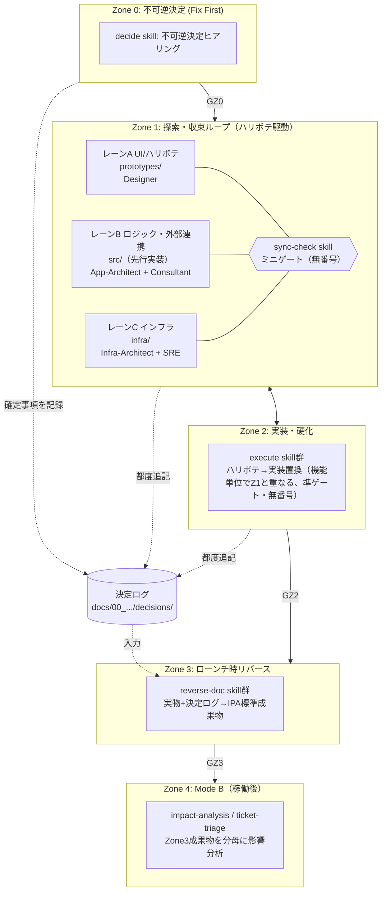
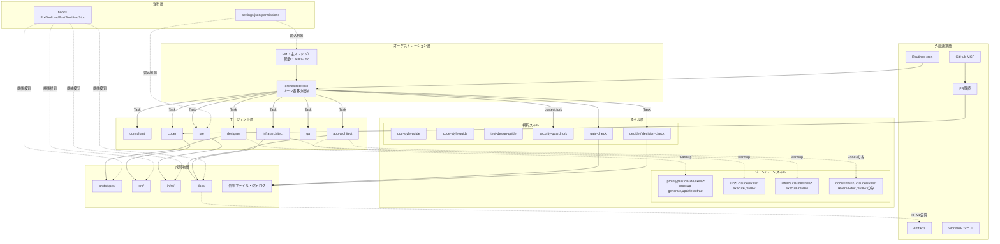
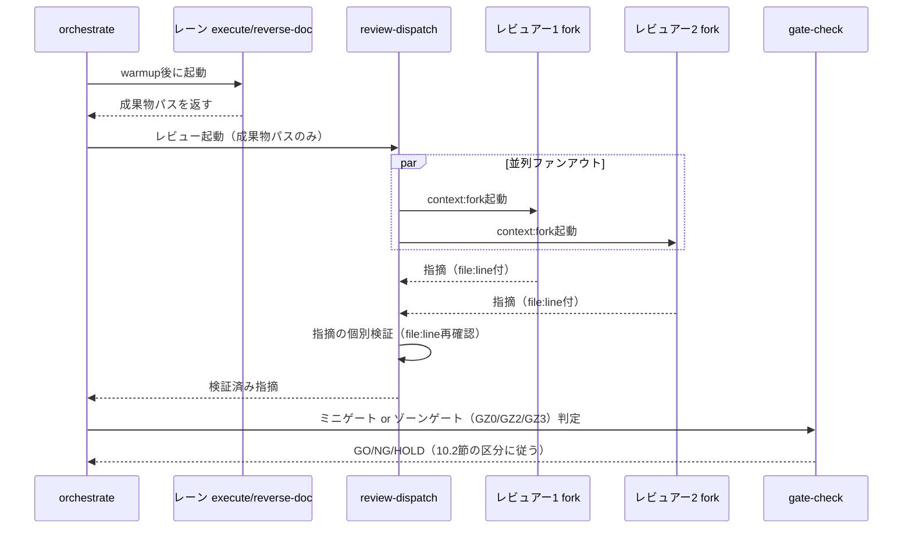
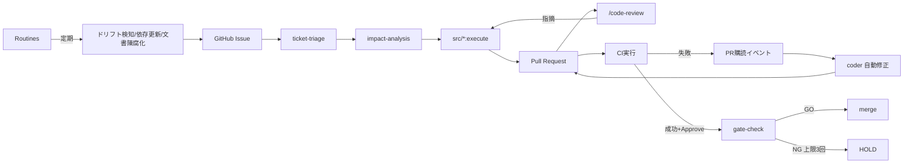

## 改訂履歴

| 版数 | 日付 | 作成者 | 変更内容 |
|---|---|---|---|
| 1.0 | 2026-09-10 | App-Architect | 初版作成（Mode Aをフェーズ順次型として写像） |
| 1.1 | 2026-09-10 | App-Architect | Mode Aのプロセスモデルを「ゾーン/レーン型（ハリボテ駆動＋ローンチ時リバース）」に全面改訂。決定ログ機構・リバース生成エンジンを新設章として追加 |
| 1.2 | 2026-09-10 | App-Architect | 「要件定義前倒しモード」をZone0のプロセス・オプションとして追加。決定ログ機構・リバース生成エンジンへ関連機構を追記（標準構成は変更なし） |
| 1.3 | 2026-09-10 | App-Architect | PM整合レビュー（01文書との突合）の指摘3件を反映。(1)トレーサビリティ起点を`SCR-ID`（画面単位）/`HB-ID`（機能・E2Eシナリオ単位）の二層ID体系に改訂（10.1節）。(2)ゾーンゲートの名称を`GZ0`/`GZ2`/`GZ3`に統一し10.2節・関連箇所へ併記。(3)`docs/`配下00〜07の完全な成果物区分一覧を新設（4.2.1節、annotation基準、旧版の「06_運用・保守」表記を「07_運用・保守」に訂正） |

---

## 1. はじめに

### 1.1 目的

本文書は、aidev フレームワーク自体を Claude Code の最新機構（Skills / Subagents / Hooks / Permissions / Workflow ツール / Agent Memory / PR購読 / Routines 等）の上に再実装するための**実行基盤アーキテクチャ**を定める。対象は aidev という製品（PM エージェントが Consultant / App-Architect / Infra-Architect / Designer / Coder / QA / SRE に委譲し、顧客案件の企画〜納品を支援するファシリテーター・フレームワーク）の内部構造であり、顧客案件個別のアプリケーション設計・インフラ設計ではない。

### 1.2 適用範囲

- `/home/user/aidev/.claude/` 配下の全構成（agents, skills, hooks, commands, settings, templates）
- `docs/` `prototypes/` `src/` `infra/` `tests/` 配下のディレクトリスコープ Skill 配置と、`.claude/docs/10_facilitation/` `.claude/docs/40_standards/` の解体・変換先
- 決定ログ機構、リバース生成エンジン、レビュー・ゲート判定の実行機構
- Mode B（チケット駆動アジャイル）の実行機構
- モデル階層とコスト方針
- v1 → v2 の移行計画

顧客案件そのものの成果物（決定の中身・設計の中身）は対象外である。プロセスの What / なぜ（ゾーン定義、レーン定義、IPA準拠の論理、戻りの承認レベル）は並行して作成される `docs/v2/01_プロセス定義書.md`（以下「01文書」）の責務であり、本文書はそれを Claude Code の機能に**どう写像するか（How）**のみを扱う。

### 1.3 前提: Mode A のプロセスモデル（01文書の要約、本文書はこれを所与とする）

Mode A（0→1 開発）は要件を先に固める直列フェーズ進行ではなく、**HTMLのハリボテを先に出し、会話で機能とUIを決める**。IPA標準成果物は放棄せず、**作成タイミングをローンチ直前に後ろ倒しし、実物から逆生成する**。

| ゾーン | 内容 | 成果物の性質 |
|---|---|---|
| Zone 0: 不可逆決定（Fix First） | 後から変えると手戻りコストが非線形に跳ねる決定のみを先に確定（ドメイン/スコープ外周、法規制・セキュリティ前提、非機能の骨格、アーキテクチャの土台、外部連携の動かせない制約、予算・期限） | 決定ログ（Decision Log）。分厚い企画書は作らない |
| Zone 1: 探索・収束ループ（ハリボテ駆動） | レーンA（UI/ハリボテ・Designer）、レーンB（ビジネスロジック・外部連携・App-Architect+Consultant）、レーンC（インフラ・Infra-Architect+SRE）の3レーン並行。レーン間にミニゲート（同期点） | 記述系文書は作らない。永続化するのは決定と根拠のみ |
| Zone 2: 実装・硬化 | ハリボテが実装に置き換わる。機能単位でZone1と重なる（ある機能はハリボテ、別の機能は実装済み、が正常状態） | コード、IaC |
| Zone 3: ローンチ時リバース | 動く実物＋決定ログからIPA標準成果物（要件定義書・基本設計書・詳細設計書・RTM）をas-built生成。**IPA準拠の担保点はここ** | IPA標準文書一式 |
| Zone 4: Mode B（稼働後チケット駆動） | 既存のチケット駆動アジャイル。Zone 3の成果物が影響範囲分析の分母になる | Issue/PR |

戻り作業はゾーン間・レーン間で常態的に発生することを前提に組む。**戻りは異常ではなく正常系**である。この前提は本文書の強制機構設計（差し戻しカウントの適用範囲、ゲート条件の抑制条件）に直接影響するため、7章・10章で繰り返し参照する。ゾーン間の遷移判定（ゾーンゲート）には正式名称 `GZ0`/`GZ2`/`GZ3` を用いる（10.2節）。

なお、受託契約の形態によっては標準（本節のゾーン型モデル）をそのまま適用できない例外案件があり、その場合にZone0で選択する「プロセス・オプション」の機構は8.4節・9.5節で扱う。**標準側の設計は例外に合わせて歪めない**。

### 1.4 用語

| 用語 | 定義 |
|---|---|
| Skill | `.claude/skills/<name>/SKILL.md`。frontmatter の `description` のみ常時ロードされ、本体は起動時に遅延ロードされる |
| ディレクトリスコープ Skill | 任意のサブディレクトリ配下 `.claude/skills/` に置かれた Skill。そのディレクトリのファイルを読み書きした時点で有効化され、`ディレクトリ:スキル名` の修飾名で呼び出す |
| ウォームアップ | ディレクトリスコープ Skill を呼ぶ前に、対象ディレクトリ配下のファイルを1つ読み込み、Skill を有効化させる操作 |
| `context: fork` | Skill を呼び出し元とは独立したコンテキストで実行する指定 |
| Subagent | `.claude/agents/<name>.md`。`description`/`tools`/`model` を frontmatter で指定できる独立実行コンテキスト |
| Zone / レーン | 1.3節の定義に従う |
| ミニゲート | レーン間同期点。番号を持たない。差し戻し回数カウントの対象外（10.2章） |
| ゾーンゲート（`GZ0`/`GZ2`/`GZ3`） | Zone間の遷移判定。`GZ0`=Zone0→1、`GZ2`=Zone2→3（ローンチ判定）、`GZ3`=Zone3→4（運用定常化・Mode B切替）。差し戻し回数カウントの対象（10.2節） |
| 決定ログ（Decision Log） | Zone 0〜2で生じた不可逆・準不可逆な決定を記録するADR風の台帳（8章） |
| リバース生成 | Zone 3で実物と決定ログからIPA標準成果物をas-built生成する処理（9章） |
| 逆差分 | 実装に存在し文書に存在しない要素 |
| 台帳ファイル | 判定結果・差し戻し回数・承認記録をファイルとして永続化したもの |
| プロセス・オプション | Zone0で選択する進行方式の分岐。標準は `prototype-driven`、契約上の例外は `requirements-first`（8.4節） |
| 要件定義前倒しモード（`requirements-first`） | 要件定義書を契約上の中間検収物としてZone1のうちに執筆する例外的プロセス・オプション。標準（ハリボテ駆動）は歪めない案件単位の選択（8.4節・9.5節） |
| `SCR-{連番}` | 画面1枚粒度のトレーサビリティID。ハリボテHTMLが書かれた時点で機構が採番する。機械抽出（grep）の単位（10.1節） |
| `HB-{連番}` | 機能・E2Eシナリオ1本（複数画面をまたぐ）粒度のトレーサビリティID。レーンA⇔B同期点でQAが採番する。**カバレッジの分母**（10.1節） |

不確かな Claude Code の機能仕様は本文中で「要検証」と明記する。断定はしない。

---

## 2. 設計方針

### 2.1 v1 の機構上の問題

現状の v1 資産を実際に確認した結果を根拠として示す。

| 資産 | 実測 | 問題 |
|---|---|---|
| `CLAUDE.md`（PM定義） | 338行 | フェーズマップ・品質ゲート・読み書き権限表まで**常時全文コンテキストに乗る**。Skill のプログレッシブ・ディスクロージャに相当する遅延ロード機構が無い |
| `.claude/agents/*/AGENT.md` | 合計3,866行（最大 infra-architect 955行） | Task 委譲のたびにサブエージェントの全文がシステムプロンプトとして渡る |
| `.claude/docs/10_facilitation/` | 80ファイル超 | フェーズ順次進行を前提にした「要件定義ヒアリング→設計執筆→…」という記述系文書の執筆ガイド群であり、**ハリボテ駆動モデルとは前提が根本的に異なる**。そのまま移植できない |
| `.claude/docs/40_standards/` | 15ファイル | 「サブエージェントが都度参照する」設計だが、読むか否かが自己申告的 |
| `.claude/hooks/prevent-pm-layer-violation.sh` | `settings.local.json` にのみ登録、`project-structure.json` 不在 | 強制機構が個人設定依存かつ識別子なしの自動検出フォールバックで動作。Coder の正当な `src/` 書き込みまでブロックしうる設計不備を内包 |
| `.claude/skills/review-*` 6種 | `context: fork` 指定なし | レビューの独立性がプロンプト指示依存 |

v1 は「規律」の大半を自然言語命令と Markdown 読解に依存しており、機構による強制は一部かつ配線不備がある。さらに v1 の `10_facilitation` は要件定義書を起点とする直列進行を前提に書かれており、**Mode A のプロセスモデルが変わった以上、その前提ごと組み替える必要がある**。これは単なる Skill 化ではなく、「何を先に確定し、何を後回しにし、何を実物から逆算するか」というプロセスの骨格そのものを実行基盤に落とし込む作業である。

### 2.2 v2 の解決方針

| 課題 | 解決方針 | 主たる機構 |
|---|---|---|
| 常時コンテキストの肥大化 | フェーズ知識・技術標準・ゾーン別手続きをすべて Skill 化し、`description` 以外は起動時のみロードする | Skills のプログレッシブ・ディスクロージャ |
| ロール規律のプロンプト依存 | 「誰が何を書けるか」を宣言的な allow/ask/deny とエージェント単位のツール制限で固定する | Permissions、Subagent `tools`、Hooks |
| 自己レビュー化 | レビューを `context: fork` で必ず独立コンテキスト化する | `context: fork` |
| 標準文書の肥大化 | 技術標準を `user-invocable: false` の自動参照 Skill に変換し、`paths` で発火させる | 自動参照 Skill |
| ゲート判定の自己申告 | 分母・分子を `gate-check` 自身が `grep` して数える | 機械判定 + 台帳ファイル |
| **記述系文書を先に書かせてしまう慣性**（新規） | `docs/02〜04` 配下には `plan`/`execute` Skill を**置かない**。Zone 3到達まで空であることを正常状態として扱い、記述の起点をハリボテと決定ログに一本化する | ディレクトリ構成そのもの（4章）＋ ゾーン対応ゲート（10章） |
| **決定の根拠が消える**（新規） | 「なぜそう決めたか」は実物からは復元できないため、決定ログを Zone 0〜2の生命線として機構的に書き漏らしを検知する | 決定ログ機構（8章） |
| **要件定義書が無い状態でのトレーサビリティ**（新規） | ハリボテの画面確定時点で`SCR-ID`を、レーンA⇔B同期点で`HB-ID`を採番し、これをトレーサビリティの起点として`SCR-ID`/`HB-ID`→E2E→実装の連鎖を機械的に追跡する（二層ID体系、10.1節） | ハリボテ起点トレーサビリティ（10章） |
| **戻りを異常視する統制**（新規） | Zone1内のレーン往復・ミニゲートのNGは差し戻しカウントの対象外とし、ゾーンゲート（`GZ0`/`GZ2`/`GZ3`）のみをカウント対象とする | ゲート設計の階層化（10章） |

**代替案と却下理由**: 「10_facilitation の内容をほぼそのまま `docs/02〜04` の `execute` Skill に移植し、記述の順序だけをZone3側に遅延させる」という保守的な案も検討した。しかし `execute` Skill を `docs/02〜04` に置いた時点で、そのディレクトリのファイルを書く操作が発生しうる導線ができてしまい、「記述先行を作らない」という Zone 1/2 の原則と衝突する。したがって `docs/02〜04` には**生成専用**（`reverse-doc` と `review`）の Skill のみを置き、執筆を行う `execute` に相当する導線は物理的に存在しないという設計を採用する（4章・5章）。この原則には契約上の例外（8.4節・9.5節）があるが、例外は案件単位で明示的に有効化されるものであり、標準の既定構成には影響しない。

---

## 3. 全体アーキテクチャ

### 3.1 ゾーン/レーンとメカニズムの対応



### 3.2 実行基盤レイヤ構成



v1 との最大の違いは、`docs/` が L6 成果物層の中で**Zone3まで空である**点である。これは実装漏れではなく設計上の正常状態であり、7章・9章の hook 設計はこれを前提に「空であることを警告しない」制御を組み込む（ただし8.4節の例外選択時はこの限りでない）。

---

## 4. ディレクトリ構成（v2 レイアウト）

### 4.1 `.claude/` 直下

```
.claude/
├── CLAUDE.md                          # PMの主体定義（150〜180行目安、6章）
├── settings.json                      # permissions + hooks 登録（プロジェクト共有・必須コミット）
├── settings.local.json                # 開発者個人の追加許可のみ
├── agents/
│   ├── consultant.md
│   ├── app-architect.md
│   ├── infra-architect.md
│   ├── designer.md
│   ├── coder.md
│   ├── qa.md
│   └── sre.md
├── agent-memory/
│   └── {agent}/MEMORY.md
├── skills/
│   ├── orchestrate/SKILL.md           # ゾーン遷移の統制（旧: フェーズループの統制）
│   ├── gate-check/SKILL.md            # ゾーンゲート(GZ0/GZ2/GZ3)/ミニゲート判定（10.2節）
│   ├── security-guard/SKILL.md
│   ├── doc-style-guide/SKILL.md
│   ├── code-style-guide/{SKILL.md, languages/*.md}
│   ├── iac-style-guide/{SKILL.md, *.md}
│   ├── test-design-guide/SKILL.md
│   ├── decide/SKILL.md                # Zone0: 不可逆決定ヒアリングと決定ログ起票（8章、新設）
│   ├── decision-check/SKILL.md        # 決定ログのカバレッジ検査（8章、新設）
│   ├── sync-check/SKILL.md            # レーン間ミニゲート、HB-ID採番（5.5節・10.3節）
│   ├── impact-analysis/SKILL.md       # Mode B
│   ├── ticket-triage/SKILL.md         # Mode B
│   └── review-dispatch/SKILL.md
├── hooks/
│   ├── lint-guard.js
│   ├── role-boundary-guard.js
│   ├── gate-transition-guard.js       # ゾーン対応、GZ0/GZ2/GZ3のみ対象（10章）
│   ├── doc-header-guard.js            # as-built必須フィールド検証含む（9章）
│   ├── decision-log-guard.js          # 決定ログ書き忘れ警告（8章、新設）
│   └── artifact-emptiness-guard.js    # Zone3到達までdocs/02〜07（01除く）の空を正常とみなす（4.2.1節・9章。8.4節のプロセス・オプションで抑制を解除）
├── commands/{init,status,next}.md
└── templates/prototype/
```

### 4.2 `docs/` `prototypes/` 直下（ゾーン/レーンの配置）

```
prototypes/                                    # レーンA。第一級の作業ディレクトリ（格上げ）
├── .claude/skills/
│   ├── mockup-generate/SKILL.md               # ハリボテ新規生成（SCR-ID採番を伴う）
│   ├── mockup-update/SKILL.md                 # ハリボテ改修（SCR-ID追随検知・影響HB-ID特定を伴う）
│   └── mockup-extract/SKILL.md                # ハリボテからデータ項目・遷移を抽出しレーンBへ連携
├── SCREEN_ID_INDEX.md                          # SCR-ID（画面単位）採番台帳。機械抽出の起点（10.1節）
├── index.html / design-system.html / {screen}.html
└── mockups/...

docs/
├── 00_プロジェクト管理・ガバナンス/
│   ├── decisions/                              # Zone0〜2 決定ログ（8章、新設）
│   │   ├── .claude/skills/ → 上記 decide / decision-check を参照（ディレクトリスコープではなく横断skill）
│   │   ├── INDEX.md                            # 決定ログ一覧・ID体系
│   │   ├── DL-0000_process-option.md           # プロセス・オプション選択の正本（8.4節、新設）
│   │   └── DL-0001_{タイトル}.md
│   ├── 00-01_成果物構成カタログ.md              # IPA成果物カタログ（Zone3出力先の正本として継続）
│   ├── 00-02_HBトレーサビリティ台帳.md          # HB-ID台帳。経由するSCR-ID一覧を保持（10.1節、新設）
│   ├── 00-12_リスク管理台帳.md
│   ├── 00-13_課題管理表.md
│   ├── 00-14_変更管理台帳.md
│   └── GZ{0,2,3}-99_ゲート記録.md               # ゾーンゲート判定の台帳（10.2節）
│
├── 02_要件定義/                                 # 標準: Zone3到達まで空が正常
│   └── .claude/skills/{reverse-doc,review}/SKILL.md   # execute/planは意図的に置かない（2.2節）
│                                                        # 例外(requirements-first)時のみ execute/plan を追加有効化（8.4節）
├── 03_アプリケーション設計/
│   └── .claude/skills/{reverse-doc,review}/SKILL.md
├── 04_インフラ設計/
│   └── .claude/skills/{reverse-doc,review}/SKILL.md
├── 05_テスト/
│   └── .claude/skills/{reverse-doc,review}/SKILL.md   # HB-ID起点のRTM（10.1節）
├── 06_移行・導入/
│   └── .claude/skills/{reverse-doc,review}/SKILL.md
└── 07_運用・保守/
    └── .claude/skills/{reverse-doc,review}/SKILL.md
```

01番（システム企画相当）は独立ディレクトリを持たない。詳細は次項4.2.1の一覧表を参照。

### 4.2.1 `docs/` 配下の成果物区分一覧（00〜07）

annotationの構成（`00_プロジェクト管理・ガバナンス` / `01_システム企画` / `02_要件定義` / `03_基本設計` / `04_詳細設計` / `05_製造・テスト` / `06_移行・導入` / `07_運用・保守`）を基準とし、v2で名称・構成を変える場合はその理由を併記する。

| 項番 | ディレクトリ名 | annotation基準との異同 | どのゾーンで埋まるか | 配置されるディレクトリスコープSkill |
|---|---|---|---|---|
| 00 | プロジェクト管理・ガバナンス | 同名。`decisions/`（決定ログ、8章）・`00-02`（HB-ID台帳、10.1章）を新設格納する点のみ相違 | 常時（Zone0から蓄積） | 持たない。横断skill（`decide`/`decision-check`/`gate-check`）が直接読み書きする |
| 01 | システム企画 | **v2では独立ディレクトリを持たない**。理由: Zone0は分厚い企画書を作らず決定ログのみを残す設計（1.3節）であり、01番に対応する記述系文書が存在しないため。番号は将来拡張のため欠番として予約する | — | なし |
| 02 | 要件定義 | 同名 | 標準: Zone3まで空。例外（`requirements-first`）時はZone1から（8.4節） | `reverse-doc`, `review`（例外時 `execute`, `plan` を追加） |
| 03 | アプリケーション設計 | annotationの「03_基本設計」を**分割**。理由: v2はApp-Architect/Infra-Architectの責務をトップディレクトリ単位で分離する。これはv1 aidevの既存カタログ（`00-01_成果物構成カタログ.md`、旧`0.1_成果物構成設計.md`）が既に採用していた構成を継承したものであり、annotation（単一プロジェクト・単一アーキテクト）との構成差はaidevがフレームワーク製品であることに起因する | Zone3で生成 | `reverse-doc`, `review` |
| 04 | インフラ設計 | 03の分割相手（上記参照） | Zone3で生成 | `reverse-doc`, `review` |
| 05 | テスト | annotationの「05_製造・テスト」を**「テスト（記述系のみ）」に縮小**。理由: ハリボテ駆動モデルでは「製造」はコード（`src/`, `infra/`）そのものであり文書化しない。RTM（`HB-ID`起点、10.1節）とテスト結果報告書のみをZone3で生成する | Zone3で生成 | `reverse-doc`, `review` |
| 06 | 移行・導入 | 同名 | **Zone3〜Zone4境界**で生成（運用移行の直前。他番号のような「Zone3到達まで空」ではなく、Zone3内でも比較的遅く埋まる） | `reverse-doc`, `review` |
| 07 | 運用・保守 | 同名（前版の本書は誤って「06_運用・保守」と表記していた。annotationの番号順に合わせ本改訂で07に訂正） | Zone3で生成 | `reverse-doc`, `review` |

備考: annotationの「04_詳細設計」は独立したトップ番号を持たない。v2では03/04それぞれの配下に`02_詳細設計/`サブディレクトリとして格納する（v1 aidevの既存カタログが採用していた階層をそのまま踏襲。作るか省略するかの判断基準は01文書のIPA準拠マトリクスに従う）。

**「Zone 3まで空である状態が正常」な項番**: 02（標準時）・03・04・05・07。06（移行・導入）はZone3〜Zone4境界で埋まるためこの集合から除外し、`artifact-emptiness-guard.js`（7.3節#6）の抑制対象からも外す（06の未生成はZone4着手直前に`gate-check`（`GZ3`）が個別に確認する、10.2節）。01は成果物を持たないため対象外。00は常時蓄積が正常であるため対象外。

### 4.3 `src/` / `infra/` / `tests/`（レーンB・レーンC・Zone2）

```
src/
├── frontend/.claude/skills/{execute,review}/SKILL.md   # レーンB（一部レーンA由来のUI実装を含む）
├── backend/.claude/skills/{execute,review}/SKILL.md    # レーンB
└── {mobile,sdk,...}/.claude/skills/{execute,review}/SKILL.md

infra/
└── {cdk,terraform,...}/.claude/skills/{execute,review}/SKILL.md   # レーンC

tests/
├── e2e/        # HB-ID起点のシナリオ。docblockにHB-IDと経由するSCR-IDを記載（qa Subagent、10.1節）
└── integration/
```

`src/` `infra/` に `plan` Skill を置かない点が v1（4章の当初案）およびannotationとの違いである。Zone1/2ではモジュール分解の計画立案という独立工程を置かず、ハリボテ・決定ログ・インフラ制約の3者を突き合わせながら直接実装に入り、計画に相当する判断は `sync-check`（ミニゲート）と決定ログが代替する。これは「記述系文書を先に作らない」という2.2節の原則を実装Skillの構成そのものに反映したものである。

**設計判断（ジェネリック性の担保、継続）**: `docs/00-01_成果物構成カタログ.md`（旧 `0.1_成果物構成設計.md`）はプロジェクト非依存のIPA成果物カタログとして引き続き正本とする。フェーズ順次からゾーン型に変わっても、「最終的にどのIPA文書を何本出すか」というカタログ自体は不変であるため、これを Zone 3 の `reverse-doc` 群の出力先カタログとして再利用する。これにより4.1節で述べた代替案A（Skillのプロジェクトごと動的生成）を依然として不要にできる。

**例外（契約上の前倒し）**: 受託契約で要件定義書を中間検収物とする案件では、Zone0のプロセス・オプション選択（8.4節）により `docs/02_要件定義/` に限り `execute`/`plan` Skillが追加有効化され、Zone1のうちに執筆できるようになる。これは標準構成に対する**案件単位の例外**であり、本節で示した標準構成（`reverse-doc`/`review` のみ）自体は変更しない。他のIPA成果物ディレクトリ（`03_アプリケーション設計/` 等）は例外選択時も標準どおりZone3まで生成しない。

---

## 5. スキル設計一覧

### 5.1 横断スキル（`.claude/skills/`、常設）

| 名前 | 配置先 | frontmatter主要設定 | 責務 | 呼び出し元 | 連携先 |
|---|---|---|---|---|---|
| orchestrate | `.claude/skills/orchestrate/SKILL.md` | `disable-model-invocation: true` | ゾーン遷移・ミニゲート・ゾーンゲート（`GZ0`/`GZ2`/`GZ3`）の統制 | PM | 各レーンSkill、`decide`、`gate-check`、`review-dispatch` |
| decide | `.claude/skills/decide/SKILL.md` | `argument-hint` | Zone0の不可逆決定ヒアリングと決定ログ起票（プロセス・オプションの選択もここで確定、8.4節）。Zone1/2進行中の追加決定の起票も担う | orchestrate、各エージェント（決定発生時） | 決定ログ（8章） |
| decision-check | `.claude/skills/decision-check/SKILL.md` | `context: fork` | 決定ログのカバレッジ検査、`process-option.json`との同期検査（8.4節） | orchestrate（ミニゲート/ゾーンゲート時） | gate-check |
| sync-check | `.claude/skills/sync-check/SKILL.md` | `argument-hint` | レーンA/B/Cのミニゲート整合確認、通過時の`HB-ID`採番と`00-02`台帳登録（5.5節・10.3節） | orchestrate（レーン同期時） | gate-check、`docs/00_.../00-02` |
| gate-check | `.claude/skills/gate-check/SKILL.md` | `argument-hint` | ミニゲート/ゾーンゲート（`GZ0`/`GZ2`/`GZ3`）の機械判定。ゾーンに応じて判定基準を切り替える（10章） | orchestrate | 台帳ファイル |
| security-guard | `.claude/skills/security-guard/SKILL.md` | `context: fork` | コンプライアンス検査 | orchestrate | qa |
| doc-style-guide | `.claude/skills/doc-style-guide/SKILL.md` | `user-invocable: false` | 文書ヘッダー・語調・構成規約（as-built必須フィールド含む） | `reverse-doc`系（自動） | — |
| code-style-guide | `.claude/skills/code-style-guide/` | `user-invocable: false`, `paths` | コーディング規約 | `src/**` の execute/review（自動） | — |
| iac-style-guide | `.claude/skills/iac-style-guide/` | `user-invocable: false`, `paths` | IaC規約 | `infra/**` の execute/review（自動） | — |
| test-design-guide | `.claude/skills/test-design-guide/SKILL.md` | `user-invocable: false`, `paths` | 試験レベル責務分担・ID体系（分母が`HB-ID`、機械抽出単位が`SCR-ID`である二層ID体系を明記、10.1節） | qa、gate-check | — |
| impact-analysis | `.claude/skills/impact-analysis/SKILL.md` | `argument-hint` | Mode B: チケットの影響範囲特定（分母はZone3成果物） | orchestrate（Mode B） | `src/{layer}:execute` |
| ticket-triage | `.claude/skills/ticket-triage/SKILL.md` | `argument-hint` | Mode B: Issueの一次仕分け | orchestrate（Mode B） | impact-analysis |
| review-dispatch | `.claude/skills/review-dispatch/SKILL.md` | `disable-model-invocation: true` | クロスレビューの並列ファンアウトと指摘検証（11章） | orchestrate | Workflow、各`review`、gate-check |

### 5.2 レーンA: `prototypes/.claude/skills/`（新設・厚め設計）

ハリボテは v1/annotation では Designer の補助成果物（基本設計の下位工程）だったが、v2 では**合意形成の主媒体**として第一級に格上げする。そのため3つのSkillに分割し、それぞれの責務を明確化する。

| 名前 | 責務 | 入力 | 出力 | frontmatter |
|---|---|---|---|---|
| mockup-generate | 対話しながら新規画面のHTMLハリボテを生成する。決定ログ（Zone0の制約）とdesign-system.htmlのパターンに従う | ユーザーとの会話、決定ログ | `{screen}.html`、`SCREEN_ID_INDEX.md` への新規`SCR-ID`追記 | `disable-model-invocation: true`, `argument-hint: "[画面名 or all]"` |
| mockup-update | 既存ハリボテの改修。改修に伴う`SCR-ID`・入力項目の変化を検知し、その`SCR-ID`を経路に含む`HB-ID`を`00-02`台帳から逆引きして特定した上で、影響を受けるレーンB（データモデル）・E2Eシナリオへの波及を警告する | 変更依頼、既存HTML | 更新後HTML、`SCR-ID`変更差分レポート、影響`HB-ID`一覧 | `argument-hint: "[画面名]"` |
| mockup-extract | 確定したハリボテからデータ項目（入力フィールド名・型のヒント）・画面遷移条件を抽出し、レーンB向けの構造化データ（決定ログまたは一時メモ）として出力する。抽出対象画面の`SCR-ID`が`00-02`台帳の`HB-ID`経路に未紐付けであれば警告する。**記述系文書は生成しない**、あくまでレーンB/Cへの引き渡し用データの抽出に限る | 確定済みHTML一式 | 抽出データ（画面遷移表、入力項目一覧の中間データ） | `disable-model-invocation: true`, `argument-hint: "[画面名 or all]"` |

`mockup-extract` の出力は「記述系文書」ではなく「レーン間の受け渡しデータ」という位置づけである点に注意する。これは2.2節の原則（docs/02〜04には記述系文書を作らない）を守りながら、レーンA→レーンBの情報伝達を機構的に行うための設計であり、実体は決定ログのサブフォーマット（`DL-xxxx_screen-data-{screen}.md`）として `decisions/` 配下に保存し、後述の `sync-check`（ミニゲート）が読む。

### 5.3 レーンB/C: `src/{layer}/`・`infra/{layer}/.claude/skills/`

| 名前 | 責務 |
|---|---|
| execute | ハリボテ・決定ログ・インフラ制約を直接の入力として実装する。規約準拠実装＋UT（レーンB）／IaC実装（レーンC） |
| review | `context: fork`。実装可能性・規約準拠・決定ログとの整合を検証 |

### 5.4 Zone3: `docs/{02〜07}/.claude/skills/`（01を除く。4.2.1節参照）

| 名前 | 責務 |
|---|---|
| reverse-doc | 実物（コード/IaC/ハリボテ）＋決定ログからIPA標準成果物をas-built生成する。9章で詳述（`docs/02_要件定義/` は例外選択時、9.5節の差分検査モードを先に実行） |
| review | `context: fork`。生成物の完全性・決定ログとの整合・逆差分の有無を検証 |

### 5.5 Zone境界のミニゲートSkill

| 名前 | 配置先 | 責務 |
|---|---|---|
| sync-check | `.claude/skills/sync-check/SKILL.md`（横断、対象パスを引数で受け取る） | レーンA（画面項目）とレーンB（データモデル）の機械的突合、レーンC（インフラ制約）との整合確認（10.3節）。**整合が確認できた時点で`HB-ID`を採番し、経由する`SCR-ID`一覧とともに`00-02`台帳へ登録する（QA実施）**（10.1節） |

---

## 6. エージェント設計

### 6.1 v2 エージェント一覧

| エージェント | 役割 | tools | model | agent-memory | 起動元 |
|---|---|---|---|---|---|
| consultant | Zone0ヒアリング支援、ビジネス整合レビュー（成果物なし） | Read, Grep, Glob, Skill | Sonnet 5 | なし | orchestrate |
| app-architect | レーンB主担当、Zone3 `reverse-doc`（アプリ系）の主担当 | Read, Write, Edit, Grep, Glob, Skill, TodoWrite | Opus 5（Zone3生成はSonnet 5、13章） | あり | orchestrate |
| infra-architect | レーンC主担当、Zone3 `reverse-doc`（インフラ系）の主担当 | Read, Write, Edit, Grep, Glob, Skill, TodoWrite | Opus 5（Zone3生成はSonnet 5） | あり | orchestrate |
| designer | レーンA主担当（ハリボテ生成・改修） | Read, Write, Edit, Grep, Glob, Skill | Sonnet 5 | あり | orchestrate |
| coder | Zone2実装（ハリボテ→実装置換） | Read, Write, Edit, Bash, Grep, Glob, Skill, TodoWrite | Sonnet 5 | あり | orchestrate、PR購読 |
| qa | 試験設計・実装・十分性レビュー（実装者から独立）、レーンA⇔B同期点での`HB-ID`採番（10.1節）、Zone3 `traceability-reverse`（`HB-ID`から正式要件IDへの変換を含むRTM生成、9章） | Read, Write, Edit, Bash, Grep, Glob, Skill, TodoWrite | Sonnet 5 | あり | orchestrate |
| sre | レーンCの構築実務、運用移行 | Read, Write, Edit, Bash, Grep, Glob, Skill, TodoWrite | Sonnet 5（本番deployのみOpus 5判断） | あり | orchestrate |

レビュー実行時は既存ロールをそのまま用い、`context: fork` で独立コンテキスト化する（v1版の6.2節の判断を維持）。

### 6.2 PMを痩せさせる方法（維持）

v1のCLAUDE.md（338行）のうち、フェーズマップ・ゲート詳細・クロスレビュー詳細・読み書き権限詳細は `orchestrate` Skillと`settings.json`に移す。CLAUDE.mdに残すのは3層原則、ゾーンマップ（表のみ簡略）、ユーザー対話原則、「まず `/orchestrate` を起動する」導線のみとし、150〜180行を目安とする。**この分離が v2 最大のコンテキスト削減レバーである**点は変わらない。

---

## 7. 規律の強制機構

### 7.1 permissions（`settings.json`）

| 主体 | 対象パターン | allow/ask/deny | 理由 |
|---|---|---|---|
| 全体（既定） | `Write`, `Edit` (`docs/02_**`, `docs/03_**`, `docs/04_**`, `src/**`, `infra/**`, `tests/**`) | deny | PMの主スレッドからの直接編集を防ぐ既定値 |
| 全体（既定） | `Write`, `Edit` (`docs/00_プロジェクト管理・ガバナンス/**`, `.claude-state/**`) | allow | PMの決定ログ起票補助・進捗記録、QAの`HB-ID`台帳登録 |
| 全体（既定） | `Bash(terraform destroy *)`, `Bash(cdk destroy *)`, `Bash(git push --force*)`, `Bash(git reset --hard*)` | deny | 破壊的操作の恒久禁止 |
| sre | `Bash(*apply*env=prod*)`, `Bash(*deploy*env=prod*)` | ask | 本番デプロイは人間承認必須 |
| sre | `Bash(terraform plan*)`, `Bash(cdk diff*)`, `Bash(*apply*env=dev*)` | allow | dry-run・非本番は自律実行可 |
| 全体（既定） | `Read(.env)`, `Read(**/*secret*)` | deny | シークレット漏洩防止 |
| coder / qa | `Bash(npm test*)`, `Bash(pytest*)`, `Bash(npm run build*)` | allow | 開発ループの自律実行 |

### 7.2 Subagent 単位のツール制限

consultant に `Write`/`Edit` を持たせない、レビュー実行時（`context: fork` 内の各ロール）に `Write`/`Edit` を持たせない、`gate-check`・`decision-check` を `Read`/`Grep`/`Glob` のみとする方針は v1版から維持する（6章参照）。

### 7.3 Hooks 一覧

| # | Hook名 | イベント | 検知内容 | 動作 | 実装方針 |
|---|---|---|---|---|---|
| 1 | `lint-guard.js` | `PostToolUse`（Edit\|Write） | 機械判定可能な規約違反 | `exit 2` | annotation方式を継続 |
| 2 | `role-boundary-guard.js` | `PreToolUse`（Edit\|Write） | ロール境界違反（対象パスに `prototypes/**`, `docs/00_.../decisions/**` を追加） | `exit 2` | アクティブエージェント方式（7.4） |
| 3 | `gate-transition-guard.js` | `PreToolUse`（ゾーンゲート`GZ0`/`GZ2`/`GZ3`相当の操作） | ゾーンゲート未通過での次ゾーン着手 | `exit 2` | ミニゲートには適用しない（10.2節で区別）。台帳ファイルをgrep |
| 4 | `doc-header-guard.js` | `PostToolUse`（Write, `docs/**/*.md`） | doc-style-guide必須ヘッダー、`生成区分: as-built` フィールドの欠落 | `exit 2` | 9章参照。例外選択時の前倒し要件定義書には`as-built`フィールドを要求しない（9.5節） |
| 5 | `decision-log-guard.js`（新設） | `PostToolUse`（Edit\|Write, アーキテクチャ関連パターン: `infra/**`, `src/**/schema.*`, `prototypes/**` の新規画面、外部連携設定） | 対応する決定ログが直近に追記されていない変更 | **警告のみ（exit 0、stderrに警告表示）**。ブロックしない | 8章で詳述。ブロックしない理由も8章に明記 |
| 6 | `artifact-emptiness-guard.js`（新設） | 定期実行（Routine）または `PostToolUse`（`docs/00-01_成果物構成カタログ.md` の完全性走査） | `docs/02〜07`（01を除く。区分別のゾーン対応は4.2.1節の一覧表を参照。06_移行・導入はこの抑制対象から除外し別枠で扱う）のIPA成果物カタログ上の未生成項目 | `.claude-state/current-zone.json` の `zone` が3未満、かつ `.claude-state/process-option.json` の `mode` が `prototype-driven`（標準）なら**検知そのものを抑制**（通知しない）。`zone`が3以上、または`mode`が`requirements-first`（前倒し例外）なら通常どおり警告する | 9章・8.4節・4.2.1節参照 |

### 7.4 ロール境界の機構化とその限界（維持、対象パス更新）

v2でも `active-agent.json` 方式（`orchestrate` がTask起動直前に現在のロールを記録し、`role-boundary-guard.js` がこれと許可パス表を突き合わせる）を採用する。**要検証**: hookイベントペイロードに呼び出し元Subagentの識別子が含まれるか。含まれない場合のフォールバックとしてこの方式を用いる点、および「更新漏れに対して脆弱」という限界を認める点は v1版から変更しない。

新たに、`decisions/` と `prototypes/` がロール境界の対象パスに加わる。`decisions/` への書き込みは `decide` Skill 経由（実質どのエージェントからも起票可能だが、必ずSkillを介す）に限定し、直接の素のWriteでの決定ログ作成は境界表で拒否する（フォーマット・ID採番の一貫性を保つため）。

---

## 8. 決定ログ機構

決定ログは本方式（ハリボテ駆動＋ローンチ時リバース）の生命線である。実物は後から読めるが「なぜそう決めたか」は後から復元できない。9章のリバース生成エンジンは決定ログを主要な入力源とするため、書き漏れは Zone 3 の成果物の欠落に直結する。

### 8.1 ファイル形式とID体系

- 配置: `docs/00_プロジェクト管理・ガバナンス/decisions/DL-{4桁連番}_{タイトルkebab}.md`
- ID体系: `DL-0001` 通し番号。画面データ抽出等の中間データ（5.2節の `mockup-extract` 出力）も同一体系内のサブタイプとして採番する（例: `DL-0032_screen-data-upload.md`）。トレーサビリティ用の `SCR-ID`（画面単位）・`HB-ID`（機能単位）は別体系であり、決定ログのIDとは混同しない（10.1節）
- 記載項目: 決定内容 / 背景・検討した代替案とその却下理由 / 影響レーン（A/B/Cのどれに波及するか） / **不可逆度**（高: Zone0確定・覆す場合はゾーンゲートの差し戻し扱い／中: Zone1で覆せるがミニゲート再承認が必要／低: Zone2以降でも軽微修正可） / 状態（確定/仮/覆った） / 決定日時 / 決定に関与したロール

不可逆度の区分ラベルと承認レベルの正確な定義は01文書に従う。本文書ではこれをファイルのfrontmatterフィールドとして機構的に扱えるようにする、という実装上の受け皿のみを定義する。

### 8.2 書き忘れを機構で防ぐ方法

3段構えとする。いずれも完全な機構化ではなく、確実性の異なる複数の網を重ねる設計とする。

| 段 | 機構 | 確実性 | 内容 |
|---|---|---|---|
| 1 | `decision-log-guard.js`（PostToolUse） | 中（パターンマッチに依存） | アーキテクチャに関わるファイル変更（`infra/**`、`src/**/schema.*`、`prototypes/**` の新規画面ファイル、外部連携設定ファイル等）を検知した際、直近の決定ログ更新時刻と比較し、対応するエントリが無ければ**警告**する。**あえてブロックしない**。決定ログを書くべきかの判断自体にエージェントの裁量が必要な場面が多く、機械的な `exit 2` は誤検知（些末な変更まで止める）のコストが高いと判断したためである。これは代替案として「ブロックする」案も検討したが、Zone1のハリボテ反復のような高頻度・低コストの変更にまでブロックが効くと、ハリボテ駆動という速度重視のプロセス自体を阻害するため、**警告に留める**という設計判断を明示的に採る（トレードオフ: 見逃しリスクは残るが、Zone1の速度を優先） |
| 2 | Stop hook によるセッション終了時チェック | 低〜中（要検証） | セッション中に変更されたファイル一覧（`git diff` 相当）と決定ログの追記を突き合わせ、パターンに該当するのに記録が無い変更を「未記録の決定」としてPMに一覧提示する。**要検証**: Stop hookの実行タイミングでgitワーキングツリーの差分を確実に取得できるか、Stop hook自体がこの用途で利用可能な仕様か |
| 3 | `decision-check` Skill（ミニゲート/ゾーンゲート時） | 高（ゲートを通らない限り先に進めない） | `gate-check` がミニゲート/ゾーンゲート（`GZ0`/`GZ2`/`GZ3`）を判定する際、`decision-check` の結果（1・2段の警告が未解消のまま残っていないか）を条件の一つとして確認する。ここで初めて「先に進めない」という強い制約になる |

1・2段は「気づかせる」機構、3段目でようやく「止める」機構になるという段階設計であり、Zone1の速度を殺さずに書き漏れの実害（Zone3での欠落）を防ぐという設計意図を持つ。

### 8.3 Zone3での消費

`reverse-doc` Skillは決定ログを読み、IPA成果物の「設計判断・根拠」「トレードオフ」節に**転記**する（生成ではなく転記）。決定ログに存在しない判断は「未記載」と明記し、実装から推測して後知恵の作文をしない（annotationの `reverse-doc` 原則を踏襲、9章）。

### 8.4 プロセス・オプションの記録と分岐（要件定義前倒しモード）

受託契約によっては「要件定義書を中間成果物として検収する」ことが契約条件になる案件があり、その場合は標準（ハリボテ駆動＋ローンチ時リバース）をそのまま適用できない。01文書が定めるこの例外を、実行基盤では**Zone0で選択するプロセス・オプション**として扱う。**標準側の設計（Zone3集約のリバース生成）は歪めない**。例外を選んだ案件だけが追加の振る舞いを持つ、という構成を取る。

**保持場所**: 選択そのものは決定ログの正本エントリ（`docs/00_.../decisions/DL-0000_process-option.md`、不可逆度: 高、Zone0で確定）に記録する。ただし hook / gate はMarkdownを都度解析するコストと精度の問題を避けるため、この決定ログの内容を**機械可読な鏡ファイル**`.claude-state/process-option.json`（例: `{"mode": "prototype-driven" | "requirements-first", "decided_by": "DL-0000", "since": "<timestamp>"}`）にミラーし、hook / `gate-check` はこちらを参照する。決定ログが正本、鏡ファイルは実行時参照用のキャッシュという位置づけであり、`current-zone.json`・`active-agent.json`（7.4節・9.2節）と同じ設計パターンを踏襲する。

**分岐する振る舞い**:

| 機構 | `prototype-driven`（標準） | `requirements-first`（前倒し例外） |
|---|---|---|
| `artifact-emptiness-guard.js`（7.3節#6） | Zone3未到達の`docs/02_要件定義`の空を正常として抑制 | **抑制を無効化**。Zone1開始時点で`docs/02_要件定義`が埋まっていることを期待し、未着手なら通常どおり警告する |
| `docs/02_要件定義/.claude/skills/` | `reverse-doc`/`review`のみ（4.2節） | `execute`/`plan`を追加で有効化し、Zone1のうちに執筆できるようにする（`doc-style-guide`は変わらず自動適用） |
| Zone3の`docs/02_要件定義`向け`reverse-doc` | 通常生成 | 9.5節の**差分検査モード**を先に実行する |
| `doc-header-guard.js`（7.3節#4） | `docs/02_要件定義`配下の生成物に`as-built`を要求 | 前倒し要件定義書自体には`as-built`を要求しない（9.5節） |

**トレードオフ**: 鏡ファイル方式は7.4節・9.2節のアクティブエージェント方式と同じ限界（決定ログとの同期漏れ）を持ち込む。これを避けるため、`decision-check`（本章既出）の検査項目に「`process-option.json`が対応する決定ログエントリ（`DL-0000`）と一致していること」を追加し、不一致はゾーンゲートでブロックする。この同期検証の機械的な検出限界は15章の要検証項目として扱う。

---

## 9. リバース生成エンジン（Zone 3）

Zone 3 は「片手間の逆生成」ではなく、**IPA準拠を担保する主要機構**として設計する。

### 9.1 入力→出力対応表

| 入力 | 出力（IPA成果物） | 生成主体 |
|---|---|---|
| `src/backend/`, `src/frontend/` のコード | ソフトウェア構成図、API設計書（IF部分）、論理データモデル（実体部分）（03番） | app-architect の `docs/03_.../reverse-doc` |
| `infra/`（CDK/Terraform） | AWS構成設計書、ネットワーク構成図（04番） | infra-architect の `docs/04_.../reverse-doc` |
| `prototypes/` 確定版 ＋ `SCREEN_ID_INDEX.md`（`SCR-ID`） | 画面設計書（画面一覧・画面遷移図・画面レイアウト）（03番） | designer の `docs/03_.../reverse-doc` |
| `tests/e2e/`（`HB-ID`のdocblock）＋`docs/00_.../00-02_HBトレーサビリティ台帳.md` | RTM（`HB-ID`を正式要件IDへ変換したトレーサビリティマトリクス）（05番） | qa の `docs/05_.../traceability-reverse` |
| `docs/00_.../decisions/` 全件 | 各設計書の「設計方針・判断根拠・トレードオフ」節、要件定義書の背景・制約・スコープ | 各 `reverse-doc` が該当ログを引用・転記（新規生成しない） |
| Git履歴（コミットログ、PR、Issue）＋決定ログ（移行関連）＋`infra/`のデプロイ設定 | 変更履歴、体制・スケジュール実績、移行計画書・手順書骨格（06番） | orchestrate が `git log` を集計／infra-architect・sreの `docs/06_.../reverse-doc` |
| コード・IaC・決定ログの統合ビュー | 運用手順書骨格（07番） | sreの `docs/07_.../reverse-doc` |

例外選択時（`process-option.json` の `mode` が `requirements-first`）は、`docs/02_要件定義/` のみ入力の一部が反転する。実物から生成する代わりに、Zone1で前倒し執筆済みの要件定義書そのものが既に存在するため、9.5節の差分検査モードがこれを扱う。

### 9.2 `生成区分: as-built` の強制

`doc-style-guide` の文書ヘッダーテンプレートに `生成区分: 実装反映(as-built)` を必須フィールドとして追加する。`doc-header-guard.js`（7.3節#4）はこのフィールドの有無を機械チェックする。加えて、`reverse-doc` Skill 経由で生成されたことを示す `.claude-state/active-skill.json` 的なマーカー（`decision-log-guard` と同様のアクティブ状態記録方式）を用いて、`reverse-doc` を経由せず直接 `docs/02〜07` に書き込まれたファイルを識別し警告する。**この識別方式は7.4節のアクティブエージェント方式と同じ限界（更新漏れへの脆弱性）を持つことを明記する**。

なお、前倒し要件定義書（9.5節）は実装に先行して書かれた正真の事前設計文書であるため、この`as-built`フィールドを付与しない。付与するのは9.5節の突合レポートのみであり、両者を混同しないよう`reverse-doc`実行時にモード表示を明示する。

### 9.3 正確性の担保

1. **差分検査モード**: `reverse-doc` を引数無しで起動した場合、生成せずに既存文書と実装のズレの一覧のみを出す（annotation方式を踏襲）
2. **逆差分検出**: 実装に存在し文書に無い要素（ルート、APIエンドポイント、画面）が0件であることをゾーンゲート条件に組み込む（10章）。画面の逆差分は`prototypes/`の`SCR-ID`総数と実装側ルーティング定義の画面数を突き合わせて検出する（10.1節）
3. **未記載の明示**: 決定ログに根拠が無い判断は「未記載」と明記し `00-13_課題管理表.md` へ登録する。実装からの推測で埋めることを禁止する

### 9.4 分割生成と中断耐性

Zone 3 は一括で生成する成果物の量が多く、長時間セッションになりやすい。annotationの `qa-engineer` 運用（「1件判明するごとに即座にファイルへ追記する。まとめ書きは中断で全損する」）と同じ教訓を踏まえ、`reverse-doc` 系Skillは以下を実行方針としてSKILL.md本文に明記する。

- 出力先ファイルは着手前に決め、冒頭に見出しだけ作ってから埋める
- 1セクション判明するごとに即座に追記する。セッション最後にまとめて書かない
- 中断時に再開できるよう、生成対象文書の一覧と進捗状態を `docs/00_.../00-01_成果物構成カタログ.md` に生成済みマーク欄として追記する

### 9.5 差分検査モード: 前倒し版とas-built版の突合（要件定義前倒しモードのみ）

`.claude-state/process-option.json` が `requirements-first` のとき、Zone1のうちに契約上の中間成果物として要件定義書（`docs/02_要件定義/`）が既に存在する。Zone3のリバース生成は、この前倒し文書をいきなり上書きしてはならない（検収済みの契約成果物であるため）。そこで `docs/02_要件定義/.claude/skills/reverse-doc` は、`process-option` が `requirements-first` の場合に限り、通常の生成に先立って以下の差分検査を行う。この節は9.3節の一般的な「差分検査モード」を、前倒し例外に特化して拡張したものである。

**手順**:

1. 前倒し要件定義書の各項目（機能要件・非機能要件等）を読み込む
2. 実物（コード・ハリボテ・決定ログ）から同じ項目をas-built生成する（ただし既存ファイルへは書き込まない。一時的な比較用データとして保持する）
3. 両者を突き合わせ、次の判定表を出力する

| 項番 | 前倒し版の記述 | 実物（as-built） | 判定 |
|---|---|---|---|
| F-012 | 「CSVエクスポート機能を持つ」 | 実装に存在しない | 文書のみ（未実装） |
| F-018 | （記載なし） | `/api/v1/notifications` が実在 | 実装のみ（契約外の追加） |
| F-020 | 「同時アクセス100ユーザーまで」 | 非機能要件として実測未検証 | 一致（検証待ち） |

**判定後のフロー**: 判定が「文書のみ」「実装のみ」の項目は、契約成果物の変更を伴いうるため `reverse-doc` が自動で前倒し文書を書き換えることはしない。`docs/00_.../00-14_変更管理台帳.md` へCRとして起票し、PM経由でユーザー（発注者）の承認を得た上で、承認された変更のみを前倒し文書側に反映する。この点は9.2節の「`reverse-doc`はas-builtとして自由に生成・上書きしてよい」という標準側の原則の**例外**であり、混同しないよう `reverse-doc` 実行時にどちらのモードで動作しているかを明示する。

**出力先**: 突合レポートは `docs/02_要件定義/02-99_前倒し版差分検査レポート.md` として出力し、9.2節の通り**このレポートにのみ** `生成区分: 実装反映(as-built)` を付与する（前倒し要件定義書本体には付与しない）。

---

## 10. トレーサビリティとゲート・レーン同期の実行機構

### 10.1 トレーサビリティの起点（二層のハリボテ起点ID）

v1（annotation含む）は要件ID・画面遷移IDを要件定義書・基本設計書から採番していたが、Zone3までこれらの文書が存在しないため（標準構成の場合）、**トレーサビリティの起点をハリボテ側の二層のIDに置く**。画面1枚の粒度とE2Eシナリオ1本の粒度は一致しない（1つのE2Eシナリオが複数画面をまたぐことが常態）ため、単一のID体系では「機械抽出の単位（画面単位でなければ成立しない）」と「カバレッジの分母（シナリオ単位でなければ成立しない）」の両方を同時に満たせない。したがって次の二層とする。

| ID | 粒度 | 採番者・タイミング | 用途 | 台帳 |
|---|---|---|---|---|
| `SCR-{連番}` | 画面1枚 | ハリボテHTMLが書かれた時点で機構（PostToolUse hook）が採番 | 機械抽出の単位。入力項目・遷移条件の抽出元。`grep`で数えられる | `prototypes/SCREEN_ID_INDEX.md` |
| `HB-{連番}` | 機能／E2Eシナリオ1本（複数画面をまたぐ） | レーンA⇔B同期点（ミニゲート、10.3節）通過時にQAが採番 | **カバレッジの分母**。1件が複数の`SCR-ID`を経路として参照する | `docs/00_.../00-02_HBトレーサビリティ台帳.md` |

```
prototypes/SCREEN_ID_INDEX.md（SCR-ID採番、画面単位）
   ↓ mockup-extract が入力項目・遷移条件を抽出
   ↓ レーンA⇔B同期点（sync-check）通過時、QAがシナリオ単位でHB-IDを採番
     （1つのHB-IDが複数のSCR-IDを経路として参照する）
docs/00_.../00-02_HBトレーサビリティ台帳.md（HB-ID台帳、SCR-ID経路を保持）
   ↓
tests/e2e/*.spec.ts の docblock（HB-IDと、経由するSCR-IDの両方を記載）
   ↓ 実装（src/）
Zone3: reverse-doc がHB-ID起点のRTMを生成し、正式な要件IDへ変換する（qa の docs/05_.../traceability-reverse）
```

画面が確定した時点（`mockup-generate`/`mockup-update` によりHTMLが書かれ、`SCREEN_ID_INDEX.md` に`SCR-ID`が追記された時点）で機構的に採番する。これを機械的に強制するため、`prototypes/` への Write を検知する `PostToolUse` hook（`lint-guard.js` の拡張、または専用hook）が、新規画面HTMLの追加を検知した際に `SCREEN_ID_INDEX.md` への対応エントリの有無を確認し、無ければ警告する。

`HB-ID` はこれとは別のタイミングで採番される。レーンA（画面）とレーンB（ロジック）が一連の機能として同期を取れた時点（ミニゲート通過時）に、QAがそのシナリオが経由する `SCR-ID` の一覧を `00-02_HBトレーサビリティ台帳.md` へ束ねて記録し、`HB-ID` を1件採番する（5.5節）。**この採番はミニゲート自体の合否条件ではない**。10.2節のとおりミニゲートは差し戻しカウント対象外の反復ポイントであり、`HB-ID` 採番はそこに付随する記録作業に過ぎない。

**ID追随の検知**: `mockup-update` はハリボテ改修時に `SCR-ID`・入力項目の変化（追加/削除/リネーム）を検出し、その `SCR-ID` を経路に含む `HB-ID`（`00-02`台帳を逆引き）を特定した上で、対応する `tests/e2e/` のシナリオ・`src/` のデータモデルへの影響を一覧化してユーザー/PMに提示する。これは `impact-analysis` のZone1版に相当する軽量な影響分析であり、Mode Bの `impact-analysis` と実装を共有する。

**gate-checkがトレーサビリティを判定する際の分母・分子**は、ゾーンによって切り替わる。

| ゾーン | 分母 | 分子 |
|---|---|---|
| Zone 1〜2 | `00-02`台帳に登録された`HB-ID`全件（`requirements-first`選択時は前倒し要件定義書の要件IDも分母に加わる、8.4節） | `tests/e2e/*.spec.ts`のdocblockに記載された`HB-ID`。`skip`/`fixme`/握りつぶしは分子に数えない |
| Zone 3以降 | Zone3で生成されたRTM（`HB-ID`から変換された正式な要件ID起点、9.1節の`traceability-reverse`出力） | 同上（要件ID化後） |

`SCR-ID` はカバレッジの分母には使わない。その代わり、9.3節の逆差分検出（実装にあって設計に無い要素の検出）の材料として使う。`prototypes/`に存在する`SCR-ID`の総数と、実装（`src/frontend/`のルーティング定義）に存在する画面ルートの総数を突き合わせ、ハリボテには無いのに実装だけに存在する画面（逆差分）を検出する。「機械抽出の単位（`SCR-ID`）」と「分母の単位（`HB-ID`）」を1つのIDで兼務させると、E2Eシナリオが複数画面をまたぐ場合に分母が成立しない、という問題を二層化によって解消している。分母のソースがゾーンごとに切り替わるという設計自体が、要件定義書が存在しない期間でもトレーサビリティ判定を機能させるための中心的な工夫である。

### 10.2 ゲートの再設計（フェーズゲートからゾーンゲート＋ミニゲートへ）

| ゲート種別 | 正式名称 | 遷移 | 判定条件（概要） | 差し戻しカウント対象か |
|---|---|---|---|---|
| ゾーンゲート | `GZ0` | Zone0 → Zone1 | 決定ログの必須項目（不可逆度:高の決定、プロセス・オプション選択を含む）が充足していること | 対象 |
| ミニゲート | （無番号） | レーンA⇄B⇄C（Zone1内、随時） | `sync-check` によるレーン間整合（10.3節）、`HB-ID`採番 | **対象外**（1.3節・2.2節の「戻りは正常系」原則） |
| （準ゲート） | （無番号） | Zone1 ⇄ Zone2（機能単位） | 特定機能のハリボテが実装に置き換わる際の整合確認 | 対象外（機能単位の反復は正常系） |
| ゾーンゲート | `GZ2` | Zone2 → Zone3（ローンチ判定） | 決定ログカバレッジ、E2E十分性（`HB-ID`起点）、Critical/High指摘0件 | 対象 |
| ゾーンゲート | `GZ3` | Zone3 → Zone4（運用定常化・Mode B切替） | IPA成果物の生成完了、逆差分0件、RTM充足（9.3節）。`requirements-first`選択時は9.5節の突合レポートに未承認CRが残っていないことも条件に加わる。`06_移行・導入`（4.2.1節）の生成完了も条件に含む | 対象 |

`G0`/`G7`のような通し番号ではなく`GZ0`/`GZ2`/`GZ3`と表記し、Zone番号を残したままゲートであることを明示する（01文書とのゲート名称統一）。ミニゲートおよびZone1⇄2の機能単位往復（準ゲート）は番号を持たない。

**戻りを異常として扱わない設計**を明確にするため、差し戻し回数カウント（3回超でHOLD、7.3節#3・8章の`gate-transition-guard.js`）は**ゾーンゲート（`GZ0`/`GZ2`/`GZ3`）にのみ適用**し、ミニゲートおよびZone1⇄2の機能単位往復には適用しない。ミニゲートの実行回数そのものは記録するが、それは統制のためではなく「レーン間でどれだけ反復が生じたか」という進行状況の可視化のためである。

### 10.3 レーン同期点（ミニゲート）の判定機構

`sync-check` Skillは、レーンAで確定した画面項目とレーンBのデータモデルを機械的に突き合わせる。具体的には次の手順を取る。

1. `prototypes/{screen}.html` の `<input name="...">` 等から入力フィールド名の一覧を `grep` で抽出する
2. `src/backend/models/` または該当する pydantic/ORM 定義ファイルからフィールド名の一覧を `grep` で抽出する
3. 両者の差分（画面にあってモデルに無い、モデルにあって画面に無い）を報告する
4. 整合が確認できた時点で `HB-ID` を採番し、経由する `SCR-ID` 一覧とともに `docs/00_.../00-02_HBトレーサビリティ台帳.md` へ登録する（QA実施、10.1節）

**限界**: 1〜3の突合は命名規則の揺らぎ（`user_name` と `userName` 等）に弱く、完全一致ベースの `grep` では検出漏れ・誤検出が起こりうる。命名変換ルール（snake_case⇔camelCase）を吸収する正規化ステップを組み込むが、意味的な対応（同じ概念を異なる語彙で表現している場合）までは機械的に検出できない。この限界は15章の要検証項目として扱う。

---

## 11. レビューの実行機構

レビューのコンテキスト分離（`context: fork`）、Workflow ツールによる並列ファンアウトと指摘の個別検証パイプライン、`gate-check` の機械判定（grepと引き算）、台帳ファイルによるセッションを跨いだ差し戻し回数の管理という4点の設計思想は、ゾーン型モデルに移行しても変わらない。適用対象がフェーズの `review` Skill からゾーン/レーンの `review` Skill（5.3・5.4節）に置き換わるのみである。



分母・分子の機械判定（grepと引き算）の例、合格率のみの報告を受理しない方針は、v1版から変更しない。ただし分母の取得元は10.1節の通りゾーンによって切り替わる。

---

## 12. Mode B（チケット駆動）の実行機構



| 要素 | 設計 |
|---|---|
| チケット | GitHub Issue を正とする |
| リリース単位 | PR = 1チケット分の実装＋テスト |
| impact-analysis の分母 | **Zone3で生成されたIPA成果物（RTM・API設計書等）**。Mode B開始時点（`GZ3`通過後）では要件定義書・設計書が実在するため、この時点からはannotationと同じ「設計書を分母とする」原則に復帰する |
| `/code-review` の組み込み | PR作成時に起動、インラインコメント投稿。Critical/HighはブロッキングでCoderが追加コミットで応答 |
| PR購読による自動修正 | CI失敗・レビューコメントを受け `coder` を起動。ループ上限3回、超過時HOLD |
| Routines | 依存更新チェック、IaCドリフト検知、文書陳腐化チェック（`reverse-doc` の差分検出モードを定期実行） |

Zone3を境に、統制の性質が「決定ログ中心」から「設計書中心」へ切り替わる点が、v1版からの実質的な変更点である。

---

## 13. モデル階層とコスト方針

| 役割・処理 | モデル | 根拠 |
|---|---|---|
| Zone0 決定ログ起票（`decide`） | Opus 5 | 不可逆決定の判断コストが最も高く、誤りの手戻りコストが非線形に跳ねる（1.3節） |
| ミニゲート判定（`sync-check`）、ゾーンゲート判定（`gate-check`、`GZ0`/`GZ2`/`GZ3`） | Opus 5 | 判断の質が事故コストに直結する |
| ハリボテ生成（`mockup-generate`） | Sonnet 5 | 対話しながらの反復生成が中心。UIの軽微な微調整はHaiku 4.5でも十分な場面がある |
| ハリボテ改修（`mockup-update`） | Sonnet 5（影響分析部分はSonnet 5、単純なスタイル変更はHaiku 4.5） | 変化検知と影響分析には一定の判断力が必要 |
| レーンB/C実装（`execute`） | Sonnet 5 | 定型生成が中心 |
| Zone3リバース生成（`reverse-doc`） | 転記中心の節（体制・スケジュール実績等）はHaiku 4.5〜Sonnet 5／決定ログの転記元が曖昧で補完判断を要する節はOpus 5にエスカレーション | 生成量が多い一方、逆差分ゼロという正確性要求があるため、節の性質で混在させる |
| レビュー（`context: fork`） | Sonnet 5基本、セキュリティ・本番インフラ関連はOpus 5 | 重要度に応じて可変 |
| 機械チェック（lint-guard、doc-header-guard等） | Haiku 4.5 | 決定論的処理に近い |
| Routines | Haiku 4.5（軽量チェック）／Sonnet 5（依存更新の互換性評価等） | トリガーの性質に応じて使い分け |

**トレードオフ**: ハリボテ駆動モデルは反復回数がフェーズ順次型より格段に多くなる（Zone1のミニゲートが機能単位で何度も回る）。全工程をOpus 5に統一するとこの反復コストが線形以上に増加し非現実的になる。一方、`GZ0`の不可逆決定と`GZ2`/`GZ3`のゲート判定は「後戻りできない/しにくい」判断であるため、ここだけは上位モデルを固定する。**「反復頻度が高く後戻りが容易な工程は下位モデル、反復頻度が低く後戻りが困難な工程は上位モデル」という軸で線引きする**（v1版の「判断の失敗が手戻りコストに直結する工程」という基準を、ゾーン型モデルの反復構造に合わせて具体化したものである）。

---

## 14. v1 → v2 マッピング表と移行計画

### 14.1 資産ごとの判定

| 現行資産 | 内容 | 判定 | 変換先 |
|---|---|---|---|
| `CLAUDE.md`（338行） | PM定義、フェーズマップ等 | 変換 | 軽量化CLAUDE.md＋`settings.json`＋`orchestrate`（ゾーンマップに書き換え） |
| `.claude/agents/*/AGENT.md` | 各サブエージェント定義 | 変換 | frontmatter化＋各ゾーン/レーンSkillへ責務知識を移管 |
| `.claude/commands/check.md`, `check-code.md` | 手動チェック手続き | 廃止・機能移管 | `gate-check`（ゾーン対応） |
| `.claude/helpers/*` | 各種ガイド | 変換 | `review-dispatch`、`00-01カタログ`、`gate-check`、台帳運用へ分散（内容はv1版と同様） |
| `.claude/docs/10_facilitation/2.1_企画フェーズ/`（ヒアリング項目含む） | 企画フェーズガイド | 変換 | **Zone0 `decide` Skillの不可逆決定ヒアリング項目**へ組み替え。企画フェーズという区切りは消え、不可逆決定かどうかという軸に再分類される |
| `.claude/docs/10_facilitation/2.2_要件定義フェーズ/`（23ファイル） | 要件定義ヒアリング項目・記述方法 | 変換 | 機能要件ヒアリングの実質は**ハリボテ会話（`mockup-generate`内の確認プロンプト）**に置き換わる。記述方法・Good/Bad集は**Zone3 `reverse-doc`（要件定義書生成）の生成テンプレート**として転用（執筆ガイドではなく生成時のセクション構成テンプレートとして）。前倒し例外選択時に有効化される `execute` Skillの執筆ガイドとしても再利用する |
| `.claude/docs/10_facilitation/2.3_設計フェーズ/`（24ファイル） | 設計フェーズガイド | 変換 | Zone3 `reverse-doc`（アプリ/インフラ）の生成テンプレートへ転用。「図の作成方法」は`doc-style-guide`のMermaid規約に統合 |
| `.claude/docs/10_facilitation/2.3.14_インターフェース設計.md` | レーン間整合チェック項目 | 変換 | `sync-check`（ミニゲート、10.3節）の照合観点へ転用 |
| `.claude/docs/10_facilitation/2.4_実装フェーズ/` | 実装ガイド | 変換 | `src/{layer}/execute` Skill（Zone2硬化の実装規約として継続） |
| `.claude/docs/10_facilitation/2.5_テストフェーズ/` | テストガイド | 変換 | `test-design-guide`＋`qa` Subagent（分母が`HB-ID`起点、機械抽出単位が`SCR-ID`である点を追記、10.1節） |
| `.claude/docs/10_facilitation/2.6_納品フェーズ/` | 納品ガイド | 変換 | `docs/07_運用・保守/reverse-doc, review` |
| `.claude/docs/10_facilitation/0.1_成果物構成設計.md` | 成果物カタログ | 継続 | `docs/00_.../00-01_成果物構成カタログ.md`（Zone3出力先カタログとして継続、4.3節）。区分一覧は4.2.1節へ整理 |
| `.claude/docs/40_standards/` | 技術標準 | 変換 | `code-style-guide`/`iac-style-guide`（変更なし、4.4節相当のマッピングをそのまま踏襲） |
| `.claude/skills/review-*` | レビューSkill | 変換 | 各ゾーン/レーンの`review`へ吸収し`context: fork`付与 |
| `.claude/hooks/prevent-pm-layer-violation.sh` | ロール境界hook | 変換 | `role-boundary-guard.js`（対象パスに`prototypes/`,`decisions/`追加） |
| `.claude-state/` | ランタイム状態 | 継続（形式変更） | 台帳ファイル＋決定ログ＋`current-zone.json`＋`active-agent.json`＋`process-option.json`（8.4節、新設） |

### 14.2 段階移行計画

| フェーズ | 内容 | 完了条件 |
|---|---|---|
| M0 | v2骨格の新設（`settings.json`雛形、`agents/*.md`雛形、横断Skill雛形） | v2骨格が空実装でもロード可能 |
| M1 | 横断Skill実装（doc-style-guide, code-style-guide, test-design-guide, security-guard）＋**決定ログ機構実装**（`decide`, `decision-check`, `decision-log-guard.js`、プロセス・オプション選択と`process-option.json`の実装） | 決定ログの起票からミニゲート参照までが単体で動作確認済み。標準/前倒し両モードの切り替えが確認済み |
| M2 | ゾーン/レーンSkill実装（`prototypes/`の`mockup-*`3種、`src`/`infra`の`execute`/`review`、`sync-check`、`SCR-ID`/`HB-ID`の二層採番） | ミニゲートが機能単位で1件通しで動作確認済み。`00-02`台帳への`HB-ID`登録が確認済み |
| M3 | Hooks/Permissions強制層の実装。`role-boundary-guard`をアクティブエージェント方式で稼働 | `settings.json`がプロジェクト共有としてコミットされ、7章の全hookが動作確認済み |
| M4 | **リバース生成エンジン実装**（`reverse-doc`群、`traceability-reverse`、`artifact-emptiness-guard.js`、9.5節の差分検査モード） | Zone2完了想定のサンプルからIPA成果物一式（`docs/02〜07`）が生成され、逆差分0件を確認。前倒し例外サンプルで9.5節の突合レポートが生成されることを確認 |
| M5 | Mode B機構実装（GitHub MCP連携、impact-analysis、PR購読、Routines） | Issue起票からPRマージまでのループが1件通しで動作確認済み |
| M6 | 旧資産（`CLAUDE.md`, `AGENT.md`, `10_facilitation`, `40_standards`の一部, `check.md`等）を削除。README・`init-new-project`をv2レイアウト生成に更新 | v1資産がリポジトリから完全に除去 |

v1版からの変更点は、決定ログ機構（M1に前倒し、Zone0/1の生命線であるため）とリバース生成エンジン（M4として独立ステップ化）を明示的に段階として切り出した点、前倒し例外モードをM1・M4の完了条件に組み込んだ点、および二層ID体系（`SCR-ID`/`HB-ID`）の実装をM2の完了条件に組み込んだ点である。

### 14.3 破壊的変更・既存プロジェクトへの影響

- プロセスモデル自体がフェーズ順次型からゾーン/レーン型に変わるため、**v1で進行中の案件をv2へ移行する経路は原則提供しない**（14.1節のヒアリング項目の再分類が示す通り、単純なフォーマット変換では済まない）。v2は新規案件立ち上げ時のみ選択可能とする
- `docs/02〜04` に `plan`/`execute` Skillを置かないという構成自体が破壊的変更であり、v1の「要件定義書から設計を積み上げる」運用に慣れたユーザーへの説明（01文書側の責務）が必須になる
- `.claude-state/` の形式変更（決定ログ、`current-zone.json`、`process-option.json`の新設）を伴うため、自動マイグレーションは本文書のスコープ外とする

---

## 15. 残課題・要検証項目

1. `settings.json` の permissions がTask起動されたSubagentのツール呼び出しにも同一適用されるか、Subagent自身の`tools`frontmatterが優先されるか（7章の前提）
2. `PreToolUse`/`PostToolUse`のhookイベントペイロードにアクティブなSubagent識別子が含まれるか（7.4節・9.2節のアクティブエージェント方式の必要性に直結）
3. Stop hookでセッション中の`git diff`相当の変更差分を取得できるか、決定ログ書き忘れ検知（8.2節#2）の実現可能性
4. `sync-check`（ミニゲート）の命名規則ゆらぎ吸収がどこまで機械的に可能か（10.3節）。意味的対応の検出は原理的に困難であり、人間レビューとの役割分担を再検討する余地がある
5. Zone1のミニゲート実行頻度の実測値。想定より頻繁だと13章のモデル割当（Sonnet基本）でもコストが嵩む可能性がある
6. Workflowツールの`pipeline`/`parallel`構文の確定仕様（引数受け渡し、一部失敗時のフォールバック）
7. Zone3の`reverse-doc`群が1セッションでIPA成果物全量を生成しきれるか。コンテキスト長制約による分割実行の単位設計（9.4節を補強する詳細設計が別途必要）
8. `decisions/`の不可逆度フィールドと、01文書が定めるであろう「戻りの承認レベル」の用語・粒度をどう同期させるか
9. Routines のトリガー精度（cron実行時にリポジトリの最新状態を確実に参照できるか）
10. `agent-memory`の永続化スコープ（プロジェクト単位かグローバルか）。案件をまたいだ記憶汚染の対策
11. M1〜M5の段階移行中、v1資産とv2資産が同一リポジトリに共存する期間の互換性維持方法
12. `.claude-state/process-option.json`（鏡ファイル）と決定ログ正本（`DL-0000_process-option.md`）の同期漏れを`decision-check`がどこまで機械的に検出できるか（8.4節）
13. `HB-ID`採番のタイミング判断（QAが「レーンA/Bの同期が取れた」とみなす基準）が主観的にならないための客観条件をどこまで機械化できるか（10.1節・10.3節）
14. `00-02_HBトレーサビリティ台帳.md`と`SCREEN_ID_INDEX.md`の相互整合を`sync-check`の実行タイミング以外（例: `mockup-update`単独実行時）でも検知できるか
