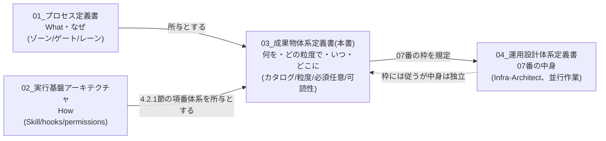

# AI駆動IPA標準フレームワーク 成果物体系定義書

## 改訂履歴

| 版数 | 日付 | 改訂者 | 改訂内容 |
|------|------|--------|----------|
| 1.0 | 2026-09-10 | App-Architect | 初版作成。01_プロセス定義書・02_実行基盤アーキテクチャが未定義のまま残していた成果物まわりの4つの欠落（詳細設計の粒度規定、成果物の必須/任意判断基準、案件類型別の成果物差分、人が読むためのドキュメント構成）を埋める。02の4.2.1節が定める`docs/`配下00〜07の項番体系を所与とし、その正本カタログ・生成規則・省略可否の実務基準を定義する |

---

## 1. はじめに

### 1.1 目的

本書は、aiDev フレームワーク v2 における**成果物そのものの体系**を定める正本である。`docs/v2/01_プロセス定義書.md`（以下「01文書」）はプロセスの What・なぜを、`docs/v2/02_実行基盤アーキテクチャ.md`（以下「02文書」）は実行機構の How を定めるが、両文書は「成果物を、どの粒度で、いつ、どこに、どう作るか」という実務判断に使える基準までは踏み込んでいない。本書はその欠落を埋め、案件を回すエージェント・PMが実際に参照して判断できる密度で規定することを目的とする。

本書が扱う欠落は次の4点である。

1. 詳細設計書の粒度規定が無い（5章）
2. 「作るか省略するかの判断基準」が他文書への参照切れを起こしている（4章）
3. 案件類型に応じたフォルダ構成・成果物差分が無い（7章）
4. 人が読むための構成（INDEX・相互リンク・HTML版）が設計されていない（8章）

なお、v1で検出されたのと同型の欠陥（02文書4.2.1節備考が「作るか省略するかの判断基準は01文書のIPA準拠マトリクスに従う」と記載しているが、01文書のマトリクス（8章）は「どのIPAプロセスをどのゾーンで満たすか」の対応表であり、案件ごとの省略可否を判定する基準にはなっていない）を、本書4章が実体を持つ形で解消する。**本書は他文書への「〜に従う」という丸投げを行わない。成果物の必須/任意判断（4章）と詳細設計の粒度（5章）については、本書が最終的な参照先（終着点）である。**

### 1.2 適用範囲

- `docs/`配下00〜07の全成果物区分（02文書4.2.1節が定める項番体系を所与とする）
- 詳細設計書（03/04の`02_詳細設計/`配下）の生成方式・粒度
- 単体テスト成果物の文書化範囲（05番の中身）
- 案件類型（Webアプリ、API・バックエンドのみ、バッチ・データ処理等）に応じた成果物の差分
- 人が読むためのドキュメント構成（INDEX、相互リンク、HTML版、文書ヘッダー規約）
- ファイル命名規則とディレクトリ規約

対象外とする事項は次のとおりである。

- プロセスの構造・ゲート条件・レーン定義そのもの（01文書の責務）
- Skill・hooks・permissions等の実行機構の実装（02文書の責務）
- 運用設計・運用手順（07番の中身の詳細）は Infra-Architect が並行して作成する `docs/v2/04_運用設計体系定義書.md`（以下「04文書」）の責務とする。**ただし07番のカタログ上の枠（何が入るか、生成ゾーン、生成主体）は本書3章が定める。04文書はこの枠を再定義してはならない（MUST NOT）。**

### 1.3 関連文書

| 文書 | 位置づけ |
|------|---------|
| 01_プロセス定義書（`docs/v2/01_プロセス定義書.md`） | プロセスのWhat・なぜを定める文書。本書のゾーン・ゲート・不可逆度等の用語はすべて01文書の定義に従う |
| 02_実行基盤アーキテクチャ（`docs/v2/02_実行基盤アーキテクチャ.md`） | 実行機構のHowを定める文書。`docs/`配下00〜07の項番体系（4.2.1節）は本書が所与として引き継ぐ |
| 04_運用設計体系定義書（`docs/v2/04_運用設計体系定義書.md`、Infra-Architect作成・並行作業） | 07番（運用・保守）の中身の詳細を定める文書。本書3章が定める07番の枠に従うことを前提とする |
| doc-style-guide（`/home/user/annotation/.claude/skills/doc-style-guide/SKILL.md`、参考実装） | 文書ヘッダー・セクション構成テンプレートの参考元。本書8.4節でv2向けに調整する |

### 1.4 用語

01文書1.4節の用語（Zone、レーン、決定ログ、SCR-ID、HB-ID、不可逆度、as-built等）をすべて継承する。本書で新たに使う用語は以下のとおりである。

| 用語 | 定義 |
|------|------|
| 成果物区分 | `docs/`配下00〜07の各トップディレクトリ、およびその配下の個別文書単位を指す総称 |
| モジュール | 詳細設計書1ファイルが対応する実装上の単位。定義の詳細は5.1節 |
| オンデマンド生成 | 詳細設計書を常時全量保持せず、生成トリガが発生した時点で対象範囲を指定して都度生成する方式（5.3節） |
| ローンチスナップショット | GZ2→GZ3のタイミングで一度だけ全量生成し、納品物として保持する詳細設計書一式（5.3節） |
| 生成可能性検査 | 「いつでも詳細設計書を生成できる」状態が保たれているかを定期的に検査する仕組み（5.4節） |
| 案件類型 | Webアプリ、API・バックエンドのみ等、成果物の要否パターンが異なるプロジェクトの類別（7章） |
| 必須／条件付き必須／任意 | 成果物区分ごとの作成要否を表す3値。判断基準は4章 |
| 枠 | 成果物区分の「項番・生成ゾーン・生成主体・生成方式」までを定めるが、記載内容の詳細は定めない状態を指す（07番に用いる、1.2節） |
| `RPT-{連番}` | 帳票1様式の粒度で採番するトレーサビリティID。帳票ハリボテ（HTML組みの出力イメージ）確定時に機構が採番する（3.10節） |
| `BAT-{連番}` | バッチジョブ1本の粒度で採番するトレーサビリティID。入出力仕様とサンプルデータの合意時点でQAが採番する（3.10節） |
| CRUD図 | テーブル×機能（画面・API・バッチ）の操作（Create/Read/Update/Delete）を対応づけるマトリクス。実装から機械的にリバース生成する（3.11節） |
| 廃棄プロセス | IPA共通フレーム2013のテクニカルプロセスに含まれる、システム・データの計画的な廃止を扱うプロセス。v2では07番が受ける（3.12節） |

---

## 2. 本文書の位置づけ

01文書がプロセス（Zone構成、ゲート、レーン、決定ログの扱い）を定め、02文書がそれをClaude Codeの機構（Skill、hooks、permissions）にどう写像するかを定めるのに対し、**本書は成果物そのものの体系**を定める。三者の関係を図で示す。



本書は、**02文書の4.2.1節が定める00〜07の項番体系を所与とし、その各項番の中身を具体化する**。02文書4.2.1節と矛盾する体系を独自に作らない。3章のカタログは02文書4.2.1節の一覧と一対一で対応させ、矛盾を発見した場合は自己判断で別体系を作らず、10章の残課題として02文書側の修正要否を明記する。

本書が終着点となる事項は次の2点である。他文書はこれらについて本書を参照し、本書はさらに別の文書へ転送しない。

1. **成果物の必須／任意の判断基準**（4章）— 02文書4.2.1節備考が参照していた「01文書のIPA準拠マトリクスに従う」という記述は、01文書8章のマトリクスが判断基準として機能しないため参照切れであった。本書4章がその実体を提供する
2. **詳細設計書の粒度規定**（5章）— 01文書・02文書のいずれにも定義がなかった

---

## 3. 成果物カタログ

本章は`docs/`配下00〜07の全文書を一覧化し、v2における成果物の正本カタログとする。02文書4.2.1節の項番体系（00〜07）と一対一で対応し、矛盾しない。

### 3.1 カタログの読み方

各行は次の8列を持つ。

| 列 | 意味 |
|---|---|
| 文書番号 | `{大区分2桁}-{連番2桁}`形式。命名規則の詳細は9章 |
| 文書名 | - |
| 生成ゾーン | どのゾーンで内容が埋まるか（01文書のZone定義に従う） |
| 生成主体 | 主担当エージェント |
| 生成方式 | 「決定ログからの転記」「実物からのリバース」「オンデマンド」「機構自動集計」「前倒し執筆（例外）」のいずれか |
| 必須区分 | 必須／条件付き必須／任意（判断基準は4章） |
| IPA対応 | 01文書8.2節のプロセス対応マトリクスにおける対応プロセス名 |
| 想定分量 | 行数目安（Markdown） |

### 3.2 00_プロジェクト管理・ガバナンス

| 文書番号 | 文書名 | 生成ゾーン | 生成主体 | 生成方式 | 必須区分 | IPA対応 | 想定分量 |
|---|---|---|---|---|---|---|---|
| 00-00 | ドキュメント構成一覧（INDEX） | 常時（Zone0から） | PM（機構`gate-check`が整合検査） | 機構自動集計 | 必須 | 構成管理プロセス | 100〜200行 |
| 00-01 | 成果物構成カタログ | 常時（Zone0で初期化、以降更新） | PM | 機構自動集計 | 必須 | 構成管理プロセス | 150〜300行 |
| 00-02 | HBトレーサビリティ台帳 | Zone1〜（同期点A⇔B通過時に随時追記） | QA | 機構自動集計（`sync-check`が登録） | 必須 | 検証プロセス | 累積型（上限なし） |
| 00-03 | バッチトレーサビリティ台帳（`BAT-ID`、3.10節で新設） | Zone1〜（入出力仕様確定時に随時追記） | QA | 機構自動集計＋手動記録 | 条件付き必須（バッチ処理を持つ案件のみ、7章） | 検証プロセス | 累積型（上限なし） |
| decisions/DL-{4桁} | 決定ログ群 | Zone0〜2（都度） | 各領域主担当 | 決定ログ起票（`decide` Skill） | 必須 | 構成管理プロセス | 1件30〜80行 |
| 00-12 | リスク管理台帳 | 常時 | PM | 機構自動集計＋手動記録 | 必須 | プロジェクト管理プロセス | 累積型 |
| 00-13 | 課題管理表 | 常時 | PM | 手動記録 | 必須 | プロジェクト管理プロセス | 累積型 |
| 00-14 | 変更管理台帳 | Zone3以降（CR発生時） | CR発生元エージェント | 手動記録 | 必須 | 構成管理プロセス | 累積型 |
| GZ{0,2,3}-99 | ゲート記録 | 各ゾーンゲート通過時 | `gate-check` | 機構自動集計 | 必須 | 検証・妥当性確認プロセス | 1件20〜50行 |

備考: 00番は常時蓄積が正常であるため「Zone3まで空」の対象から除外される（02文書4.2.1節と整合）。

### 3.3 01（システム企画相当）

| 文書番号 | 文書名 | 生成ゾーン | 生成主体 | 生成方式 | 必須区分 | IPA対応 | 想定分量 |
|---|---|---|---|---|---|---|---|
| （欠番） | - | - | - | - | - | 企画プロセス | - |

02文書4.2.1節のとおり、01番は独立ディレクトリを持たない。企画プロセスの実体（事業背景・スコープ外周）はZone0の決定ログとして確定し、Zone3のリバース時に**02-01（要件定義書）の「背景・スコープ」章に統合する**。番号は将来拡張のため欠番として予約する。

### 3.4 02_要件定義

| 文書番号 | 文書名 | 生成ゾーン | 生成主体 | 生成方式 | 必須区分 | IPA対応 | 想定分量 |
|---|---|---|---|---|---|---|---|
| 02-01 | 要件定義書（概要・背景・スコープ・用語、01番相当を統合） | 標準: Zone3／例外: Zone1 | App-Architect（Reverse担当） | 実物からのリバース（例外時: 前倒し執筆） | 必須 | 企画プロセス・要件定義プロセス | 200〜400行 |
| 02-02 | 機能要件一覧（正式要件ID表、HB-ID変換対応表を含む） | Zone3 | QA + App-Architect | 実物からのリバース（HB-ID変換は9.1節） | 必須 | 要件定義プロセス | 100〜300行（要件数に比例） |
| 02-03 | 非機能要件一覧 | Zone0（決定ログ）＋Zone3（文書化） | App-Architect / Infra-Architect | 決定ログからの転記 | 必須 | 要件定義プロセス | 50〜150行 |
| 02-04 | 外部インターフェース要件 | Zone1（決定ログ）＋Zone3（文書化） | App-Architect | 決定ログからの転記＋実物からのリバース | 条件付き必須（外部連携がある案件のみ、7章） | 要件定義プロセス | 50〜200行 |
| 02-99 | 前倒し版差分検査レポート | Zone3（`requirements-first`選択時のみ） | App-Architect | 差分検査（02文書9.5節） | 条件付き必須（例外選択時のみ） | 要件定義プロセス | 50〜150行 |

### 3.5 03_アプリケーション設計

| 文書番号 | 文書名 | 生成ゾーン | 生成主体 | 生成方式 | 必須区分 | IPA対応 | 想定分量 |
|---|---|---|---|---|---|---|---|
| 03-01 | アーキテクチャ概要 | Zone3 | App-Architect | 実物からのリバース | 必須 | ソフトウェア方式設計プロセス | 100〜200行 |
| 03-02 | コンポーネント設計 | Zone3 | App-Architect | 実物からのリバース | 必須 | ソフトウェア方式設計プロセス | 100〜250行 |
| 03-03 | データモデル設計（ER図） | Zone3 | App-Architect | 実物からのリバース | 必須 | ソフトウェア方式設計プロセス | 150〜400行 |
| 03-04 | API設計 | Zone3 | App-Architect | 実物からのリバース | 条件付き必須（APIを持つ案件のみ、7章） | ソフトウェア方式設計プロセス | エンドポイント数に比例 |
| 03-05 | 画面設計（画面一覧・遷移図・レイアウト、SCR-ID起点） | Zone3 | Designer | 実物からのリバース（`prototypes/`＋`SCREEN_ID_INDEX.md`が入力） | 条件付き必須（UIを持つ案件のみ、7章） | ソフトウェア方式設計プロセス | 画面数に比例 |
| 03-06 | セキュリティ設計（アプリ層） | Zone3 | App-Architect | 実物からのリバース＋決定ログ転記 | 必須 | ソフトウェア方式設計プロセス | 80〜200行 |
| 03-07 | 実装方針 | Zone3 | App-Architect | 実物からのリバース | 必須 | ソフトウェア構築プロセス | 100〜200行 |
| 03/02_詳細設計/03-D-00 | 詳細設計サマリ | GZ2到達時（スナップショット）＋Zone4オンデマンド | App-Architect | オンデマンド（常時1枚を維持） | 必須（5.5節） | ソフトウェア詳細設計プロセス | 100〜200行 |
| 03/02_詳細設計/03-D-{モジュールID} | モジュール詳細設計 | GZ2到達時（全量）＋Zone4オンデマンド | App-Architect | オンデマンド（5章） | 必須（生成可能な状態の維持として。実体の常時保持は不要） | ソフトウェア詳細設計プロセス | 1モジュール300〜800行 |
| 03-08 | 帳票設計（帳票一覧・帳票概要・帳票レイアウト） | Zone3 | Designer | 実物からのリバース（`prototypes/`の帳票ハリボテ＋`REPORT_ID_INDEX.md`が入力、3.10節） | 条件付き必須（帳票出力機能を持つ案件のみ、7章） | ソフトウェア方式設計プロセス | 帳票数に比例 |
| 03-09 | バッチ設計（バッチ処理一覧・処理フロー・ジョブ定義） | Zone3 | App-Architect | 実物からのリバース（入出力仕様＋サンプルデータ＋`00-03`台帳が入力、3.10節） | 条件付き必須（バッチ処理を持つ案件のみ、7章） | ソフトウェア方式設計プロセス | ジョブ数に比例 |
| 03-10 | CRUD図（テーブル×機能マトリクス） | Zone3 | App-Architect | 実物からのリバース（ORM定義・クエリの静的解析、3.11節） | 必須（永続データを持つ全案件、7章） | ソフトウェア方式設計プロセス | テーブル数×機能数に比例 |

### 3.6 04_インフラ設計

| 文書番号 | 文書名 | 生成ゾーン | 生成主体 | 生成方式 | 必須区分 | IPA対応 | 想定分量 |
|---|---|---|---|---|---|---|---|
| 04-01 | システム構成図 | Zone3 | Infra-Architect | 実物からのリバース | 必須 | システム方式設計プロセス | 50〜150行＋図 |
| 04-02 | ネットワーク設計 | Zone3 | Infra-Architect | 実物からのリバース | 必須 | システム方式設計プロセス | 80〜200行 |
| 04-03 | セキュリティ設計（インフラ層） | Zone3 | Infra-Architect | 実物からのリバース＋決定ログ転記 | 必須 | システム方式設計プロセス | 100〜250行 |
| 04-04 | 可用性設計 | Zone3 | Infra-Architect | 実物からのリバース | 条件付き必須（可用性クラスが規定される案件、7章） | システム方式設計プロセス | 50〜150行 |
| 04-05 | 監視設計 | Zone3 | Infra-Architect | 実物からのリバース | 必須 | システム方式設計プロセス | 80〜200行 |
| 04-06 | バックアップ設計 | Zone3 | Infra-Architect | 実物からのリバース | 条件付き必須（永続データを持つ案件のみ） | システム方式設計プロセス | 50〜100行 |
| 04-07 | DR設計 | Zone3 | Infra-Architect | 実物からのリバース＋決定ログ転記 | 条件付き必須（可用性クラス上位のみ、7章） | システム方式設計プロセス | 50〜150行 |
| 04-08 | コスト見積 | Zone0（決定ログ）＋Zone3（文書化） | Infra-Architect | 決定ログからの転記 | 必須 | プロジェクト管理プロセス | 30〜100行 |
| 04-09 | 環境設計 | Zone3 | Infra-Architect | 実物からのリバース | 必須 | システム方式設計プロセス | 50〜150行 |
| 04-10 | IaC方針 | Zone3 | Infra-Architect | 実物からのリバース | 必須 | ソフトウェア構築プロセス | 50〜100行 |
| 04-11 | CI/CD設計 | Zone3 | Infra-Architect / SRE | 実物からのリバース | 条件付き必須（自動デプロイ基盤を構築する案件のみ） | ソフトウェア構築プロセス | 50〜150行 |
| 04/02_詳細設計/04-D-00 | 詳細設計サマリ | GZ2到達時＋Zone4オンデマンド | Infra-Architect | オンデマンド（5章） | 必須 | ソフトウェア詳細設計プロセス | 50〜100行 |
| 04/02_詳細設計/04-D-{リソースID} | リソース詳細設計 | GZ2到達時（全量）＋Zone4オンデマンド | Infra-Architect | オンデマンド（5章） | 必須（生成可能な状態の維持として） | ソフトウェア詳細設計プロセス | 1リソース200〜500行 |

備考: v1（`0.1_成果物構成設計.md`）では移行計画・運用設計が04番配下に含まれていたが、v2では06番・07番が独立トップディレクトリであるため、これらは04番から除外し06番・07番に移す（3.9節・3.10節）。

### 3.7 05_テスト

| 文書番号 | 文書名 | 生成ゾーン | 生成主体 | 生成方式 | 必須区分 | IPA対応 | 想定分量 |
|---|---|---|---|---|---|---|---|
| 05-01 | テスト方針（責務分担、二層ID体系の要約） | Zone3 | QA | 実物からのリバース＋`test-design-guide`の転記 | 必須 | ソフトウェア結合・システム適格性確認テストプロセス | 80〜150行 |
| 05-02 | トレーサビリティマトリクス（正式版） | Zone3 | QA | 実物からのリバース（`traceability-reverse`） | 必須（GZ3のGO条件、01文書6.5節条件6） | 検証・妥当性確認プロセス | HB-ID数に比例 |
| 05-03 | テスト結果報告書（サマリ） | Zone3 | QA | 実物からのリバース | 条件付き必須（契約上の検収物指定がある場合。無い場合はCI実行ログで代替可、6章） | システム適格性確認テストプロセス | 50〜150行 |

### 3.8 06_移行・導入

| 文書番号 | 文書名 | 生成ゾーン | 生成主体 | 生成方式 | 必須区分 | IPA対応 | 想定分量 |
|---|---|---|---|---|---|---|---|
| 06-01 | 移行計画書 | Zone3〜Zone4境界 | Infra-Architect / SRE | 実物からのリバース | 条件付き必須（データ移行・既存リプレースを伴う案件のみ、4章・7章） | 導入プロセス | 50〜150行 |
| 06-02 | 移行手順書 | Zone3〜Zone4境界 | SRE | 実物からのリバース | 条件付き必須（同上） | 導入プロセス | 100〜300行 |
| 06-03 | 受入テスト結果報告書 | Zone3〜Zone4境界 | QA | 実物からのリバース | 必須 | 受入れ支援プロセス | 50〜150行 |
| 06-04 | リリース手順書 | Zone3〜Zone4境界 | SRE | 実物からのリバース | 必須 | 導入プロセス | 50〜150行 |

備考: 06番は「Zone3まで空である状態が正常」の集合から除外される（02文書4.2.1節と整合。Zone3〜Zone4境界で埋まる）。

### 3.9 07_運用・保守（枠のみ。中身は04文書が定める）

| 文書番号 | 文書名 | 生成ゾーン | 生成主体 | 生成方式 | 必須区分 | IPA対応 |
|---|---|---|---|---|---|---|
| 07-01 | 運用設計書 | Zone3 | SRE | 実物からのリバース | 条件付き必須（4章参照） | 保守プロセス |
| 07-02 | 運用手順書 | Zone3 | SRE | 実物からのリバース | 条件付き必須（4章参照） | 保守プロセス |
| 07-03 | 監視・アラート対応手順 | Zone3 | SRE | 実物からのリバース | 条件付き必須（4章参照） | 保守プロセス |
| 07-04 | バックアップ・リストア運用手順 | Zone3 | SRE | 実物からのリバース | 条件付き必須（4章参照） | 保守プロセス |
| 07-05 | 障害対応・エスカレーション手順 | Zone3 | SRE | 実物からのリバース | 条件付き必須（4章参照） | 保守プロセス |
| 07-06 | システム廃止計画・データ廃棄手順（証跡保存を含む） | Zone4（稼働後、廃止判断が下された時点） | Infra-Architect / SRE | 実物からのリバース＋決定ログからの転記（3.12節） | 条件付き必須（規制要件上の保存年限・廃棄証跡が求められる案件、契約終了が明確な受託案件で必須。それ以外は任意） | 廃棄プロセス |

**本表は07番の枠（項番・生成ゾーン・生成主体・生成方式・必須区分の考え方まで）を定めるものであり、各文書の記載事項・構成テンプレート・想定分量は04文書が定める。04文書はこの表の項番体系（07-01〜07-06）を再定義してはならない（MUST NOT）。項番を追加する場合は本書の改訂として扱う。**

### 3.10 帳票・バッチという「UIを持たない」成果物の扱い（構造的弱点への対応）

ハリボテ駆動（01文書4.4節）は画面上の合意形成を前提とする方式であり、`SCR-ID`（01文書4.4.5節）は画面1枚の実在を証跡とする。しかし帳票（PDF・印刷物・外部提出様式）とバッチ処理（UIを持たない定期実行ジョブ）には「画面」が存在しないため、両者にはハリボテ駆動の合意形成の枠組みがそのまま適用できない。**これは本方式（ハリボテ駆動）の構造的な弱点であり、逃げずに正面から対応を定める。**

**方針**: 帳票・バッチそれぞれについて、画面に相当する「合意の媒体」と、`SCR-ID`/`HB-ID`に相当する二層のID体系を新設する。既存の画面駆動の枠組み（01文書4.4.5節）と対称的な構造を採ることで、レーンA/Bの相互駆動・トレーサビリティの機構をそのまま流用できるようにする。

#### 3.10.1 帳票

| 項目 | 画面（既存） | 帳票（新設） |
|---|---|---|
| 合意の媒体 | HTMLハリボテ | 帳票ハリボテ（HTMLで組んだ出力イメージ。実際の印字レイアウト・項目配置を再現する） |
| 機械抽出単位ID | `SCR-ID`（画面1枚） | `RPT-ID`（帳票1様式） |
| 採番タイミング・採番者 | ハリボテHTML記述時に機構が自動採番 | 帳票ハリボテのHTML記述時に機構が自動採番（`SCR-ID`と同一の仕組みを流用。レーンA=Designerが作成） |
| 台帳 | `prototypes/SCREEN_ID_INDEX.md` | `prototypes/REPORT_ID_INDEX.md`（新設。項目構成は`SCREEN_ID_INDEX.md`に準じる） |
| `HB-ID`との接続 | 画面遷移を経由するE2Eシナリオの経路情報として`SCR-ID`を保持 | 帳票出力を伴う業務シナリオの経路情報として`RPT-ID`を`SCR-ID`と同列に保持する。`00-02_HBトレーサビリティ台帳`の経路欄は`SCR-ID`/`RPT-ID`混在の並びを許容するよう拡張する（MUST拡張） |
| Zone3での文書化先 | 03-05（画面設計） | 03-08（帳票設計。帳票一覧・帳票概要・帳票レイアウトを含む） |

#### 3.10.2 バッチ

バッチは帳票よりもさらに「見た目」を持たないため、出力イメージではなく**入出力仕様と処理結果のサンプルデータ**を合意の媒体とする。

| 項目 | 画面（既存） | バッチ（新設） |
|---|---|---|
| 合意の媒体 | HTMLハリボテ | 入出力仕様（入力データ形式・出力データ形式・処理タイミング）＋処理結果のサンプルデータ |
| 機械抽出単位ID | `SCR-ID` | `BAT-ID`（バッチジョブ1本） |
| 採番タイミング・採番者 | ハリボテHTML記述時に機構が自動採番 | 入出力仕様とサンプルデータがレーンB（App-Architect）で確定した時点でQAが採番する（バッチは見た目を持たず機構による自動検知が難しいため、`HB-ID`と同様に人が採番する） |
| 台帳 | `prototypes/SCREEN_ID_INDEX.md` | `docs/00_プロジェクト管理・ガバナンス/00-03_バッチトレーサビリティ台帳.md`（新設、3.2節） |
| `HB-ID`との接続 | 画面遷移を経由するE2Eシナリオの経路情報として`SCR-ID`を保持 | 画面を経由し業務の一部としてバッチが起動されるシナリオでは、当該`HB-ID`の経路情報に`BAT-ID`を追加する。画面を経由せずバッチ単体で完結するシナリオ（夜間バッチ等）は`BAT-ID`をそのままカバレッジの分母として扱う特例とする（理由: バッチには画面をまたぐ概念が無く、`HB-ID`の粒度を強制する必要が無いため） |
| Zone3での文書化先 | 03-05（画面設計） | 03-09（バッチ設計。バッチ処理一覧・処理フロー・ジョブ定義を含む） |

**トレーサビリティの分母への統合**: 01文書10.1節（トレーサビリティの起点）が定める`gate-check`の分母集計は、「`HB-ID`全件 ＋ 画面非経由の`BAT-ID`全件」に拡張する（MUST）。この拡張の実装（`gate-check`・`sync-check`側の集計ロジック改修）は02文書10章側で反映する必要があり、10章の残課題とする。

**代替案の検討**: 「帳票・バッチも無理に`HB-ID`一本に統合する」案も検討したが、`HB-ID`は同期点A⇔B（画面とロジックの整合）を前提に採番されるため、画面が存在しない帳票・バッチにこれを強制すると採番タイミングの定義が破綻する。したがって独立したID体系（`RPT-ID`/`BAT-ID`）を新設し、経路情報として`HB-ID`側へ合流させる方式を採用する。

### 3.11 CRUD図

CRUD図（テーブル×機能のマトリクス。各セルにCreate/Read/Update/Deleteの操作有無を記載する）は、日本のSI実務における基本設計の定番成果物である。01文書・02文書のいずれにも記載が無かったため、本書で新規にカタログへ追加する（3.5節の03-10）。

CRUD図は実装（ORM定義・データアクセス層のクエリ）から機械的にリバース生成しやすく、v2の設計思想（実物からの逆生成）と特に相性が良い成果物である。

**生成手順の概略**: `src/backend/models/`等のORM定義からテーブル一覧を抽出し、`src/backend/`配下のデータアクセス層コード（Repository/DAO相当）を静的解析して、各テーブルに対するCRUD操作を機能単位（`HB-ID`・APIエンドポイント・`BAT-ID`のいずれか）に紐づける。この抽出手順は02文書9.1節のリバース生成エンジン入力対応表へ追加することが望ましい（10章の残課題）。

### 3.12 廃棄プロセスへの対応

IPA共通フレーム2013のテクニカルプロセスには、システム・ソフトウェアの計画的な廃止を扱う**廃棄プロセス（Disposal Process）**が明示的に含まれる。01文書8.2節のプロセス対応マトリクスはこれを扱っておらず、v2の00〜07にも対応する項番が存在しなかった。**本書はこれを黙って落とさず、07番（運用・保守）が受ける成果物として新設する（3.9節の07-06）。**

**04文書との境界**: 07-06は本書が定める枠（項番・生成ゾーン・生成主体）であり、記載事項の詳細（廃棄手順のテンプレート、証跡保存の具体的な方式）は04文書（`docs/v2/04_運用設計体系定義書.md`）が定める。3.9節の原則（07番の枠は本書が持ち、04文書はこれを再定義しない）をここでも適用する。**04文書は07-06という項番の存在を前提に中身を執筆すること（MUST）。**

生成タイミングが他の07番文書（Zone3）と異なりZone4である点に注意する。廃棄プロセスは「稼働中のシステムをいつか廃止する」という将来判断に関わるものであり、初回リリース時点（Zone3）では廃棄計画そのものが未定であることが通常であるため、Mode B（Zone4）で廃止判断が下された時点、または契約終了条件が当初から明確な受託案件はMode B開始時点で作成する運用とする。

**01文書側への申し送り**: 01文書8.2節のプロセス対応マトリクスに廃棄プロセスの行が存在しないことは、本書の対象外である01文書の欠落であるため、修正要否を10章の残課題として申し送る（本書が01文書を直接修正することはしない）。

### 3.13 IPA共通フレームのプロセス階層と00番の対応

IPA共通フレーム2013は「プロセス > アクティビティ > タスク」の3階層で構成され、テクニカルプロセスの他に**合意プロセス（取得プロセス・供給プロセス）**、**組織のプロジェクトイネーブリングプロセス**、**プロジェクトプロセス**、**支援プロセス**を持つ。01文書8章のマトリクスは主にテクニカルプロセス（企画〜保守、および3.12節で追加した廃棄）を扱っており、これ以外のプロセス群がv2のどこで受けられるかが明示されていなかった。本書は00番（プロジェクト管理・ガバナンス）がこれらをどこまで受けるかを次の対応表で示す。

| IPA共通フレーム2013のプロセス群 | 主なプロセス例 | v2での対応 |
|---|---|---|
| テクニカルプロセス | 企画〜要件定義〜設計〜構築〜結合〜適格性確認〜導入〜保守〜廃棄 | 01文書8.2節のマトリクスが対応する（廃棄プロセスは3.12節で追加対応） |
| 合意プロセス（取得プロセス） | 発注者側の調達・契約管理 | **00番が一部受ける**。契約形態・検収条件は4.4節の決定ログ（Zone0）に記録し、00-14変更管理台帳が契約変更（CR）を追跡する。契約書そのものはaiDevのスコープ外（本書1.2節、01文書10章残課題#5と同根） |
| 合意プロセス（供給プロセス） | 受託者側の提案・契約遂行管理 | **00番が一部受ける**。00-01成果物構成カタログ・00-12リスク管理台帳が進行管理に相当する情報を保持する |
| 組織のプロジェクトイネーブリングプロセス | 組織の資源管理、環境整備、人的資源管理等 | **aiDevのスコープ外**。aiDevは個別プロジェクトの実行を支援するフレームワークであり、組織横断の資源管理・人事管理は対象としない（明示的にスコープ外とする） |
| プロジェクトプロセス | プロジェクト計画、プロジェクト評価・管理、意思決定管理、リスク管理、構成管理、情報管理、測定 | **00番がほぼ全面的に受ける**。リスク管理→00-12、構成管理→00-01・00-00・`decisions/`、意思決定管理→`decisions/`、プロジェクト評価・管理→`GZ{0,2,3}-99`ゲート記録 |
| 支援プロセス | 品質保証、検証、妥当性確認、レビュー、監査、問題解決、ユーザビリティ、機能安全 | 01文書6章・7章（統一実行ループ、AIレビュー文化）が対応する。00-13課題管理表が問題解決プロセスの記録先に相当する |

**明記する理由**: IPA準拠を掲げる以上、「テクニカルプロセスだけを満たしていればよい」という誤解を避ける必要がある。組織のプロジェクトイネーブリングプロセスのみを明示的にスコープ外とし、それ以外は00番が実質的に受けていることを本表で示す。

### 3.14 参考文献（3.10〜3.13節の追加成果物の出典）

- IPA「共通フレーム2013」: https://www.ipa.go.jp/publish/secbooks20130304.html
- 基本設計の成果物一覧（画面・帳票・バッチ・テーブル・CRUD図・外部IF）: https://pm-rasinban.com/bd-write
- 基本設計書の記載事項に関する実務解説: https://ysinc.co.jp/blog/basic-design-documents/

---

## 4. 成果物の必須／任意の判断基準

本章は、02文書4.2.1節備考が参照していた「作るか省略するかの判断基準」の実体である。**本章が終着点であり、他文書へは転送しない。**

### 4.1 判断軸

案件ごとに5つの軸で条件を確認し、成果物区分の要否を決定する。

| 判断軸 | 確認内容 | 主な影響先 |
|---|---|---|
| 契約形態 | 受託開発か自社サービスか。受託の場合、準委任か請負か。要件定義書等を中間検収物とするか | 02番、01文書4.10節の前倒しオプション選択 |
| システム特性 | UIの有無、外部連携の有無、バッチ処理の有無、永続データの有無、データ移行の有無 | 03番・04番の個別サブ文書、06番 |
| 規制要件 | 監査対象業種か（金融・医療・個人情報保護法の適用対象等）、三省二ガイドライン等の対象か | 02番・03番・04番（規制要件は他の軸に優先する） |
| 規模 | 体制人数、開発期間、想定ユーザー数 | 05番の一部（テスト結果報告書）、07番 |
| 運用体制 | 開発チームがそのまま運用継続するか、別チームまたは委託先に引き継ぐか、SLAが契約に含まれるか | 06番、07番 |

### 4.2 優先順位ルール

複数の軸が異なる判定を示す場合、**最も保守的な判定（必須側）を採用する（MUST）**。すなわち優先順位は「規制要件 > 契約形態 > システム特性 > 規模 > 運用体制」の順とし、規制要件が「必須」と示す成果物を規模の軸だけで「任意」に倒してはならない（MUST NOT）。

### 4.3 成果物区分別の判定表

| 成果物区分 | 必須（常に作る） | 条件付き必須（条件を満たせば作る） | 任意（作らなくてよい） |
|---|---|---|---|
| 00（プロジェクト管理・ガバナンス） | 常に必須。規模・契約形態を問わない | - | - |
| 02（要件定義） | 標準ではGZ3時点のas-built版を必須とする。契約形態が請負・要件定義書を中間検収物とする場合は前倒し版（01文書4.10節）も必須とする | 監査対象業種は契約形態・規模を問わず常に必須とする（4.2節の優先順位ルール） | 自社サービス・非監査・小規模（体制3名未満かつ開発3ヶ月未満）の場合、02-01を圧縮し00-02のHB-ID台帳と決定ログで代替してよい（MAY）。ただしこの場合も02-02（機能要件一覧・HB-ID変換表）は省略しない（MUST NOT省略。トレーサビリティの分母を失うため） |
| 03（アプリケーション設計・基本設計） | UIまたはAPIを持つ全案件で03-01/02/03/06/07を必須とする | 03-04（API設計）はAPIを持つ案件のみ、03-05（画面設計）はUIを持つ案件のみ必須とする（7章の案件類型で機械的に判定） | インフラ構築のみの案件（7章）では03番自体を圧縮し、03-03（連携先とのデータ交換仕様がある場合のみ）以外を省略してよい（MAY） |
| 03/04（詳細設計） | 「オンデマンドで生成可能な状態を保つこと」自体は常に必須（5.4節） | 監査・引き継ぎ・大規模改修の事前調査等のトリガー発生時（5.3節）は実体生成が必須となる | 上記トリガーが無い期間は、実体としての常時保持を行わないことが既定（省略ではなく「生成しない」状態が正常。5.3節） |
| 04（インフラ設計） | インフラを本フレームワークの範囲で構築する全案件で必須 | 既存インフラを変更しないアプリ改修のみの案件は04-01・04-03のみに圧縮してよい（MAY） | 完全にSaaS利用でインフラ構築が発生しない案件は04番自体を省略してよい（MAY）。省略した場合は00-12リスク管理台帳に記録する（MUST） |
| 05（テスト） | 05-02（トレーサビリティマトリクス正式版）は常に必須（GZ3のGO条件、01文書6.5節条件6） | 05-03（テスト結果報告書）は契約上の検収物指定がある場合のみ必須とする | 検収物指定が無い場合、05-03は`tests/`配下のCI実行ログをもって代替してよい（MAY） |
| 06（移行・導入） | 06-03（受入テスト結果報告書）・06-04（リリース手順書）は常に必須 | データ移行・既存システムからのリプレースを伴う案件では06-01・06-02が必須となる | 完全新規構築でデータ移行が存在しない案件は06-01・06-02を省略してよい（MAY） |
| 07（運用・保守） | 開発チームと異なる主体への引き継ぎがある案件、またはSLAが契約に含まれる案件では07番全体を必須とする | 運用委託だが引き継ぎ文書が個別に必要な項目のみ指定される場合は該当項目のみ条件付き必須とする | 開発チームがそのまま運用も継続する小規模案件では、04文書が定める最小構成（簡略版）で代替してよい（MAY） |

### 4.4 判断のタイミングと責任者

判断はZone0で行う（MUST）。PM・Consultantが5軸をヒアリングし（`decide` Skillのヒアリング項目に含める。02文書8章参照）、判定結果を決定ログ（不可逆度: 中。契約形態に関する判定は不可逆度: 高として扱う。理由: Zone3で契約形態を覆すと成果物一式の作り直しが生じるため）に記録する。判定結果は00-01成果物構成カタログの各行の「必須区分」欄へ反映する（MUST）。

### 4.5 省略した場合の記録先

任意と判定し実際に省略した成果物は、次の2箇所へ記録する（MUST）。

1. **決定ログ**: 省略の判断内容・根拠・適用範囲（プロジェクト全体か特定成果物のみか）を記録する
2. **00-12リスク管理台帳**: 省略によって生じうるリスク（監査時の指摘、引き継ぎ時の情報不足等）と、対応予定（次期リリース時に生成する等）を登録する（01文書5.5節#4の「deferは必ずリスク管理台帳に登録する」原則を継承）

**MUST要件・正常系に相当する成果物（00番全体、05-02、契約上の検収物指定がある成果物）の省略は許可しない（MUST NOT）。** 省略可否の判断自体が誤っていた場合はHOLDとし、ユーザー判断を仰ぐ。

---

## 5. 詳細設計書の粒度規定

本章は01文書・02文書のいずれにも定義が無かった事項を新規に定める、本書の中核章である。

### 5.1 分割単位: 「モジュール」の定義

詳細設計書1ファイルは1モジュールに対応させる（MUST）。ファイル1つを1モジュールとする、あるいはシステム全体を1モジュールとする、といった機械的な単位は採らない。**モジュール**とは、以下のいずれかを満たす実装上の単位を指す。

| 領域 | モジュールの実体 | 判定基準 |
|---|---|---|
| バックエンド | 1つのユースケース群・サービスクラス群（例: `src/backend/services/order/`のようなディレクトリ境界） | ディレクトリ境界の依存が単方向であること、デプロイ・テストの単位として独立していること |
| フロントエンド | 1画面（`SCR-ID`）またはコンポーネント境界 | 画面単位はSCR-IDと一致させる。共有コンポーネントは別モジュールとして切り出す |
| インフラ | 1スタック・1IaCモジュール（CDK Stack、Terraform Module） | IaCツールが定義するデプロイ単位と一致させる |

**判定できない場合の指針**: 上記いずれの基準でも独立性を判定できない場合は、「担当者・PRが概ね閉じて完結する単位」を採用する（SHOULD）。1モジュール1詳細設計書が300〜800行程度に収まることを目安とし、収まらない場合はサブモジュールへ分割する（SHOULD）。逆に、1モジュールの記述が100行に満たない場合は、隣接モジュールと統合できないか検討する（SHOULD）。

### 5.2 何を書き、何を書かないか

詳細設計書の価値は「実装から読み取れないもの」にある。実装を読めば分かることを書き写す行為は、二重メンテナンスの負債を生むだけであり禁止する（MUST NOT）。

| 区分 | 内容 | 記載要否 |
|---|---|---|
| 書かない | 実装済みのループ・分岐構造そのもの、型定義の内部実装、コメントを読めば分かる自明な処理 | 記載しない（MUST NOT） |
| 書く（設計意図） | なぜこの分割にしたか、検討した代替案とその却下理由（決定ログからの転記） | 必ず記載する（MUST） |
| 書く（不変条件・境界条件） | このモジュールが常に満たす前提（不変条件）、境界値・例外処理の設計根拠（なぜこの閾値か） | 必ず記載する（MUST） |
| 書く（非機能上の考慮） | なぜこの実装がこの非機能要件（性能・可用性等）を満たすと判断したか | 該当する場合は記載する（SHOULD） |
| 転記する（インターフェース） | パブリックなインターフェース定義（関数・メソッドシグネチャ、リクエスト/レスポンス型）、例外・エラーコード一覧、依存モジュール一覧 | 実物から機械抽出して転記する（MUST）。手書きで別に定義しない |

### 5.3 オンデマンド生成方式の定義

**確定事項（ユーザー決定、覆さない）**: 詳細設計書は常時全量を保持せず、必要になったときに必要な範囲だけas-built生成する。ローンチ時（GZ2→GZ3）に一度だけ全量生成して**ローンチスナップショット**とし、以降は「保持しない・必要時に再生成する」運用とする。

#### 5.3.1 生成トリガ

以下のいずれかの発生時に生成する（MUST、いずれかに該当しない限り生成を行わない）。

| トリガ | 説明 |
|---|---|
| 納品（GZ2→GZ3） | 全量を一度だけ生成し、ローンチスナップショットとして保持する |
| 監査 | 監査対象の機能・モジュールに限定して生成する |
| 引き継ぎ | 引き継ぎ対象範囲（担当領域単位）に限定して生成する |
| 大規模改修の事前調査 | 01文書3.4節の基準でZone1へ退避する際、影響を受けるモジュールに限定して生成する |
| ユーザーからの明示要求 | 指定された範囲のみ生成する |

#### 5.3.2 生成範囲の指定方法

生成範囲は次のいずれかの方法で指定する（MUST、いずれかを用いる）。

- モジュール指定: ディレクトリパスまたはモジュールIDを直接指定する
- 機能指定: `HB-ID`を指定し、経由する`SCR-ID`・関連モジュールを`00-02`台帳から逆引きして範囲を確定する
- 画面指定: `SCR-ID`を指定し、画面設計相当（03-05）の該当範囲を確定する

#### 5.3.3 生成物の置き場所と寿命

| 生成タイミング | 置き場所 | 寿命 |
|---|---|---|
| ローンチスナップショット（GZ2→GZ3、1回のみ） | `docs/03(04)_.../02_詳細設計/` | **保持する（MUST）**。納品物であるため。ヘッダーに「生成区分: 実装反映(as-built) - スナップショット版（生成日時固定）」と明記し、以降自動更新されないことを明示する |
| Zone4（Mode B）以降のオンデマンド生成 | 同ディレクトリに上書き生成 | 次回オンデマンド生成まで保持してよい（MAY）が、正としての権威は常にコードにある。生成後、次のコード変更が入った時点で内容は陳腐化しうる。複数版を並べて保持しない（バージョン管理はgit履歴に委ねる、MUST NOT複数版並存） |

### 5.4 オンデマンド方式のリスクと担保

「いつでも生成できる」という前提が崩れる状態には2種類ある。

1. 決定ログの欠落（なぜの情報が失われ、生成しても「何であるか」しか書けない）
2. コードの可読性劣化（命名規則の崩れ、コメント欠落により機械抽出の精度が落ちる）

この状態を放置すると、オンデマンド生成方式は成立しなくなる。したがって以下を**要求**する（本書からの要求であり、実装方式は02文書側の機構に委ねる）。

| 要求 | 内容 | 実装の接続先 |
|---|---|---|
| 決定ログ書き漏れの継続検知 | 02文書8.2節の`decision-log-guard.js`（3段構えの検知）をZone4以降も有効化する | 02文書8章 |
| 生成可能性検査（新規要求） | Routine（02文書12章）で四半期に一度、`reverse-doc`を差分検査モード（02文書9.3節）で実行し、生成に失敗する・著しく劣化したモジュールを検出する。検出されたら`00-13課題管理表`へ登録する | 02文書12章のRoutines機構に追加要求する |
| 合格基準 | `HB-ID`が紐づく全モジュールについて、差分検査モードがエラー無く差分レポートを出力できること | `gate-check`の判定条件に追加することを検討する（実装方式は02文書側に委ねる） |

### 5.5 膨大化の実際的な抑制

詳細設計書が膨大化し読めなくなることを防ぐため、以下の階層構造を採る（MUST）。

```
docs/03_アプリケーション設計/02_詳細設計/
├── 03-D-00_詳細設計サマリ.md      # 全モジュール一覧、概要1〜2行、各モジュールへのリンク
├── 03-D-01_{モジュール名}.md      # モジュール別詳細設計（オンデマンド生成、5.3節）
├── 03-D-02_{モジュール名}.md
└── ...
```

**サマリ（`03-D-00`）は常時1枚を維持する（MUST）**。個別モジュールファイルはオンデマンド生成の対象だが、サマリ自体は「どのモジュールが存在し、いつ最後に生成されたか」の索引として、モジュール構成が変わった時点で軽量に更新する。読み手はまず`00-00_ドキュメント構成一覧` → `03-D-00_詳細設計サマリ` → 個別モジュール、という3階層で辿る（8.1節と接続）。

---

## 6. 単体テストと、テスト成果物の文書化範囲

### 6.1 UTの粒度

単体テスト（UT）は01文書6.5節に定めるとおり、実装の分岐網羅を分母とする。**UTコード自体がテスト仕様であり、これとは別に詳細なテストケース一覧を文書化しない（MUST NOT）。** 別文書化は実装との二重メンテナンスを生み、コード変更のたびに文書が陳腐化する負債を生むためである。

### 6.2 05番に含めるもの・含めないもの

| 区分 | 内容 | 05番に含めるか |
|---|---|---|
| テスト方針 | UT/IT/E2Eの責務分担、`SCR-ID`/`HB-ID`の二層ID体系の要約 | 含める（05-01） |
| トレーサビリティマトリクス正式版 | `HB-ID`→正式要件IDの変換結果、要件×テストの対応表 | 含める（05-02。GZ3のGO条件） |
| テスト結果報告書 | サマリレベルの実施結果（合格率のみの記載は01文書7.2節によりNG。分母・分子の出典を明記） | 条件付きで含める（05-03。4.3節の判断基準に従う） |
| UTの個別テストケース一覧 | 実装の分岐に対応する個別ケースの詳細 | **含めない**。`tests/`配下のコード自体とCI実行ログを正とする |
| IT/E2Eのシナリオ詳細 | シナリオの手順・期待結果 | **含めない**。`00-02_HBトレーサビリティ台帳`と`tests/e2e/`のdocblockが正であり、05-02からはリンク参照に留める |

### 6.3 理由

テストコードと文書が同じ情報を別々に保持すると、コード変更時に文書の更新が漏れやすく、01文書9.2節が定める「形骸化のサイン」（記述系文書が実装に追随できず負債化する）を05番でも再現してしまう。したがって05番は**要約と正式な対応関係（分母）のみを文書化し、詳細はコード側を正とする**という一貫方針を採る。この方針は5章の詳細設計における「実装から読み取れることを書き写さない」原則と対をなす。

---

## 7. 案件類型別の成果物差分

### 7.1 案件類型の定義

以下6類型を定義する。判定はZone0でPM・Consultantが行い、決定ログ（不可逆度: 高。理由: 類型の判定を誤ると03〜07全体の生成範囲が誤るため）に記録する（MUST）。複数の類型にまたがる場合は、該当する全類型の「必須」の和集合を採用する（4.2節の優先順位ルールと同様、保守的な側を採用する）。

| 類型 | 定義 | 代表例 |
|---|---|---|
| A: Webアプリ | UI・API・永続データを持つ標準的な業務アプリケーション | 業務システム、SaaS管理画面 |
| B: API・バックエンドのみ | UIを持たず、外部クライアント（他社システム、モバイルアプリ）向けにAPIを提供する | 外部連携API、マイクロサービス |
| C: バッチ・データ処理 | UIを持たず、定期実行のジョブ・データ変換処理が中心 | 夜間バッチ、集計処理 |
| D: データ基盤 | ETL・分析基盤。データモデル・インフラの比重が高い | データウェアハウス、分析基盤 |
| E: モバイル | ネイティブ/クロスプラットフォームアプリ。ハリボテはモバイルモックとして扱う | スマートフォンアプリ |
| F: インフラ構築のみ | アプリケーション開発を伴わず、インフラ構成の構築・移行のみを行う | クラウド移行案件 |

### 7.2 類型別の成果物差分表

`必須`／`条件付き必須`／`不要`の3値で示す。`条件付き必須`は4章の判断基準を重ねて適用する（本表は7章固有の追加調整であり、4章の判断基準を上書きしない）。

| 成果物区分 | A: Webアプリ | B: API・バックエンド | C: バッチ・データ処理 | D: データ基盤 | E: モバイル | F: インフラ構築のみ |
|---|---|---|---|---|---|---|
| 00（ガバナンス） | 必須 | 必須 | 必須 | 必須 | 必須 | 必須 |
| 02（要件定義） | 必須 | 必須 | 必須 | 必須 | 必須 | 必須（機能要件は縮小版） |
| 03-01〜03-04, 03-06, 03-07（アプリ基本設計） | 必須 | 必須（03-05を除く） | 必須（03-04, 03-05を除く） | 条件付き必須（データモデル03-03のみ必須） | 必須（03-05はネイティブUI設計に置換） | 不要 |
| 03-05（画面設計） | 必須 | 不要 | 不要 | 不要 | 必須（形式をネイティブUI設計に読み替え） | 不要 |
| 03/02_詳細設計 | 必須（5章のオンデマンド方式） | 必須 | 必須 | 条件付き必須（バッチジョブ本体のみ） | 必須 | 不要 |
| 03-08（帳票設計） | 条件付き必須（帳票出力機能の有無次第） | 条件付き必須 | 条件付き必須（CSV/CSV帳票出力を伴う場合） | 条件付き必須 | 条件付き必須 | 不要 |
| 03-09（バッチ設計） | 条件付き必須（バッチ機能の有無次第） | 条件付き必須 | 必須 | 必須 | 条件付き必須 | 不要 |
| 03-10（CRUD図） | 必須 | 必須 | 必須 | 必須 | 条件付き必須（バックエンド＋DBを持つ場合のみ） | 不要 |
| 04（インフラ設計） | 必須 | 必須 | 必須 | 必須（比重大） | 条件付き必須（バックエンドAPIがある場合のみ） | 必須（比重大） |
| 05-01, 05-02（テスト方針・RTM） | 必須 | 必須 | 必須（冪等性・リトライ観点を追加） | 必須 | 必須 | 必須（疎通確認中心） |
| 05-03（テスト結果報告書） | 条件付き必須（4章） | 条件付き必須 | 条件付き必須 | 条件付き必須 | 条件付き必須 | 条件付き必須 |
| 06（移行・導入） | 条件付き必須（データ移行の有無） | 条件付き必須 | 条件付き必須（重要度高。既存バッチの移行を伴うことが多い） | 条件付き必須（重要度高） | 条件付き必須 | 必須 |
| 07（運用・保守） | 条件付き必須（4章） | 条件付き必須 | 条件付き必須 | 条件付き必須 | 条件付き必須 | 必須 |

### 7.3 v1資産からの継承

`.claude/helpers/directory-structure-helper.md`（v1）が定めていた「規模別の一般的傾向」「ベストプラクティス調査（WebSearch）の実施手順」は、**`docs`の成果物体系とは別軸（`src/`・`infra/`の実装ディレクトリ構成）である**ため、本書では継承範囲を明記するに留める。具体的には、02文書4.3節が定める`src/{layer}/execute`・`infra/{layer}/execute` Skillが、実装時のディレクトリ構成決定において同ヘルパーの調査手順（公式ドキュメント優先、複数情報源の比較、規模に応じたシンプルさの維持）を引き続き利用してよい（MAY）。本書のカタログ（3章）・粒度規定（5章）とは独立した事項として扱う。

---

## 8. 人が読むためのドキュメント構成

### 8.1 INDEX（`docs/00-00_ドキュメント構成一覧.md`）の設計

INDEXは全成果物の状態を一目で把握できることを目的とする。状態は次の4値のいずれかとする。

| 状態 | 意味 |
|---|---|
| 未生成 | 標準どおりZone3未到達で空。異常ではない（02文書4.2.1節） |
| as-built生成済 | Zone3以降にリバース生成済み |
| 前倒し作成 | `requirements-first`選択時の02番等、Zone1のうちに執筆済み |
| 省略 | 4章の判断基準に基づき意図的に作成しないと決定した（決定ログ参照リンクを併記する） |

**構成例**:

| 文書番号 | 文書名 | 状態 | 最終更新ゾーン | 参照決定ログ | リンク |
|---|---|---|---|---|---|
| 02-01 | 要件定義書 | 未生成 | - | - | - |
| 03-03 | データモデル設計 | as-built生成済 | Zone3 | - | `03_アプリケーション設計/03-03_データモデル設計.md` |
| 04-04 | 可用性設計 | 省略 | - | `DL-0042` | - |

**更新責任者**: 各`reverse-doc`実行時に、生成主体が自身が担当する行を更新する（自己申告、MUST）。ゾーンゲート判定時（`GZ2`/`GZ3`）に`gate-check`・`decision-check`がINDEXの内容と実際の生成物の有無を突き合わせ、不整合（INDEXは生成済みだがファイルが存在しない等）を検出する（機械検査）。01文書5.5節#3の四半期棚卸しの際は、PMがINDEX全体を集約確認する。

### 8.2 文書間リンク

文書番号による参照を正とする（例:「詳細はAPI設計（03-04）を参照」）。相互参照は本文中にMarkdownの相対リンクとして記載する（MUST）。リンク切れの検知は、ファイル名パターン（`{項番}-{連番}_*.md`）とリンク先の実在確認を組み合わせた機械検査とし、Routine（02文書12章）で定期実行する（SHOULD）。実装方式（具体的なスクリプト）は02文書側の課題として10章に残す。

### 8.3 HTML版

**読み手は開発者に限らない。顧客・監査人・引き継ぎ先を含む。** これを前提に以下を定める。

| 項目 | 方針 |
|---|---|
| 生成タイミング | GZ3到達時（ローンチスナップショット生成と同時）に一括生成する（MUST）。以降のZone4オンデマンド生成物は既定でHTML化しない（MAY、必要な場合のみ都度変換） |
| 生成主体 | `reverse-doc`完了後の後処理として、`doc-style-guide`が定めるスタイルでMarkdown→HTML変換を行う。実装方式（変換ツールの選定）は02文書側の課題とする（10章） |
| 見た目 | 印刷可能な体裁（A4想定の余白・フォントサイズ）、目次自動生成、Mermaid図はレンダリング画像として埋め込む。装飾は最小限とし、顧客・監査人が読んでも違和感のない簡潔なCSSとする |
| 命名規則 | `{項番}_{文書名}.html`。Markdown原本と同一ディレクトリに配置する（doc-style-guideの命名規則を継承） |

### 8.4 文書ヘッダーとセクション構成テンプレート

`/home/user/annotation/.claude/skills/doc-style-guide/SKILL.md`を基礎とし、v2向けに以下を調整する。

**文書ヘッダー（v2版、必須フィールド追加）**:

```
---
文書番号: 03-04
文書名: API設計
版数: 1.0
作成日: 2026-09-10
最終更新日: 2026-09-10
作成者: App-Architect
承認者: PM
分類: 社外秘 | 関係者限り | 公開
準拠規格: IPA共通フレーム2013
生成区分: 実装反映(as-built) | 事前設計(前倒し) | 手動作成
---
```

`生成区分`は01文書4.6節・02文書9.2節が定める`生成区分: 実装反映(as-built)`を必須フィールド化したものであり、`doc-header-guard.js`（02文書7.3節#4）が機械検査する対象と一致させる（MUST）。

**セクション構成テンプレート**: doc-style-guideの区分（設計書系／計画書系／結果報告書系／手順書系／規程方針書系）をそのまま流用する。ただし設計書系（03番・04番）文書には、次のセクションをv2固有の追加節として挿入する（SHOULD）。

```
1. はじめに（目的/適用範囲/関連文書/用語集）
2. 設計方針（基本方針/制約事項）
2.5 決定ログからの引用（当該設計に関わる決定ログID一覧と要旨） ← v2追加
3. 本文
4. 非機能要件への対応
5. AWS Well-Architected 対応（該当する場合）
6. 三省二ガイドライン対応（該当する場合）
7. 残課題
```

「2.5 決定ログからの引用」は、01文書4.7節の「決定と根拠は決定ログに残し、記述系文書はリバースする」という線引きを、生成物の中で可視化するための節である。`reverse-doc`はここに該当決定ログのIDと要旨を転記する（新規生成しない、02文書8.3節の原則を継承）。

### 8.5 グラフィカル図の管理方式（Mermaid／drawio使い分け）

01文書・02文書はいずれも図の記法としてMermaidのみに言及しており、`/home/user/annotation/.claude/skills/doc-style-guide/SKILL.md`が定める「グラフィカル図は`.drawio`形式で別紙として管理する」という規約を丸ごと落としている（両文書とも`drawio`・`別紙`の出現0件）。本書はこれを復活させ、Mermaidとdrawioの使い分けを明文化する。

#### 8.5.1 図種別ごとの使い分け

「全図をMermaid」でも「全図をdrawio」でもなく、図種別ごとに一次生成物の形式と、drawio清書の要否を分けて定める（MUST）。

| 図種別 | 一次生成物（Zone3 `reverse-doc`が常に生成する形式） | drawio清書の要否 | 主な対応文書 | 理由 |
|---|---|---|---|---|
| システム構成図・AWS構成図 | Mermaid（`graph`記法によるスケルトン版） | **必須**（清書版をdrawio別紙として追加生成する） | 04-01 | AWS4シェイプの価値が大きく、顧客提出物として体裁が要る。Mermaidでは表現しきれない |
| ネットワーク構成図 | Mermaid（スケルトン版） | **必須**（同上） | 04-02 | 同上 |
| 業務フロー図（スイムレーン付き） | Mermaid（`flowchart`によるスケルトン版。レーン表現は簡略） | **必須**（レーン表現を正式化した清書版を追加） | 02-01、03-09 | Mermaidのフローチャートはレーン表現が弱い |
| シーケンス図 | Mermaid | 不要 | 03/04詳細設計 | Mermaidの表現力で十分。テキスト差分が取れ、`reverse-doc`が正確かつ低コストに生成できる |
| ER図・データモデル図 | Mermaid（`erDiagram`） | 不要 | 03-03 | 実装（ORM定義）からのリバース生成と相性が良い |
| 状態遷移図 | Mermaid（`stateDiagram-v2`） | 不要 | 03/04詳細設計 | 同上 |
| 画面遷移図 | Mermaid（`SCR-ID`と`prototypes/`の遷移定義から機械生成） | **任意**（顧客提示用の清書が必要な場合のみdrawio版を追加。既定では作らない） | 03-05 | ハリボテの`SCR-ID`から機械生成する場合はMermaidで十分だが、契約上の納品体裁を要する案件では清書版が必要になりうるため、一律には決めず案件ごとの判断に委ねる |

#### 8.5.2 リバース生成との相性（v2固有の論点、判断とその理由）

Zone3の`reverse-doc`は生成量が多く、1セッションで完結しないことを前提とする設計（02文書9.4節、分割生成と中断耐性）を採っている。ここに「全図をdrawioで清書する」という前提を持ち込むと、次の理由でZone3のリバース生成そのものが破綻する恐れがある。

- drawioのXMLをAIが正確に生成することは、Mermaidのテキスト記法より本質的に高コストかつエラー率が高い（座標・接続関係を全てXML属性として構造化する必要があり、部分的な修正が難しい）
- 生成に失敗した場合の切り分けもMermaidより難しく、02文書9.3節が定める「未記載の明示」原則（決定ログに根拠が無い判断を実装からの推測で埋めない）と同様の慎重さが図の生成にも要求されるため、失敗コストが高い形式を全図に強制すべきではない

したがって本書は**「Mermaidを一次生成物とし、drawioは納品・顧客提示が必要な図（8.5.1節で必須と定めた図種別）だけを清書する」という二段構え方式を採用する（MUST）**。annotationの「Markdown本文にテキスト版（ASCII図）を残しつつ、別紙への参照リンクを付記する」という原則はそのまま踏襲するが、v2ではテキスト版をASCII図ではなくMermaidへ格上げする（Mermaidはレンダリング可能でありASCII図より情報量を保持できるため）。

**生成タイミングの分離**:

| 生成物 | 生成タイミング | 対象範囲 |
|---|---|---|
| Mermaid版（一次生成物） | `reverse-doc`実行のたびに常に生成する（Zone3の全量生成・Zone4のオンデマンド生成のいずれでも同じ） | 全図種別 |
| drawio清書版（別紙） | GZ3のローンチスナップショット生成時に**一度だけ**生成する | 8.5.1節で「必須」と定めた図種別（システム構成図・ネットワーク構成図・業務フロー図）のみ。Zone4のオンデマンド生成では既定で作らない（MAY、必要な場合のみ都度追加） |

**検討した代替案**: 「annotation方式をそのまま採り、全グラフィカル図をdrawioで管理する」案、および「全図をMermaidに統一しdrawioを廃止する」案の両方を検討した。前者はZone3のリバース生成の工数・エラー率の観点で非現実的であり、後者はAWS構成図等の顧客提出物としての体裁を損なう。両者の中間として8.5.1節の使い分け表を採用する。

#### 8.5.3 実行機構への要求（drawio作図スキル、要検証）

drawio清書版の生成には、XML構造・AWS4シェイプの配置規則を扱う専用のスキルが必要である。**02文書5章のスキル一覧には、この種のスキルが存在しない。** 本書は次を実行機構（02文書）への要求として発注する。

| 要求 | 内容 |
|---|---|
| drawio作図スキルの新設 | `.claude/skills/drawio-diagram/SKILL.md`相当のスキルを新設し、`docs/04_.../reverse-doc`（および必要に応じて`docs/02_.../reverse-doc`、`docs/03_.../reverse-doc`）から呼び出せるようにする |
| 準拠ルール | draw.ioのAWS4シェイプライブラリを使用し、`vidanov/aws-architecture-diagram-skill`（doc-style-guideが参照するルール）に準拠する |
| 入力 | 対応するMermaid版（8.5.1節の一次生成物）と、実物（`infra/`のIaC定義） |
| 呼び出しタイミング | GZ3のローンチスナップショット生成時。対象は8.5.1節で「必須」と定めた図種別に限定する |
| 導入可否 | **要検証**とする。本セッションの環境には当該スキルに相当するものが導入されておらず、実現可能性・実装コストは02文書側で確認する必要がある（10章の残課題） |

---

## 9. ファイル命名規則とディレクトリ規約

### 9.1 項番の採番ルール

`docs/`配下の案件成果物は`{大区分2桁}-{連番2桁}_{文書名}.md`形式とする（MUST）。doc-style-guide（参考実装）が用いる`03-10-01`のような3階層番号は採用せず、2階層に簡略化する。理由は、annotationが前提とする単一プロジェクト・単一アーキテクトの規模に対し、aiDevは案件ごとに規模が大きく変動するフレームワーク製品であり、3階層の固定番号は小規模案件では過剰、大規模案件では逆に不足するためである。連番の欠番（4章で「不要」と判定した項目）は許容し、詰め直しを行わない（MUST NOT詰め直し。決定ログとの対応関係が崩れるため）。

### 9.2 サブディレクトリの切り方

`02_詳細設計/`のような詳細設計サブディレクトリは、オンデマンド生成方式（5章）の対象であるため、生成前は空（`.gitkeep`等のプレースホルダのみ）であってよい（MAY）。これは02文書4.2.1節が定める「Zone3まで空である状態が正常」という原則と整合する。

### 9.3 別紙・図版の配置

doc-style-guideの規約（グラフィカル図は`.drawio`形式で別紙管理、命名`{項番}_{文書名}_別紙{N}.drawio`）を継続する。ただし本書は次の調整を加える。

- 本文中の構成図・フロー図は**Mermaidを既定とする**（MUST推奨）。理由は、Markdownに埋め込めば`reverse-doc`が実装から直接生成でき、別紙ファイルとの二重管理を避けられるためである
- `.drawio`は複雑なAWS構成図（04番）等、Mermaidでは表現が困難な場合にのみ限定使用する（MAY、04文書側の裁量とする）

### 9.4 v2固有の命名注意（重要な明確化）

**`docs/v2/`配下のフレームワーク自体の文書番号（`V2-01`、`V2-02`、`V2-03`、`V2-04`）と、案件成果物である`docs/00〜07`配下の文書番号（`00-01`、`03-04`等）は別の採番体系である。** 前者はaiDevフレームワーク自体の設計文書、後者は個々の案件がaiDevを使って生成する成果物であり、番号が重複していても対応関係は無い。両者を混同しないこと（MUST NOT混同）。

---

## 10. 残課題

| # | 残課題 | 内容 |
|---|---|---|
| 1 | 02文書4.2.1節備考の修正要否 | 02文書4.2.1節備考「作るか省略するかの判断基準は01文書のIPA準拠マトリクスに従う」は参照切れであった。本書4章がその実体を提供したため、**02文書側で当該記述を「判断基準は03_成果物体系定義書4章に従う」へ修正することが望ましい（02文書の改訂タスクとして残す）** |
| 2 | モジュール粒度判定の自動化可能性 | 5.1節の判定基準（依存の単方向性、デプロイ単位の独立性）を、依存関係グラフ解析等で機械的に検出できるかは要検証。現状はエージェントの判断に依存する |
| 3 | HTML変換の実装方式 | 8.3節のMarkdown→HTML変換ツールの選定・実装方式は02文書側の実行機構として具体化が必要 |
| 4 | 生成可能性検査の実装詳細 | 5.4節で要求した「生成可能性検査」の具体的な実装（Routineのスケジュール、判定ロジック）は02文書12章のRoutines機構側で詳細設計が必要 |
| 5 | 07番の中身との整合確認 | 07番の中身の詳細は04文書（Infra-Architect、並行作成）が定める。本書3.9節が定める枠（項番・生成ゾーン・生成主体）との整合を、04文書公開後にクロスレビューで確認する必要がある |
| 6 | 案件類型のハイブリッド対応 | 7章の6類型は代表例であり、複数類型にまたがる案件（例: モバイル＋バックエンドAPI）の差分表の適用は「該当する全類型の必須の和集合」という原則のみを示した。個別案件での運用実績を踏まえた精緻化が今後必要 |
| 7 | 小規模プロジェクトへの適用縮退基準 | 01文書10章の残課題#6（小規模プロジェクトへの適用過多）と同根の課題である。本書4章の必須/任意判断基準を実務投入した上で、数日規模の案件にどこまで適用すべきかの妥当性検証が必要 |
| 8 | リンク切れ機械検査の具体的スクリプト | 8.2節で要求した文書間リンクの機械検査は、具体的な実装（ファイル名パターンマッチとリンク先実在確認の方法）を02文書側で詳細化する必要がある |
| 9 | `BAT-ID`/`RPT-ID`のトレーサビリティ集計拡張 | 3.10節で要求した「`gate-check`の分母を`HB-ID`全件＋画面非経由の`BAT-ID`全件に拡張する」実装は、02文書10章（トレーサビリティとゲート・レーン同期の実行機構）側の改訂が必要 |
| 10 | 01文書8.2節への廃棄プロセス追加の要否 | 3.12節で指摘したとおり、01文書8.2節のIPA準拠マトリクスに廃棄プロセスの行が存在しない。01文書側での追記要否を判断する必要がある（本書からは修正しない） |
| 11 | CRUD図・帳票・バッチの自動抽出ロジック実装 | 3.10節・3.11節で要求したORM静的解析によるCRUD図生成、帳票ハリボテからの`RPT-ID`自動採番、`REPORT_ID_INDEX.md`のhook実装は、02文書7章・9章側の具体化が必要 |
| 12 | 07-06（廃棄プロセス）の生成トリガーの検証 | 3.9節・3.12節で定めたZone4での07-06生成トリガー（「廃止判断が下された時点」）を、`gate-check`等の機構でどう検知するかは02文書側で要検証 |

---
