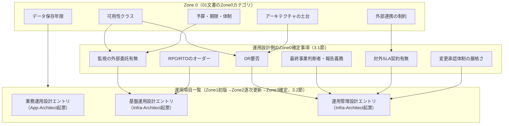
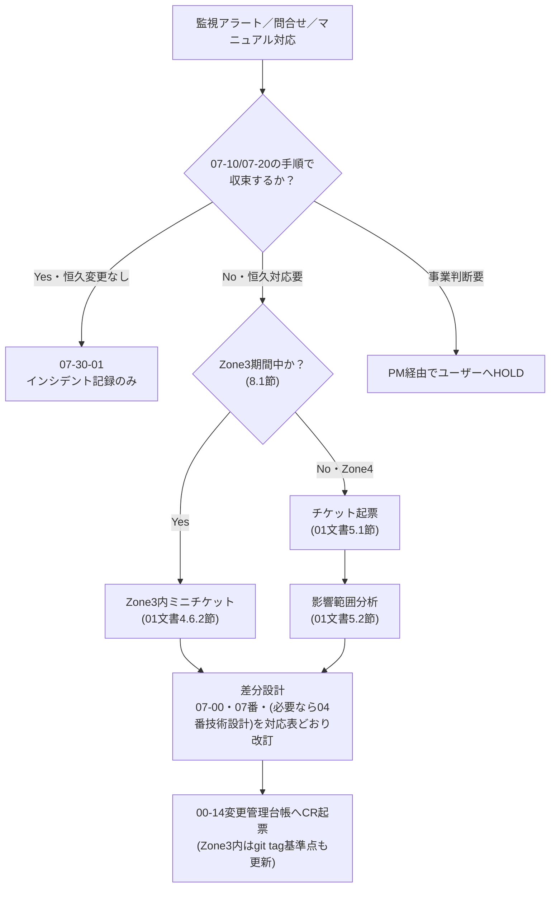

# AI駆動IPA標準フレームワーク 運用設計体系定義書

## 改訂履歴

| 版数 | 日付 | 改訂者 | 改訂内容 |
|------|------|--------|----------|
| 1.0 | 2026-09-10 | Infra-Architect | 初版作成。PMの検査により v2 文書群（01・02）から運用設計が丸ごと欠落していたことが判明したため、これを埋める文書として新設。運用設計の決定タイミング（Zone 0 / Zone 1レーンC）、運用設計の項目体系、運用設計書と運用手順書の1対1対応（07番内部構成）、リバース生成の可否判定、Zone 3→4境界のチェックリスト、Mode Bとの接続、運用の担い手を定義する |
| 1.1 | 2026-09-10 | Infra-Architect | PMが調査した実務資料を反映。(1) 4章を「業務運用設計／基盤運用設計／運用管理設計」の3分類を骨格として全面再構成し、v2エージェント体制（Infra-Architect／App-Architect／SRE）との対応、実務検討項目チェックリスト24件との照合表を追加。(2) 「運用項目一覧」を起点の台帳として新設し、Zone1レーンCで初版作成・Zone2で逐次更新・Zone3で確定するという既存の`SCR-ID`/`HB-ID`台帳パターンへの適合を根拠に位置づけ（4.6節）。(3) IPA共通フレームの廃棄（Disposal）プロセスを新規項目「システム廃止管理」として追加し、07番に`07-50_システム廃止`を新設（4.5節・5.2節）。(4) 5章の1対1対応表を新しい項目taxonomyに合わせて全面更新し、07-10（運用手順書）と07-20（マニュアル）を「実行主体がSRE/インフラか、業務部門/エンドユーザーか」で使い分ける設計原則を追加 |
| 1.2 | 2026-09-10 | Infra-Architect | ユーザーからの図版方針を反映。annotationのdoc-style-guideが定めるdrawio別紙規約（01・02文書では未継承）を踏まえ、運用フロー図（誰が・いつ・何をするかのスイムレーン）をdrawio別紙として作成する方針を5.5節に新設し、運用項目一覧→運用フロー図→運用手順書→台帳という文書の流れを4.6節・5.5節に明記した。図種別ごとの一般原則（システム構成図はdrawio、シーケンス図はMermaid等）は03文書に委ね、本書は運用領域固有の判断のみを記載した。6.2節の判定表に運用フロー図の行を追加し、10章にdrawio作図スキル未導入の残課題を追加した |
| 1.3 | 2026-09-10 | Infra-Architect | PM整合レビュー（03文書版1.2との突合）の指摘を反映。**(1) 参照切れの解消**: 3.2節・10章残課題#9で仮置きしていた運用項目一覧の台帳番号`00-XX`を、03文書3.2節が正式採番した`00-04_運用項目一覧.md`に確定し、残課題#9を解消済みとして削除した。**(2) 構造修正（重要）**: 03文書3.9節・3.6節備考により、運用設計書は04番（インフラ設計）ではなく**07番の単独文書`07-00_運用設計書`**として採番されていることが判明したため（v1版は04番に置く誤った前提で執筆していた）、4章・5章・6章・7章・8章・9章にわたり「04番の運用設計書」という記述をすべて「07-00_運用設計書」に訂正し、04番（04-01〜04-11、03文書3.6節）は監視・バックアップ・DR等の**技術設計**（インフラの実装内容）を担い、07-00は**運用の主体・手順への接続**を担うという役割分担を明記した。これに伴い9.1節の生成主体表を03文書3.9節の生成主体表（07番全体はSRE、07-50のみInfra-Architect/SRE）と整合させ、残課題#2（04番配置先の未確定）を解消済みとして削除した。**(3) 節番号を特定しない委譲表現の解消**: 「03文書が定める」「03文書に従う」等、参照先の節番号を伴わない記述をすべて洗い出し、03文書8.5節（図種別）・9.1節（採番規則）・9.3節（別紙配置・命名）・3.2節（00-04）・3.6節（04番カタログ）・3.9節（07番の枠）・3.12節（廃棄プロセス）・5章（詳細設計粒度）のいずれかを名指しする形に置き換えた。**(4) 別紙命名の訂正**: 5.5節の運用フロー図の別紙ファイル名を、03文書9.3.1節・9.3.2節が定める命名規則（`{項番}_{文書名}_別紙{N}.drawio`、Nは文書内通し番号）に合わせ、`07-00_運用設計書_別紙{N}.drawio`形式に統一した |
| 1.4 | 2026-09-11 | Infra-Architect | 01文書版1.3・02文書版1.4の申し送りを反映する最終整合。**(1) 01文書版1.3（Zone3再定義）との整合**: GZ2の再定義（リリース候補確定＝コードフリーズとリリース実施の分離、01文書4.6.1節）に伴い、7.1節の06番・07番の生成順序を訂正（旧版は07番が06番より先行する前提だったが、06番（06-01〜04）はGZ2以前＝リリース前、07番はリリース実施後のZone3という順序に訂正）。8章に新設8.1節「Zone3期間中の運用事象とZone4（Mode B）の使い分け」を追加し、01文書4.6.2節のZone3内ミニチケット経由の運用対応（一次対応・ポストモーテムでのチケット化判定・記録先）を明記した（旧8.1〜8.4は8.2〜8.5に繰り下げ）。4.5節の廃棄プロセス判断理由3を「初回リリース時点（GZ2/GZ3）」という旧いGZ2解釈から「初回リリース実施の時点（01文書4.6.1節）」に訂正。**(2) 02文書版1.4（15章#21）への回答**: 新設3.2.1節に、`ops-item-guard.js`が検知すべき監視・バックアップ・DR関連IaCファイル、およびジョブスケジューラ定義ファイルの典型的なパス・命名パターンをTerraform／CloudFormation／CDK別に一覧化し、機械判定できない範囲（体制・判断基準を内容とする項目）を明記して提供した。**(3) 自己点検（03文書との不整合指摘の再確認）**: `00-04`起票主体（App-Architect起票、3.2節）・`07-10`の粒度（分類項目ごとの固定11文書、5.2節）・`07-20`の生成主体（App-Architect主導＋SRE、9.1節）はいずれもPM決定により04文書側の記述が正であることを確認し、変更なし。**(4) 誤参照の訂正**: 1.2節の「01文書8章の対象外事項」を、01文書の実際の該当箇所である「01文書10章残課題#8」に訂正した（01版1.3で章構成・残課題番号が変わったため現物を確認のうえ訂正） |

---

## 1. はじめに

### 1.1 目的

本書は、aiDev フレームワーク v2 における**運用設計**の体系を定義する。運用設計とは、システムを安定稼働させ、障害時に迅速に復旧し、日々の運用作業を継続可能にするために、稼働前に決めておくべき事項の総体を指す。

本書は `docs/v2/01_プロセス定義書.md`（以下「01文書」）および `docs/v2/02_実行基盤アーキテクチャ.md`（以下「02文書」）を前提とし、両文書が扱わなかった運用設計の論点について**終着点となる定義**を与える。すなわち、本書が定める事項（運用設計の項目体系、決定タイミングの切り分け、設計書と手順書の対応関係、リバース可否の判定）について、他文書への「〜に従う」という丸投げは行わない。01文書・02文書が既に定めた原則（ゾーン構造、決定ログの書式、成果物番号体系、統一実行ループ、Gate判定基準）はそのまま引用し、変更・再定義はしない。

### 1.2 適用範囲

- Mode A（Zone 0〜Zone 3）における運用設計関連の決定タイミングと成果物
- Mode B（Zone 4）における運用と開発の境界、および運用事象のチケット化経路
- `docs/07_運用・保守/` の内部構成（単独文書`07-00_運用設計書`、および`07-10`〜`07-50`のサブディレクトリと番号体系）、および `docs/04_インフラ設計/` 配下の技術設計文書（監視設計・バックアップ設計・DR設計等）との参照関係
- 運用設計に関わるエージェント（Infra-Architect、App-Architect、SRE）と人間の役割分担

適用範囲外とする事項は次のとおりである。

- `docs/` 配下 00〜07 の項番体系そのものの再定義（02文書 4.2.1節、および並行して作成される `docs/v2/03_成果物体系定義書.md`（以下「03文書」、App-Architect作成）が正本である）
- 成果物カタログ全体・詳細設計の粒度・案件類型別の差分（03文書の責務）
- Claude Code の機構実装そのもの（hooks・Skill・permissionsの具体的な実装コード。02文書の責務。本書は「機構に何を要求するか」までを書く）
- 業種別ガイドライン（三省二ガイドライン等）に固有の運用要件（01文書10章残課題#8と同様、本書の対象外とし、案件個別に `00_プロジェクト管理・ガバナンス/` 配下へ追加する運用とする）
- システム移行（`06_移行・導入`）そのものの計画・手順（02文書4.2.1節が定める既存の項番の責務。4.4節で除外理由を述べる）

### 1.3 関連文書

| 文書 | 位置づけ |
|------|---------|
| 01_プロセス定義書（`docs/v2/01_プロセス定義書.md`） | ゾーン構造・決定ログ書式・Gate判定基準の正本。本書はこれに従う |
| 02_実行基盤アーキテクチャ（`docs/v2/02_実行基盤アーキテクチャ.md`） | 成果物番号体系（4.2.1節）・決定ログ機構（8章）・リバース生成エンジン（9章）・`SCR-ID`/`HB-ID`台帳パターン（10.1節）の正本。本書はこれに従う |
| 03_成果物体系定義書（`docs/v2/03_成果物体系定義書.md`、App-Architect作成、並行作成中） | 成果物カタログ全体・項番体系・詳細設計粒度の正本。本書は07番の内部構成のみを定義し、03文書の項番体系と衝突する場合は03文書を優先する |
| annotation参考実装 `docs/07_運用・保守/`、`docs/03_基本設計/03-30_インフラ設計/03-30-07_運用設計書/` | 運用設計書と運用手順書を1対1対応させる構成の先行事例。本書はこの対応関係の思想を継承しつつ v2 向けに調整する |
| v1 運用設計ガイド（`.claude/docs/10_facilitation/2.3_設計フェーズ/2.3.12_運用設計ガイド.md`） | 監視メトリクス・アラート閾値・バックアップ戦略の記載レベル感の参考 |
| 実務における運用設計の一般的な整理（業務運用設計／基盤運用設計／運用管理設計の3分類、運用項目一覧を起点とする文書体系） | PMが外部の実務資料調査に基づき提供した、システム運用設計として業界で広く使われている整理。本書4章・5章の骨格として採用する（採用理由は4.1節） |

### 1.4 用語

01文書・02文書の用語集は再定義しない。本書固有の用語のみ以下に示す。

| 用語 | 定義 |
|------|------|
| 運用設計 | 監視・ログ・バックアップ・DR・インシデント対応・変更管理等、稼働後の運用を成立させるために決めておくべき事項の総体。本書4章で体系化する |
| 業務運用設計 | 業務アプリケーションの起動・停止、ジョブ運用、異常終了時の復旧、ユーザー側の運用業務を対象とする運用設計の分類（4章） |
| 基盤運用設計 | サーバ・NW・OS・ミドルウェアを安定稼働させるための運用方法を対象とする運用設計の分類（4章） |
| 運用管理設計 | 運用全体のルール・体制、インシデント管理・変更管理・リリース管理・構成管理・情報セキュリティ管理・SLA管理を対象とする運用設計の分類（4章） |
| 運用項目一覧 | 3分類の各項目を、当該プロジェクト向けに具体的なタスク単位まで洗い出した台帳。運用フロー図・運用手順書・台帳（記録）という後続文書群の質を左右する起点として位置づける（4.6節） |
| 運用設計書 | 運用設計の内容を記述した単独文書。`docs/07_運用・保守/07-00_運用設計書.md`として置かれる（03文書3.9節が正式に採番。5章） |
| 運用手順書 | 運用設計書の内容を、SRE/インフラが実行する作業手順に落とした文書。`docs/07_運用・保守/07-10_運用手順書/` 配下に置く（5章） |
| マニュアル（07-20） | 業務運用設計の内容を、業務部門・エンドユーザーが実行する操作に落とした文書。`docs/07_運用・保守/07-20_マニュアル/` 配下に置く（5章） |
| 廃棄（Disposal） | IPA共通フレーム2013のテクニカルプロセスに含まれる、システムの終了・データ廃棄・証跡保存を扱うプロセス。本書4.5節で運用管理設計の1項目として位置づける |
| SLO / SLA | Service Level Objective（内部目標）／ Service Level Agreement（対外契約） |
| RTO / RPO | Recovery Time Objective（目標復旧時間）／ Recovery Point Objective（目標復旧時点） |

### 1.5 文書番号の名前空間についての注意

本書の文書番号「V2-04」は `docs/v2/` 配下のフレームワークメタ文書の通し番号であり、個別プロジェクトの成果物ディレクトリである `docs/04_インフラ設計/`（02文書4.2.1節）の項番「04」とは**別の名前空間**である。本書中で「04番」と言及する場合は特記なき限り後者（プロジェクト成果物のインフラ設計ディレクトリ）を指す。

---

## 2. 本文書の位置づけと、欠落していた理由

### 2.1 欠落の事実確認

PMによる検査の結果、01文書・02文書の両方に「運用設計」という語が0件であることが確認された。07番（運用・保守）に運用手順書を置く記述（02文書4.2.1節）は存在するが、その手前にあるべき運用設計を定義する文書種別そのものが、01文書のゾーン定義にも、02文書の成果物区分一覧にも登場しない。

### 2.2 構造的な理由

本フレームワークの中核主張は「動くものを作るコストが低いので、実物を出してから文書化するほうが正確である」という点にある（01文書1.1節）。この主張は、画面・API・データモデルのように**実装物と設計内容が一対一で対応し、実装を見れば設計の中身をほぼ再構成できる領域**では成立する。しかし運用設計は、この前提が部分的にしか成立しない領域である。

- 監視の閾値やバックアップのスケジュールは IaC（CloudWatch Alarms、AWS Backup Plan等）に実体として現れるため、画面やAPIと同様に「実物から逆生成できる」領域である
- しかし、インシデント発生時に誰が対応するか、どの基準でエスカレーションするか、事業影響をどう判断するかといった情報は、コードにもIaCにも決して現れない
- さらに（1.1版で追加判明した論点として）業務部門が行う定常作業や、ユーザー側の運用業務のように、**そもそもインフラのIaCという対象領域自体に属さない**運用項目が存在する。これは基盤運用設計（従来Infra-Architectが単独で担ってきた領域）だけでは運用設計の全体像を捉えられないことを意味する

01文書・02文書はいずれも「実装物＋決定ログから逆生成する」という設計の枠組みを、画面・API・データモデルという「実物対応が成立する領域」を主眼に据えて構築した。運用設計は、この枠組みの適用対象として想定された領域と部分的にしか重ならず、かつ担当領域が単一のアーキテクトに閉じない**境界的な領域**であるため、検討対象から漏れた、というのが欠落の構造的な理由である。

補足すると、01文書4.3節はZone 0の対象として「非機能の骨格（マルチテナントか否か、想定規模のオーダー、可用性クラス、データ主権・保存年限）」を既に挙げている。可用性クラスやデータ保存年限は、運用設計の入力そのものである。しかし01文書はこれを「非機能要件の一般論」として記述するに留まり、これが運用設計の具体的な文書体系に接続される経路までは書いていない。本書3章・4章はこの接続を行う。

### 2.3 本書が埋める範囲、埋めない範囲

本書が終着点として定義する事項は次のとおりである。

- 運用設計の決定タイミング（3章）
- 運用設計として決めるべき項目の一覧（業務運用設計・基盤運用設計・運用管理設計の3分類）とその内容、および起点となる運用項目一覧の位置づけ（4章）
- 運用設計書と運用手順書・マニュアルの対応関係、および07番の内部構成（5章）
- 運用関連の文書種別ごとのリバース可否判定（6章）
- Zone 3→4境界での引き渡し内容（7章）
- 運用事象とMode Bの接続（8章）
- 運用の担い手（9章）

本書が定義しない事項は次のとおりである。

- `docs/` 00〜07全体の項番体系そのもの（02文書4.2.1節、03文書）
- 04番・05番配下の運用設計以外の詳細設計粒度（03文書）
- hooks・Skillの実装コード（02文書。本書は要求のみ記す）

---

## 3. 運用設計の決定タイミング

### 3.1 切り分けの原則

01文書4.3節は、Zone 0に置いてよい決定を「後から変えたときの手戻りコストが非線形に跳ねる決定」に限定し、「念のため今決めておく」ことを明示的に禁止している（MUST NOT）。運用設計についてもこの原則をそのまま適用する。**運用設計固有の新しいZone 0カテゴリを追加するのではなく、01文書が既に定義した5つのZone 0カテゴリが、運用設計のどの項目に具体化するかを明示する**、という整理を取る。

| 01文書のZone 0カテゴリ | 運用設計への具体化 |
|---|---|
| 非機能の骨格（可用性クラス、データ主権・保存年限） | 可用性クラスは監視の重大度区分・DR要否の前提になる。データ保存年限はログ・バックアップの保持期間、およびシステム廃止時のデータ廃棄タイミングの下限を規定する |
| 法規制・コンプライアンス・セキュリティの前提 | 監査ログの改ざん防止要否、インシデント発生時の対外報告義務の有無、データ廃棄の法的要件を規定する |
| アーキテクチャの土台（クラウド、認証基盤、データストアの種別） | マルチリージョン構成の要否（DR）、IAM統合の方式（アクセス管理）を規定する |
| 外部連携の相手と、相手都合で動かせない制約 | 外部SLA契約がある場合、対外SLA・監視の外部委託有無に波及する |
| 予算・期限・体制 | 監視の外部委託有無、運用要員数の前提を規定する |

**選別基準**: 運用設計項目のうち、上表のいずれかのZone 0カテゴリに直接紐づき、かつ「後から覆すとアーキテクチャの作り直しを要する」ものだけをZone 0で扱う。それ以外はZone 1レーンC（または後述の運用項目一覧の逐次更新）に送る。

### 3.2 運用項目一覧の位置づけ（起点となる台帳）

実務では、運用設計は「まず全運用タスクを洗い出した運用項目一覧を作り、その質が後続の運用フロー図・運用手順書・台帳の質を決める」という進め方が定着している。本フレームワークにこの起点文書をどう位置づけるかは、次の3案を比較して判断する。

| 案 | 内容 | 問題点 |
|---|---|---|
| A: Zone 0で確定 | 全運用タスクを不可逆決定として前倒しで洗い出す | 01文書4.3節「念のため今決めておく」の禁止に抵触する。大半のタスク（個々のバッチジョブの存在等）は「後から変えると全損する」性質を持たず、Zone 0の肥大化（01文書9.2節「形骸化のサイン」筆頭項目）を招く |
| B: Zone 3で実物からリバース生成のみ | 実装完了後にIaC・監視設定・スクリプトから機械的に洗い出す | 業務部門が行う定常作業やユーザー側の運用業務など、**実装物として一切現れない運用タスク**を構造的に見落とす（6.3節「条件B」と同じ問題）。PMの懸念どおり「漏れる」 |
| C（採用）: Zone 1レーンCで初版作成し、Zone 2で逐次更新し、Zone 3で確定する「生きた台帳」 | 02文書10.1節が`SCR-ID`/`HB-ID`（`prototypes/SCREEN_ID_INDEX.md`、`00-02_HBトレーサビリティ台帳.md`）で採用しているパターン——早期登録・逐次更新・Zone3確定——を運用項目一覧に適用する | 台帳運用の負荷が発生するが、01文書5.5節1（トレーサビリティマトリクスの都度追記、まとめ書き禁止）と同種の運用でありフレームワーク全体で既に許容されている負荷である |

**採用: 案C**。理由は次の3点である。

1. **既存パターンとの整合**: 02文書は既に「早期に軽量な台帳へ登録し、Zone3で正式化する」という設計判断を`SCR-ID`/`HB-ID`で行っている。運用項目一覧に同型のパターンを適用すれば、新しい台帳運用パターンを発明せずに済む
2. **「記述系文書」との区別**: 01文書4.4.4節はZone 1で「記述系文書（画面設計書・API設計書等の散文の設計文書）」を作ることを禁止している（MUST NOT）。運用項目一覧は個々のタスクをエントリとして列挙する**台帳**であり、決定ログや`00-02`台帳と同じ性質を持つ。散文で構成・手順を説明する記述系文書ではないため、01文書4.4.4節の禁止には抵触しない
3. **漏れの防止**: Zone 1のうちに（実装が存在しなくても）洗い出しに着手できるため、実装物に現れない業務運用タスクも取りこぼさない。Zone 2で機能が実装されるたびにエントリを追記する運用とすることで、Zone 3の段階で初めて洗い出す（案B）よりも網羅性が高い

**運用（MUST）**:

- 台帳ファイル名は `docs/00_プロジェクト管理・ガバナンス/00-04_運用項目一覧.md` とする（03文書3.2節が正式に採番済み。02文書が`00-02_HBトレーサビリティ台帳.md`を新規追加した前例と同型の位置づけである）
- 着手タイミング: Zone 0の運用関連決定（3.1節）が確定した直後、Zone 1レーンCの活動として初版を作成する
- 更新: Zone 2で機能・ジョブ・監視項目が実装されるたびに、対応するエントリを追記または状態更新する（まとめ書き禁止。01文書5.5節1と同じ理由）
- 確定: Zone 3のリバース時に、実物（IaC、cron定義、監視設定）との突合により漏れ・過不足を検査し、全エントリを「確定済み」状態にする（7.2節のチェックリストに反映）
- エントリ形式: タスク名／分類（4章の項目のいずれか）／頻度／担当（誰）／根拠（紐づく決定ログIDまたは実装物のパス）／状態（Zone1着手／Zone2実装待ち／Zone3確定済み）
- 起票責任: 業務運用設計に属するエントリはApp-Architectが起票し、基盤運用設計・運用管理設計に属するエントリはInfra-Architectが起票する。SREは基盤運用設計エントリの実装状況を更新する（4.2節）

### 3.2.1 `ops-item-guard.js`が検知すべきIaCファイルの類型（02文書15章#21への回答・新設）

02文書版1.4は7.3節#9で`ops-item-guard.js`を新設した。このhookは`infra/**`配下の監視・バックアップ・DR関連IaC定義ファイル、および`src/**`配下のジョブスケジューラ定義ファイルの変更（`PostToolUse`、Edit|Write）を検知し、対応する`00-04_運用項目一覧.md`のエントリが存在しない場合に警告する（`exit 0`、ブロックはしない）。「どのファイルが変更されたら`00-04`への登録が必要になるか」の判定条件は運用の知識を要するため04文書側に委ねられており（02文書15章#21）、本節でその具体例を提供する。

**前提（正直な限界の明記）**: 以下はIaCツール別の**典型的な**パス・命名パターンの例であり、プロジェクトのディレクトリ構成・命名規則によって実際の配置は異なりうる。パターンに一致しない配置（汎用スタックへの混在、独自の命名規則等）は`ops-item-guard.js`のパスマッチングでは検知できない。この限界を認めたうえで、検知精度を上げるには「パスパターン」と「IaCのリソース型・属性名でのgrep」を併用することが望ましい（MAY）。

| 運用項目（4.3節） | 変更検知の対象カテゴリ | Terraform | CloudFormation | CDK（TypeScript） | 機械判定の限界 |
|---|---|---|---|---|---|
| I1 監視運用（監視対象・ダッシュボード・アラート） | 監視・アラート定義 | パス例: `infra/terraform/**/monitoring/*.tf`。リソース型: `aws_cloudwatch_metric_alarm`, `aws_cloudwatch_dashboard`, `aws_sns_topic`（通知先） | パス例: `infra/cloudformation/templates/*monitoring*.yaml`\|`*.json`。リソース型: `AWS::CloudWatch::Alarm`, `AWS::CloudWatch::Dashboard`, `AWS::SNS::Topic` | パス例: `infra/cdk/lib/*monitoring-stack.ts`。コンストラクト: `new cloudwatch.Alarm(`, `new cloudwatch.Dashboard(` | ファイル名に`monitoring`/`alarm`を含まず汎用スタックに混在配置された場合は検知できない |
| I3 バックアップ・リストア運用 | バックアップ計画・世代管理 | パス例: `infra/terraform/**/backup/*.tf`。リソース型: `aws_backup_plan`, `aws_backup_vault`, `aws_backup_selection` | パス例: `infra/cloudformation/templates/*backup*.yaml`。リソース型: `AWS::Backup::BackupPlan`, `AWS::Backup::BackupVault`, `AWS::Backup::BackupSelection` | パス例: `infra/cdk/lib/*backup-stack.ts`。コンストラクト: `new backup.BackupPlan(`, `new backup.BackupVault(` | RDS等のDB定義ファイルに埋め込まれた`backup_retention_period`（TF）／`BackupRetentionPeriod`（CFn）属性の変更は、専用ファイルを持たないためパスパターンでは検知できず、属性名でのgrepを別途要する |
| I4 BCP・DR | マルチリージョン構成・フェイルオーバー | パス例: `infra/terraform/**/dr/*.tf`または`infra/terraform/environments/dr/**`。リソース型: `aws_route53_health_check`, `aws_db_instance`（`replicate_source_db`によるクロスリージョンリードレプリカ）, `aws_s3_bucket_replication_configuration` | パス例: `infra/cloudformation/templates/*dr*.yaml`。リソース型: `AWS::Route53::HealthCheck`、`AWS::RDS::DBInstance`（`SourceDBInstanceIdentifier`でクロスリージョン判定） | パス例: `infra/cdk/lib/*dr-stack.ts`。コンストラクト: `new route53.CfnHealthCheck(` | DR構成は複数リージョン・複数ディレクトリ（リージョン別スタック等）にまたがることが多く、単一ファイルパスに閉じないため、パスパターンのみでの機械判定は精度が低い |
| B3・M9 ジョブ運用・スケジュール定義 | バッチ・定期実行ジョブの定義 | パス例: `infra/terraform/**/scheduler/*.tf`。リソース型: `aws_cloudwatch_event_rule`（`schedule_expression`属性）, `aws_scheduler_schedule`（EventBridge Scheduler） | パス例: `infra/cloudformation/templates/*scheduler*.yaml`。リソース型: `AWS::Events::Rule`（`ScheduleExpression`）, `AWS::Scheduler::Schedule` | パス例: `infra/cdk/lib/*scheduler-stack.ts`。コンストラクト: `new events.Rule(`（`schedule: events.Schedule...`） | `src/**`側でアプリケーションコードに埋め込まれたジョブ定義（`src/jobs/**`のcron設定オブジェクト、Serverless Frameworkの`serverless.yml`内`functions.*.events[].schedule`、Kubernetesの`k8s/**/cronjob-*.yaml`の`kind: CronJob`等）はフレームワークごとに記法が異なり、単一のパスパターンでは捕捉しきれない。02文書9.1.1節の静的解析アダプタと同様、フレームワーク別に検知ルールを拡張していく方式が必要である |

**機械判定できないもの（正直な明記）**: 上表はIaC・ジョブ定義という「実物」に現れるカテゴリに限定される。B5（ユーザー側運用業務）・M2（インシデント管理の体制）・M10（システム廃止管理）のように体制・判断基準を内容とする項目（4.3節、6.3節「条件B」）は、そもそも実物に現れないため`ops-item-guard.js`の検知対象になり得ない。これらは決定ログ・`00-04`への事前記録（6.3節MUST）に頼るほかなく、hookによる機械的な補足は原理的に不可能である。

### 3.3 決定タイミングの全体像



---

## 4. 運用設計の項目体系

### 4.1 3分類の採用

実務では運用設計を「業務運用設計」「基盤運用設計」「運用管理設計」の3分類に整理するのが定着した進め方である。本書はこれを4章の骨格として**採用する**。

| 分類 | 対象 | 内容 |
|---|---|---|
| 業務運用設計 | 業務アプリケーション | アプリの起動・停止、ジョブ運用、異常終了時の復旧、ユーザー側の運用業務 |
| 基盤運用設計 | サーバ・NW・OS・ミドルウェア | 基盤を安定稼働させるための運用方法 |
| 運用管理設計 | 運用全体の仕組み | ルール・体制の整備、運用の統制と改善。インシデント管理、変更管理、リリース管理、構成管理、情報セキュリティ管理、SLA管理 |

**採用理由**: annotation参考実装の`03-30-07_運用設計書`（8サブ項目）は、実質的には基盤運用設計と運用管理設計の一部（インシデント管理、コスト管理）に偏っており、業務運用設計に相当する項目（ジョブ運用、ユーザー側運用業務、稼働統計運用）を持たなかった。1.0版の本書もこの偏りを引き継ぎ、12項目のうち業務側の項目を明示的に扱っていなかった。3分類を骨格に採用することで、この偏りを構造的に解消する。加えて、3分類は「誰が担当すべきか」（4.2節）を機械的に決めやすくするという実務上の利点も持つ。

### 4.2 3分類とv2エージェント体制の対応

| 分類 | 主担当 | 連携が必要な理由 |
|---|---|---|
| 業務運用設計 | App-Architect（レーンB主担当）＋ Infra-Architect | アプリの起動・停止手順、異常終了時の業務データ整合性回復、業務部門の運用フローの設計にはビジネスロジックとデータモデルの知識を要する。**Infra-Architect単独では書けない**。01文書のレーンB/C分離（4.4.1節）と整合させ、レーンBが主体的に関与する |
| 基盤運用設計 | Infra-Architect ＋ SRE | 従来のannotation `03-30-07`相当。インフラ構成の知識が中心であり、Infra-Architect単独で完結できる |
| 運用管理設計 | Infra-Architect（体制・ルールの設計）＋ PM（体制決定に関するユーザー合意形成の進行）＋ Consultant（事業影響を伴う判断基準の助言） | 変更管理・インシデント管理の「体制」は事業判断を伴うため、Infra-Architect単独で決めきれない部分がある（3.1節のZone0該当決定と対応する） |

**MUST**: 業務運用設計の項目は、Zone 1のレーンB⇔C同期点（01文書4.4.2節が既に定義する「外部連携の制約が判明したとき」の同期点）を転用し、App-Architectが起票した運用項目一覧のエントリ（3.2節）とInfra-Architectのインフラ制約を突き合わせる。**新しいミニゲートを追加しない**（01文書・02文書の既存の同期点機構をそのまま使う）。

### 4.3 項目一覧

#### 4.3.1 業務運用設計

| # | 項目 | 決まる場所 | 決定ログに残すもの | 実物のどこに現れるか（Zone3リバース元） |
|---|---|---|---|---|
| B1 | 業務基本方針・対象業務概要 | Zone1レーンB | 対象業務の範囲、運用対象外とする業務の明示 | 該当なし（記述型。運用項目一覧のヘッダ情報として管理） |
| B2 | アプリケーション起動・停止運用 | Zone1レーンB＋C | メンテナンスモードの要否とその判断基準 | デプロイスクリプト、ヘルスチェック設定 |
| B3 | ジョブ運用（JOB管理設計） | Zone1レーンB＋C | ジョブの異常終了時のリトライ・アラート方針 | バッチスケジューラ設定（EventBridge、cron等） |
| B4 | 稼働統計運用 | Zone1レーンB | 集計するビジネスメトリクスの種類 | ダッシュボード定義、集計バッチのコード |
| B5 | ユーザー側運用業務 | Zone1レーンB | 業務部門が担う定常作業の範囲 | 実物にはほぼ現れない（体制・業務プロセス情報のため。6.3節「条件B」該当） |
| B6 | アプリケーション異常時の復旧（業務データ整合性回復） | Zone1レーンB | 業務データの不整合検知基準、手動補正の要否 | 補正用バッチ・管理画面のコード |

#### 4.3.2 基盤運用設計

| # | 項目 | 決まる場所 | 決定ログに残すもの | 実物のどこに現れるか（Zone3リバース元） |
|---|---|---|---|---|
| I1 | 監視運用（監視対象の詳細を含む） | Zone0（外部委託有無）＋Zone1C（閾値等） | 外部委託の有無とその理由 | CloudWatch Alarms等の監視IaC定義、SNS Topic構成、ダッシュボード定義 |
| I2 | ログ運用 | Zone0（保存年限・改ざん防止要否）＋Zone1C（レベル・フォーマット） | 保存年限の根拠となる法令・契約条項 | ログ基盤の保持設定（S3ライフサイクル、CloudWatch Logs保持期間）のIaC |
| I3 | バックアップ・リストア運用 | Zone0（RPO/RTOのオーダー）＋Zone1C（頻度・世代管理） | RPO/RTO目標値と、その根拠 | バックアップIaC定義（AWS Backup Plan、RDSスナップショット設定） |
| I4 | BCP・DR（災害時の対応方針を含む） | Zone0（DR要否）＋Zone1C（訓練頻度・手順詳細） | DR要否の判断根拠 | マルチリージョン構成のIaC、DNSフェイルオーバー設定 |
| I5 | キャパシティ運用（基盤の容量管理） | Zone1Cのみ（Zone0は01文書の既存項目「想定規模のオーダー」を参照） | （新規なし） | AutoScaling設定のIaC |
| I6 | パッチ・脆弱性対応 | 原則Zone1C（契約上のSLAがある場合のみZone0） | 契約上のパッチ適用SLAがある場合、その内容 | パッチ適用の自動化スクリプト、脆弱性スキャンのCI設定 |
| I7 | アカウント・アクセス管理運用 | Zone0（特権アクセス承認要否）＋Zone1C（IAM詳細） | 特権アクセス承認フローの要否とその根拠 | IAMポリシー・ロール定義のIaC |

#### 4.3.3 運用管理設計

| # | 項目 | 決まる場所 | 決定ログに残すもの | 実物のどこに現れるか（Zone3リバース元） |
|---|---|---|---|---|
| M1 | 運用体制・基本方針 | Zone0（体制・予算の一部）＋Zone1C | 運用体制の人数・役割分担の前提 | 該当なし（annotation `03-30-07-00`相当の記述型セクション） |
| M2 | インシデント管理 | Zone0（最終判断者・報告義務）＋Zone1C（フロー詳細） | 事業判断者の指名、対外報告義務の有無とその根拠 | 実物にはほぼ現れない（6.3節「条件B」該当） |
| M3 | 変更管理 | Zone0（承認体制の厳格さ） | 承認体制の厳格さと、その根拠 | Git履歴、`00-14_変更管理台帳.md`のCR記録 |
| M4 | リリース管理 | Zone1C | リリース判定基準、ロールバック方針（01文書5.4節と重複回避） | CI/CDパイプライン定義（IaC） |
| M5 | 構成管理 | Zone1C | （新規なし。決定ログ自体が構成管理台帳の役割を兼ねる） | IaCのバージョン管理履歴、`00-01_成果物構成カタログ.md` |
| M6 | 情報セキュリティ管理（運用ポリシーの運用） | Zone0（法規制前提）＋Zone1C | 準拠すべきセキュリティ基準・ポリシーの根拠 | security-guard（02文書5.1節）の検査設定 |
| M7 | SLA管理 | Zone0（対外SLA契約）＋Zone1C（内部SLO閾値） | 対外SLA契約条件 | 監視ダッシュボードのSLO定義 |
| M8 | コスト監視運用 | Zone1Cのみ（予算上限は01文書のZone0を参照） | （新規なし） | AWS Budgets、コスト配分タグのIaC |
| M9 | スケジュール・定常作業管理 | Zone1Cのみ | （なし） | cron/EventBridge Rule等の定期実行IaC定義 |
| M10 | システム廃止管理（廃棄プロセス） | Zone0（データ廃棄の法的要件）＋Zone1C（手順） | 廃棄トリガの判断基準、法定保存期間経過後のデータ廃棄義務 | 実物にはほぼ現れない（4.5節で詳述） |

### 4.4 実務チェックリストとの照合

PMが提示した実務上の検討項目24件について、上記項目一覧への採用・除外を次のとおり整理する。

| チェックリスト項目 | 採用先 | 備考 |
|---|---|---|
| 運用体制 | M1 | - |
| アカウント管理方法 | I7 | - |
| セキュリティポリシー | M6 | - |
| ジョブ運用 | B3 | - |
| バックアップ・リストア運用 | I3 | - |
| 監視運用 | I1 | - |
| ログ運用 | I2 | - |
| 稼働統計運用 | B4 | - |
| 移行 | **除外** | 02文書4.2.1節が「06 移行・導入」を独立項番として既に定義済み。運用設計に含めると06番・07番で責務が重複するため対象外とする |
| BCP・DR | I4 | - |
| 基本方針 | M1に統合 | - |
| 対象システム・業務の概要 | B1に統合 | - |
| システムの管理項目 | M1・M5に分割統合 | 体制に関する記述はM1、資産・構成管理に関する記述はM5 |
| スケジュール | M9 | - |
| 定常作業の詳細 | M9（基盤）＋B3・B5（業務） | 基盤側の定常作業はM9、業務側の定常作業はB3・B5に振り分ける |
| 障害発生時の手順 | M2（体制）＋I1（検知） | インシデント管理の体制部分と、監視運用の検知部分に分割する |
| 監視対象の詳細 | I1に統合 | - |
| JOB管理設計 | B3に統合 | ジョブ運用と同一 |
| 災害時の対応方針 | I4に統合 | BCP・DRと同一 |
| SLA管理 | M7 | - |
| 変更管理 | M3 | - |
| リリース管理 | M4 | - |
| 構成管理 | M5 | - |
| インシデント管理 | M2 | - |

**追加**: チェックリストに含まれていなかった「システム廃止管理」（M10）を、IPA共通フレーム2013の廃棄プロセスへの対応として新規に追加した（4.5節）。

### 4.5 廃棄（Disposal）プロセスの位置づけ

IPA共通フレーム2013のテクニカルプロセスには「廃棄（Disposal）」が明示的に含まれるが、01文書・02文書には「廃棄」の語が0件であることをPMが指摘している。本書は次のとおり位置づける。

**設計判断**: 廃棄プロセスを運用管理設計の項目M10「システム廃止管理」として位置づけ、07番の内部構成に新設バケット`07-50_システム廃止`（5.2節）を設ける。

**判断理由**:

1. データ主権・保存年限は既に01文書4.3節のZone 0対象であり、法定保存期間の経過後にデータを廃棄する義務はこの既存決定から直接導かれる。新しいZone 0カテゴリを追加する必要はなく、既存決定の下流に位置づければ足りる
2. 廃棄は「システムの終了」という運用ライフサイクルの最終段階であり、`07_運用・保守`が運用ライフサイクル全体を扱う項番であることと整合する（annotation・02文書ともに07番の役割を「運用・保守」と定義しており、終了もこの範囲に含めるのが自然である）
3. 廃棄計画そのもの（いつ・どうやってシステムを終了するか）は、多くの場合、初回リリース実施の時点（01文書4.6.1節が定めるGZ2 GO後のコードフリーズからリリース実施を経てZone3開始に至るまでの間。版1.4で訂正。旧版は「初回リリース時点（GZ2/GZ3）」としていたが、01文書版1.3がGZ2をリリース候補確定＝コードフリーズに再定義し、実際のリリース実施をGZ2から分離したため、本書もこれに合わせて訂正した）ではまだ意思決定されていない。したがって`07-00_運用設計書`には「廃棄の判断基準・データ廃棄の法的要件」という**方針**のみを記載し、実際の廃棄手順（07-50）はシステムの終了が具体的に決まった時点で初めて内容を充足させる、という2段階の扱いとする（生成タイミングは03文書3.9節・3.12節が定めるとおりZone4である）

**03文書との境界に関する確認**: `07-50`という項番の存在と、その中身（記載事項の詳細）を04文書（本書）が定めるという役割分担は、03文書3.12節が明示的に確認済みである（「04文書は`07-50`という項番の存在を前提に中身を執筆すること」）。したがって項番自体の帰属に委譲すべき論点は残らない。ただし、廃棄計画書がデータモデル（App-Architect側の責務、例えば論理削除・物理削除の実装方式）とどこまで重複するかという記載内容レベルの重複調整は、03文書5章（詳細設計書の粒度規定）が定める04-D/05-D等のモジュール粒度、およびApp-Architect側の設計判断と個別にすり合わせる必要がある。本書はこの記載内容の重複調整を完了させる立場にないため、**残課題として明記する**（10章）。

### 4.6 運用項目一覧という起点文書の役割

3.2節で位置づけた運用項目一覧は、4.3節の23項目（B1〜B6、I1〜I7、M1〜M10）を当該プロジェクト向けに具体的なタスク単位まで洗い出したものである。例えば項目B3（ジョブ運用）は、プロジェクトごとに「夜間バッチAのリトライ方針」「月次集計バッチBの異常検知基準」といった個々のエントリに展開される。

**運用項目一覧が後続文書の質を決める理由**: 運用フロー図（誰が・いつ・何をするか）は運用項目一覧のタスク単位を前提に描かれ、運用手順書・マニュアルは運用フロー図の各ステップを具体化したものである。運用項目一覧に洗い出し漏れがあれば、その漏れは運用フロー図にも手順書にも伝播し、Zone 3のリバース時に「実装は存在するが手順書に記載がない」という逆差分（02文書9.3節）として顕在化する。したがって、**運用項目一覧の網羅性チェックは、7.2節のZone3→4移行チェックリストの中核項目の一つとする**（MUST）。

**運用フロー図の位置づけ**: 運用項目一覧の各エントリのうち、複数の主体（SRE／業務部門／エンドユーザー／承認者等）にまたがるタスクは、そのままでは手順書に落としにくい。実務の定着した流れ（運用項目一覧 → 運用フロー図 → 運用手順書 → 台帳）に従い、複数主体にまたがるタスクは**運用フロー図（誰が・いつ・何をするかを表すスイムレーン図）**として一段可視化してから手順書に展開する。運用フロー図はMermaidのフローチャートではレーン表現が弱いため、**drawio形式の別紙として作成する**。配置・対応関係の詳細は5.5節で定める。図種別ごとの一般原則（どの図をdrawioにし、どの図をMermaidにするか）は03文書8.5.1節が定める表に従うものとし（同節は業務フロー図・運用フロー図をdrawio形式と明記済み）、本書は運用領域固有の判断（対象項目の絞り込みと07-00内での配置）のみを明示する。

---

## 5. 運用設計書と運用手順書の1対1対応

### 5.1 annotationの構成の継承と、v2での確定形（07-00への統合）

annotation参考実装は、運用設計書（`03-30-07_運用設計書`、8サブ項目、04番相当ディレクトリの配下）と運用手順書（`07-10_運用手順書`、8サブ項目）を1対1で対応させていた。v2はこの対応関係の思想を継承するが、**配置は04番ではなく07番に統合される**。03文書3.9節・3.6節備考が確定させたとおり、運用設計は v1（`0.1_成果物構成設計.md`）や本書1.0〜1.2版が暗黙に前提としていた「04番（インフラ設計）配下」ではなく、**`docs/07_運用・保守/07-00_運用設計書.md`という単独文書**として07番に位置づけられる（03文書3.6節備考「移行計画・運用設計は04番から除外し06番・07番に移す」）。

この確定に伴い、4.3節（B1〜B6, I1〜I7, M1〜M10）で洗い出した23項目は、**すべて`07-00_運用設計書`内のセクションとして記述される**。04番（04-01〜04-11、03文書3.6節）に残る監視設計（04-05）・バックアップ設計（04-06）・DR設計（04-07）等は、インフラの**技術的な実装内容**（何が構築されているか）を扱う文書であり、`07-00`の対応セクション（I1・I3・I4）は、その実装をどう**運用するか**（誰が・どの基準で）を扱う。両者の関係は5.1.1節で整理する。

07番の内部区分（`07-10_運用手順書` / `07-20_マニュアル` / `07-30_台帳・記録` / `07-40_定期見直し`）はannotationの構成をそのまま継承する。1.1版で導入した**「実行主体が誰か」**という軸（SRE/インフラが実行する手順は`07-10`、業務部門・エンドユーザーが実行する操作は`07-20`）も維持する。

#### 5.1.1 `07-00`と04番技術設計文書の役割分担

| 07-00のセクション | 対応する04番の技術設計文書（03文書3.6節） | 07-00が扱う内容 | 04番側が扱う内容 |
|---|---|---|---|
| I1 監視運用 | 04-05 監視設計 | 誰が監視するか、外部委託の有無、アラート受信後の一次判断基準 | 監視対象メトリクス・CloudWatch Alarms等の技術的定義 |
| I3 バックアップ・リストア運用 | 04-06 バックアップ設計 | RPO/RTO目標値の運用上の意味、リストア実施の承認フロー | バックアップ方式・世代管理の技術的定義 |
| I4 BCP・DR | 04-07 DR設計 | DR発動の判断基準・訓練の運用、事業継続の観点 | マルチリージョン構成等の技術的実装 |

**MUST**: `07-00`の該当セクションは、対応する04番文書への相対リンクを明記し、技術的定義（メトリクス名、閾値の実装値等）を重複して記載しない（MUST NOT重複記載）。技術的な実装内容が変更された場合、リンク先の04番文書を参照すれば足りる構成とする。

### 5.2 `docs/07_運用・保守/` の内部構成

**MUST**: `docs/07_運用・保守/` の内部は、単独文書`07-00`と5つの群（`07-10`〜`07-50`）で構成する。項番体系（`07-00`/`07-10`/`07-20`/`07-30`/`07-40`/`07-50`）は03文書3.9節が確定させた正本であり、本書はこれを再定義しない（MUST NOT再定義）。本節が定めるのは、各群の内側（3階層目）の内訳のみである。

```
docs/07_運用・保守/
├── 07-00_運用設計書.md                  # 単独文書。B1〜B6, I1〜I7, M1〜M10（4.3節）を全セクションとして格納
├── 07-10_運用手順書/                    # 基盤運用設計・運用管理設計のうちSRE/インフラが実行する項目
│   ├── 07-10-01_監視対応手順            # I1
│   ├── 07-10-02_障害対応手順            # M2（インシデント管理）
│   ├── 07-10-03_バックアップ・リストア手順  # I3
│   ├── 07-10-04_DR発動・訓練手順        # I4
│   ├── 07-10-05_ログ・監査対応手順      # I2
│   ├── 07-10-06_変更管理・リリース手順  # M3・M4（統合。5.4節で理由を述べる）
│   ├── 07-10-07_パッチ・脆弱性対応手順  # I6
│   ├── 07-10-08_アカウント・アクセス管理手順 # I7
│   ├── 07-10-09_キャパシティ管理手順    # I5
│   ├── 07-10-10_コスト監視対応手順      # M8
│   └── 07-10-11_構成管理手順            # M5
├── 07-20_マニュアル/                    # 業務運用設計のうち業務部門・エンドユーザーが実行する項目
│   ├── 07-20-01_アプリケーション起動・停止マニュアル  # B2
│   ├── 07-20-02_ジョブ運用マニュアル    # B3
│   ├── 07-20-03_稼働統計レポートマニュアル  # B4
│   ├── 07-20-04_ユーザー側運用マニュアル    # B5
│   └── 07-20-05_業務異常時復旧マニュアル    # B6
├── 07-30_台帳・記録/                    # 運用中に生成される記録
│   ├── 07-30-01_インシデント記録
│   ├── 07-30-02_SLA実績報告             # M7
│   └── 07-30-03_問合せ対応記録
├── 07-40_定期見直し/                    # M9（スケジュール・定常作業）、SLOレビュー、権限棚卸し等の実施記録
└── 07-50_システム廃止/                  # M10（新設、4.5節）
    ├── 07-50-01_システム廃止手順
    └── 07-50-02_データ廃棄・証跡記録
```

**生成タイミング**（03文書3.9節の生成主体表に準拠。本書は再定義しない）:

| 項番 | 生成ゾーン | 生成主体 |
|---|---|---|
| `07-00` | Zone3 | SRE |
| `07-10` | Zone3 | SRE |
| `07-20` | Zone3 | SRE |
| `07-30` | Zone3で初期化、Zone4で継続更新 | SRE |
| `07-40` | Zone4（稼働後、定期サイクル） | SRE |
| `07-50` | Zone4（稼働後、廃止判断が下された時点） | Infra-Architect / SRE |

### 5.3 `07-00`の項目 ↔ 07番手順書・マニュアル 対応表

**MUST**: 次の対応表を `docs/00_プロジェクト管理・ガバナンス/00-01_成果物構成カタログ.md` に転記し、Zone 3のリバース生成時に両者が漏れなく生成されることをカタログ上で追跡できるようにする。

| 分類 | 4.3節の項目 | `07-00`の該当セクション | 07番の対応文書 |
|---|---|---|---|
| 業務運用 | B1 業務基本方針 | 業務運用設計方針 | （記述のみ。手順書無し） |
| 業務運用 | B2 起動・停止運用 | アプリケーション起動・停止設計 | 07-20-01 |
| 業務運用 | B3 ジョブ運用 | ジョブ運用設計 | 07-20-02 |
| 業務運用 | B4 稼働統計運用 | 稼働統計運用設計 | 07-20-03 |
| 業務運用 | B5 ユーザー側運用業務 | ユーザー側運用設計 | 07-20-04 |
| 業務運用 | B6 異常時復旧（業務データ） | 業務異常時復旧設計 | 07-20-05 |
| 基盤運用 | I1 監視運用 | 監視・アラート運用設計（04-05を参照、5.1.1節） | 07-10-01 |
| 基盤運用 | I2 ログ運用 | ログ・監査運用設計 | 07-10-05 |
| 基盤運用 | I3 バックアップ・リストア運用 | バックアップ・リストア運用設計（04-06を参照、5.1.1節） | 07-10-03 |
| 基盤運用 | I4 BCP・DR | DR運用設計（04-07を参照、5.1.1節） | 07-10-04 |
| 基盤運用 | I5 キャパシティ運用 | キャパシティ運用設計 | 07-10-09 |
| 基盤運用 | I6 パッチ・脆弱性対応 | パッチ・脆弱性対応運用設計 | 07-10-07 |
| 基盤運用 | I7 アカウント・アクセス管理 | アクセス管理運用設計 | 07-10-08 |
| 運用管理 | M1 運用体制・基本方針 | 運用体制・基本方針 | 07-20運用体制欄／07-40（連絡先の定期更新） |
| 運用管理 | M2 インシデント管理 | インシデント対応運用設計 | 07-10-02、記録は07-30-01 |
| 運用管理 | M3 変更管理 | 変更管理運用設計 | 07-10-06（M4と統合） |
| 運用管理 | M4 リリース管理 | リリース管理運用設計 | 07-10-06（M3と統合） |
| 運用管理 | M5 構成管理 | 構成管理運用設計 | 07-10-11 |
| 運用管理 | M6 情報セキュリティ管理 | セキュリティ運用ポリシー設計 | 07-10-07と連携（パッチ）、台帳は07-30 |
| 運用管理 | M7 SLA管理 | SLA運用設計 | 記録は07-30-02、定期見直しは07-40 |
| 運用管理 | M8 コスト監視運用 | コスト監視運用設計 | 07-10-10 |
| 運用管理 | M9 スケジュール・定常作業 | 定常作業一覧（`00-04`運用項目一覧を転記） | 実施記録は07-40 |
| 運用管理 | M10 システム廃止管理 | システム廃止方針（4.5節） | 07-50-01、07-50-02 |

### 5.4 対応関係の設計原則

**MUST**:

1. `07-00`の1セクションは、原則として07番の1文書に対応する。設計書側にセクションが増減した場合、対応する07番文書もZone3のリバース時に増減を反映しなければならない
2. **1対1対応は「設計のまとまり」対「手順のまとまり」の対応であり、必ずしもファイル数の1:1を意味しない**。M3（変更管理）とM4（リリース管理）は設計上は別項目として扱うが、実務上は一連の作業（変更承認→デプロイ）であるため、手順書は`07-10-06`に統合する。このような統合を行う場合、対応表（5.3節）にその旨を明記し、統合理由を`07-00`側に記載する（MUST）
3. M9（スケジュール・定常作業）とM7（SLA管理）は「手順」ではなく「記録・見直し」の性質が強いため、07-10ではなく07-30・07-40に対応させる。この非対称性は意図的なものであり、無理に07-10に手順書を作らない
4. 業務運用設計（B1〜B6）は07-20（マニュアル）に対応させ、07-10（運用手順書）には含めない。実行主体が異なる文書を同一バケットに混在させると、Zone3のリバース時に生成責任の所在が曖昧になるためである（9.1節）
5. `07-00`の内部セクション構成・見出し番号は、本書4.3節の項目一覧（B1〜B6, I1〜I7, M1〜M10）をそのまま用いる。03文書3.9節は「07番の枠（項番・生成ゾーン・生成主体・必須区分）は本書（03文書）が持ち、群内文書および単独文書内部の記載事項は04文書（本書）が定める」と明記している。したがって`07-00`の内部構成について03文書側への追加の委譲は生じない（**委譲の終着点はここである**）

### 5.5 運用フロー図の対応関係（drawio別紙）

運用項目一覧（`00-04`、3.2節・4.6節）から運用手順書・マニュアル（5.2節・5.3節）に至る文書の流れは、次のとおりである。

```
運用項目一覧（00-04台帳。3.2節）
   ↓ 複数主体にまたがるタスクを抽出
運用フロー図（07-00内のdrawio別紙。誰が・いつ・何をするか。本節）
   ↓ フロー図の各ステップを具体化
運用手順書（07-10）／マニュアル（07-20）
   ↓ 実施結果を記録
台帳・記録（07-30）
```

**MUST**: 次の項目は複数主体（SRE、業務部門、エンドユーザー、事業判断者等）にまたがる手順であるため、運用フロー図を作成する。図種別としてdrawioを用いる根拠は03文書8.5.1節（業務フロー図・運用フロー図はdrawio形式と規定）である。

**別紙の命名**: 03文書9.3.1節・9.3.2節の規約により、別紙のファイル名は`{文書番号}_{文書名}_別紙{N}.drawio`とし、`{N}`は`07-00`文書内での登場順の通し番号とする（別紙ごとに個別の名前を付けない。MUST NOT個別命名）。

| # | 項目 | `07-00`内のセクション | 運用フロー図が必要な理由 | 別紙ファイル名 | 参照元（07番） |
|---|---|---|---|---|---|
| 別紙1 | M2 インシデント管理 | インシデント対応運用設計 | 検知(SRE)→一次対応(SRE)→エスカレーション(事業判断者)→復旧→報告、と主体が切り替わる | `07-00_運用設計書_別紙1.drawio` | 07-10-02 |
| 別紙2 | M3・M4 変更管理・リリース管理 | 変更管理運用設計 | 申請者→承認者→実施者(SRE)の3者にまたがる | `07-00_運用設計書_別紙2.drawio` | 07-10-06 |
| 別紙3 | B5 ユーザー側運用業務 | ユーザー側運用設計 | 業務部門とシステムの間の作業受け渡しがある | `07-00_運用設計書_別紙3.drawio` | 07-20-04 |
| 別紙4 | B6 業務異常時復旧 | 業務異常時復旧設計 | システム検知→業務部門への連絡→手動補正、と主体が切り替わる | `07-00_運用設計書_別紙4.drawio` | 07-20-05 |
| 別紙5 | M10 システム廃止管理 | システム廃止方針 | 事業判断者→データ廃棄実施者→証跡記録という一回性の多者プロセス | `07-00_運用設計書_別紙5.drawio` | 07-50-01 |

**MUST**: `07-00_運用設計書.md`の冒頭（改訂履歴の直後）に、03文書9.3.2節が定める「別紙一覧」（別紙番号・種別・タイトル・本文中の参照箇所）を設ける。

上表以外の項目（単一主体で完結する監視・バックアップ等の技術的手順）は、運用フロー図を必須としない（MAY）。主体が単一であればMermaidのシーケンス図等で足りる場合があり、その判断は03文書8.5.1節が定める図種別の一般原則に従う。

**MUST**:

- 上表の運用フロー図はdrawio形式の別紙として作成し、`07-00_運用設計書.md`と同一ディレクトリ（`docs/07_運用・保守/`）に配置する
- 07番の手順書・マニュアルは、参照する運用フロー図への相対リンクを本文中に明記する
- annotation参考実装のdoc-style-guideが定める「Markdown本文にはASCII版（v2ではMermaidスケルトン、03文書8.5.2節）を残しつつ別紙への参照リンクを付記する」原則を維持する

**04番インフラ構成図の参照作法**: `04-01_システム構成図`・`04-02_ネットワーク設計`（AWS4シェイプライブラリを用いたdrawio別紙、03文書8.5.1節・9.3.1節の例示どおり`04-01_システム構成図_別紙1.drawio`等の命名）は、07-10-01（監視対応手順）・07-10-04（DR発動・訓練手順）等の07番文書からしばしば参照される。**MUST**: 07番文書は該当図への相対リンクを手順の冒頭に明記する。図そのものの作成は04番側（Infra-Architect）の責務であり、本書は参照作法のみを定める。

---

## 6. リバース生成の可否と、前に置くべきもの

### 6.1 01文書4.7.1節との整合方針

01文書4.7.1節は文書種別ごとの前後判断表を持ち、「運用手順書」を「後（Zone3でリバース）」に分類している。本書はこの分類を**変更しない**。`07-00`（運用設計書）・07-10番の運用手順書は引き続きZone3生成である（03文書3.9節と整合）。本書が付け加えるのは、**その手順書・マニュアルの中身の一部は、実物からは復元できないため、Zone0/Zone1のうちに決定ログまたは運用項目一覧として先出ししておかなければ、Zone3のリバース時に「未記載」（02文書8.3節・9.3節の原則）としてしか埋められない**という運用上の注意である。

### 6.2 判定表

| 文書種別 | 前（Zone0/1で決定ログ・運用項目一覧） | 後（Zone3でリバース） | 理由 |
|---|---|---|---|
| `07-00`：I1〜I4, I6, I7（基盤運用、Zone0該当部分を除く） | Zone0該当部分のみ〇 | 〇（大部分） | 実装上の詳細はIaCから機械的に復元できる |
| `07-00`：B1〜B4, B6（業務運用のうち手順化可能な部分） | 起動条件・判定基準の一部〇 | 〇（大部分） | デプロイスクリプト・バッチ定義から復元できる |
| `07-00`：B5（ユーザー側運用業務） | ほぼ全体を〇（前） | 差分反映のみ後 | 業務プロセス情報であり、実物にまったく現れない |
| `07-00`：M2（インシデント管理） | ほぼ全体を〇（前） | 差分反映のみ後 | 判断基準・連絡先・事業判断者は体制情報であり実物に現れない。01文書4.7.1節の「事業背景・スコープ外周」と同種の性質を持つ |
| `07-00`：M3・M4（変更管理・リリース管理） | 承認体制の厳格さの根拠〇 | 〇（大部分） | Git運用・CR起票フローから部分的に復元できる |
| `07-00`：M10（システム廃止管理） | ほぼ全体を〇（前、方針レベル） | 実行時のみ後（07-50-02の証跡記録） | 廃棄はGZ3到達時点では実行されていない一回性の事象であり、実物としての実行履歴がZone3時点で存在しない。方針・トリガ条件は決定ログに前もって記録し、実際の手順書充足は廃棄が具体的に計画された時点まで持ち越す（4.5節） |
| `00-04`運用項目一覧 | 初版はZone1（前）。ただし逐次更新はZone2、確定はZone3 | 確定はZone3 | 3.2節で述べたとおり「前でも後でもなく、生きた台帳として両方にまたがる」という運用パターンを取る。01文書4.7.1節の二値分類には収まらない例外として明示する |
| 運用フロー図（drawio別紙、5.5節） | 主体・エスカレーション経路の情報は前（決定ログ・運用項目一覧） | 作図そのものは後（Zone3。ただしdrawio作図の実行機構は要検証、10章） | 条件Bと同型。誰が・いつ・何をするかという体制情報は実物に現れないため前もって決定ログに残す必要があるが、図としての描画は実物（実際の役割・承認フローの確定）が揃った後の方が正確である |
| 運用手順書一式（07-10、07-20） | 上記各設計書の「前」部分を転記元として保持 | 〇（生成そのものは後） | 01文書4.7.1節の「運用手順書」分類を継承 |
| 07-30台帳・記録（インシデント記録、SLA実績報告） | - | 〇（運用開始後、都度記録） | 実際の運用実績そのものであり、事前に書けるものではない |

### 6.3 手順書・マニュアルのリバースが成立する条件

| 条件 | 内容 | 該当する項目の例 | 対応 |
|---|---|---|---|
| 条件A | 手順の「動作」が機械可読な実物として存在する | I1〜I4, I6, I7、B2, B3 | Zone3のreverse-docが実物から機械的に生成できる。**MUST**: 生成の際、対応するIaCファイルのパスを引用元として明記する |
| 条件B | 手順が判断基準・体制情報（誰が、どんな基準で、誰に確認するか）を含む | M2、B5、M10（方針部分） | 実物には現れないため、Zone0/1の決定ログまたは運用項目一覧に事前記録することをMUSTとする。記録が無い場合、reverse-docは「未記載」と明記し実装から推測しない（02文書8.3節・9.3節の原則） |
| 条件C | 低頻度・高影響事象であり、実行履歴自体が乏しい、または一度も実行されていない | I4（DR発動）、M10（システム廃止の実行） | 実物としての実行履歴が薄い、またはGZ3時点でゼロであるため、通常の「実物から生成」という前提が成立しにくい。決定ログに加え、机上訓練（テーブルトップ演習）の実施記録を手順書の構成材料とすることをSHOULDとする |

**MUST**: 条件Bに該当する項目（M2、B5、M10）については、Zone0の決定ログ起票時に、02文書8章の`decide` Skillのヒアリング項目へ次の項目を追加することを02文書の実行機構に要求する。

1. 重大インシデント発生時の一次対応者・エスカレーション先
2. 事業影響の判断基準
3. 対外報告義務の有無と、報告先・期限
4. 本番変更の最終承認者
5. データ廃棄・システム廃止の判断トリガとなる条件（法定保存期間の満了、契約終了等）

---

## 7. 運用への移行（06番との関係）

### 7.1 Zone3からZone4への境界で引き渡されるもの

**版1.4での訂正（06番と07番の前後関係の逆転）**: 旧版は、02文書4.2.1節・03文書3.8節備考に基づき「06 移行・導入」（06-01〜06-04：移行計画書・移行手順書・受入テスト結果報告書・リリース手順書）を「Zone3〜Zone4境界で生成」、07番（`07-00`〜`07-40`、通常のZone3生成）より遅く埋まるものと位置づけていた。しかし01文書版1.3の4.6.1節は、GZ2を「リリース候補確定（コードフリーズ）」に再定義し、実際のリリース実施をGZ2から分離したうえで、06-01〜04の生成タイミングを「Zone3〜Zone4境界」から**「GZ2以前（リリース前）」**へ移す必要があると申し送っている（01文書10章#16）。リプレース案件のデータ移行・受入テストは本番リリースより前に完了していなければならないためである。

この結果、06番と07番の前後関係は旧版から**逆転する**。**06番（移行計画書・移行手順書・受入テスト結果報告書・リリース手順書）はGZ2以前、すなわちコードフリーズからリリース実施までの間に確定し、07番の運用設計書・運用手順書・マニュアル（`07-00`〜`07-40`）はリリース実施後のZone3で生成される**（`07-30`はZone3初期化・Zone4継続更新、`07-50`はZone4生成。いずれも03文書3.9節が定めるとおり）。したがって、Zone3が開始し07番の生成に着手する時点では、06番の移行計画・受入テストは既に確定済みであることが前提となる（旧版とは逆の前後関係である点に注意）。

**03文書のカタログ改訂待ちについて**: 03文書3.8節のカタログ表は、本書執筆時点でなお生成ゾーンを「Zone3〜Zone4境界」と記載しており、01文書10章#16の申し送りに基づく改訂は未反映である。本節は01文書4.6.1節が確定させた新しいゾーン・ゲート構造を正として記述している。03文書のカタログ改訂が完了し次第、生成ゾーン欄の表記が本節の記述と一致することを確認する必要があるが、これは03文書側の残課題であり、本書側の対応（前後関係の記述訂正）は本節をもって完了している。

### 7.2 運用開始前チェックリスト

**MUST**: Zone3からZone4（Mode B）への移行に先立ち、次のすべてを満たすことを確認する。

- [ ] 運用項目一覧（3.2節）の全エントリが「Zone3確定済み」状態である
- [ ] 4.3節の23項目（B1〜B6, I1〜I7, M1〜M10）すべてについて、`07-00_運用設計書`に該当セクションが存在する（「該当なし」と明記されたセクションを含めて欠落なく存在すること）
- [ ] 5.3節の対応表で定めた07-10番（11件）・07-20番（5件）の運用手順書・マニュアルがすべて生成済みである
- [ ] M2（インシデント管理）に関する決定ログが確定済みであり、07-10-02に転記されている
- [ ] バックアップ・リストアの月次・四半期テスト計画が07-40_定期見直しに登録済みである
- [ ] SLO監視ダッシュボードが実際に稼働しており、07-30-02_SLA実績報告の初回記録の枠が用意されている
- [ ] M10（システム廃止管理）について、少なくとも方針レベル（廃棄トリガ条件、データ廃棄の法的要件）が`07-00_運用設計書`に記載されている。07-50の手順書自体は廃棄が具体的に計画されるまで空でよい（6.2節、03文書3.9節・3.12節が定めるZone4生成タイミング）
- [ ] `07-00`〜`07-40`のいずれについても、`生成区分: 実装反映(as-built)` が文書ヘッダーに記載されている（`07-50`を除く。`07-50`は方針レベルのみの場合、事前設計文書としての扱いになる）
- [ ] 逆差分検出（02文書9.3節）が運用設計領域についても実施されている

### 7.3 GZ3ゲート条件への反映

01文書4.6.3節はGZ3（運用定常化、Zone3完了）の条件を「IPA標準成果物一式の生成完了 かつ トレーサビリティマトリクスの充足 かつ 初回リリース後の安定稼働確認」としている（版1.4で節番号を4.6節から4.6.3節に訂正）。この「IPA標準成果物一式」には07番の運用手順書・マニュアルが含まれることを、本書は明示的に確認する。**MUST**: `gate-check` Skill（02文書5.1節）がGZ3を判定する際、7.2節のチェックリストを分母の一部として数えること。

---

## 8. Mode Bとの接続

### 8.1 Zone3期間中の運用事象とZone4（Mode B）の使い分け（新設・版1.4）

01文書版1.3の4.6.1節は、GZ2（リリース候補確定＝コードフリーズ）とリリース実施を分離し、リリース実施完了時点からZone3（本番稼働と並行するローンチ時リバース期間）が開始する構成に改めた。この結果、**Zone3期間中（リリース実施後、GZ3 GO前）は本番が稼働しているにもかかわらず、Mode B（Zone4）はまだ開始していない**（01文書3.1節・3.2節：Mode AとMode Bは排他であり、Mode BはGZ3 GOをもって初めて適用される）。以下、本章が扱う「運用事象」は、発生時期に応じて次のいずれかの経路で処理する（MUST）。

| 事象発生の時期 | 適用する経路 | チケットの性質 |
|---|---|---|
| Zone3期間中（リリース実施後、GZ3 GO前） | 01文書4.6.2節が定める**Zone3内ミニチケット** | ミニゲート相当の扱い。差し戻し回数の累積対象外（01文書4.6.2節・4.8節） |
| GZ3 GO後（Mode B開始後） | 01文書5章が定める標準のチケット駆動アジャイルループ | 通常のGate判定。差し戻し3回超過でHOLD（01文書7.4節） |

8.2節〜8.5節が定める「事象の分類」「影響範囲分析への入力」「差分設計の反映」「運用と開発の境界」は、いずれもZone3内ミニチケットに準用する（MUST）。両者の違いは、恒久対応が必要と判定された場合の**チケット化の宛先**（GitHub Issue経由でMode B入口ゲートへ進むか、01文書4.6.2節のZone3内ミニチケット手順で処理するか）のみであり、一次対応の手順（07-10-02障害対応手順等）・記録先（07-30-01インシデント記録）はいずれの期間でも共通である。

**Zone3内ミニチケットにおける07番の状態への注意**: 07-00〜07-40はZone3で生成される（5.2節）ため、Zone3開始直後、生成がまだ完了していない時点で本番障害が発生する可能性がある。この場合、07-10-02（障害対応手順）が未整備であっても一次対応自体は行わなければならない。対応内容は事後的に07-30-01へ記録し、07-10-02の初版生成時にその実例を反映することが望ましい（SHOULD）。

### 8.2 運用事象の分類とチケット化の判断基準

| 事象の性質 | 判定 | 記録先（共通） | チケット化の宛先（Zone4／Mode B） | チケット化の宛先（Zone3内、8.1節、版1.4で追加） |
|---|---|---|---|---|
| 07-10/07-20番の手順・マニュアルどおりの対応で収束し、恒久的な設計・実装変更を伴わない | チケット化しない | 07-30-01_インシデント記録 に記録するのみ | - | - |
| 恒久対応（設計変更、閾値の恒久的な変更、コード変更）を要する | チケット化する | 07-30-01への記録＋変更管理台帳CR紐づけ（8.4節） | GitHub Issue起票 → 01文書5.2節の影響範囲分析へ | 01文書4.6.2節のZone3内ミニチケットとして起票・処理する |
| 一次対応では収束せず、事業判断を要する | チケット化に加えHOLD相当のエスカレーション | 同上 | PM経由でユーザーに確認（01文書3.5節・4.8節） | 同左 |

判定基準は、07-10-02_障害対応手順のポストモーテム項目に「再発防止策が設計・実装変更を含むか」という設問を設けることで運用上判定する（MUST）。この判定手続きはZone3内・Zone4のいずれでも共通とする。

### 8.3 影響範囲分析への入力

運用起因のチケットにおける対象IDの特定（01文書5.2節手順1。Zone3内ミニチケットの場合は01文書4.6.2節手順2「影響範囲の暫定特定」）は、次のいずれかを起点とする。

- 監視アラートが指すインフラリソース → `07-00_運用設計書`（基盤運用設計）の該当セクション経由で、対応する非機能要件ID・インフラ構成要素を特定する
- ユーザーからの問い合わせ（07-30-03） → 該当する機能の`HB-ID`または正式要件IDを特定する
- 業務運用マニュアル（07-20）どおりの対応で収束しない事象 → `07-00_運用設計書`（業務運用設計）の該当セクション経由で、App-Architectが管理する要件IDを特定する

以降の正引き・逆引き・波及先の分類（01文書5.2節手順2〜4。Zone3内ミニチケットの場合は01文書4.6.2節手順2の準用）は標準の手順をそのまま適用する。

### 8.4 運用起因の変更が設計文書に跳ね返る場合の扱い

**MUST**: `07-00`のセクションを改訂した場合、5.3節の対応表に基づき、対応する07番の文書も同一チケット内（Zone3内ミニチケットの場合は当該ミニチケット内）で改訂する。1対1対応を崩したまま（設計書のみ更新し手順書・マニュアルを放置する等）チケットをクローズしてはならない（MUST NOT）。`07-00`の改訂が、対応する04番の技術設計文書（04-05監視設計等、5.1.1節）側の技術的変更を伴う場合は、01文書5.3節の差分設計原則（Zone3内ミニチケットの場合は01文書4.6.2節の「as-built再生成の範囲」）に従い当該文書も併せて改訂する（MUST）。

**MUST**: 運用チケットに対応する変更管理台帳（`00-14_変更管理台帳.md`）のCR番号を、07-30-01_インシデント記録の該当エントリに紐づける。Zone3内ミニチケットの場合も同様とし、01文書4.6.3節が定めるas-built基準点（git tag）の更新と対応させる。

### 8.5 運用と開発の境界を示す図



---

## 9. 運用の担い手

### 9.1 エージェントの役割分担

`07-00`〜`07-40`のreverse-doc実行主体はSREに一本化されている（03文書3.9節・02文書9.1節と整合。`07-50`のみInfra-Architect／SREの両名）。以下は「誰がreverse-doc（生成コマンド）を実行するか」と「誰がその生成材料（決定ログ・`00-04`運用項目一覧のエントリ）を用意するか」を分けて整理する。1.2版までは業務運用設計（B1〜B6）の生成主体をApp-Architectとしていたが、03文書の生成主体表と整合させるため本版で訂正する。

| 領域 | 実行主体（reverse-doc） | 材料の起票者 | 分担の理由 |
|---|---|---|---|
| `07-00`のうちB1〜B6（業務運用設計）セクション | SRE（`docs/07_.../reverse-doc`、03文書3.9節） | App-Architect（決定ログ・`00-04`のB系エントリを起票） | ビジネスロジック・データモデルの知識を要する部分はApp-Architectが材料を用意し、SREがreverse-docとして転記・統合する（02文書8.3節の「転記であり生成ではない」原則） |
| `07-00`のうちI1〜I7・M1〜M10（基盤運用設計・運用管理設計）セクション | SRE（同上） | Infra-Architect（決定ログ・`00-04`のI/M系エントリを起票） | 従来の役割分担どおり |
| `07-10`（運用手順書）・`07-20`（マニュアル）・`07-30`・`07-40`の生成 | SRE（`docs/07_.../reverse-doc`、03文書3.9節） | `07-00`の対応セクション（転記元） | 03文書3.9節の生成主体表と整合 |
| `07-50`（システム廃止管理）の生成 | Infra-Architect／SRE | Infra-Architect（廃棄トリガの判断根拠を決定ログに起票） | 03文書3.9節が明示的に両者を生成主体としている。廃棄トリガの判断はInfra-Architect、実行記録の反映はSREが担う |
| 04番の技術設計文書（04-05監視設計等）の生成 | Infra-Architect（`docs/04_.../reverse-doc`、02文書9.1節） | Infra-Architect | 5.1.1節。`07-00`とは別文書であり生成主体も異なる |
| Zone0の運用関連決定ログ起票 | Infra-Architect（基盤・管理系）＋App-Architect（業務系）＋ユーザー承認 | - | 3.1節・4.2節の分担に対応 |
| `00-04`運用項目一覧の起票・更新 | App-Architect（業務運用エントリ）＋Infra-Architect（基盤・管理運用エントリ） | - | 3.2節（03文書3.2節で正式採番） |
| Mode B運用チケットの一次対応 | SRE | - | 07-10番の手順書に従った一次対応の実行 |
| Mode B運用チケットの恒久対応の設計変更 | Infra-Architect または App-Architect（決定ログの更新元）＋SRE（`07-00`等の再リバース実行） | - | 8.4節の差分設計・改訂 |

**1.2版までの残課題の解消**: 1.2版までは「業務運用設計（B1〜B6）を04番（インフラ設計）に置くか03番（アプリケーション設計）に置くか未確定」という残課題を抱えていた（旧10章残課題#2）。03文書1.2版が`07-00`という単独項番を正式採番したことにより、この論点は解消した。生成主体の別（App-Architectが材料を起票／Infra-Architectが材料を起票）に関わらず、運用設計の内容はすべて`07-00`という単一の文書に集約されるため、03番か04番かという配置先の選択自体が発生しない。

### 9.2 AIが担える範囲

- 監視設定・バックアップ設定のIaC実装（SREが実行、02文書7.1節の既存permissionsに従う）
- `07-00`〜`07-40`のZone3リバース生成（SREが実行主体。App-Architect・Infra-Architectが決定ログ・`00-04`台帳の材料を用意する）
- 04番の技術設計文書（04-05監視設計等）のZone3リバース生成（Infra-Architect）
- 07-10/07-20に明記された定型対応の実行補助（例: 既知のエラーパターンに対する自動復旧スクリプトの実行）
- インシデント記録・SLA実績報告のドラフト作成
- コスト監視レポートの定期生成
- 運用項目一覧の逐次更新（実装が完了した機能に対応するエントリの状態更新）

### 9.3 人間の判断が必須な箇所

| 判断 | 理由 | 対応する既存原則 |
|---|---|---|
| 本番デプロイ・本番環境への変更の実行承認 | 破壊的操作・不可逆な影響を持つ | 02文書7.1節：`Bash(*apply*env=prod*)`等は`ask` |
| インシデント時の事業判断（顧客影響の公表要否、SLA違反の対外報告） | 事業リスク判断であり、AIの権限を超える | 01文書3.5節の原則を運用時の事業判断にも準用する |
| Zone0の運用関連不可逆決定（DR要否、監視外部委託有無、廃棄トリガ等）の最終承認 | GZ0の要件どおり、ユーザー承認が必須 | 01文書4.3節 |
| システム廃止の実行判断 | 不可逆かつ事業への影響が最大級の判断 | 01文書3.5節の原則を準用 |
| 差し戻し3回超過時のHOLD判断 | 既存原則 | 01文書7.4節 |

### 9.4 権限との対応

02文書7.1節が定める既存のpermissions設計は、運用フェーズ（Mode B）でも変更なく適用される。本書は新たな権限区分を追加しない。

---

## 10. 残課題

**解消済みの旧項目**: 1.2版までの残課題#2（04番配置先の未確定）は03文書1.2版が`07-00`を単独項番として確定させたことにより解消した。旧課題#9（運用項目一覧の台帳番号未確定）は03文書3.2節が`00-04`を正式採番したことにより解消した。以下は版1.3時点で残る項目であり、番号を振り直した。

| # | 残課題 | 内容 |
|---|---|---|
| 1 | オンコール体制の技術的実装 | PagerDuty等の外部ツール連携の技術的な実装は02文書の範囲であり、本書は要求（6.3節）のみを示した |
| 2 | 廃棄計画書とデータモデル設計との記載内容の重複調整 | 4.5節で述べたとおり、`07-50`の記載事項（本書の責務、03文書3.12節で確認済み）と、論理削除・物理削除の実装方式（App-Architect側の責務、03文書5章が定める詳細設計粒度の対象）との**記載内容レベル**の重複調整が必要。項番の帰属自体は解消済みだが、内容のすり合わせは残る。PMを通じてApp-Architectにも同一論点が伝達済み |
| 3 | 規制業種固有の運用要件 | 医療・金融等の規制業種における運用要件は本書の対象外とした。案件個別対応が必要 |
| 4 | Mode Bチケット化判定の主観性 | 8.2節の判定基準は、ポストモーテムの記載に依存し、判定者の裁量が残る |
| 5 | 条件C（低頻度事象）のリバース精度 | DR発動・システム廃止のように実行履歴が乏しい手順は、決定ログと机上訓練記録からの生成となり、通常のリバースより精度が低い可能性がある |
| 6 | 運用系決定ログのカテゴリタグ | 02文書8.1節の決定ログ書式に、4.3節の項目コード（B1〜B6, I1〜I7, M1〜M10）で検索しやすくするための分類タグを追加することが望ましい（SHOULD）。書式自体の変更は02文書の責務であり、本書からの提案に留める |
| 7 | SLO/エラーバジェット運用の定量化基準 | エラーバジェット消費率に応じた開発速度の調整をMode Bのどの機構に組み込むかは未定義であり、今後の整備が必要 |
| 8 | 業務運用設計における同期点運用の実効性 | 4.2節で既存の同期点（B⇔C）を運用項目のすり合わせにも転用する設計としたが、実プロジェクトで機能するかは実測による検証が必要 |
| 9 | drawio作図スキルの未導入 | 5.5節はM2・M3/M4・B5・B6・M10の運用フロー図をdrawio別紙として作成することをMUSTとしたが、drawio形式で作図するための専用スキルは、本書執筆時点でv2にも本セッションの実行環境にも導入されていない。したがって5.5節のMUST要件は**機構への要求**であり、現時点では未充足である。導入可否・導入方法は03文書8.5.3節が02文書側への要検証事項として既に発注済みであり、本書はこれに追随する |
| 10 | `07-00`をSREが生成する際の業務知識の限界 | 9.1節でB1〜B6セクションの生成実行主体をSREとしたが、SREはビジネスロジックの専門家ではないため、App-Architectが起票した決定ログ・`00-04`エントリの転記が不正確にならないよう、reverse-doc実行時にApp-Architectへの確認を挟む運用（レビュー、7章のクロスレビュー原則）が実質的に必須になる。この確認ステップの具体的な機構は02文書側の設計が必要 |

---
