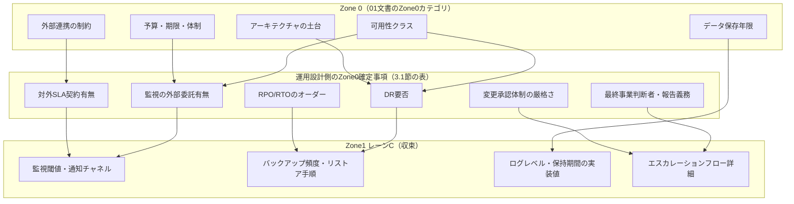
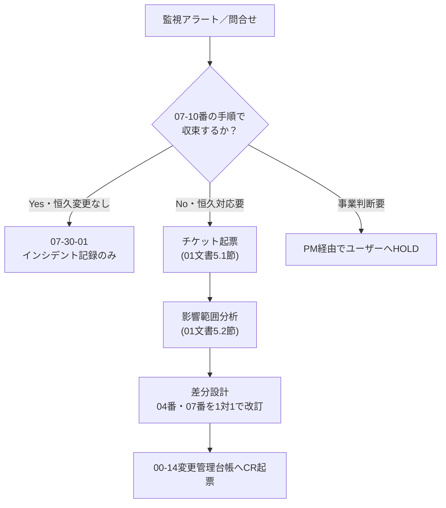

# AI駆動IPA標準フレームワーク 運用設計体系定義書

## 改訂履歴

| 版数 | 日付 | 改訂者 | 改訂内容 |
|------|------|--------|----------|
| 1.0 | 2026-09-10 | Infra-Architect | 初版作成。PMの検査により v2 文書群（01・02）から運用設計が丸ごと欠落していたことが判明したため、これを埋める文書として新設。運用設計の決定タイミング（Zone 0 / Zone 1レーンC）、運用設計の項目体系（12項目）、運用設計書と運用手順書の1対1対応（07番内部構成）、リバース生成の可否判定、Zone 3→4境界のチェックリスト、Mode Bとの接続、運用の担い手を定義する |

---

## 1. はじめに

### 1.1 目的

本書は、aiDev フレームワーク v2 における**運用設計**の体系を定義する。運用設計とは、システムを安定稼働させ、障害時に迅速に復旧し、日々の運用作業を継続可能にするために、稼働前に決めておくべき事項（監視方針、バックアップ方針、インシデント対応体制、変更管理の運用等）の総体を指す。

本書は `docs/v2/01_プロセス定義書.md`（以下「01文書」）および `docs/v2/02_実行基盤アーキテクチャ.md`（以下「02文書」）を前提とし、両文書が扱わなかった運用設計の論点について**終着点となる定義**を与える。すなわち、本書が定める事項（運用設計の項目体系、決定タイミングの切り分け、設計書と手順書の対応関係、リバース可否の判定）について、他文書への「〜に従う」という丸投げは行わない。01文書・02文書が既に定めた原則（ゾーン構造、決定ログの書式、成果物番号体系、統一実行ループ、Gate判定基準）はそのまま引用し、変更・再定義はしない。

### 1.2 適用範囲

- Mode A（Zone 0〜Zone 3）における運用設計関連の決定タイミングと成果物
- Mode B（Zone 4）における運用と開発の境界、および運用事象のチケット化経路
- `docs/07_運用・保守/` の内部構成（サブディレクトリと番号体系）、および `docs/04_インフラ設計/` 配下に置かれる運用設計文書との対応関係
- 運用設計に関わるエージェント（Infra-Architect、SRE）と人間の役割分担

適用範囲外とする事項は次のとおりである。

- `docs/` 配下 00〜07 の項番体系そのものの再定義（02文書 4.2.1節、および並行して作成される `docs/v2/03_成果物体系定義書.md`（以下「03文書」、App-Architect作成）が正本である）
- 成果物カタログ全体・詳細設計の粒度・案件類型別の差分（03文書の責務）
- Claude Code の機構実装そのもの（hooks・Skill・permissionsの具体的な実装コード。02文書の責務。本書は「機構に何を要求するか」までを書く）
- 業種別ガイドライン（三省二ガイドライン等）に固有の運用要件（01文書8章の対象外事項と同様、本書の対象外とし、案件個別に `00_プロジェクト管理・ガバナンス/` 配下へ追加する運用とする）

### 1.3 関連文書

| 文書 | 位置づけ |
|------|---------|
| 01_プロセス定義書（`docs/v2/01_プロセス定義書.md`） | ゾーン構造・決定ログ書式・Gate判定基準の正本。本書はこれに従う |
| 02_実行基盤アーキテクチャ（`docs/v2/02_実行基盤アーキテクチャ.md`） | 成果物番号体系（4.2.1節）・決定ログ機構（8章）・リバース生成エンジン（9章）の正本。本書はこれに従う |
| 03_成果物体系定義書（`docs/v2/03_成果物体系定義書.md`、App-Architect作成、並行作成中） | 成果物カタログ全体・項番体系・詳細設計粒度の正本。本書は07番の内部構成のみを定義し、03文書の項番体系と衝突する場合は03文書を優先する |
| annotation参考実装 `docs/07_運用・保守/`、`docs/03_基本設計/03-30_インフラ設計/03-30-07_運用設計書/` | 運用設計書と運用手順書を1対1対応させる構成の先行事例。本書はこの対応関係の思想を継承しつつ v2 向けに調整する |
| v1 運用設計ガイド（`.claude/docs/10_facilitation/2.3_設計フェーズ/2.3.12_運用設計ガイド.md`） | 監視メトリクス・アラート閾値・バックアップ戦略の記載レベル感の参考。フェーズ順次型を前提とした記述であり、Zone構造への写像は本書が行う |

### 1.4 用語

01文書・02文書の用語集（決定ログ、不可逆度、ゾーン、レーン、GZ0/GZ2/GZ3、SCR-ID、HB-ID 等）は再定義しない。本書固有の用語のみ以下に示す。

| 用語 | 定義 |
|------|------|
| 運用設計 | 監視・ログ・バックアップ・DR・インシデント対応・変更管理等、稼働後の運用を成立させるために決めておくべき事項の総体。本書4章で12項目に体系化する |
| 運用設計書 | 運用設計の内容を記述した文書。`docs/04_インフラ設計/` 配下に、他のインフラ設計文書と並ぶ形で置かれる（5章） |
| 運用手順書 | 運用設計書の内容を、実際の作業手順（誰が・何を・どの順で）に落とした文書。`docs/07_運用・保守/07-10_運用手順書/` 配下に置かれる（5章） |
| SLO / SLA | Service Level Objective（内部目標）／ Service Level Agreement（対外契約）。本書4章の項目の一つとして扱う |
| RTO / RPO | Recovery Time Objective（目標復旧時間）／ Recovery Point Objective（目標復旧時点）。バックアップ・DR設計の数値目標 |
| オンコール | 障害発生時に呼び出される一次対応要員、および呼び出し体制 |
| ランブック | 定型化された障害対応・復旧手順。本書では運用手順書のサブセットとして扱う |

### 1.5 文書番号の名前空間についての注意

本書の文書番号「V2-04」は `docs/v2/` 配下のフレームワークメタ文書の通し番号であり、個別プロジェクトの成果物ディレクトリである `docs/04_インフラ設計/`（02文書4.2.1節）の項番「04」とは**別の名前空間**である。両者はたまたま番号が一致するに過ぎず、本書中で「04番」と言及する場合は特記なき限り後者（プロジェクト成果物のインフラ設計ディレクトリ）を指す。読者はこの二重の番号体系を混同しないよう注意されたい。

---

## 2. 本文書の位置づけと、欠落していた理由

### 2.1 欠落の事実確認

PMによる検査の結果、01文書・02文書の両方に「運用設計」という語が0件であることが確認された。07番（運用・保守）に運用手順書を置く記述（02文書4.2.1節）は存在するが、その手前にあるべき運用設計（何を監視するか、SLOは何か、障害時の体制は誰か、バックアップ・復旧方針は何か、変更管理をどう運用するか）を定義する文書種別そのものが、01文書のゾーン定義にも、02文書の成果物区分一覧にも登場しない。

### 2.2 構造的な理由

本フレームワークの中核主張は「動くものを作るコストが低いので、実物を出してから文書化するほうが正確である」という点にある（01文書1.1節）。この主張は、画面・API・データモデルのように**実装物と設計内容が一対一で対応し、実装を見れば設計の中身をほぼ再構成できる領域**では成立する。しかし運用設計は、この前提が部分的にしか成立しない領域である。

- 監視の閾値やバックアップのスケジュールは IaC（CloudWatch Alarms、AWS Backup Plan等）に実体として現れるため、画面やAPIと同様に「実物から逆生成できる」領域である
- しかし、インシデント発生時に**誰が対応するか**、**どの基準でエスカレーションするか**、**事業影響をどう判断するか**といった情報は、コードにもIaCにも決して現れない。これらは人間の体制・判断基準そのものであり、実装物という「答え合わせの対象」が存在しない

01文書・02文書はいずれも「実装物＋決定ログから逆生成する」という設計の枠組みを、画面・API・データモデルという「実物対応が成立する領域」を主眼に据えて構築した。運用設計は、この枠組みの適用対象として想定された領域と部分的にしか重ならない**境界的な領域**であるため、「実物対応が成立しない部分をどう決定ログに落とすか」という設計判断が必要になる。この判断が01文書・02文書のいずれの執筆時にも行われず、結果として運用設計という文書種別自体が検討対象から漏れた、というのが欠落の構造的な理由である。

補足すると、01文書4.3節はZone 0の対象として「非機能の骨格（マルチテナントか否か、想定規模のオーダー、可用性クラス、データ主権・保存年限）」を既に挙げている。可用性クラスやデータ保存年限は、実のところ運用設計の入力そのものである。しかし01文書はこれを「非機能要件の一般論」として記述するに留まり、「これが運用設計のどの項目にどう波及するか」までは書いていない。**Zone 0の決定項目のリストは存在したが、それが運用設計という具体的な文書体系に接続される経路が欠けていた**、という言い方もできる。本書3章はこの接続を行う。

### 2.3 本書が埋める範囲、埋めない範囲

本書が終着点として定義する事項は次のとおりである。

- 運用設計の決定タイミング（Zone 0 / Zone 1レーンCの切り分け、3章）
- 運用設計として決めるべき項目の一覧とその内容（4章）
- 運用設計書と運用手順書の対応関係、および07番の内部構成（5章）
- 運用関連の文書種別ごとのリバース可否判定（6章）
- Zone 3→4境界での引き渡し内容（7章）
- 運用事象とMode Bの接続（8章）
- 運用の担い手（9章）

本書が定義しない事項は次のとおりである。これらは他文書の責務に委ねる。

- `docs/` 00〜07全体の項番体系そのもの（02文書4.2.1節、03文書）
- 04番・05番配下の運用設計以外の詳細設計粒度（03文書）
- hooks・Skillの実装コード（02文書。本書は要求のみ記す）

---

## 3. 運用設計の決定タイミング

### 3.1 切り分けの原則

01文書4.3節は、Zone 0に置いてよい決定を「後から変えたときの手戻りコストが非線形に跳ねる決定」に限定し、「念のため今決めておく」ことを明示的に禁止している（MUST NOT）。運用設計についてもこの原則をそのまま適用する。**運用設計固有の新しいZone 0カテゴリを追加するのではなく、01文書が既に定義した5つのZone 0カテゴリが、運用設計のどの項目に具体化するかを明示する**、という整理を取る。これにより、01文書の対象リストを変更せずに済み、かつ「Zone 0が肥大化する」というリスク（01文書9.2節「形骸化のサイン」の筆頭項目）を回避できる。

| 01文書のZone 0カテゴリ | 運用設計への具体化 |
|---|---|
| 非機能の骨格（可用性クラス、データ主権・保存年限） | 可用性クラスは監視の重大度区分・DR要否の前提になる。データ保存年限はログ・バックアップの保持期間の下限を規定する |
| 法規制・コンプライアンス・セキュリティの前提 | 監査ログの改ざん防止要否、インシデント発生時の対外報告義務の有無を規定する |
| アーキテクチャの土台（クラウド、認証基盤、データストアの種別） | マルチリージョン構成の要否（DR）、IAM統合の方式（アクセス管理）を規定する |
| 外部連携の相手と、相手都合で動かせない制約 | 外部SLA契約がある場合、対外SLA・監視の外部委託有無に波及する |
| 予算・期限・体制 | 監視の外部委託有無（24/365 SOC委託 vs 内製）、運用要員数の前提を規定する |

**選別基準**: 運用設計項目のうち、上表のいずれかのZone 0カテゴリに直接紐づき、かつ「後から覆すとアーキテクチャ（ネットワーク構成、データストアのレプリケーション方式、契約関係）の作り直しを要する」ものだけをZone 0で扱う。それ以外（具体的な閾値、通知チャネル、シフト表、ツール選定の詳細）はZone 1レーンCに送る。

### 3.2 決定タイミング切り分け表

4章で定義する12項目それぞれについて、どこまでがZone 0の対象で、どこからがZone 1レーンCの対象かを次表に示す。

| # | 項目 | Zone 0で確定する部分（不可逆度: 高） | Zone 1レーンCで収束する部分（不可逆度: 中〜低） | Zone 0部分が波及する先 |
|---|---|---|---|---|
| 1 | 監視・アラート | 監視の外部委託有無（24/365 SOC委託 or 内製） | 監視対象メトリクス、閾値、重要度区分、通知チャネル、ダッシュボード構成 | 予算・体制、契約関係 |
| 2 | ログ | ログ・監査証跡の法定/契約上の保存年限、改ざん防止（WORM等）の要否 | ログレベル定義、フォーマット、実装上の保持期間（法定年限以上であればよい）、分析クエリ | ストレージ構成、コスト |
| 3 | バックアップ・リストア | RPO/RTOのオーダー（例: 「RPO 5分」は同期レプリケーション必須という構成上の制約になる） | バックアップ頻度、世代管理、リストア手順の詳細 | データストアのレプリケーション方式、インスタンス構成 |
| 4 | DR | DR要否そのもの（マルチリージョン構成を組むか否か） | フェイルオーバー手順の詳細、DR訓練の頻度 | ネットワーク構成、データストアのレプリケーション方式、コスト |
| 5 | キャパシティ | （新規決定なし。01文書Zone0の「想定規模のオーダー」をそのまま参照する） | AutoScalingの具体的閾値、キャパシティプランニングの数値 | - |
| 6 | パッチ・脆弱性対応 | 契約上パッチ適用SLAが存在する場合はその適用範囲・期限 | パッチ適用の頻度、脆弱性スキャンツール選定、適用ウィンドウ | 契約関係 |
| 7 | アクセス管理 | 特権アクセス（本番環境操作）の承認要否と承認者（内部統制上の要求） | IAMロール設計の詳細、MFA適用範囲、鍵ローテーション頻度 | 認証基盤、権限モデル |
| 8 | インシデント対応とエスカレーション | 重大インシデント時の最終事業判断者、SLA違反時の対外報告義務の有無 | 具体的なエスカレーションフロー、対応時間、連絡手段 | 体制、契約関係 |
| 9 | 定期作業 | （Zone 0対象なし） | 定期作業の頻度、自動化範囲 | - |
| 10 | SLO/SLA | 対外SLA契約の有無とその数値（契約締結済みであれば不可逆） | 内部SLOの具体的閾値、エラーバジェット運用 | 契約関係、可用性クラス |
| 11 | コスト監視 | 予算上限（01文書Zone0「予算・期限・体制」の一部として既に対象） | 具体的なコストアラート閾値、タグ設計 | - |
| 12 | 変更管理の運用 | 本番変更の承認要否・承認体制の厳格さ（例: 規制業種における変更諮問委員会の要否） | 変更管理台帳の具体的な運用ルール | 体制、コンプライアンス前提 |

**MUST**: 上表でZone 0欄に「なし」と記載された項目（#5, #9, #11）を、念のためZone 0で決定してはならない。01文書4.3節の原則をそのまま適用する。

**MUST**: Zone 0欄に該当する決定は、01文書4.7.2節の決定ログ書式に従い、不可逆度「高」として記録する。決定ログのタイトル・本文に運用設計の項目名（本書4章の項目名）を明記し、後続のZone 3リバース時（6章）に検索・転記しやすくする。決定ログのフォーマット自体は02文書8.1節から変更しない。

### 3.3 波及の連鎖



---

## 4. 運用設計の項目体系

運用設計として決めるべき項目を12に体系化する。各項目について、決まる場所（3章の切り分けに対応）、決定ログに残すべき内容、実物（Zone 3でのリバース元）のどこに現れるかを示す。この一覧は本書が終着点であり、他文書へは委譲しない。

| # | 項目 | 決まる場所 | 決定ログに残すもの | 実物のどこに現れるか（Zone3リバース元） |
|---|---|---|---|---|
| 1 | 監視・アラート | Zone0（外部委託有無）＋Zone1C（閾値等） | 外部委託の有無とその理由（コスト・可用性クラスとの整合） | CloudWatch Alarms等の監視IaC定義、SNS Topic構成、ダッシュボード定義 |
| 2 | ログ | Zone0（保存年限・改ざん防止要否）＋Zone1C（レベル・フォーマット） | 保存年限の根拠となる法令・契約条項 | ログ基盤の保持設定（S3ライフサイクル、CloudWatch Logs保持期間）のIaC |
| 3 | バックアップ・リストア | Zone0（RPO/RTOのオーダー）＋Zone1C（頻度・世代管理） | RPO/RTO目標値と、その根拠（SLA契約、事業影響度分析） | バックアップIaC定義（AWS Backup Plan、RDSスナップショット設定） |
| 4 | DR | Zone0（DR要否）＋Zone1C（訓練頻度・手順詳細） | DR要否の判断根拠（事業継続性要求、規制要求） | マルチリージョン構成のIaC、DNSフェイルオーバー設定 |
| 5 | キャパシティ | Zone1Cのみ（Zone0は01文書の既存項目を参照） | （新規なし） | AutoScaling設定のIaC |
| 6 | パッチ・脆弱性対応 | 原則Zone1C（契約上のSLAがある場合のみZone0） | 契約上のパッチ適用SLAがある場合、その内容 | パッチ適用の自動化スクリプト、脆弱性スキャンのCI設定 |
| 7 | アクセス管理 | Zone0（特権アクセス承認要否）＋Zone1C（IAM詳細） | 特権アクセス承認フローの要否とその根拠 | IAMポリシー・ロール定義のIaC |
| 8 | インシデント対応とエスカレーション | Zone0（最終判断者・報告義務）＋Zone1C（フロー詳細） | 事業判断者の指名、対外報告義務の有無とその契約根拠 | 実物にはほぼ現れない（体制情報のため。6章で詳述） |
| 9 | 定期作業 | Zone1Cのみ | （なし） | cron/EventBridge Rule等の定期実行IaC定義 |
| 10 | SLO/SLA | Zone0（対外SLA契約）＋Zone1C（内部SLO閾値） | 対外SLA契約条件（数値、違反時のペナルティ） | 監視ダッシュボードのSLO定義 |
| 11 | コスト監視 | Zone1Cのみ（予算上限は01文書のZone0を参照） | （新規なし） | AWS Budgets、コスト配分タグのIaC |
| 12 | 変更管理の運用 | Zone0（承認体制の厳格さ）＋Zone1C（台帳運用ルール） | 変更承認体制の厳格さと、その根拠（規制業種の変更諮問委員会要否等） | Git履歴、`00-14_変更管理台帳.md`のCR記録 |

### 4.1 項目間の重複整理（既存の設計文書との境界）

annotation参考実装では、DR設計（03-30-04_可用性・DR設計書）と運用設計書（03-30-07）が別文書として扱われていた。本書はこの前例を踏まえ、**「DR」を本書の12項目に含めるが、アーキテクチャ寄りの設計内容（レプリケーション方式、リージョン構成そのもの）は04番の別文書（可用性・DR設計に相当する文書。具体的な文書名・番号は03文書が定める）の責務とし、本書が扱うのは運用の観点（DR発動の判断基準、訓練頻度、発動手順）に限定する**。同様に「アクセス管理」についても、認証基盤の方式そのもの（IAM/Cognito等の選定）はアプリケーション設計・セキュリティ設計側の責務であり、本書が扱うのは運用としてのアクセス権限の棚卸し・ローテーション・承認フローに限定する。この境界は03文書と齟齬が生じないよう、5.5節で残課題として明示する。

### 4.2 SLOとエラーバジェットについての補足

01文書・02文書のいずれも品質保証・Gate判定において「合格率のみの報告を受理しない」という原則（01文書7.2節）を掲げている。SLO運用においても同じ原則を適用し、**SLO達成率の報告は、分母（監視対象期間の総リクエスト数・総稼働時間）と分子（SLO内に収まった件数）を明示しない限り受理しない**（MUST）。これはGate判定基準の転用であり、本書が新規に原則を作るものではない。

---

## 5. 運用設計書と運用手順書の1対1対応

### 5.1 annotationの構成の継承と調整

annotation参考実装は、運用設計書（`03-30-07_運用設計書`、8サブ項目）と運用手順書（`07-10_運用手順書`、8サブ項目）を1対1で対応させていた。v2はこの対応関係の思想を継承する。ただし、annotationは単一プロジェクト・単一アーキテクトを前提とした構成であるのに対し、v2はフレームワーク製品として複数の案件類型に適用されるため、項目数を本書4章の12項目に合わせて再編する。また、annotationの07番構成（`07-10_運用手順書` / `07-20_マニュアル` / `07-30_台帳・記録` / `07-40_定期見直し`）という4区分は、それ自体が運用ドキュメントの性質（手順・マニュアル・記録・定期見直し）を的確に切り分けているため、そのままv2に継承する。

### 5.2 `docs/07_運用・保守/` の内部構成

**MUST**: `docs/07_運用・保守/` の内部は次の4区分とする。

```
docs/07_運用・保守/
├── 07-10_運用手順書/           # 4章の12項目のうち手順化できるものを1件1手順書として格納
│   ├── 07-10-01_監視対応手順/
│   ├── 07-10-02_障害対応手順/
│   ├── 07-10-03_バックアップ・リストア手順/
│   ├── 07-10-04_DR発動・訓練手順/
│   ├── 07-10-05_ログ・監査対応手順/
│   ├── 07-10-06_デプロイ・リリース手順/
│   ├── 07-10-07_パッチ・脆弱性対応手順/
│   ├── 07-10-08_アクセス管理手順/
│   ├── 07-10-09_キャパシティ管理手順/
│   └── 07-10-10_コスト監視対応手順/
├── 07-20_マニュアル/            # 運用者向け操作マニュアル（管理コンソール操作等）
├── 07-30_台帳・記録/            # 運用中に生成される記録
│   ├── 07-30-01_インシデント記録/
│   ├── 07-30-02_SLA実績報告/
│   └── 07-30-03_問合せ対応記録/
└── 07-40_定期見直し/            # リストアテスト、DR訓練、権限棚卸し、SLOレビューの実施記録
```

この内部構成は02文書4.2.1節が定める「00〜07の項番体系」を再定義するものではなく、その7番の**内側**を定義するものである。07番というディレクトリ自体の存在・生成タイミング（Zone3）は02文書の定義に従う。

### 5.3 04番運用設計項目 ↔ 07-10手順書 対応表

**MUST**: 次の対応表を、`docs/00_プロジェクト管理・ガバナンス/00-01_成果物構成カタログ.md`（02文書3.2節・4.3節が定めるIPA成果物カタログの正本）に転記し、Zone 3のリバース生成時に両者が漏れなく1対1で生成されることをカタログ上で追跡できるようにする。

| 本書4章の項目 | 04番の運用設計書（該当セクション） | 07-10番の運用手順書 |
|---|---|---|
| 1 監視・アラート | 監視・アラート運用設計 | 07-10-01_監視対応手順 |
| 8 インシデント対応とエスカレーション | インシデント対応運用設計 | 07-10-02_障害対応手順 |
| 3 バックアップ・リストア | バックアップ・リストア運用設計 | 07-10-03_バックアップ・リストア手順 |
| 4 DR | DR運用設計 | 07-10-04_DR発動・訓練手順 |
| 2 ログ | ログ・監査運用設計 | 07-10-05_ログ・監査対応手順 |
| 12 変更管理の運用 | 変更管理運用設計 | 07-10-06_デプロイ・リリース手順 |
| 6 パッチ・脆弱性対応 | パッチ・脆弱性対応運用設計 | 07-10-07_パッチ・脆弱性対応手順 |
| 7 アクセス管理 | アクセス管理運用設計 | 07-10-08_アクセス管理手順 |
| 5 キャパシティ | キャパシティ運用設計 | 07-10-09_キャパシティ管理手順 |
| 11 コスト監視 | コスト監視運用設計 | 07-10-10_コスト監視対応手順 |
| 9 定期作業 | （各設計セクションに分散記載） | 07-40_定期見直し（実施記録として） |
| 10 SLO/SLA | SLO/SLA運用設計 | 07-30-02_SLA実績報告（実績記録として） |

**対応関係の設計原則（MUST）**:

1. 04番の運用設計書の1セクションは、07番の1手順書に対応する。設計書側にセクションが増減した場合、対応する手順書もZone3のリバース時に増減を反映しなければならない
2. #9（定期作業）と#10（SLO/SLA）は「手順」ではなく「記録・見直し」の性質が強いため、07-10ではなく07-30・07-40に対応させる。この非対称性は意図的なものであり、無理に07-10に手順書を作らない
3. 04番側の文書名・具体的なセクション番号は03文書が定める最終的な項番体系に従う。本表の「04番の運用設計書」列は暫定的な項目名であり、確定番号ではない

### 5.4 04番運用設計書の位置づけ

運用設計書は `docs/04_インフラ設計/` 配下に、他のインフラ設計文書（ネットワーク設計、セキュリティ設計等）と並ぶ形で配置する。annotationの `03-30-07_運用設計書` が `03-30_インフラ設計` 配下に置かれていた構成をそのまま踏襲するものである。02文書4.2.1節は「04 インフラ設計」を「Zone3で生成」と定めており、運用設計書もこのタイミングで生成される（詳細は6章で、部分的に前出しが必要な内容を扱う）。

---

## 6. リバース生成の可否と、前に置くべきもの

### 6.1 01文書4.7.1節との整合方針

01文書4.7.1節は文書種別ごとの前後判断表を持ち、「運用手順書」を「後（Zone3でリバース）」に分類している。本書はこの分類を**変更しない**。07番の運用手順書は引き続きZone3生成である。本書が付け加えるのは、**その運用手順書の中身の一部（判断基準、エスカレーション先等）は、実物からは復元できないため、Zone0/Zone1のうちに決定ログとして先出ししておかなければ、Zone3のリバース時に「未記載」（02文書8.3節・9.3節の原則）としてしか埋められない**という運用上の注意である。文書の生成タイミング自体は後のままであるが、その生成に使う材料の一部は前もって用意しておく必要がある、という位置づけである。

### 6.2 判定表

01文書4.7.1節の表形式を踏襲し、運用設計・運用手順に関わる文書種別を追加する。

| 文書種別 | 前（Zone0/1で決定ログ） | 後（Zone3でリバース） | 理由 |
|---|---|---|---|
| 運用設計書：監視・アラート運用設計 | 外部委託有無のみ〇 | 〇（大部分） | 閾値・メトリクス定義はCloudWatch Alarms等のIaCから機械的に復元できる |
| 運用設計書：ログ・監査運用設計 | 保存年限の根拠のみ〇 | 〇（大部分） | 実装上の保持設定はIaCから復元できるが、「なぜその年限か」は実物に現れない |
| 運用設計書：バックアップ・リストア運用設計 | RPO/RTO目標値と根拠〇 | 〇（大部分） | 頻度・世代管理はバックアップIaCから復元できる |
| 運用設計書：DR運用設計 | DR要否の根拠〇 | 〇（大部分） | 構成の実体はマルチリージョンIaCから復元できるが、要否判断の根拠は実物にない |
| 運用設計書：インシデント対応・エスカレーション運用設計 | ほぼ全体を〇（前） | 差分反映のみ後 | 判断基準・連絡先・事業判断者は体制情報であり、実物にまったく現れない。01文書4.7.1節の「事業背景・スコープ外周」と同種の性質を持つ |
| 運用設計書：変更管理運用設計 | 承認体制の厳格さの根拠〇 | 〇（大部分） | 実際の運用ルールはGit運用・CR起票フローから部分的に復元できるが、「誰が承認するか」という体制情報は実物に現れにくい |
| 運用手順書一式（07-10番） | 上記各設計書の「前」部分を転記元として保持 | 〇（生成そのものは後） | 01文書4.7.1節の「運用手順書」分類を継承。ただし転記元の決定ログが薄いと内容が空疎な手順書になる（6.3節） |
| 07-30台帳・記録（インシデント記録、SLA実績報告） | - | 〇（運用開始後、都度記録） | 実際の運用実績そのものであり、事前に書けるものではない |

### 6.3 手順書のリバースが成立する条件

実物（IaC、監視設定、自動化スクリプト）から手順書を逆生成できるかどうかは、次の3条件のいずれに該当するかで判定する。

| 条件 | 内容 | 該当する項目の例 | 対応 |
|---|---|---|---|
| 条件A | 手順の「動作」が機械可読な実物として存在する | 監視閾値、バックアップスケジュール、パッチ適用cron | Zone3のreverse-docが実物から機械的に生成できる。**MUST**: reverse-docは生成の際、対応するIaCファイルのパスを引用元として明記する |
| 条件B | 手順が判断基準・体制情報（誰が、どんな基準で、誰に確認するか）を含む | エスカレーション先、事業判断者、対応要否の閾値の「意味」 | 実物には現れないため、Zone0/1の決定ログに事前記録することをMUSTとする。決定ログに記録が無い場合、reverse-docは「未記載」と明記し実装から推測しない（02文書8.3節・9.3節の原則をそのまま適用） |
| 条件C | 低頻度・高影響事象であり、実行履歴自体が乏しい | DR発動、大規模障害対応 | 実物としての実行履歴が薄いため、通常の「実物から生成」という前提が成立しにくい。決定ログに加え、机上訓練（テーブルトップ演習）の実施記録を手順書の構成材料とすることをSHOULDとする |

**MUST**: 条件Bに該当する運用設計項目（本書4章の#8 インシデント対応とエスカレーション、および#4 DR・#12 変更管理の運用の一部）については、Zone0の決定ログ起票時に、02文書8章の`decide` Skillのヒアリング項目へ次の4点を追加することを02文書の実行機構に要求する。

1. 重大インシデント発生時の一次対応者・エスカレーション先
2. 事業影響の判断基準（何が起きたら「重大」と判定するか）
3. 対外報告義務の有無と、義務がある場合の報告先・期限
4. 本番変更の最終承認者

この4点は「機構に何を要求するか」という要求であり、02文書のdecide Skillの具体的な実装（ヒアリングスクリプトの文言等）は02文書側の責務とする。

---

## 7. 運用への移行（06番との関係）

### 7.1 Zone3からZone4への境界で引き渡されるもの

02文書4.2.1節は「06 移行・導入」を「Zone3〜Zone4境界で生成」と定めており、他の項番（02〜05, 07）よりも遅いタイミングで埋まることを想定している。運用設計・運用手順（04番・07番）はこれより早い、通常の「Zone3で生成」に属する。したがって、06番の移行計画が動き出す時点では、04番の運用設計書・07番の運用手順書は**既に生成済みであることが前提**となる。

### 7.2 運用開始前チェックリスト

**MUST**: Zone3からZone4（Mode B）への移行に先立ち、次のすべてを満たすことを確認する。

- [ ] 4章の12項目すべてについて、04番の運用設計書に該当セクションが存在する（「該当なし」と明記されたセクションを含めて欠落なく存在すること）
- [ ] 5.3節の対応表で定めた07-10番の運用手順書10件すべてが生成済みである
- [ ] #8（インシデント対応とエスカレーション）に関する決定ログ（6.3節の4項目）が確定済みであり、対応する07-10-02の手順書に転記されている
- [ ] バックアップ・リストアの月次・四半期テスト計画が07-40_定期見直しに登録済みである
- [ ] SLO監視ダッシュボードが実際に稼働しており、07-30-02_SLA実績報告の初回記録の枠が用意されている
- [ ] 04番・07番のいずれについても、`生成区分: 実装反映(as-built)` が文書ヘッダーに記載されている（02文書9.2節の原則）
- [ ] 逆差分検出（02文書9.3節）が運用設計領域についても実施されている。すなわち、IaC上に存在する監視・バックアップ・アラートのリソースのうち、04番の運用設計書に記載が無いものが0件であること

### 7.3 GZ3ゲート条件への反映

01文書4.6節はGZ3（Zone3完了）の条件を「IPA標準成果物一式の生成完了」としている。この「一式」には07番の運用手順書が含まれることを、本書は明示的に確認する。**MUST**: `gate-check` Skill（02文書5.1節）がGZ3を判定する際、7.2節のチェックリストを分母の一部として数えること。これは01文書・02文書の既存のGate判定基準（01文書6.5節の条件3「当該ゾーン・当該Gateで定義された成果物が作成済み」）の運用領域への適用であり、新しい判定軸を追加するものではない。

---

## 8. Mode Bとの接続

### 8.1 運用事象の分類とチケット化の判断基準

運用で発生する事象（障害、性能劣化、容量逼迫、監視アラート）のすべてをチケット化すると、定型的な一次対応にまでMode Bの重いループ（01文書5章）を適用することになり非効率である。したがって、次の基準で「チケット化する／しない」を判定する（MUST）。

| 事象の性質 | 判定 | 記録先 |
|---|---|---|
| 07-10番の手順書どおりの対応で収束し、恒久的な設計・実装変更を伴わない | チケット化しない | 07-30-01_インシデント記録 に記録するのみ |
| 恒久対応（設計変更、閾値の恒久的な変更、コード変更）を要する | チケット化する | GitHub Issue起票 → 5.2節の影響範囲分析へ |
| 一次対応では収束せず、事業判断（顧客への影響公表、SLA違反の対外報告等）を要する | チケット化に加えHOLD相当のエスカレーション | PM経由でユーザーに確認（01文書3.5節・4.8節の原則を適用） |

判定基準は、07-10-02_障害対応手順のポストモーテット（振り返り）項目に「再発防止策が設計・実装変更を含むか」という設問を設けることで運用上判定する（MUST）。

### 8.2 影響範囲分析への入力

チケット化された運用事象は、01文書5.2節の影響範囲分析にそのまま入る。運用起因のチケットにおける対象IDの特定（5.2節手順1）は、次のいずれかを起点とする。

- 監視アラートが指すインフラリソース → 04番の運用設計書の該当セクション経由で、対応する非機能要件ID・インフラ構成要素を特定する
- ユーザーからの問い合わせ（07-30-03_問合せ対応記録） → 該当する機能の`HB-ID`または正式要件IDを特定する

以降の正引き・逆引き・波及先の分類（01文書5.2節手順2〜4）は標準の手順をそのまま適用する。運用起因のチケットは多くの場合、01文書5.2節の分類表における「非機能影響」に該当し、Guardの対象範囲として扱われる。

### 8.3 運用起因の変更が設計文書に跳ね返る場合の扱い

運用チケットの対応の結果、04番の運用設計書または07番の運用手順書の内容変更が必要になった場合、01文書5.3節の差分設計の原則（影響を受ける設計書のみを改訂し、全文書を再生成しない）をそのまま適用する。**MUST**: 04番のセクションを改訂した場合、5.3節の対応表に基づき、対応する07番の手順書も同一チケット内で改訂する。1対1対応を崩したまま（設計書のみ更新し手順書を放置する等）チケットをクローズしてはならない（MUST NOT）。

**MUST**: 運用チケットに対応する変更管理台帳（`00-14_変更管理台帳.md`）のCR番号を、07-30-01_インシデント記録の該当エントリに紐づける。これは01文書5.5節2の原則（Ticketには対応するCR番号を必ず紐づける）の運用領域への適用である。

### 8.4 運用と開発の境界を示す図



---

## 9. 運用の担い手

### 9.1 エージェントの役割分担

02文書6.1節・9.1節の既存の役割分担をそのまま踏襲する。本書が付け加えるのは運用設計固有の分担の明確化である。

| 領域 | 主担当 | 分担の内容 |
|---|---|---|
| 04番 運用設計書の生成（Zone3） | Infra-Architect（`docs/04_.../reverse-doc`、02文書9.1節） | 監視・バックアップ・DR等のIaCと決定ログを読み、運用設計書を生成する |
| 07番 運用手順書の生成（Zone3） | SRE（`docs/07_.../reverse-doc`、02文書9.1節） | 04番の運用設計書と実際の構築手順を統合し、作業手順として具体化する |
| Zone0の運用関連決定ログ起票 | Infra-Architect（決定ログ提案）＋ユーザー承認 | 3.2節のZone0欄に該当する決定を`decide` Skill経由で起票する |
| Mode B運用チケットの一次対応 | SRE | 07-10番の手順書に従った一次対応の実行 |
| Mode B運用チケットの恒久対応の設計変更 | Infra-Architect（設計変更）＋SRE（実装） | 8.3節の差分設計・改訂 |

### 9.2 AIが担える範囲

- 監視設定・バックアップ設定のIaC実装（SREが実行、02文書7.1節の既存permissionsに従う）
- 04番・07番文書のZone3リバース生成（Infra-Architect・SRE）
- 07-10番手順書に明記された定型対応の実行補助（例: 既知のエラーパターンに対する自動復旧スクリプトの実行）
- インシデント記録・SLA実績報告のドラフト作成
- コスト監視レポートの定期生成

### 9.3 人間の判断が必須な箇所

次の判断は、AIが単独で完了させてはならない（MUST NOT）。01文書3.5節・4.8節、02文書7.1節の既存原則をそのまま運用領域に適用したものであり、新しい制約を追加するものではない。

| 判断 | 理由 | 対応する既存原則 |
|---|---|---|
| 本番デプロイ・本番環境への変更の実行承認 | 破壊的操作・不可逆な影響を持つ | 02文書7.1節：`Bash(*apply*env=prod*)`等は`ask`。SREのモデル階層でも本番deployのみOpus5判断（02文書6.1節） |
| インシデント時の事業判断（顧客影響の公表要否、SLA違反の対外報告） | 事業リスク判断であり、AIの権限を超える | 01文書3.5節：Zone0の不可逆決定を覆す判断はユーザーHOLD必須の原則を運用時の事業判断にも準用する |
| Zone0の運用関連不可逆決定（DR要否、監視外部委託有無等）の最終承認 | 01文書4.3節Gate（GZ0）の要件どおり、ユーザー承認が必須 | 01文書4.3節：GZ0はユーザー承認＋実現可能性確認 |
| 差し戻し3回超過時のHOLD判断 | 01文書7.4節の既存原則 | 01文書7.4節 |

### 9.4 権限との対応

02文書7.1節が定める既存のpermissions設計（SREの`ask`/`allow`区分）は、運用フェーズ（Mode B）でも変更なく適用される。本書は新たな権限区分を追加しない。運用チケット対応におけるSREのBash実行は、02文書7.1節の「dry-run・非本番は自律実行可」「本番デプロイはask」という既存の区分にそのまま従う。

---

## 10. 残課題

| # | 残課題 | 内容 |
|---|---|---|
| 1 | オンコール体制の技術的実装 | 実際に誰を呼び出すか（PagerDuty等の外部ツール連携）の技術的な実装は02文書の範囲であり、本書は要求（6.3節の4項目）のみを示した。02文書側での具体化が必要 |
| 2 | 04番の運用設計書とDR/アクセス管理の既存設計文書との境界 | 4.1節で暫定整理したが、03文書（成果物体系定義書）が確定する項番体系・文書分割方針と齟齬が生じる可能性がある。03文書確定後にすり合わせが必要 |
| 3 | 規制業種固有の運用要件 | 医療・金融等の規制業種における運用要件（監査対応、規制当局への報告義務等）は01文書8章の対象外事項と同様、本書の対象外とした。案件個別対応が必要 |
| 4 | Mode Bチケット化判定の主観性 | 8.1節の判定基準（「恒久対応を要するか」）は、ポストモーテムの記載に依存し、判定者の裁量が残る。客観的な判定ルールの精緻化は今後の課題 |
| 5 | 条件C（低頻度事象）のリバース精度 | DR発動・大規模障害対応のように実行履歴が乏しい手順は、決定ログと机上訓練記録からの生成となり、通常の「実物対応」によるリバースより精度が低い可能性がある。運用開始後の実インシデントを反映した継続的な改訂が前提となる |
| 6 | 運用系決定ログのカテゴリタグ | 02文書8.1節の決定ログ書式に、運用設計の項目名で検索しやすくするための分類タグを追加することが望ましい（SHOULD）。決定ログのフォーマット自体の変更は02文書の責務であり、本書からの提案に留める |
| 7 | SLO/エラーバジェット運用の定量化基準 | 4.2節で原則のみ示したが、エラーバジェット消費率に応じた開発速度の調整（フィーチャーフリーズ等）をMode Bのどの機構に組み込むかは未定義であり、今後の整備が必要 |

---
