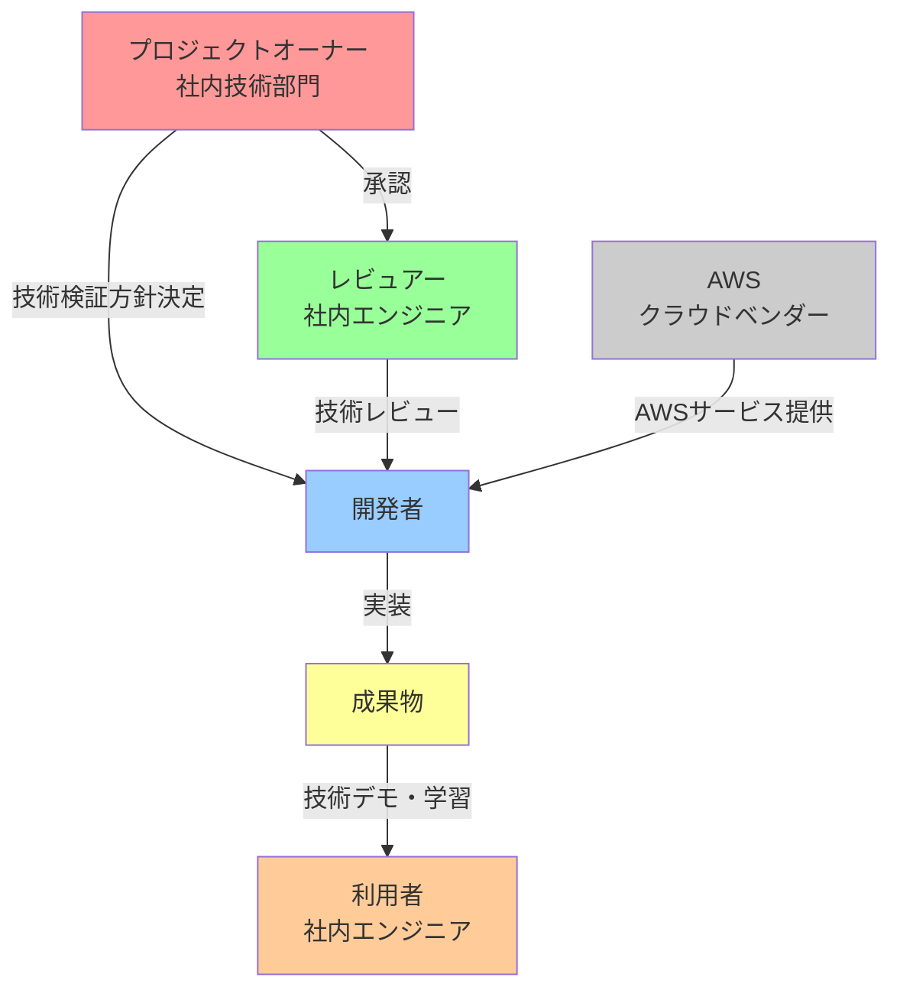
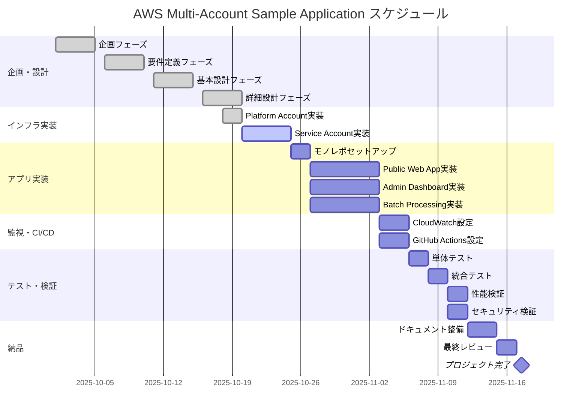

# 企画書

> AWS Multi-Account Sample Application
> Transit Gatewayによる拠点間閉域接続を実現する技術検証・社内デモ用サンプル

---

## 1. ドキュメント情報

| 項目 | 内容 |
|------|------|
| プロジェクト名 | AWS Multi-Account Sample Application |
| 文書バージョン | 1.0 |
| 作成日 | 2025-10-21 |
| 最終更新日 | 2025-10-21 |
| 承認状態 | 承認済み |
| 承認者 | - |

---

## 2. プロジェクト概要

### 2.1 プロジェクト名
**AWS Multi-Account Sample Application**

### 2.2 プロジェクトの目的
AWS Multi-Account構成とTransit Gatewayによる拠点間閉域接続の技術検証を目的とした、社内向け技術デモ・PoC用のリファレンスアーキテクチャを構築する。

---

## 3. 背景と課題

### 3.1 ビジネス背景

**業界・業態:**
- Technology/IT業界
- AWSインフラ技術の社内技術蓄積・検証

**現状:**
- AWS Multi-Account構成の実装パターンが社内に蓄積されていない
- Transit Gatewayによる拠点間閉域接続の実装経験が不足している
- CloudFormationによるInfrastructure as Codeのベストプラクティスが確立されていない
- アプリケーションとインフラの統合的なサンプル実装が存在しない

### 3.2 解決したい課題

1. **技術的課題**
   - Transit Gatewayによる拠点間閉域接続の実装方法が不明確
   - Multi-Account構成（Platform Account + Service Account）の設計パターンが未確立
   - CloudFormationネストスタック構成のベストプラクティスが不明確
   - 3サービス構成（Public/Admin/Batch）の実装パターンが未確立

2. **運用的課題**
   - CloudWatch統合監視の実装パターンが未確立
   - マルチAZ構成の具体的な実装方法が不明確
   - インフラとアプリケーションの統合的な管理方法が未確立

3. **組織的課題**
   - 社内向け技術デモ・PoC用のリファレンス実装が不足
   - 技術検証結果の共有・蓄積の仕組みが不十分

---

## 4. プロジェクトゴール

### 4.1 プロジェクトの成功基準

| ゴール | 測定指標 | 目標値 |
|--------|---------|--------|
| Transit Gateway技術検証 | 拠点間通信レイテンシ | 50ms以内 |
| Multi-Account構成検証 | アカウント分離による管理性 | Platform/Service分離実現 |
| 3サービス構成検証 | サービス別デプロイ可能性 | 独立デプロイ実現 |
| CloudFormation実装パターン確立 | スタック分割による保守性 | 4スタック構成実現（Network/Database/Compute/Monitoring） |
| CloudWatch監視パターン確立 | 統合監視ダッシュボード | 全リソース可視化実現 |

### 4.2 期待される成果物

1. **Infrastructure as Code**
   - Platform Account CloudFormationテンプレート（ネストスタック構成）
   - Service Account CloudFormationテンプレート（スタック分割構成）
   - デプロイスクリプト・パラメータファイル

2. **アプリケーション**
   - Node.js 20ベースのサンプルアプリケーション（モノレポ構成）
   - 3サービス（Public Web App / Admin Dashboard / Batch Processing）
   - Dockerfileおよびコンテナ設定

3. **ドキュメント**
   - アーキテクチャ設計書
   - 構築手順書
   - 運用手順書

4. **監視設定**
   - CloudWatch Alarmsサンプル設定
   - CloudWatch Dashboard設定
   - SNS通知設定

---

## 5. ステークホルダー

### 5.1 関係者

| 役割 | 氏名/組織 | 責任範囲 | 関与レベル |
|------|----------|----------|-----------|
| プロジェクトオーナー | 社内技術部門 | 技術検証方針決定 | 高 |
| 開発者 | - | 設計・実装 | 高 |
| レビュアー | 社内エンジニア | 技術レビュー | 中 |
| 利用者 | 社内エンジニア | 技術デモ・学習 | 中 |

### 5.2 ステークホルダーマップ



### 5.3 意思決定者
- プロジェクトオーナー: 技術検証方針・優先順位決定

---

## 6. スコープ

### 6.1 対象範囲（Included）

**Platform Account:**
- Shared VPC構築
- Transit Gateway構築
- Client VPN構築
- 共有サービス基盤

**Service Account:**
- App VPC構築
- 3サービス構成実装
  - Public Web App（一般ユーザー向け、インターネット公開）
  - Admin Dashboard（管理者向け、VPN/Direct Connect経由）
  - Batch Processing（データ処理・集計）
- RDS PostgreSQL（Multi-AZ）
- Application Load Balancer
- ECS Fargate

**監視:**
- CloudWatch Alarms（ECS/RDS/ALB）
- CloudWatch Dashboard統合ビュー
- SNS通知設定

**アプリケーション:**
- Node.js 20サンプルアプリケーション
- モノレポ構成（npm workspaces）
- Dockerコンテナ化

### 6.2 対象外範囲（Excluded）

- 本番運用レベルのセキュリティ対策（検証・デモ用のため簡易実装）
- 高度なCI/CDパイプライン（基本的なデプロイフローのみ）
- マルチリージョン構成
- DR（災害対策）環境
- WAF/Shield等の高度なセキュリティサービス
- 詳細なコスト最適化

---

## 7. 主要機能

### 7.1 機能一覧

| ID | 機能名 | 説明 | 優先度 |
|----|--------|------|--------|
| F-001 | Platform Account共通基盤 | Shared VPC、Transit Gateway、Client VPN | 高 |
| F-002 | Service Account基盤 | App VPC、3サービス構成 | 高 |
| F-003 | Public Webアプリ | 一般ユーザー向けWebアプリケーション | 高 |
| F-004 | Admin Dashboard | 管理者向けダッシュボード（VPN経由） | 中 |
| F-005 | Batch Processing | データ処理・集計バッチ | 中 |
| F-006 | 統合監視 | CloudWatch Alarms + Dashboard | 高 |
| F-007 | データベース | RDS PostgreSQL（Multi-AZ） | 高 |

### 7.2 技術スタック

**Infrastructure:**
- AWS CloudFormation（ネストスタック構成）
- AWS Multi-Account（Platform + Service）
- AWS Transit Gateway
- AWS Client VPN
- ECS Fargate
- RDS PostgreSQL
- Application Load Balancer
- CloudWatch

**Application:**
- Node.js 20
- npm workspaces（モノレポ）
- Docker

---

## 8. ビジネス価値とKPI

### 8.1 ビジネス価値

1. **技術蓄積の加速**
   - Transit Gateway実装パターンの確立
   - Multi-Account構成のベストプラクティスの確立
   - CloudFormation実装パターンの確立

2. **品質向上**
   - Infrastructure as Codeによる再現性の確保
   - 標準化されたアーキテクチャパターンの確立

3. **開発効率向上**
   - リファレンス実装による学習コスト削減
   - テンプレートの再利用による開発期間短縮

### 8.2 KPI

| KPI | 現状値 | 目標値 | 測定時期 | 測定方法 |
|-----|--------|--------|----------|----------|
| インフラ構築時間 | 未測定 | 30分以内 | 実装完了時 | CloudFormationデプロイ時間測定 |
| ネットワークレイテンシ | 未測定 | 50ms以内 | 検証時 | Transit Gateway経由の通信測定 |
| 監視アラート検知時間 | 未測定 | 5分以内 | 検証時 | CloudWatch Alarms動作確認 |
| コード再利用性 | 未測定 | 80%以上 | レビュー時 | モジュール化率測定 |

---

## 9. スケジュール

### 9.1 マイルストーン

| マイルストーン | 期日 | 成果物 | 状態 |
|-------------|------|--------|------|
| 企画フェーズ完了 | 2025-10-20 | 企画書 | 完了 |
| 要件定義完了 | 2025-10-20 | 要件定義書 | 完了 |
| 基本設計完了 | 2025-10-20 | 基本設計書 | 完了 |
| 詳細設計完了 | 2025-10-20 | 詳細設計書 | 完了 |
| インフラ実装完了 | 2025-10-20 | CloudFormationテンプレート | 完了（一部） |
| アプリケーション実装完了 | 未定 | Node.jsアプリケーション | 未着手 |
| 監視設定完了 | 未定 | CloudWatch設定 | 未着手 |
| CI/CD実装完了 | 未定 | GitHub Actions | 未着手 |
| 統合テスト完了 | 未定 | テスト結果 | 未着手 |
| プロジェクト完了 | 未定 | 全成果物 | 進行中 |

### 9.2 フェーズ別計画

**フェーズ1: 企画・要件定義・設計（完了）**
- 企画書作成
- 要件定義書作成
- 基本設計書作成
- 詳細設計書作成

**フェーズ2: インフラ実装（一部完了）**
- Platform Account実装（完了）
- Service Account実装（一部完了）

**フェーズ3: アプリケーション実装（未着手）**
- モノレポ構成セットアップ
- 3サービス実装

**フェーズ4: 監視・CI/CD実装（未着手）**
- CloudWatch監視設定
- GitHub Actions CI/CD実装

**フェーズ5: テスト・検証（未着手）**
- 統合テスト
- 性能検証
- セキュリティ検証

### 9.3 プロジェクトスケジュール（ガントチャート）



---

## 10. ROI分析

### 10.1 初期投資

| 項目 | 費用 | 備考 |
|------|------|------|
| 開発工数 | ¥2,400,000 | 300時間 × ¥8,000/時間（社内エンジニア単価） |
| AWS初期構築コスト | ¥50,000 | Platform Account + Service Account初期構築 |
| 検証・テスト工数 | ¥400,000 | 50時間 × ¥8,000/時間 |
| ドキュメント作成 | ¥320,000 | 40時間 × ¥8,000/時間 |
| **合計初期投資** | **¥3,170,000** | |

### 10.2 年間運用コスト

| 項目 | 月額 | 年額 | 備考 |
|------|------|------|------|
| AWS利用料（検証環境） | ¥30,000 | ¥360,000 | ECS Fargate + RDS + Transit Gateway |
| メンテナンス工数 | ¥40,000 | ¥480,000 | 5時間/月 × ¥8,000/時間 |
| **合計年間運用コスト** | **¥70,000** | **¥840,000** | |

### 10.3 期待される効果（年間）

| 項目 | 効果額 | 算出根拠 |
|------|--------|---------|
| 案件開発の効率化 | ¥4,800,000 | 年間3案件 × 200時間削減 × ¥8,000/時間 |
| 技術調査コスト削減 | ¥1,200,000 | Transit Gateway/Multi-Account検証コスト削減 |
| 品質向上によるトラブル削減 | ¥800,000 | IaCによる構築ミス削減、トラブル対応工数削減 |
| 技術提案力向上 | ¥2,000,000 | リファレンス提示による受注率向上（定性的） |
| **合計年間効果** | **¥8,800,000** | |

### 10.4 ROI計算

```
ROI = (年間効果 - 年間運用コスト - 初期投資償却) / (初期投資償却 + 年間運用コスト) × 100

年間効果: ¥8,800,000
年間運用コスト: ¥840,000
初期投資償却（3年): ¥1,056,667

ROI = (8,800,000 - 840,000 - 1,056,667) / (1,056,667 + 840,000) × 100
    = 6,903,333 / 1,896,667 × 100
    = 364%
```

### 10.5 投資回収期間

```
初期投資: ¥3,170,000
年間純利益: ¥8,800,000 - ¥840,000 = ¥7,960,000

投資回収期間 = 3,170,000 / 7,960,000 = 0.40年（約5ヶ月）
```

### 10.6 費用対効果まとめ

| 指標 | 値 |
|------|-----|
| 初期投資 | ¥3,170,000 |
| 年間運用コスト | ¥840,000 |
| 年間効果 | ¥8,800,000 |
| 年間純利益 | ¥7,960,000 |
| **ROI** | **364%** |
| **投資回収期間** | **約5ヶ月** |

**結論:**
- 初期投資約317万円に対し、年間約796万円の純利益が見込まれる
- 投資回収期間は約5ヶ月と非常に短期
- ROI 364%は極めて高い投資効果
- 技術蓄積・リファレンス実装としての価値は定量化困難だが、長期的な組織能力向上に寄与

---

## 11. 制約条件

### 11.1 技術的制約
- CloudFormationを使用（Terraform/CDKは対象外）
- ap-northeast-1リージョンのみ
- Node.js 20を使用
- ECS Fargateを使用（EC2は使用しない）

### 11.2 リソース制約
- 予算: 技術検証・デモ用のため最小限
- 期間: 未定（PoC性質のため柔軟）
- 人員: 1名

### 11.3 組織的制約
- 社内技術検証用途のため、本番運用レベルのセキュリティは不要
- 技術デモ・学習用途のため、完璧な実装よりも理解しやすさを優先

---

## 12. リスクと対応策

### 12.1 技術リスク

| リスク | 影響度 | 発生確率 | 対応策 |
|--------|--------|----------|--------|
| Transit Gateway設定の複雑性 | 中 | 中 | AWS公式ドキュメント参照、段階的実装 |
| CloudFormationスタック依存関係 | 中 | 中 | Cross-Stack References活用、慎重な設計 |
| Multi-Account構成の複雑性 | 中 | 低 | 段階的実装、十分なテスト |
| コスト超過 | 低 | 低 | リソース最小構成、不要時停止 |

### 12.2 スケジュールリスク

| リスク | 影響度 | 発生確率 | 対応策 |
|--------|--------|----------|--------|
| 優先順位の変更 | 低 | 中 | PoC性質のため柔軟に対応 |
| 技術調査時間の増加 | 中 | 中 | 段階的実装、MVP優先 |

---

## 13. 次のステップ

### 13.1 承認プロセス

本企画書の承認後、以下のプロセスで進行します：

1. **企画承認**
   - プロジェクトオーナーによる企画書レビュー
   - 予算・スケジュール・技術方針の承認
   - 承認期日: 企画書提出後5営業日以内

2. **要件定義承認**
   - 機能要件・非機能要件の確定
   - アーキテクチャ方針の承認
   - 承認期日: 要件定義書提出後3営業日以内

3. **設計承認**
   - 基本設計・詳細設計のレビュー
   - 技術選定の最終承認
   - 承認期日: 設計書提出後3営業日以内

### 13.2 承認後のアクション

| アクション | 責任者 | 期限 | 備考 |
|----------|--------|------|------|
| AWSアカウント準備 | インフラ担当 | 承認後1週間 | Platform/Service Account作成 |
| 開発環境セットアップ | 開発者 | 承認後1週間 | ローカル環境構築、GitHub準備 |
| CloudFormationテンプレート実装 | 開発者 | 承認後2週間 | Platform/Service Account IaC |
| アプリケーション実装開始 | 開発者 | インフラ完了後 | 3サービス並行実装 |
| 技術レビュー実施 | レビュアー | 各マイルストーン | フェーズごとにレビュー |

### 13.3 事前準備タスク

承認前に実施可能な準備作業：

- [ ] AWS公式ドキュメントレビュー（Transit Gateway、Multi-Account）
- [ ] CloudFormationベストプラクティス調査
- [ ] Node.js 20 + ECS Fargateサンプル調査
- [ ] 社内類似プロジェクト事例調査
- [ ] GitHub Actionsワークフロー調査

### 13.4 承認条件

本企画を承認するための必要条件：

1. **技術的実現可能性の確認**
   - Transit Gateway構成の技術検証完了
   - CloudFormationテンプレート構成の妥当性確認

2. **リソース確保**
   - 開発者のアサイン確定
   - AWS利用予算の確保

3. **リスク受容**
   - 技術リスク・スケジュールリスクの受容
   - PoC性質のため完璧な実装を求めないことの合意

### 13.5 プロジェクト開始基準

以下の条件がすべて満たされた時点でプロジェクト開始：

- ✅ 企画書承認
- ✅ AWSアカウント準備完了
- ✅ 開発者アサイン確定
- ✅ 開発環境セットアップ完了
- ✅ GitHubリポジトリ準備完了

---

## 14. 承認

| 承認者 | 役職 | 承認日 | 署名 |
|--------|------|--------|------|
| - | プロジェクトオーナー | 2025-10-21 | - |

---

## 変更履歴

| バージョン | 日付 | 変更内容 | 変更者 |
|----------|------|---------|--------|
| 1.0 | 2025-10-21 | 初版作成（要件定義書から逆算） | - |

---

**備考:**
- 本企画書は、既存の要件定義書・設計書・実装コードから逆算して作成されました
- プロジェクト状態を正確に反映するため、完了済み項目も記載しています
