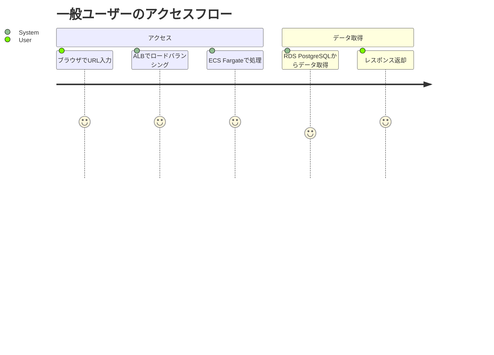
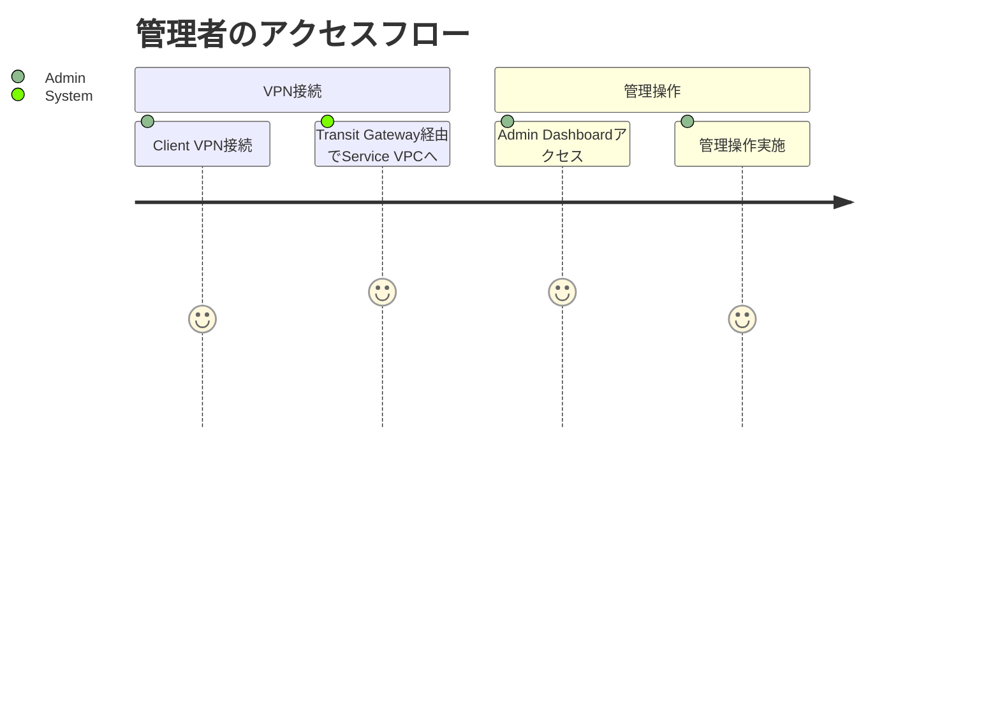
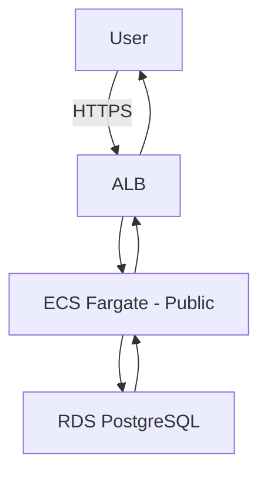
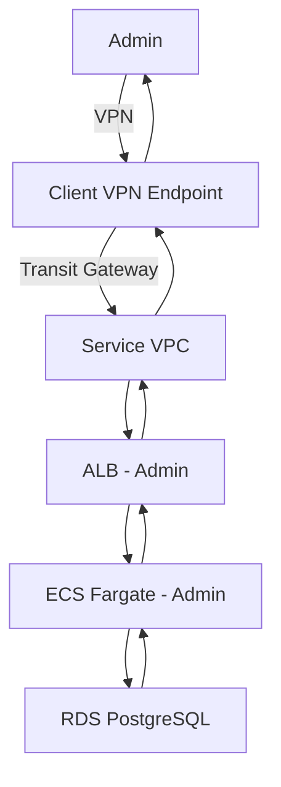
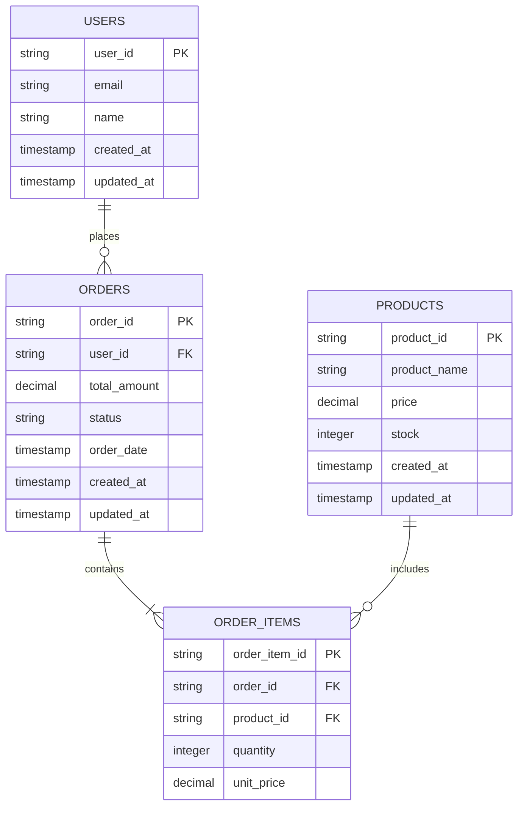

# 要件定義書

> AWS Multi-Account Sample Application
> Transit Gateway による拠点間閉域接続を実現する技術検証・社内デモ用サンプル

---

## 1. ドキュメント情報

| 項目 | 内容 |
|------|------|
| プロジェクト名 | AWS Multi-Account Sample Application |
| 文書バージョン | 2.0 |
| 作成日 | 2025-10-20 |
| 最終更新日 | 2025-10-20 |
| 承認状態 | 承認待ち |

---

## 2. プロジェクト概要

### 2.1 背景と目的

**背景:**
- AWS Multi-Account構成とTransit Gatewayによる拠点間閉域接続の技術検証が必要
- 社内向け技術デモ・PoC用のリファレンスアーキテクチャが求められている
- 実際のアプリケーション構成（Public/Admin/Batch）を含めた総合的な検証が必要

**目的:**
- Transit Gatewayを活用した拠点間閉域接続の実装パターンを確立
- Multi-Account構成（Platform Account + Service Account）のベストプラクティスを検証
- 3サービス構成（Public/Admin/Batch）の実装パターンを確立
- CloudFormationによるインフラコード化のベストプラクティスを確立
- CloudWatch統合監視の実装パターンを確立

### 2.2 スコープ

**対象範囲:**
- Platform Account: 共通ネットワーク基盤（Shared VPC, Transit Gateway, Client VPN）
- Service Account: 3サービス構成（Public Web App, Admin Dashboard, Batch Processing）
- インフラストラクチャ: CloudFormationテンプレート（ネストスタック構成）
- アプリケーション: Node.js 20ベースのサンプルアプリケーション（モノレポ構成）
- データベース: RDS PostgreSQL（Multi-AZ）
- 監視: CloudWatch統合監視（Alarms + Dashboard）

**対象外:**
- 本番運用レベルのセキュリティ対策（検証・デモ用のため簡易実装）
- 高度なCI/CDパイプライン（基本的なデプロイフローのみ）
- マルチリージョン構成
- DR（災害対策）環境

---

## 3. ビジネス要件

### 3.1 ビジネス目標

| ゴール | 測定指標 | 目標値 |
|--------|---------|--------|
| Transit Gateway技術検証 | 拠点間通信レイテンシ | 50ms以内 |
| Multi-Account構成検証 | アカウント分離による管理性 | Platform/Service分離実現 |
| 3サービス構成検証 | サービス別デプロイ可能性 | 独立デプロイ実現 |
| CloudFormation実装パターン確立 | スタック分割による保守性 | 4スタック構成実現 |
| CloudWatch監視パターン確立 | 統合監視ダッシュボード | 全リソース可視化実現 |

### 3.2 KPI

| KPI | 現状値 | 目標値 | 測定時期 | 測定方法 |
|-----|--------|--------|----------|----------|
| インフラ構築時間 | 未測定 | 30分以内 | 実装完了時 | CloudFormationデプロイ時間測定 |
| ネットワークレイテンシ | 未測定 | 50ms以内 | 検証時 | Transit Gateway経由の通信測定 |
| 監視アラート検知時間 | 未測定 | 5分以内 | 検証時 | CloudWatch Alarms動作確認 |
| コード再利用性 | 未測定 | 80%以上 | レビュー時 | モジュール化率測定 |

### 3.3 ビジネスルール

1. **技術検証**
   - Transit Gateway経由のVPC間通信を実現すること
   - オンプレミス拠点を想定したClient VPN経由のアクセスを実現すること
   - 管理系サービス（Admin）はVPN経由のみアクセス可能とすること

2. **アーキテクチャ**
   - Platform AccountとService Accountを明確に分離すること
   - 共通基盤とアプリケーション基盤の責務を分離すること
   - スタック分割により保守性を確保すること

3. **監視・運用**
   - 全リソースをCloudWatch統合監視対象とすること
   - 異常検知時はSNS経由で通知すること
   - ダッシュボードで全体状況を可視化すること

---

## 4. ユーザー要件

### 4.1 ユーザーストーリー

#### US-001: 一般ユーザーがPublic Webアプリにアクセスする
- **As a** 一般ユーザー
- **I want** インターネット経由でPublic Webアプリケーションにアクセスしたい
- **So that** サンプルアプリケーションの動作を確認できる
- **優先度**: 高
- **受け入れ基準**:
  - [ ] インターネット経由でALB経由でアクセスできる
  - [ ] HTTPSでアクセスできる（ALBでSSL終端）
  - [ ] レスポンスタイム2秒以内

#### US-002: 管理者がAdmin Dashboardにアクセスする
- **As a** システム管理者
- **I want** VPN経由でAdmin Dashboardにアクセスしたい
- **So that** システム管理操作を安全に実施できる
- **優先度**: 高
- **受け入れ基準**:
  - [ ] Client VPN接続後にAdmin Dashboardにアクセスできる
  - [ ] インターネット経由では直接アクセスできない
  - [ ] Transit Gateway経由でService VPCに到達できる

#### US-003: バッチ処理が定期実行される
- **As a** システム
- **I want** バッチ処理が定期的に自動実行されたい
- **So that** データ処理・集計が自動化される
- **優先度**: 中
- **受け入れ基準**:
  - [ ] ECS Scheduled Taskで定期実行できる
  - [ ] RDS PostgreSQLからデータを取得できる
  - [ ] 処理結果をCloudWatch Logsに出力できる

#### US-004: インフラエンジニアがCloudFormationでインフラを管理する
- **As a** インフラエンジニア
- **I want** CloudFormationテンプレートでインフラをコード管理したい
- **So that** インフラの変更履歴を追跡し、再現可能な構築ができる
- **優先度**: 高
- **受け入れ基準**:
  - [ ] スタック分割により保守性が確保されている
  - [ ] dry-run（Change Sets）で変更内容を事前確認できる
  - [ ] パラメータファイルで環境差分を管理できる

#### US-005: 運用担当者がCloudWatchで監視する
- **As a** 運用担当者
- **I want** CloudWatch Dashboardで全リソースの状態を可視化したい
- **So that** システム全体の健全性を一目で確認できる
- **優先度**: 高
- **受け入れ基準**:
  - [ ] ECS、RDS、ALBのメトリクスがダッシュボードに表示される
  - [ ] 異常時にSNS経由でアラート通知される
  - [ ] CPU使用率、メモリ使用率、接続数等が監視される

### 4.2 ユーザージャーニー





---

## 5. 機能要件

### 5.1 機能一覧

| ID | 機能名 | 概要 | 優先度 | 依存関係 |
|----|--------|------|--------|----------|
| F-001 | Platform Account基盤構築 | Shared VPC、Transit Gateway、Client VPN | 高 | - |
| F-002 | Service Account基盤構築 | Service VPC、RDS、ECS、ALB | 高 | F-001 |
| F-003 | Public Webアプリケーション | 一般ユーザー向けWebアプリ | 高 | F-002 |
| F-004 | Admin Dashboard | 管理者向けダッシュボード | 高 | F-002 |
| F-005 | Batch Processing | データ処理・集計バッチ | 中 | F-002 |
| F-006 | CloudWatch統合監視 | Alarms + Dashboard | 高 | F-002 |
| F-007 | CI/CDパイプライン | GitHub Actionsによるデプロイ | 中 | F-002, F-003 |

### 5.2 機能詳細

#### F-001: Platform Account基盤構築

**概要**
共通ネットワーク基盤（Shared VPC、Transit Gateway、Client VPN）をCloudFormationで構築する。

**構成要素**

| リソース | 詳細 | 備考 |
|---------|------|------|
| Shared VPC | 10.0.0.0/16 | Platform Account専用VPC |
| Transit Gateway | - | VPC間接続のハブ |
| Client VPN Endpoint | - | オンプレミス拠点を想定したVPN接続 |
| パブリックサブネット | 10.0.1.0/24, 10.0.2.0/24 | Multi-AZ構成 |
| プライベートサブネット | 10.0.11.0/24, 10.0.12.0/24 | Multi-AZ構成 |

**処理内容**
1. Shared VPC作成（CIDR: 10.0.0.0/16）
2. パブリック/プライベートサブネット作成（Multi-AZ）
3. Internet Gateway、NAT Gateway作成
4. Transit Gateway作成
5. Transit Gateway Attachmentでアカウント間接続準備
6. Client VPN Endpoint作成
7. セキュリティグループ作成（VPN接続用）

**CloudFormationスタック**
- `infra/platform/network.yaml`: Shared VPC、サブネット
- `infra/platform/connectivity.yaml`: Transit Gateway、Client VPN（ネストスタック）

**エラー処理**
| エラーコード | 発生条件 | 処理内容 | メッセージ |
|-------------|----------|----------|-----------|
| CFN-001 | CIDR重複 | スタック作成失敗 | "CIDR block conflicts with existing VPC" |
| CFN-002 | リソース制限 | スタック作成失敗 | "Transit Gateway limit exceeded" |

**ビジネスルール**
- Shared VPCは Platform Account専用とし、Service Accountとは分離する
- Transit Gatewayは将来的な拠点追加を考慮して設計する
- Client VPNは管理系アクセス専用とする

---

#### F-002: Service Account基盤構築

**概要**
アプリケーション基盤（Service VPC、RDS、ECS、ALB）をCloudFormationで構築する。

**構成要素**

| リソース | 詳細 | 備考 |
|---------|------|------|
| Service VPC | 10.1.0.0/16 | Service Account専用VPC |
| RDS PostgreSQL | Multi-AZ、db.t3.medium | アプリケーションDB |
| ECS Fargate | 3サービス（Public/Admin/Batch） | コンテナ実行基盤 |
| ALB | Public/Admin用 | ロードバランサー |
| パブリックサブネット | 10.1.1.0/24, 10.1.2.0/24 | ALB配置 |
| プライベートサブネット | 10.1.11.0/24, 10.1.12.0/24 | ECS、RDS配置 |

**処理内容**
1. Service VPC作成（CIDR: 10.1.0.0/16）
2. パブリック/プライベートサブネット作成（Multi-AZ）
3. Internet Gateway、NAT Gateway作成
4. Transit Gateway Attachment作成（Platform AccountのTGWに接続）
5. RDS PostgreSQL作成（Multi-AZ）
6. ECS Cluster作成
7. ALB作成（Public用、Admin用）
8. セキュリティグループ作成（ALB、ECS、RDS用）

**CloudFormationスタック**
- `infra/service/01-network.yaml`: Service VPC、サブネット、Transit Gateway Attachment
- `infra/service/02-database.yaml`: RDS PostgreSQL
- `infra/service/03-compute.yaml`: ECS Cluster、Task Definition、Service、ALB
- `infra/service/04-monitoring.yaml`: CloudWatch Alarms、Dashboard（ネストスタック）

**エラー処理**
| エラーコード | 発生条件 | 処理内容 | メッセージ |
|-------------|----------|----------|-----------|
| CFN-003 | DB接続失敗 | スタック作成失敗 | "Failed to create RDS instance" |
| CFN-004 | ECS Task起動失敗 | サービス作成失敗 | "Failed to start ECS task" |

**ビジネスルール**
- Service VPCはPlatform AccountのTransit Gateway経由でShared VPCと接続する
- RDSはMulti-AZ構成で高可用性を確保する
- ECSはFargateを使用してサーバーレス実行する

---

#### F-003: Public Webアプリケーション

**概要**
一般ユーザー向けWebアプリケーション（インターネット公開）

**入力**
| 項目名 | データ型 | 必須 | 制約 | 備考 |
|--------|----------|------|------|------|
| HTTP Request | - | ○ | GET/POST | ALB経由 |

**処理内容**
1. ALBでHTTPSリクエストを受信
2. ECS Fargate（Public Service）で処理
3. RDS PostgreSQLからデータ取得
4. レスポンス返却

**出力**
| 項目名 | データ型 | 条件 | 備考 |
|--------|----------|------|------|
| HTTP Response | JSON/HTML | 200 OK | レスポンスタイム2秒以内 |

**エラー処理**
| エラーコード | 発生条件 | 処理内容 | ユーザーへの表示 |
|-------------|----------|----------|------------------|
| E001 | DB接続失敗 | 503 Service Unavailable | "サービスが一時的に利用できません" |
| E002 | タイムアウト | 504 Gateway Timeout | "リクエストがタイムアウトしました" |

**フロー**


**ビジネスルール**
- インターネット経由でアクセス可能
- HTTPS必須（ALBでSSL終端）
- レスポンスタイム2秒以内

---

#### F-004: Admin Dashboard

**概要**
管理者向けダッシュボード（VPN/Direct Connect経由のみアクセス可能）

**入力**
| 項目名 | データ型 | 必須 | 制約 | 備考 |
|--------|----------|------|------|------|
| HTTP Request | - | ○ | GET/POST | VPN経由のみ |

**処理内容**
1. Client VPN経由でアクセス
2. Transit Gateway経由でService VPCへ
3. ECS Fargate（Admin Service）で処理
4. RDS PostgreSQLからデータ取得
5. レスポンス返却

**出力**
| 項目名 | データ型 | 条件 | 備考 |
|--------|----------|------|------|
| HTTP Response | JSON/HTML | 200 OK | 管理者向けダッシュボード |

**フロー**


**ビジネスルール**
- VPN/Direct Connect経由のみアクセス可能
- インターネット経由では直接アクセス不可
- Transit Gateway経由でService VPCに到達

---

#### F-005: Batch Processing

**概要**
データ処理・集計バッチ（スケジュール実行）

**入力**
| 項目名 | データ型 | 必須 | 制約 | 備考 |
|--------|----------|------|------|------|
| Trigger | CloudWatch Events | ○ | Cron式 | 定期実行 |

**処理内容**
1. CloudWatch Events（EventBridge）で定期実行
2. ECS Scheduled Taskでコンテナ起動
3. RDS PostgreSQLからデータ取得
4. データ処理・集計
5. 結果をCloudWatch Logsに出力

**出力**
| 項目名 | データ型 | 条件 | 備考 |
|--------|----------|------|------|
| CloudWatch Logs | JSON | - | 処理結果ログ |

**ビジネスルール**
- 定期実行（例: 毎日深夜1時）
- 処理結果はCloudWatch Logsに出力
- エラー発生時はSNS通知

---

#### F-006: CloudWatch統合監視

**概要**
ECS、RDS、ALBの統合監視（Alarms + Dashboard）

**監視対象とアラーム閾値**

| リソース | メトリクス | 閾値 | アクション |
|---------|-----------|------|-----------|
| ECS Fargate | CPU使用率 | 80%以上 | SNS通知（Warning） |
| ECS Fargate | メモリ使用率 | 80%以上 | SNS通知（Warning） |
| ECS Fargate | タスク数 | 0（全停止） | SNS通知（Critical） |
| RDS PostgreSQL | CPU使用率 | 80%以上 | SNS通知（Warning） |
| RDS PostgreSQL | 接続数 | 80%以上 | SNS通知（Warning） |
| RDS PostgreSQL | ストレージ容量 | 80%以上 | SNS通知（Warning） |
| RDS PostgreSQL | レプリケーションラグ | 60秒以上 | SNS通知（Critical） |
| ALB | ターゲット異常数 | 1以上 | SNS通知（Critical） |
| ALB | 5xxエラー率 | 5%以上 | SNS通知（Warning） |
| ALB | レスポンスタイム | 1秒以上 | SNS通知（Warning） |

**通知先**

| 重要度 | SNS Topic | 用途 |
|-------|-----------|------|
| Critical | CriticalAlerts | 即時対応が必要なアラート |
| Warning | WarningAlerts | 監視・傾向分析 |

**Dashboard構成**
- ECSサービス別CPU/メモリ使用率
- RDS CPU/接続数/ストレージ容量
- ALBリクエスト数/エラー率/レスポンスタイム

**ビジネスルール**
- 全リソースを監視対象とする
- 異常検知時は5分以内にSNS通知する
- ダッシュボードで全体状況を一目で確認できるようにする

---

#### F-007: CI/CDパイプライン

**概要**
GitHub Actionsによる自動デプロイ

**処理内容**
1. GitHub mainブランチへのpush検知
2. ユニットテスト実行
3. Dockerイメージビルド
4. ECRへpush
5. ECS Serviceを更新
6. デプロイ完了通知

**ビジネスルール**
- mainブランチへのpush時に自動デプロイ
- テスト失敗時はデプロイ中止
- 詳細設計はF-007完了後に実施

---

## 6. 非機能要件

### 6.1 パフォーマンス要件

| 項目 | 要件 | 測定方法 |
|------|------|----------|
| レスポンスタイム | 2秒以内（Public Web） | ALB → ECS → RDSの往復時間測定 |
| ネットワークレイテンシ | 50ms以内（Transit Gateway経由） | VPC間通信時間測定 |
| 同時接続数 | 100接続（検証用） | 負荷テストツール（Artillery等） |

### 6.2 可用性要件

| 項目 | 要件 | 備考 |
|------|------|------|
| Multi-AZ構成 | 必須 | VPC、RDS、ALBすべてMulti-AZ |
| 稼働時間 | 99%以上（検証用） | 本番運用レベルではないため99%目標 |
| MTTR | 30分以内 | CloudWatch Alarmsで異常検知 |

### 6.3 スケーラビリティ要件

- **ユーザー数**: 検証用のため100ユーザー程度を想定
- **データ量**: 10万レコード程度を想定
- **トラフィック**: 1万PV/日程度を想定
- **スケール戦略**: ECS Auto Scaling（CPU 70%でスケールアウト）

### 6.4 セキュリティ要件

#### 認証・認可
- **認証方式**: 検証用のため簡易実装（Basic認証またはなし）
- **VPN接続**: 管理系サービスはClient VPN経由のみアクセス可能

#### データ保護
- **暗号化**:
  - 通信: ALBでTLS 1.2以上
  - 保存データ: RDS暗号化有効化（AES-256）
  - EBS暗号化有効化

#### ネットワークセキュリティ
- **セキュリティグループ**: 最小権限の原則
  - ALB: 443（HTTPS）のみインターネットから許可
  - ECS: ALBからのみ許可
  - RDS: ECSからのみ許可（PostgreSQL 5432）
  - Admin: VPN経由のみ許可

#### 監査・ログ
- **監査ログ対象**:
  - [ ] CloudWatch Logsに全ログ出力
  - [ ] ALBアクセスログ（S3保存）
  - [ ] VPCフローログ（CloudWatch Logs保存）

- **ログ保持期間**: 30日間

### 6.5 保守性要件

- **ログ設計**:
  - アプリケーションログ: CloudWatch Logs（JSON形式）
  - アクセスログ: ALB Access Logs（S3保存）
  - VPCフローログ: CloudWatch Logs

- **監視**:
  - [ ] ECS CPU/メモリ使用率監視
  - [ ] RDS CPU/接続数/ストレージ監視
  - [ ] ALBリクエスト数/エラー率監視

- **バックアップ**:
  - RDS自動バックアップ: 7日間保持
  - スナップショット: 手動取得可能

### 6.6 互換性要件

- **ブラウザ対応**（Public Webのみ）:
  - [ ] Chrome（最新版）
  - [ ] Firefox（最新版）
  - [ ] Safari（最新版）
  - [ ] Edge（最新版）

- **デバイス対応**:
  - [ ] デスクトップ

### 6.7 運用要件

- **デプロイ**:
  - 頻度: 検証用のため任意
  - ダウンタイム: あり（Blue-Green未実装）

- **環境**:
  - 検証環境: Service Account内に構築
  - 本番環境: 想定外（検証・デモ用）

---

## 7. データ要件

### 7.1 データモデル概要



### 7.2 データ項目定義

#### USERS（ユーザー）

| 項目名 | 論理名 | データ型 | 桁数 | NULL | 主キー | 外部キー | 初期値 | 備考 |
|--------|--------|----------|------|------|--------|----------|--------|------|
| user_id | ユーザーID | UUID | - | × | ○ | - | uuid_generate_v4() | 主キー |
| email | メールアドレス | VARCHAR | 255 | × | × | - | - | ユニーク制約 |
| name | 氏名 | VARCHAR | 255 | × | × | - | - | - |
| created_at | 作成日時 | TIMESTAMP | - | × | × | - | CURRENT_TIMESTAMP | - |
| updated_at | 更新日時 | TIMESTAMP | - | × | × | - | CURRENT_TIMESTAMP | - |

**インデックス**
| インデックス名 | 項目 | ユニーク | 備考 |
|---------------|------|----------|------|
| users_email_idx | email | ○ | メールアドレス検索用 |
| users_created_at_idx | created_at | × | 日時範囲検索用 |

**制約**
- email: UNIQUE制約
- email: NOT NULL制約

#### ORDERS（注文）

| 項目名 | 論理名 | データ型 | 桁数 | NULL | 主キー | 外部キー | 初期値 | 備考 |
|--------|--------|----------|------|------|--------|----------|--------|------|
| order_id | 注文ID | UUID | - | × | ○ | - | uuid_generate_v4() | 主キー |
| user_id | ユーザーID | UUID | - | × | × | USERS.user_id | - | 外部キー |
| total_amount | 合計金額 | DECIMAL | 10,2 | × | × | - | 0 | - |
| status | ステータス | VARCHAR | 50 | × | × | - | 'pending' | pending/completed/cancelled |
| order_date | 注文日時 | TIMESTAMP | - | × | × | - | CURRENT_TIMESTAMP | - |
| created_at | 作成日時 | TIMESTAMP | - | × | × | - | CURRENT_TIMESTAMP | - |
| updated_at | 更新日時 | TIMESTAMP | - | × | × | - | CURRENT_TIMESTAMP | - |

**インデックス**
| インデックス名 | 項目 | ユニーク | 備考 |
|---------------|------|----------|------|
| orders_user_id_idx | user_id | × | ユーザー別注文検索用 |
| orders_order_date_idx | order_date | × | 日時範囲検索用 |
| orders_status_idx | status | × | ステータス別検索用 |

**制約**
- user_id: FOREIGN KEY制約（USERS.user_id）

#### PRODUCTS（商品）

| 項目名 | 論理名 | データ型 | 桁数 | NULL | 主キー | 外部キー | 初期値 | 備考 |
|--------|--------|----------|------|------|--------|----------|--------|------|
| product_id | 商品ID | UUID | - | × | ○ | - | uuid_generate_v4() | 主キー |
| product_name | 商品名 | VARCHAR | 255 | × | × | - | - | - |
| price | 価格 | DECIMAL | 10,2 | × | × | - | 0 | - |
| stock | 在庫数 | INTEGER | - | × | × | - | 0 | - |
| created_at | 作成日時 | TIMESTAMP | - | × | × | - | CURRENT_TIMESTAMP | - |
| updated_at | 更新日時 | TIMESTAMP | - | × | × | - | CURRENT_TIMESTAMP | - |

### 7.3 データライフサイクル

| データ種別 | 保持期間 | アーカイブ方式 | 削除方式 | 備考 |
|-----------|----------|---------------|----------|------|
| ユーザーデータ | 無期限 | - | 論理削除 | 検証用データ |
| 注文データ | 1年間 | S3バックアップ | 論理削除 | 1年経過後アーカイブ |
| ログデータ | 30日間 | - | 自動削除 | CloudWatch Logs |

---

## 8. 外部インターフェース要件

### 8.1 外部システム連携

**該当なし**（検証・デモ用のため外部システム連携は実装しない）

### 8.2 API仕様

#### Public Web API

**概要**
Public Webアプリケーションが提供するREST API

**エンドポイント**
| メソッド | パス | 概要 | リクエスト | レスポンス |
|---------|------|------|-----------|-----------|
| GET | /api/v1/products | 商品一覧取得 | - | 商品リスト（JSON） |
| GET | /api/v1/products/:id | 商品詳細取得 | product_id | 商品詳細（JSON） |
| POST | /api/v1/orders | 注文作成 | user_id, product_ids | 注文ID（JSON） |
| GET | /api/v1/orders/:id | 注文詳細取得 | order_id | 注文詳細（JSON） |

**リクエスト例（注文作成）**
```json
{
  "user_id": "550e8400-e29b-41d4-a716-446655440000",
  "items": [
    {
      "product_id": "660e8400-e29b-41d4-a716-446655440000",
      "quantity": 2
    }
  ]
}
```

**レスポンス例（注文作成）**
```json
{
  "status": "success",
  "data": {
    "order_id": "770e8400-e29b-41d4-a716-446655440000",
    "total_amount": 5000.00,
    "status": "pending",
    "order_date": "2025-10-20T10:00:00Z"
  }
}
```

**エラーレスポンス**
```json
{
  "status": "error",
  "error": {
    "code": "VALIDATION_ERROR",
    "message": "商品IDが不正です"
  }
}
```

---

## 9. 制約条件

### 9.1 技術的制約
- CloudFormation使用（Terraform不可）
- スタック分割構成（Network/Database/Compute/Monitoring）
- Node.js 20使用
- PostgreSQL使用（その他DBエンジン不可）
- ECS Fargate使用（EC2不可）

### 9.2 ビジネス的制約
- 検証・デモ用のため本番運用レベルのセキュリティは実装しない
- 予算制約なし（AWS Free Tier範囲内で実装）
- 納期制約なし（技術検証優先）

### 9.3 法的・規制上の制約
- 該当なし（検証・デモ用のため）

---

## 10. リスクと対策

| リスク | 影響度 | 発生確率 | 影響範囲 | 対策 | 担当 |
|--------|--------|----------|----------|------|------|
| Transit Gateway設定ミスによる通信不可 | 高 | 中 | VPC間通信全体 | dry-run必須、段階的デプロイ | インフラエンジニア |
| RDS接続失敗 | 高 | 低 | アプリケーション全体 | セキュリティグループ設定確認 | インフラエンジニア |
| ECS Task起動失敗 | 中 | 中 | 該当サービスのみ | CloudWatch Logs確認、リトライ | 開発エンジニア |
| CloudFormationスタック削除失敗 | 中 | 低 | リソース削除不可 | 依存関係順に削除 | インフラエンジニア |

---

## 11. テスト要件

### 11.1 テスト戦略
- **単体テスト**: アプリケーションコード（カバレッジ70%目標）
- **結合テスト**: API疎通確認
- **システムテスト**: エンドツーエンドフロー確認
- **性能テスト**: レスポンスタイム・レイテンシ測定

### 11.2 テスト環境
- Service Account内に検証環境を構築
- CloudFormationテンプレートでインフラを構築

### 11.3 受け入れテスト
- Transit Gateway経由のVPC間通信が正常に動作すること
- Client VPN経由でAdmin Dashboardにアクセスできること
- Public Webアプリがインターネット経由でアクセスできること
- CloudWatch Alarmsが正常に動作すること

---

## 12. 移行要件

**該当なし**（新規構築のため）

---

## 13. 教育・研修要件

**該当なし**（技術検証・デモ用のため）

---

## 14. 運用・保守要件

### 14.1 運用体制
- **運用時間**: 検証時のみ
- **サポート体制**: 開発チーム内で対応

### 14.2 保守計画
- **定期メンテナンス**: なし
- **パッチ適用**: セキュリティパッチのみ適用

---

## 15. 次のステップ

### 15.1 設計フェーズで決定すること
- [ ] CloudFormationテンプレートの詳細構成
- [ ] ECS Task Definition詳細（CPU/メモリ割り当て）
- [ ] RDS設定詳細（インスタンスクラス、ストレージ）
- [ ] CloudWatch Dashboard詳細設計
- [ ] CI/CDパイプライン詳細設計

### 15.2 承認事項
- [ ] ビジネス要件承認
- [ ] 機能要件承認
- [ ] 非機能要件承認
- [ ] 設計フェーズへの移行承認

---

## 付録

### A. 用語集
| 用語 | 定義 |
|------|------|
| Transit Gateway | AWS VPC間を接続するネットワークハブサービス |
| Multi-Account | 複数のAWSアカウントを使用した構成 |
| Platform Account | 共通ネットワーク基盤を管理するAWSアカウント |
| Service Account | アプリケーション基盤を管理するAWSアカウント |
| ECS Fargate | サーバーレスなコンテナ実行環境 |

### B. 参考資料
- AWS Transit Gateway公式ドキュメント: https://docs.aws.amazon.com/vpc/latest/tgw/
- AWS CloudFormation公式ドキュメント: https://docs.aws.amazon.com/cloudformation/
- AWS ECS公式ドキュメント: https://docs.aws.amazon.com/ecs/

### C. 変更履歴
| 日付 | 版数 | 変更内容 | 承認者 |
|------|------|----------|--------|
| 2025-10-20 | 1.0 | 初版作成 | - |
| 2025-10-20 | 2.0 | プロジェクト再起動に伴う詳細化 | - |
